# ℹ️ About EAS Station

EAS Station is a complete Emergency Alert System platform that automates the ingestion, encoding, broadcast, and verification of Common Alerting Protocol (CAP) alerts. Built by amateur radio operators supporting Putnam County, Ohio, it combines NOAA and IPAWS feed aggregation, FCC-compliant SAME encoding, PostGIS spatial intelligence, SDR verification, and LED signage integration into a unified operations hub.

## Safety Notice
- **Development status:** The project remains experimental and has only been cross-checked against community tools like [multimon-ng](https://github.com/EliasOenal/multimon-ng) for decoding parity. All other implementations, workflows, and documentation are original and subject to change.
- **No FCC certification:** The software is not an approved replacement for commercial Emergency Alert System encoders or other FCC-authorized equipment.
- **Lab use only:** Operate EAS Station strictly in test environments and never rely on it for live public warning, life safety, or mission-critical decisions.
- **Review legal docs:** Before inviting collaborators or storing data, read the repository [Terms of Use](TERMS_OF_USE.md) and [Privacy Policy](PRIVACY_POLICY.md).

## Mission and Scope
- **Primary Goal:** Provide emergency communications teams with automated CAP-to-EAS workflow, from alert ingestion through broadcast verification, with complete compliance documentation.
- **Deployment Model:** Container-first architecture designed for on-premise or field deployments with external PostgreSQL/PostGIS database service.
- **Operational Focus:** Multi-source alert aggregation, automatic SAME broadcast generation, SDR-based verification, spatial boundary awareness, and audit trail management.

## Core Services

## Software Stack
The application combines open-source tooling and optional cloud integrations. Versions below match the pinned dependencies in `requirements.txt` unless noted otherwise.

### Application Framework
- Python 3.11 runtime
- Flask 2.3.3 web framework
- Werkzeug 2.3.7 WSGI utilities
- Flask-SQLAlchemy 3.0.5 ORM integration
- SQLAlchemy 2.0.21 ORM core
- Gunicorn 21.2.0 production WSGI server

### Data and Spatial Layer
- PostgreSQL 15 with the PostGIS extension (external service)
- GeoAlchemy2 0.14.1 for spatial ORM bindings
- psycopg2-binary 2.9.7 PostgreSQL driver

### System and Utilities
- requests 2.31.0 for CAP feed retrieval and IPAWS integration
- pytz 2023.3 timezone utilities
- psutil 5.9.5 system health and receiver monitoring
- python-dotenv 1.0.0 configuration loading

### Front-End Tooling
- Bootstrap 5 UI framework
- Font Awesome iconography
- Highcharts visualization library

### Optional Integrations
- Azure Cognitive Services Speech SDK 1.38.0 (optional AI narration)
- Docker Engine 24+ and Docker Compose V2 for container orchestration

## Governance and Support
- **Issue Tracking:** Use GitHub issues for bug reports and feature requests.
- **Documentation Updates:** User-facing changes must update the README, HELP, and CHANGELOG entries.
- **Environment Variables:** Any new variables must be mirrored in `.env.example` per contributor guidelines.

## Maintainer Profile
Timothy Kramer (KR8MER) serves as the project's maintainer. Licensed as an amateur radio operator since 2004 and upgraded to General Class in 2025, Kramer brings 17 years of public-safety service as a deputy sheriff and deep familiarity with Motorola mission-critical communications. He now works as a full-time electrical panel electrician while supporting Skywarn operations and a laboratory of professional-grade radios, SDR capture nodes, digital paging systems, and networking equipment. EAS Station reflects his goal of pairing disciplined engineering practices with experimental emergency communications research.

For setup instructions, operational tips, and troubleshooting guidance, refer to the dedicated [HELP documentation](HELP.md).
