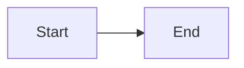

# Building Documentation

This guide explains how to build and deploy EAS Station documentation.

## Overview

EAS Station uses [MkDocs](https://www.mkdocs.org/) with the [Material theme](https://squidfunk.github.io/mkdocs-material/) for documentation.

## Prerequisites

- Python 3.11+
- pip package manager

## Local Development

### 1. Install Dependencies

```bash
pip install -r requirements-docs.txt
```

This installs:
- MkDocs
- Material theme
- Extensions and plugins

### 2. Serve Documentation Locally

```bash
mkdocs serve
```

Documentation available at: **http://localhost:8000**

Changes auto-reload in browser.

### 3. Build Static Site

```bash
mkdocs build
```

Output in `site/` directory.

## Documentation Structure

```
docs/                        # Documentation source
├── index.md                 # Homepage
├── getting-started/         # Installation and setup
├── user-guide/              # User documentation
├── admin-guide/             # Administrator docs
├── developer-guide/         # Developer docs
├── frontend/                # UI documentation
├── api/                     # API reference
├── reference/               # Technical reference
├── legal/                   # Legal and policies
├── roadmap/                 # Development roadmap
└── stylesheets/             # Custom CSS

mkdocs.yml                   # MkDocs configuration
```

## Writing Documentation

### Markdown Files

Use GitHub-flavored Markdown with extensions:

**Admonitions:**
```markdown
!!! warning "Important"
    This is a warning message
```

**Code Blocks:**
````markdown
```python
def hello():
    print("Hello, world!")
```
````

**Tabs:**
````markdown
=== "Tab 1"
    Content for tab 1

=== "Tab 2"
    Content for tab 2
````

**Mermaid Diagrams:**
````markdown

````

### Navigation

Edit `mkdocs.yml` to modify navigation:

```yaml
nav:
  - Home: index.md
  - Getting Started:
      - getting-started/index.md
      - Quick Start: getting-started/quick-start.md
```

## Deployment

### GitHub Pages (Automatic)

Documentation automatically deploys to GitHub Pages on push to `main` branch.

**Workflow**: `.github/workflows/docs.yml`

**URL**: https://kr8mer.github.io/eas-station/

### Manual Deployment

```bash
mkdocs gh-deploy
```

Builds and pushes to `gh-pages` branch.

### Custom Domain (Optional)

1. Add CNAME record: `docs.example.com` → `kr8mer.github.io`
2. Update `mkdocs.yml`:
   ```yaml
   site_url: https://docs.example.com/
   ```
3. Update workflow with `cname:` setting

## Testing

### Link Validation

```bash
mkdocs build --strict
```

Fails on warnings (broken links, missing files).

### Local Preview

```bash
mkdocs serve --strict
```

Serves with strict mode enabled.

## Styling

### Custom CSS

Edit `docs/stylesheets/extra.css`:

```css
:root {
  --custom-color: #3b82f6;
}
```

### Theme Customization

Edit `mkdocs.yml`:

```yaml
theme:
  palette:
    primary: indigo
    accent: deep purple
```

## Versioning

### Mike (Version Manager)

Install mike:
```bash
pip install mike
```

Deploy versioned docs:
```bash
mike deploy 2.0 latest --update-aliases
mike set-default latest
```

## Troubleshooting

### Build Errors

**Missing files:**
```
Error: Navigation file 'page.md' not found
```
- Create missing file or remove from `nav:` in `mkdocs.yml`

**Broken links:**
- Use relative links: `[Link](../other.md)`
- Check file paths are correct

### Serve Issues

**Port in use:**
```bash
mkdocs serve -a localhost:8001
```

**No auto-reload:**
- Check file watcher limits
- Restart serve process

## Best Practices

### Writing

- Use clear, concise language
- Include code examples
- Add screenshots where helpful
- Link to related pages
- Use admonitions for warnings/tips

### Organization

- One topic per page
- Logical navigation hierarchy
- Index pages for sections
- Cross-reference related content

### Maintenance

- Update regularly
- Test all links
- Remove outdated content
- Keep navigation clean
- Version major changes

## Resources

- [MkDocs Documentation](https://www.mkdocs.org/)
- [Material Theme Docs](https://squidfunk.github.io/mkdocs-material/)
- [Markdown Guide](https://www.markdownguide.org/)
- [Mermaid Diagrams](https://mermaid-js.github.io/)

---

For questions about documentation, open an issue on GitHub.
