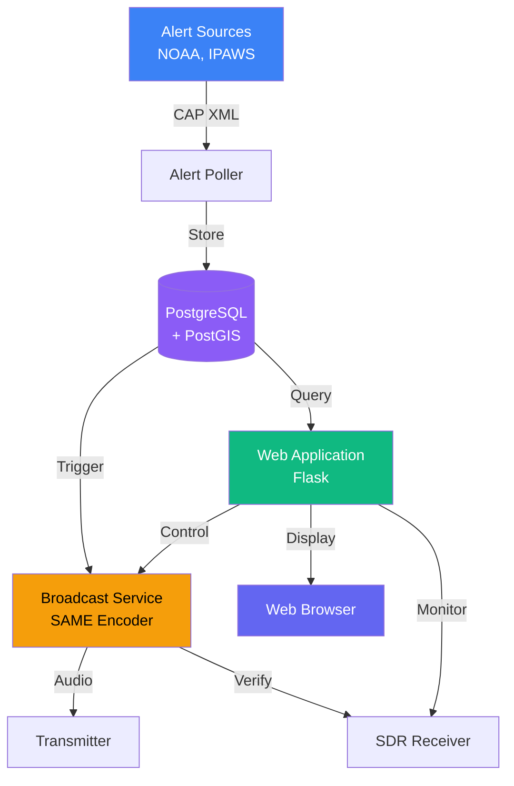

#  EAS Station

[](https://opensource.org/licenses/MIT)
[](https://www.docker.com/)
[](https://www.python.org/)
[](https://www.postgresql.org/)

> **A professional Emergency Alert System (EAS) platform for monitoring, broadcasting, and verifying NOAA and IPAWS alerts**

EAS Station is a software-defined drop-in replacement for commercial EAS encoder/decoder hardware, built on commodity hardware like Raspberry Pi. It provides comprehensive alert processing with FCC-compliant SAME encoding, multi-source aggregation, PostGIS spatial intelligence, SDR verification, and integrated LED signage.

---

!!! warning "**IMPORTANT: Laboratory Use Only**"
    EAS Station is experimental software for research and development. It is **not FCC-certified** and must only be used in controlled test environments. Never use for production emergency alerting.

---

## ✨ Key Features

| Feature | Description |
|---------|-------------|
| 🌐 **Multi-Source Ingestion** | NOAA Weather, IPAWS federal alerts, and custom CAP feeds |
| 📻 **FCC-Compliant SAME** | Specific Area Message Encoding per FCC Part 11 |
| 🗺️ **Geographic Intelligence** | PostGIS spatial filtering with county/state/polygon support |
| 📡 **SDR Verification** | Automated broadcast verification with RTL-SDR/Airspy |
| 🎨 **Modern Web UI** | Responsive Bootstrap 5 interface with real-time updates |
| ⚡ **Hardware Integration** | GPIO relay control, LED signs, multiple audio outputs |

## 🚀 Quick Start

### One-Command Installation

```bash
git clone https://github.com/KR8MER/eas-station.git && \
cd eas-station && \
cp .env.example .env && \
docker compose up -d --build
```

Then open http://localhost:5000 in your browser.

> 💡 **Next Steps**: Edit `.env` with your configuration, then restart: `docker compose restart`

### Prerequisites

- Docker Engine 24+ with Compose V2
- PostgreSQL 14+ with PostGIS (can use embedded container)
- 4GB RAM (8GB recommended)
- Internet connection for alert polling

## 📚 Documentation

<table>
<tr>
<td width="50%">

### For Users
- **[📖 Getting Started](docs_new/getting-started/index.md)**
  Installation, configuration, first alert

- **[📘 User Guide](docs_new/user-guide/index.md)**
  Daily operations, alert management, hardware

- **[🔧 Admin Guide](docs_new/admin-guide/index.md)**
  Deployment, database, maintenance

</td>
<td width="50%">

### For Developers
- **[💻 Developer Guide](docs_new/developer-guide/index.md)**
  Architecture, contribution guidelines, testing

- **[🎨 Frontend Docs](docs_new/frontend/index.md)**
  UI components, theming, JavaScript API

- **[📡 API Reference](docs_new/api/index.md)**
  REST API documentation

</td>
</tr>
</table>

### Browse Full Documentation

📖 **[View Complete Documentation Site](https://kr8mer.github.io/eas-station/)** (Coming Soon)

Or build locally:

```bash
pip install -r requirements-docs.txt
mkdocs serve
# Open http://localhost:8000
```

## 🏗️ Architecture



### Core Components

| Component | Technology | Purpose |
|-----------|-----------|---------|
| **Web Application** | Flask 3.0 + Bootstrap 5 | User interface and API |
| **Alert Poller** | Python async | CAP feed monitoring |
| **Database** | PostgreSQL 17 + PostGIS 3.4 | Spatial data storage |
| **Broadcast Engine** | Python + ALSA | SAME encoding and audio |
| **SDR Service** | RTL-SDR/Airspy | Transmission verification |

## 🎯 Use Cases

<table>
<tr>
<td width="50%">

**Broadcasters**
- Replace $5,000-$7,000 commercial encoders
- Multi-station coordination
- Automated compliance logging

**Amateur Radio**
- Emergency communications testing
- Alert relay networks
- Training and education

</td>
<td width="50%">

**Emergency Management**
- Custom alert distribution
- Geographic targeting
- Integration with existing systems

**Developers**
- CAP protocol experimentation
- Alert system research
- Custom integrations

</td>
</tr>
</table>

## ⚙️ System Requirements

### Recommended Hardware

| Component | Specification |
|-----------|---------------|
| **Compute** | Raspberry Pi 5 (8GB) or equivalent x86 |
| **Control** | Multi-relay GPIO HAT |
| **Audio** | USB sound card or Pi HAT |
| **SDR** | RTL-SDR v3 or Airspy |
| **Storage** | External SSD (50GB+) |

### Minimum Software

- Docker 24+
- PostgreSQL 14+ with PostGIS 3+
- Python 3.11+ (for development)

## 🛠️ Configuration

Edit `.env` with your settings:

```bash
# Core settings
SECRET_KEY=generate-with-python-secrets-module
POSTGRES_HOST=alerts-db
POSTGRES_PASSWORD=your-secure-password

# Your location
DEFAULT_COUNTY_NAME=Your County
DEFAULT_STATE_CODE=XX
DEFAULT_ZONE_CODES=XXZ001,XXC001

# Enable broadcast (optional)
EAS_BROADCAST_ENABLED=false
EAS_ORIGINATOR=WXR
EAS_STATION_ID=YOURCALL
```

See [Configuration Guide](docs_new/getting-started/configuration.md) for complete reference.

## 📊 Screenshots

<table>
<tr>
<td width="50%">

<p align="center"><em>Main Dashboard</em></p>
</td>
<td width="50%">

<p align="center"><em>Administration Panel</em></p>
</td>
</tr>
</table>

## 🤝 Contributing

We welcome contributions! Please see:

- [Contributing Guide](docs_new/developer-guide/contributing.md)
- [Code Standards](docs_new/developer-guide/standards.md)
- [Development Setup](docs_new/developer-guide/setup.md)

### Development

```bash
# Clone repository
git clone https://github.com/KR8MER/eas-station.git
cd eas-station

# Set up environment
python3 -m venv venv
source venv/bin/activate
pip install -r requirements.txt

# Configure database
cp .env.example .env
# Edit .env with local database settings

# Run development server
python app.py
```

## 🆘 Support

- 📖 **Documentation**: [Complete Docs](docs_new/index.md)
- 💬 **Discussions**: [GitHub Discussions](https://github.com/KR8MER/eas-station/discussions)
- 🐛 **Issues**: [GitHub Issues](https://github.com/KR8MER/eas-station/issues)
- 📡 **Community**: Join our amateur radio forums

## ⚖️ Legal & Compliance

!!! danger "FCC Compliance Warning"
    **EAS Station generates valid EAS SAME headers and attention tones.** Unauthorized broadcast violates FCC regulations and can result in substantial fines:

    - 2015 iHeartMedia: [$1M settlement](https://docs.fcc.gov/public/attachments/DA-15-199A1.pdf)
    - 2014 Multiple Networks: [$1.9M settlement](https://docs.fcc.gov/public/attachments/DA-14-1097A1.pdf)

    Always work in shielded test environments. Never connect to production broadcast chains.

See [Terms of Use](docs_new/legal/terms.md) and [FCC Compliance](docs_new/reference/fcc-compliance.md) for details.

## 📈 Roadmap

Current development focuses on:

- ✅ **Core Features**: Multi-source ingestion, SAME encoding, geographic filtering
- 🔄 **Hardware Parity**: Advanced relay control, multi-receiver coordination
- ⏳ **Certification**: FCC Part 11 compliance documentation
- ⏳ **Advanced Features**: Cloud sync, mobile app, multi-site coordination

See [Roadmap](docs_new/roadmap/index.md) for complete details.

## 📜 License

EAS Station is licensed under the [MIT License](LICENSE).

```
MIT License

Copyright (c) 2025 KR8MER

Permission is hereby granted, free of charge, to any person obtaining a copy
of this software and associated documentation files...
```

See [LICENSE](LICENSE) file for full text.

## 🙏 Acknowledgments

- **NOAA/NWS** - Weather alert data and CAP specifications
- **FEMA/IPAWS** - National alert system integration
- **PostGIS Team** - Spatial database technology
- **Flask Community** - Web framework
- **RTL-SDR Project** - Software-defined radio tools
- **Amateur Radio Community** - Testing and feedback

## 📞 Resources

| Resource | Link |
|----------|------|
| **Documentation** | [docs_new/](docs_new/index.md) |
| **NOAA CAP API** | https://www.weather.gov/documentation/services-web-api |
| **IPAWS** | https://www.fema.gov/emergency-managers/practitioners/integrated-public-alert-warning-system |
| **FCC Part 11** | https://www.ecfr.gov/current/title-47/chapter-I/subchapter-A/part-11 |
| **PostGIS** | https://postgis.net/documentation/ |

---

<div align="center">
  <strong>Made with ☕ and 📻 for Amateur Radio Emergency Communications</strong><br>
  <strong>73 de KR8MER</strong> 📡
</div>
