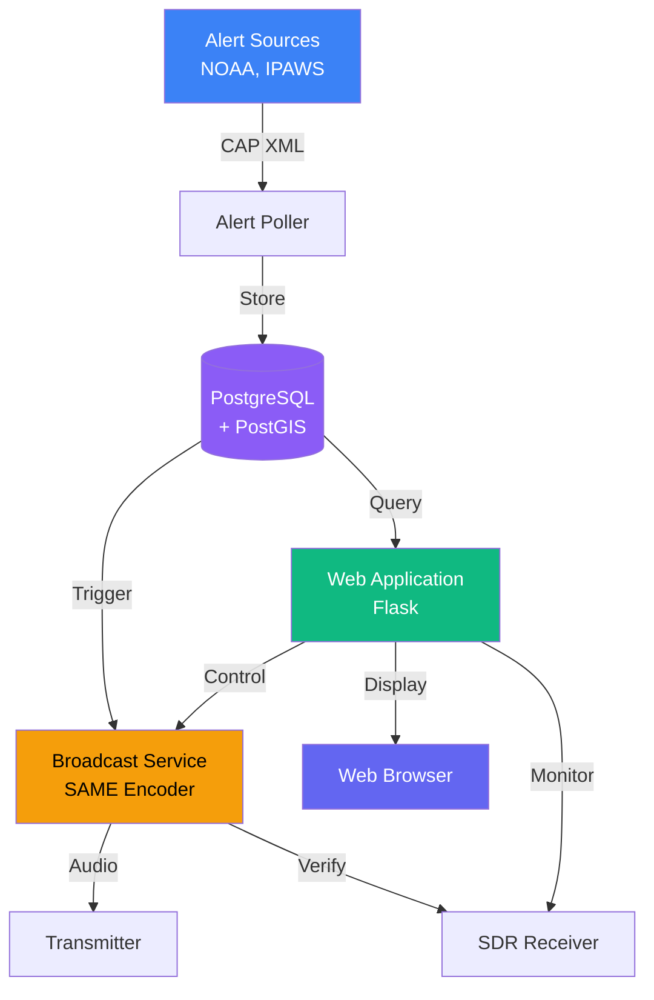
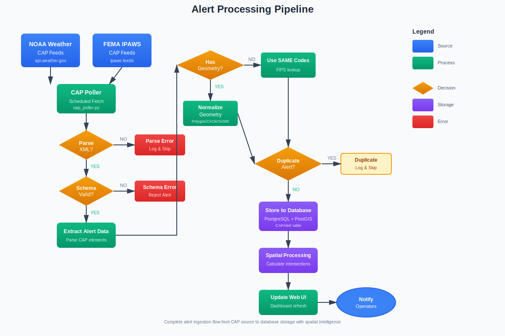
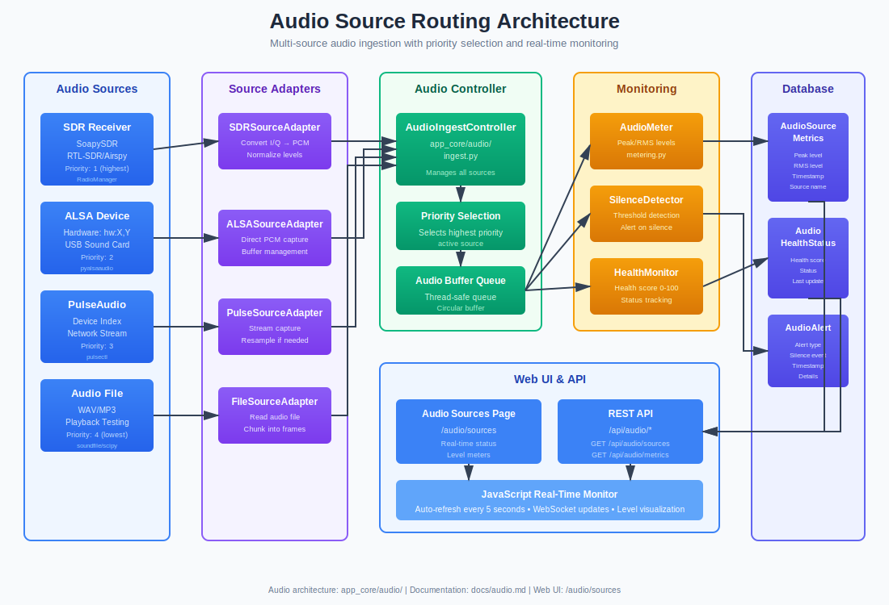
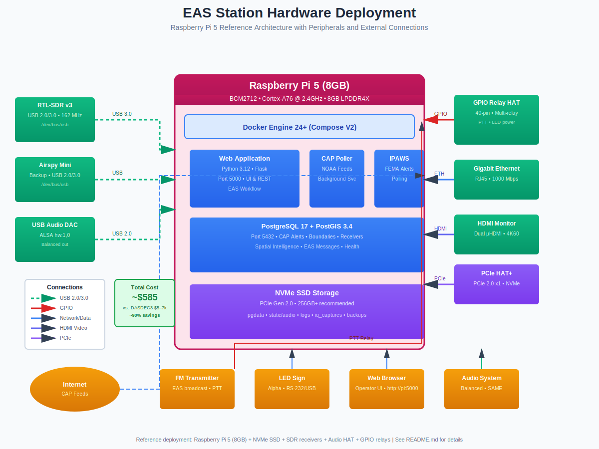
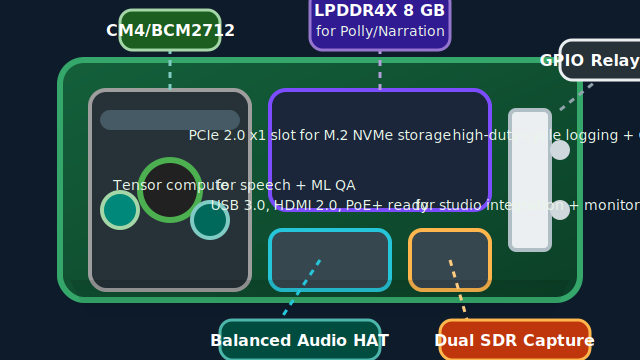

#  EAS Station

[](https://opensource.org/licenses/MIT)
[](https://www.docker.com/)
[](https://www.python.org/)
[](https://www.postgresql.org/)

> **A professional Emergency Alert System (EAS) platform for monitoring, broadcasting, and verifying NOAA and IPAWS alerts**

EAS Station is a software-defined drop-in replacement for commercial EAS encoder/decoder hardware, built on commodity hardware like Raspberry Pi. It provides comprehensive alert processing with FCC-compliant SAME encoding, multi-source aggregation, PostGIS spatial intelligence, SDR verification, and integrated LED signage.

---

!!! warning "**IMPORTANT: Laboratory Use Only**"
    EAS Station is experimental software for research and development. It is **not FCC-certified** and must only be used in controlled test environments. Never use for production emergency alerting.

---

## 📋 State EAS Plan Documentation

**Ohio Emergency Alert System Plan** (FCC-approved March 2019) is now documented:
- **[📖 Ohio EAS Documentation](docs/OHIO_EAS_README)** - Complete plan, station listings, test procedures
- **[📊 Event Code Analysis](docs/EAS_EVENT_CODES_COMPLETE)** - All 78+ FCC event codes with implementation status
- **[⚠️ Critical Alert](docs/EAS_CRITICAL_ALERT)** - 6 missing critical codes identified (SQW, ISW, WCW, LSW, LFW, EQE)

**Event Code Update (Nov 2025)**: Added 6 critical missing codes to codebase:
- **SQW** (Snow Squall Warning) - Sudden whiteout conditions on highways
- **ISW** (Ice Storm Warning) - Significant ice accumulation
- **WCW** (Wind Chill Warning) - Dangerous wind chills
- **LSW** (Lake Effect Snow Warning) - Heavy lake effect snow
- **LFW** (Lakeshore Flood Warning) - Lake Erie lakeshore flooding
- **EQE** (Earthquake Early Warning) - ShakeAlert system warning

The system now supports **67 event codes** (up from 61) and can encode/decode all missing codes using the originator reference in plain language output.

---

## ✨ Key Features

| Feature | Description |
|---------|-------------|
| 🌐 **Multi-Source Ingestion** | NOAA Weather, IPAWS federal alerts, and custom CAP feeds |
| 📻 **FCC-Compliant SAME** | Specific Area Message Encoding per FCC Part 11 |
| 🗺️ **Geographic Intelligence** | PostGIS spatial filtering with county/state/polygon support |
| 📡 **SDR Verification** | Automated broadcast verification with RTL-SDR/Airspy |
| 🔒 **Built-in HTTPS** | Automatic SSL/TLS with Let's Encrypt, nginx reverse proxy |
| 🎨 **Modern Web UI** | Responsive Bootstrap 5 interface with real-time updates |
| ⚡ **Hardware Integration** | GPIO relay control, LED signs, multiple audio outputs |

## 🚀 Quick Start

### One-Command Installation

```bash
git clone https://github.com/KR8MER/eas-station.git && \
cd eas-station && \
cp .env.example .env && \
sudo docker compose up -d --build
```

Then open **https://localhost** in your browser (HTTPS enabled by default).

> 💡 **Next Steps**:
> - For production with Let's Encrypt: Set `DOMAIN_NAME` in `.env` and restart
> - For localhost: Accept the self-signed certificate warning (safe for testing)
> - Edit `.env` with your configuration, then restart: `sudo docker compose restart`

### Prerequisites

- Docker Engine 24+ with Compose V2
- PostgreSQL 14+ with PostGIS (can use embedded container)
- 4GB RAM (8GB recommended)
- Internet connection for alert polling

> **Note**: Most Docker commands require root privileges. If you're running as a non-root user, prefix commands with `sudo`. Alternatively, add your user to the `docker` group (see [Docker Post-Installation Steps](https://docs.docker.com/engine/install/linux-postinstall/)).

## 📚 Documentation

<table>
<tr>
<td width="50%">

### For Users
- **[📖 Getting Started](docs/INDEX)**
  Installation, configuration, first alert

- **[🛠️ Setup Instructions](docs/guides/SETUP_INSTRUCTIONS)**
  First-run wizard walkthrough and environment validation tips

- **[📘 User Guide](docs/guides/HELP)**
  Daily operations, alert management, hardware

- **[📡 SDR Setup Guide](docs/SDR_SETUP)**
  USB device passthrough, troubleshooting, udev rules

- **[🔧 Admin Guide](docs/guides/PORTAINER_DEPLOYMENT)**
  Deployment, database, maintenance

- **[🔒 HTTPS Setup](docs/guides/HTTPS_SETUP)**
  SSL/TLS configuration, Let's Encrypt certificates, nginx reverse proxy

- **[🎧 Audio Monitoring](docs/audio/AUDIO_MONITORING)**
  Live stream viewer, level metering, troubleshooting steps

</td>
<td width="50%">

### For Developers
- **[💻 Developer Guide](docs/development/AGENTS)**
  Architecture, contribution guidelines, testing

- **[🎨 Frontend Docs](docs/frontend/FRONTEND_INDEX)**
  UI components, theming, JavaScript API

- **[📡 API Reference](docs/frontend/JAVASCRIPT_API)**
  REST API and JavaScript API documentation

</td>
</tr>
</table>

For complete documentation coverage, see **[Documentation Index](docs/INDEX)** with searchable topics.

### Browse Full Documentation

📖 **[View Complete Documentation Site](https://kr8mer.github.io/eas-station/)** (Coming Soon)

Or build locally:

```bash
pip install -r requirements-docs.txt
mkdocs serve
# Open http://localhost:8000
```

## 📡 API Endpoints

EAS Station exposes a comprehensive REST API for automation and integrations:

- [Endpoint reference](docs/frontend/JAVASCRIPT_API) – Complete request/response catalog and authentication model
- [Architecture overview](docs/architecture/SYSTEM_ARCHITECTURE) – How the API interacts with pollers, database, and broadcast services
- [SDK examples](docs/frontend/FRONTEND_INDEX#javascript-api-usage) – Using the JavaScript client to control GPIO and audio devices

> Tip: All API routes are namespaced under `/api/`. Use the `X-API-Key` header generated from the Configuration → API Keys page.

## 🏗️ Architecture



### Core Components

| Component | Technology | Purpose |
|-----------|-----------|---------|
| **Web Application** | Flask 3.0 + Bootstrap 5 | User interface and API |
| **Alert Poller** | Python async | CAP feed monitoring |
| **Database** | PostgreSQL 17 + PostGIS 3.4 | Spatial data storage |
| **Broadcast Engine** | Python + ALSA | SAME encoding and audio |
| **SDR Service** | RTL-SDR/Airspy | Transmission verification |

## 🎯 Use Cases

<table>
<tr>
<td width="50%">

**Broadcasters**
- Replace $5,000-$7,000 commercial encoders
- Multi-station coordination
- Automated compliance logging

**Amateur Radio**
- Emergency communications testing
- Alert relay networks
- Training and education

</td>
<td width="50%">

**Emergency Management**
- Custom alert distribution
- Geographic targeting
- Integration with existing systems

**Developers**
- CAP protocol experimentation
- Alert system research
- Custom integrations

</td>
</tr>
</table>

## ⚙️ System Requirements

### Recommended Hardware

| Component | Specification |
|-----------|---------------|
| **Compute** | Raspberry Pi 5 (8GB) or equivalent x86 |
| **Control** | Multi-relay GPIO HAT |
| **Audio** | USB sound card or Pi HAT |
| **SDR** | RTL-SDR v3 or Airspy |
| **Storage** | External SSD (50GB+) |

### Software Requirements

**For Docker deployment (recommended)**:
- Docker Engine 24+ with Compose V2
- PostgreSQL 14+ with PostGIS 3+ (provided in docker-compose.yml)

**For source installation**:
- Python 3.11+
- PostgreSQL 14+ with PostGIS 3+
- System packages (see below)

### System Package Dependencies

**Required for audio streaming**:
- `ffmpeg` - Audio codec library for MP3/AAC/OGG stream decoding
- `libpq-dev` - PostgreSQL client library headers

**Optional (for specific features)**:
- `icecast2` - Audio streaming server (recommended for production)
- `python3-soapysdr` + `soapysdr-module-rtlsdr` - SDR receiver support
- `espeak` / `libespeak-ng1` - Text-to-speech synthesis
- `libusb-1.0-0` - USB SDR hardware support

> 📘 **Docker users**: All system packages are pre-installed in the container.
>
> 📘 **Source installation**: See [SYSTEM_DEPENDENCIES.md](docs/reference/SYSTEM_DEPENDENCIES) for complete installation guide.

## 🛠️ Configuration

Edit `.env` with your settings:

```bash
# Core settings
SECRET_KEY=generate-with-python-secrets-module
POSTGRES_HOST=alerts-db
POSTGRES_PASSWORD=your-secure-password

# Your location
DEFAULT_COUNTY_NAME=Your County
DEFAULT_STATE_CODE=XX
DEFAULT_ZONE_CODES=XXZ001,XXC001

# Enable broadcast (optional)
EAS_BROADCAST_ENABLED=false
EAS_ORIGINATOR=WXR
EAS_STATION_ID=YOURCALL
```

See [Configuration Guide](docs/guides/HELP) for complete reference.

## 📊 System Diagrams

Professional flowcharts and block diagrams illustrating system architecture and workflows:

<table>
<tr>
<td width="50%">
<a href="docs/assets/diagrams/alert-processing-pipeline.svg">

</a>
<p align="center"><em><strong>Alert Processing Pipeline</strong></em><br/>CAP ingestion, validation, and storage workflow</p>
</td>
<td width="50%">
<a href="docs/assets/diagrams/broadcast-workflow.svg">

</a>
<p align="center"><em><strong>EAS Broadcast Workflow</strong></em><br/>SAME generation and transmission process</p>
</td>
</tr>
<tr>
<td width="50%">
<a href="docs/assets/diagrams/sdr-setup-flow.svg">

</a>
<p align="center"><em><strong>SDR Setup & Configuration</strong></em><br/>Complete radio receiver setup guide</p>
</td>
<td width="50%">
<a href="docs/assets/diagrams/audio-source-routing.svg">

</a>
<p align="center"><em><strong>Audio Source Architecture</strong></em><br/>Multi-source audio routing and monitoring</p>
</td>
</tr>
<tr>
<td colspan="2">
<a href="docs/assets/diagrams/system-deployment-hardware.svg">

</a>
<p align="center"><em><strong>Hardware Deployment Architecture</strong></em><br/>Raspberry Pi 5 reference configuration with peripherals</p>
</td>
</tr>
</table>

📖 **[View all architectural diagrams →](docs/architecture/SYSTEM_ARCHITECTURE)**

## 📊 Screenshots

<table>
<tr>
<td width="50%">

<p align="center"><em>Main Dashboard</em></p>
</td>
<td width="50%">

<p align="center"><em>Administration Panel</em></p>
</td>
</tr>
</table>

## 🤝 Contributing

We welcome contributions! Please see:

- [Contributing Guide](docs/process/CONTRIBUTING)
- [Code Standards](docs/development/AGENTS)
- [Development Setup](docs/development/AGENTS)

### Development

```bash
# Clone repository
git clone https://github.com/KR8MER/eas-station.git
cd eas-station

# Set up environment
python3 -m venv venv
source venv/bin/activate
pip install -r requirements.txt

# Configure database
cp .env.example .env
# Edit .env with local database settings

# Run development server
python app.py
```

## 🆘 Support

- 📖 **Documentation**: [Complete Docs](docs/INDEX)
- 🔧 **Diagnostic Tools**: [Troubleshooting Scripts](scripts/diagnostics/)
- 💬 **Discussions**: [GitHub Discussions](https://github.com/KR8MER/eas-station/discussions)
- 🐛 **Issues**: [GitHub Issues](https://github.com/KR8MER/eas-station/issues)
- 📡 **Community**: Join our amateur radio forums

> **Quick Diagnostics**: Run `bash scripts/diagnostics/troubleshoot_connection.sh` to diagnose connection issues, or see [scripts/diagnostics/README.md](scripts/diagnostics/README.md) for all available tools.

## ⚖️ Legal & Compliance

!!! danger "FCC Compliance Warning"
    **EAS Station generates valid EAS SAME headers and attention tones.** Unauthorized broadcast violates FCC regulations and can result in substantial fines:

    - 2015 iHeartMedia: [$1M settlement](https://docs.fcc.gov/public/attachments/DA-15-199A1.pdf)
    - 2014 Multiple Networks: [$1.9M settlement](https://docs.fcc.gov/public/attachments/DA-14-1097A1.pdf)

    Always work in shielded test environments. Never connect to production broadcast chains.

See [Terms of Use](docs/policies/TERMS_OF_USE) and [FCC Compliance](docs/reference/ABOUT) for details.

## 📈 Roadmap

Current development focuses on:

- ✅ **Core Features**: Multi-source ingestion, SAME encoding, geographic filtering
- 🔄 **Hardware Parity**: Advanced relay control, multi-receiver coordination
- ⏳ **Certification**: FCC Part 11 compliance documentation
- ⏳ **Advanced Features**: Cloud sync, mobile app, multi-site coordination

See [Roadmap](docs/roadmap/master_todo) for complete details.

## 📜 License

EAS Station is licensed under the [MIT License](LICENSE).

```
MIT License

Copyright (c) 2025 KR8MER

Permission is hereby granted, free of charge, to any person obtaining a copy
of this software and associated documentation files...
```

See [LICENSE](LICENSE) file for full text.

## 🙏 Acknowledgments

- **NOAA/NWS** - Weather alert data and CAP specifications
- **FEMA/IPAWS** - National alert system integration
- **PostGIS Team** - Spatial database technology
- **Putnam County GIS Office** - Geographic boundary data (Greg Luersman, GIS Coordinator)
- **U.S. Census Bureau** - FIPS codes and TIGER/Line boundary data
- **Flask Community** - Web framework
- **RTL-SDR Project** - Software-defined radio tools
- **Amateur Radio Community** - Testing and feedback

## 📞 Resources

| Resource | Link |
|----------|------|
| **Documentation** | [docs/](docs/INDEX) |
| **NOAA CAP API** | https://www.weather.gov/documentation/services-web-api |
| **IPAWS** | https://www.fema.gov/emergency-managers/practitioners/integrated-public-alert-warning-system |
| **FCC Part 11** | https://www.ecfr.gov/current/title-47/chapter-I/subchapter-A/part-11 |
| **PostGIS** | https://postgis.net/documentation/ |

---

<div align="center">
  <strong>Made with ☕ and 📻 for Amateur Radio Emergency Communications</strong><br>
  <strong>73 de KR8MER</strong> 📡
</div>
