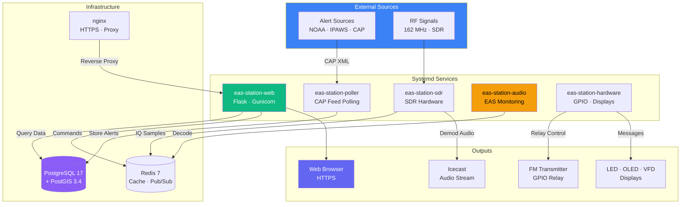

#  EAS Station

[](https://www.gnu.org/licenses/agpl-3.0)
[](LICENSE-COMMERCIAL)
[](https://www.raspberrypi.com/)
[](https://www.python.org/)
[](https://flask.palletsprojects.com/)
[](https://socket.io/)
[](https://www.sqlalchemy.org/)
[](https://alembic.sqlalchemy.org/)
[](https://www.postgresql.org/)
[](https://redis.io/)
[](https://gunicorn.org/)
[](https://nginx.org/)
[](https://letsencrypt.org/)
[](https://icecast.org/)
[](https://github.com/pothosware/SoapySDR)
[](https://numpy.org/)
[](https://getbootstrap.com/)
[](https://leafletjs.com/)
[](https://www.chartjs.org/)
[](https://fontawesome.com/)

> **A professional Emergency Alert System (EAS) research platform — CAP ingestion, SAME encoding, SDR verification, and multi-channel distribution, all on commodity hardware.**

EAS Station is a software-defined drop-in replacement for commercial EAS encoder/decoder hardware costing **$5,000–$7,000**, built on a Raspberry Pi or any Linux server. It delivers a complete, automated CAP-to-broadcast workflow with PostGIS spatial intelligence, real-time SDR verification, and a polished web dashboard — wired together from boring, battle-tested open-source components.

---

> ⚠️ **Laboratory Use Only** — EAS Station is experimental software for research, training, and development. It is **not FCC-certified** and must only be used in controlled test environments. Never connect to production broadcast chains or on-air RF. [See Legal & Compliance.](#-legal--compliance)

---

## ✨ Everything You Get

### 📥 Multi-Source Alert Ingestion
- **NOAA/NWS CAP feeds** — poll and parse all active weather alerts for your region
- **FEMA IPAWS** — federal Integrated Public Alert and Warning System integration
- **Custom CAP endpoints** — add any CAP 1.2-compatible feed source
- **Automatic deduplication** — stores once, no duplicate processing
- **FIPS & NWS zone lookup** — built-in setup wizard to find the right codes for your coverage area

### 📻 FCC-Compliant SAME Audio Engine
- **Full SAME encoding** — generates bit-perfect Specific Area Message Encoding headers per FCC Part 11
- **Attention tone synthesis** — 853/960 Hz two-tone sequence generated in software
- **Text-to-Speech voice-over** — eSpeak TTS narrates alert details automatically
- **Manual EAS print** — compose and broadcast custom SAME messages for drills and tests
- **Raw SAME parser** — paste any `ZCZC-…` string for instant field-by-field decode and validation
- **MDC1200 selective calling** — optional 1200-baud FFSK pre/post signaling for forwarding EAS audio over Motorola-style two-way radio systems. Supports PTT-ID, Emergency, Request-to-Talk, Remote Monitor, Call Alert, and Voice Selective Call (unmute a specific target subscriber), plus DTMF tone bursts. See [Alert Signals guide](docs/guides/ALERT_SIGNALS.md).

### 🗺️ PostGIS Geographic Intelligence
- **County/state spatial filtering** — alerts matched to your exact geographic footprint
- **Polygon-based targeting** — NWS zones, FIPS codes, and custom shapefile boundaries
- **Interactive Leaflet maps** — visualize alert areas and your coverage zone in the web UI
- **Shapefile import** — load ESRI boundary data directly into PostGIS for custom regions
- **US Census TIGER/Line** integration for authoritative boundary data

### 📡 SDR Broadcast Verification
- **RTL-SDR and Airspy support** via SoapySDR abstraction layer
- **FM demodulation** — tunes to 162 MHz NOAA Weather Radio and custom frequencies
- **Live SAME decode** — decodes received EAS headers in real time to confirm broadcast
- **Audio spectrum monitoring** — waveform display and signal metrics in the dashboard
- **Icecast streaming** — demodulated audio streamed over HTTP for remote monitoring
- **Multi-bitrate stream profiles** — configure multiple Icecast streams with different formats

### ⚡ Hardware Integration
- **GPIO relay control** — switch transmitters, PTT lines, and external equipment
- **LED sign support** — RS-232 protocol driver for scrolling marquee displays
- **OLED display** — I2C status display showing current alert and system state
- **VFD (Vacuum Fluorescent Display)** — custom screen editor and graphic support
- **Zigbee integration** — optional wireless sensor/device control
- **Multi-relay HAT support** — coordinate multiple relay outputs for complex workflows
- **GPIO pin map** — visual interface showing every pin assignment and current state

### 🌐 Modern Web Dashboard
- **Responsive Bootstrap 5 UI** — works on desktop, tablet, and mobile
- **Real-time updates** — Socket.IO pushes live alert and system data without page refresh
- **Alert timeline** — full history with search, filter, and detail view
- **Analytics dashboard** — alert frequency, type breakdown, and geographic distribution charts (Chart.js), with one-click **PDF export** of the full statistics report (jsPDF + html2canvas)
- **Audio monitoring** — live receive history, source routing view, and playback
- **System health panel** — CPU, memory, disk, and service status at a glance
- **Dark-mode-friendly** design with accessible color system

### 🔒 Security & Access Control
- **Role-based access control (RBAC)** — admin, operator, and viewer roles
- **Multi-factor authentication (MFA)** — TOTP-based second factor for all accounts
- **API key management** — generate and revoke keys for automation integrations
- **Built-in HTTPS** — nginx reverse proxy with Let's Encrypt auto-provisioning
- **Self-signed fallback** — works out of the box before DNS/cert setup

### 📬 Notifications
- **Email alerts** — configurable SMTP for alert and system health notifications
- **SMS** — outbound SMS notifications for critical alerts
- **SNMP v2c traps** — send traps to any NMS target for system health events

### 🗓️ Automated Scheduling
- **Required Weekly Test (RWT) scheduler** — automatically generates and schedules FCC-required weekly EAS tests
- **Required Monthly Test (RMT) support** — configurable monthly test scheduling
- **Cron-style scheduling** — flexible time rules for any recurring broadcast task

### 🛠️ Administration & Operations
- **Settings Hub** — single `/settings` dashboard with links to every configuration page
- **Stream Profile Manager** — multi-stream Icecast configuration with bitrate and format control
- **`sudo eas-config`** — interactive whiptail TUI to reconfigure any `.env` setting without manual file editing
- **Alembic database migrations** — schema upgrades run automatically on update
- **Comprehensive diagnostics** — built-in web diagnostics page and CLI scripts for SDR, network, and database
- **Alert Self-Test** — replay bundled RWT captures to verify your FIPS codes trigger correctly
- **System logs viewer** — tail journalctl logs from any service directly in the browser
- **Docs viewer** — browse the full 90+ document library from within the web UI

### 📡 REST API
- Full REST API namespaced under `/api/`
- `X-API-Key` header authentication — keys generated in the web UI
- Endpoints for alerts, GPIO, audio, streaming, and system control
- JavaScript API client for browser-side integrations
- [Complete API reference →](docs/frontend/JAVASCRIPT_API.md)

---

## 🏗️ Architecture

Five focused systemd services with clear ownership — a web crash won't affect audio, and a hardware fault won't bring down the dashboard.


```mermaid
graph TB
    subgraph External["External Sources"]
        SRC[Alert Sources<br/>NOAA · IPAWS · CAP]
        RF[RF Signals<br/>162 MHz · SDR]
    end

    subgraph Services["Systemd Services"]
        POLL[eas-station-poller<br/>CAP Feed Polling]
        WEB[eas-station-web<br/>Flask · Gunicorn]
        SDR_SVC[eas-station-sdr<br/>SDR Hardware]
        AUDIO_SVC[eas-station-audio<br/>EAS Monitoring]
        HW_SVC[eas-station-hardware<br/>GPIO · Displays]
    end

    subgraph Infrastructure["Infrastructure"]
        DB[(PostgreSQL 17<br/>+ PostGIS 3.4)]
        REDIS[(Redis 7<br/>Cache · Pub/Sub)]
        NGINX[nginx<br/>HTTPS · Proxy]
    end

    subgraph Output["Outputs"]
        TX[FM Transmitter<br/>GPIO Relay]
        UI[Web Browser<br/>HTTPS]
        LED[LED · OLED · VFD<br/>Displays]
        STREAM[Icecast<br/>Audio Stream]
    end

    SRC -->|CAP XML| POLL
    RF --> SDR_SVC

    POLL -->|Store Alerts| DB
    WEB -->|Query Data| DB
    WEB -->|Commands| REDIS
    SDR_SVC -->|IQ Samples| REDIS
    AUDIO_SVC -->|Decode| REDIS

    NGINX -->|Reverse Proxy| WEB
    WEB --> UI
    HW_SVC -->|Relay Control| TX
    HW_SVC -->|Messages| LED
    SDR_SVC -->|Demod Audio| STREAM

    style External fill:#3b82f6,color:#fff
    style DB fill:#8b5cf6,color:#fff
    style WEB fill:#10b981,color:#fff
    style AUDIO_SVC fill:#f59e0b,color:#000
    style UI fill:#6366f1,color:#fff
```

| Service | Responsibility |
|---------|---------------|
| **eas-station-web** | Flask UI, REST API, dashboards — no direct hardware access |
| **eas-station-poller** | CAP feed polling, XML parsing, deduplication, database writes |
| **eas-station-sdr** | SDR capture, FM demodulation, SAME decoding, Icecast streaming |
| **eas-station-hardware** | GPIO relays, OLED/VFD displays, LED sign protocols |
| **eas-station-audio** | Audio processing, EAS monitoring, Redis pub/sub |

**Infrastructure:** PostgreSQL 17 + PostGIS 3.4 for persistent storage · Redis 7 for real-time metrics and inter-service messaging · nginx for HTTPS termination.

**Frontend libraries (all vendored locally under `static/vendor/`):** Bootstrap 5, jQuery, Font Awesome, Leaflet (maps), Mermaid (diagrams), Chart.js 3 with the datalabels, matrix and date-fns adapter plugins (dashboards), and jsPDF + html2canvas (client-side PDF report export from the Statistics dashboard).

---

## 🚀 Quick Start

### One-Command Install

```bash
git clone https://github.com/KR8MER/eas-station.git
cd eas-station
sudo bash install.sh
```

The interactive **whiptail TUI installer** guides you through every option and then handles everything automatically:

| What you configure | What it does automatically |
|---|---|
| Admin account (user/pass/email) | Installs PostgreSQL, Redis, Python, nginx |
| Hostname, domain, callsign, EAS originator | Generates a secure 64-char `SECRET_KEY` |
| State, county, FIPS/NWS zone codes | Runs Alembic database migrations |
| Alert sources (NOAA, IPAWS) | Creates your administrator account |
| Icecast streaming passwords | Starts all systemd services |
| Hardware (GPIO, LED, VFD, Zigbee) | Configures nginx with SSL (Let's Encrypt optional) |

Then open **https://your-server-ip** and log in — your station is live.

> 💡 **Debian 13 (Trixie) and Python 3.13 are fully supported.** The installer auto-detects your OS and selects the right packages.

### Update an Existing Installation

```bash
cd /opt/eas-station
sudo bash update.sh
```

Backs up optionally → stops services → pulls latest code → preserves `.env` → migrates database → restarts everything.

### Reconfigure After Install

```bash
sudo eas-config        # interactive whiptail TUI for any .env setting
```

Or visit `/settings` in the web UI to configure hardware, Icecast, notifications, TTS, FIPS codes, and more.

### Uninstall

```bash
sudo bash uninstall.sh   # stops services, removes files, optionally removes PostgreSQL/Redis/nginx
```

---

## ⚙️ System Requirements

| Category | Minimum | Recommended |
|----------|---------|-------------|
| **Compute** | 2-core CPU, 2 GB RAM | Raspberry Pi 5 (8 GB) or x86 server |
| **Storage** | 20 GB | 50 GB+ SSD (alerts database grows over time) |
| **OS** | Debian 12 / Ubuntu 22.04 | Debian 13 (Trixie) · Raspberry Pi OS |
| **Python** | 3.11 | 3.12 or 3.13 |
| **SDR** | *(optional)* RTL-SDR v3 | Airspy R2/Mini |
| **GPIO** | *(optional)* any relay HAT | Multi-relay HAT + USB sound card |

The install script handles all system packages and Python dependencies automatically. See [requirements.txt](requirements.txt) for the full Python dependency list (50+ packages).

---

## 🛠️ Configuration

Core infrastructure settings live in `/opt/eas-station/.env` (auto-generated by the installer):

```bash
SECRET_KEY=<64-char hex>
DATABASE_URL=postgresql+psycopg2://eas_station:<password>@127.0.0.1:5432/alerts
REDIS_HOST=localhost
REDIS_PORT=6379
DOMAIN_NAME=your-domain.com
SSL_EMAIL=admin@example.com
```

All feature settings (hardware, Icecast, TTS, notifications, FIPS codes, stream profiles) are stored in the database and managed through the web UI at `/settings`.

> 💡 **Production SSL**: The installer can provision Let's Encrypt automatically, or run `sudo certbot --nginx -d your-domain.com` at any time after pointing DNS.

---

## 🎯 Who Is This For?

<table>
<tr>
<td width="50%">

**Amateur Radio / ARES / RACES**
- Research and training on CAP-to-EAS workflows
- Emergency communications lab and net testing
- Alert relay experimentation
- Skywarn and public-safety integration study

**Broadcasters & Researchers**
- Evaluate a $5K–$7K commercial encoder replacement on commodity hardware
- Automated compliance logging and audit trail research
- CAP protocol and SAME encoding experimentation

</td>
<td width="50%">

**Emergency Managers**
- Custom alert distribution and geographic targeting testing
- Understand CAP ingestion pipelines firsthand
- Integration prototyping with existing systems

**Developers**
- Explore a full-stack Python/Flask/PostGIS application
- Build custom CAP integrations against the REST API
- Contribute to open-source EAS tooling

</td>
</tr>
</table>

---

## 📈 Roadmap

| Status | Item |
|--------|------|
| ✅ Done | Multi-source CAP ingestion, SAME encoding, geographic filtering |
| ✅ Done | SDR verification, Icecast streaming, stream profile manager |
| ✅ Done | Settings Hub, system diagnostics, analytics dashboard |
| ✅ Done | SNMP trap notifications, MFA, RBAC, API keys |
| ✅ Done | LED/OLED/VFD display drivers, GPIO relay control |
| ✅ Done | RWT/RMT automatic scheduling |
| 🔄 In Progress | Advanced relay control, multi-receiver coordination |
| ⏳ Planned | FCC Part 11 certification documentation |
| ⏳ Planned | Cloud sync, mobile app, multi-site coordination |

See [Changelog](docs/reference/CHANGELOG.md) and [Feature Roadmap](docs/roadmap/dasdec3-feature-roadmap.md) for full details.

---

## 📚 Documentation

| Topic | Link |
|-------|------|
| **Setup & Installation** | [docs/guides/SETUP_INSTRUCTIONS](docs/guides/SETUP_INSTRUCTIONS) |
| **SDR Configuration** | [docs/hardware/SDR_SETUP](docs/hardware/SDR_SETUP) |
| **Daily Operations** | [docs/guides/HELP](docs/guides/HELP) |
| **REST API Reference** | [docs/frontend/JAVASCRIPT_API.md](docs/frontend/JAVASCRIPT_API.md) |
| **Architecture** | [docs/architecture/SYSTEM_ARCHITECTURE.md](docs/architecture/SYSTEM_ARCHITECTURE.md) |
| **Developer Guide** | [docs/development/AGENTS](docs/development/AGENTS) |
| **Remote Dev (VSCode)** | [.vscode/VSCODE_SETUP.md](.vscode/VSCODE_SETUP.md) |
| **Full Index** | [docs/INDEX](docs/INDEX) — 90+ documents |

**Quick diagnostics:**
- SDR not working? `bash scripts/collect_sdr_diagnostics.sh` → [SDR Quick Fix Guide](docs/troubleshooting/SDR_QUICK_FIX_GUIDE.md)
- Connection issues? `bash scripts/diagnostics/troubleshoot_connection.sh`

---

## 🤝 Contributing

```bash
git clone https://github.com/KR8MER/eas-station.git
cd eas-station
python3 -m venv venv && source venv/bin/activate
pip install -r requirements.txt
cp .env.example .env   # edit with local DB settings
python app.py
```

See [Contributing Guide](docs/process/CONTRIBUTING) and [Code Standards](docs/development/AGENTS).

---

## ⚖️ Legal & Compliance

> 🚨 **EAS Station generates valid SAME headers and attention tones.** These signals will trigger downstream EAS equipment if coupled to any RF, STL, or streaming chain.
>
> - **Not FCC-certified** — for laboratory, research, and training use only.
> - **Never connect to on-air infrastructure** without explicit authorization.
> - Unauthorized broadcast has real consequences: iHeartMedia paid a [$1M settlement](https://docs.fcc.gov/public/attachments/DA-15-199A1.pdf) (2015); the *Olympus Has Fallen* trailer misuse cost [$1.9M](https://docs.fcc.gov/public/attachments/DA-14-1097A1.pdf).
> - The maintainer will cooperate fully with authorities against any misuse.

See [Terms of Use](docs/policies/TERMS_OF_USE.md), [FCC Compliance](docs/reference/ABOUT.md), and [Trademark Policy](docs/policies/TRADEMARK_POLICY.md).

---

## 📜 License

EAS Station is **dual-licensed**:

### Open Source — AGPL v3
Free to use, modify, and distribute under the [GNU Affero General Public License v3](LICENSE). Modifications to network-deployed versions must be made available as source.

### Commercial License
For proprietary or closed-source use without AGPL obligations — no source disclosure required, priority support, custom development assistance. See [LICENSE-COMMERCIAL](LICENSE-COMMERCIAL).

```
Copyright (c) 2025-2026 Timothy Kramer (KR8MER)
EAS Station — https://github.com/KR8MER/eas-station
```

Branding governed by the [Trademark Policy](docs/policies/TRADEMARK_POLICY.md). See [NOTICE](NOTICE) for required attribution details.

---

## 🙏 Acknowledgments

NOAA/NWS · FEMA/IPAWS · PostGIS Team · U.S. Census Bureau (TIGER/Line) · Putnam County GIS Office · Allen County GIS Office · Flask Community · RTL-SDR Project · Amateur Radio Community

| Resource | Link |
|----------|------|
| NOAA CAP API | https://www.weather.gov/documentation/services-web-api |
| FEMA IPAWS | https://www.fema.gov/emergency-managers/practitioners/integrated-public-alert-warning-system |
| FCC Part 11 | https://www.ecfr.gov/current/title-47/chapter-I/subchapter-A/part-11 |
| PostGIS Docs | https://postgis.net/documentation/ |

---

<div align="center">
  <strong>Made with ☕ and 📻 for Amateur Radio Emergency Communications</strong><br>
  <strong>73 de KR8MER</strong> 📡
</div>
