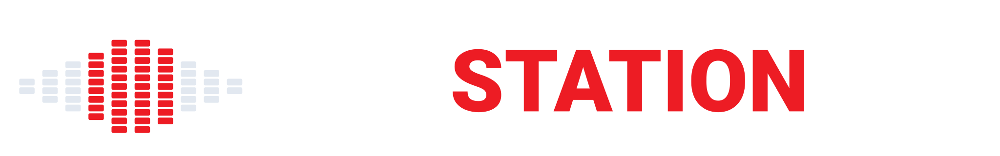

#  EAS Station™

> **A professional Emergency Alert System (EAS) research platform — CAP ingestion, SAME encoding, SDR verification, and multi-channel distribution, all on commodity hardware.**

EAS Station™ is a software-defined drop-in replacement for commercial EAS encoder/decoder hardware costing **$5,000–$7,000**, built on a Raspberry Pi or any Linux server. It delivers a complete, [...]