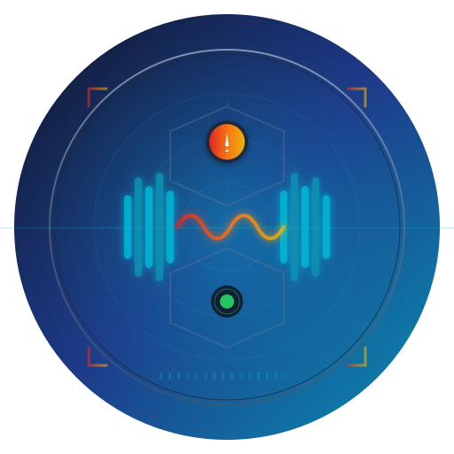
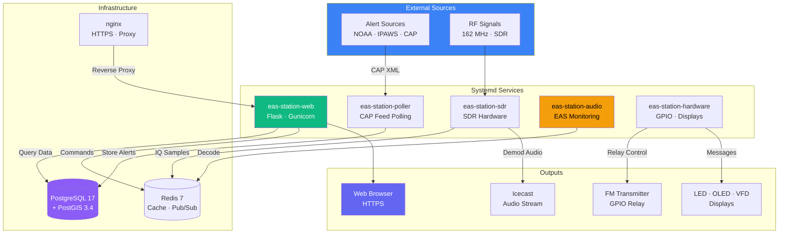

#  EAS Station

[](https://www.gnu.org/licenses/agpl-3.0)
[](LICENSE-COMMERCIAL)
[](https://www.raspberrypi.com/)
[](https://www.python.org/)
[](https://flask.palletsprojects.com/)
[](https://werkzeug.palletsprojects.com/)
[](https://jinja.palletsprojects.com/)
[](https://socket.io/)
[](https://www.sqlalchemy.org/)
[](https://alembic.sqlalchemy.org/)
[](https://www.postgresql.org/)
[](https://redis.io/)
[](https://gunicorn.org/)
[](https://www.gevent.org/)
[](https://nginx.org/)
[](https://letsencrypt.org/)
[](https://systemd.io/)
[](https://icecast.org/)
[](https://github.com/pothosware/SoapySDR)
[](https://ffmpeg.org/)
[](https://github.com/jiaaro/pydub)
[](https://github.com/espeak-ng/espeak-ng)
[](https://numpy.org/)
[](https://scipy.org/)
[](https://numba.pydata.org/)
[](https://lxml.de/)
[](https://python-pillow.org/)
[](https://getbootstrap.com/)
[](https://fontawesome.com/)
[](https://leafletjs.com/)
[](https://www.chartjs.org/)
[](https://pyauth.github.io/pyotp/)
[](https://www.twilio.com/)
[](https://chrony-project.org/)
[](https://gpsd.gitlab.io/gpsd/)

> **A professional Emergency Alert System (EAS) research platform — CAP ingestion, SAME encoding, SDR verification, and multi-channel distribution, all on commodity hardware.**

EAS Station is a software-defined drop-in replacement for commercial EAS encoder/decoder hardware costing **$5,000–$7,000**, built on a Raspberry Pi or any Linux server. It delivers a complete, automated CAP-to-broadcast workflow with PostGIS spatial intelligence, real-time SDR verification, and a polished web dashboard — wired together from boring, battle-tested open-source components.

---

> ⚠️ **Laboratory Use Only** — EAS Station is experimental software for research, training, and development. It is **not FCC-certified** and must only be used in controlled test environments. Never connect to production broadcast chains or on-air RF. [See Legal & Compliance.](#-legal--compliance)

---

## ✨ Everything You Get

### 📥 Multi-Source Alert Ingestion
- **NOAA/NWS CAP feeds** — poll and parse all active weather alerts for your region
- **FEMA IPAWS** — federal Integrated Public Alert and Warning System integration
- **Custom CAP endpoints** — add any CAP 1.2-compatible feed source
- **Automatic deduplication** — stores once, no duplicate processing
- **FIPS & NWS zone lookup** — built-in setup wizard to find the right codes for your coverage area

### 📻 FCC-Compliant SAME Audio Engine
- **Full SAME encoding** — generates bit-perfect Specific Area Message Encoding headers per FCC Part 11
- **Attention tone synthesis** — 853/960 Hz two-tone sequence generated in software
- **Text-to-Speech voice-over** — eSpeak TTS narrates alert details automatically
- **Manual EAS print** — compose and broadcast custom SAME messages for drills and tests
- **Raw SAME parser** — paste any `ZCZC-…` string for instant field-by-field decode and validation
- **MDC1200 selective calling** — optional 1200-baud FFSK pre/post signaling for forwarding EAS audio over Motorola-style two-way radio systems. Supports PTT-ID, Emergency, Request-to-Talk, Remote Monitor, Call Alert, and Voice Selective Call (unmute a specific target subscriber), plus DTMF tone bursts. See [Alert Signals guide](docs/guides/ALERT_SIGNALS.md).

### 🗺️ PostGIS Geographic Intelligence
- **County/state spatial filtering** — alerts matched to your exact geographic footprint
- **Polygon-based targeting** — NWS zones, FIPS codes, and custom shapefile boundaries
- **Interactive Leaflet maps** — visualize alert areas and your coverage zone in the web UI
- **Shapefile import** — load ESRI boundary data directly into PostGIS for custom regions
- **US Census TIGER/Line** integration for authoritative boundary data

### 📡 SDR Broadcast Verification
- **RTL-SDR and Airspy support** via SoapySDR abstraction layer
- **FM demodulation** — tunes to 162 MHz NOAA Weather Radio and custom frequencies
- **Live SAME decode** — decodes received EAS headers in real time to confirm broadcast
- **Audio spectrum monitoring** — waveform display and signal metrics in the dashboard
- **Icecast streaming** — demodulated audio streamed over HTTP for remote monitoring
- **Multi-bitrate stream profiles** — configure multiple Icecast streams with different formats

### ⚡ Hardware Integration
- **GPIO relay control** — switch transmitters, PTT lines, and external equipment
- **LED sign support** — RS-232 protocol driver for scrolling marquee displays
- **OLED display** — I2C status display showing current alert and system state
- **VFD (Vacuum Fluorescent Display)** — custom screen editor and graphic support
- **Zigbee integration** — optional wireless sensor/device control
- **Multi-relay HAT support** — coordinate multiple relay outputs for complex workflows
- **GPIO pin map** — visual interface showing every pin assignment and current state

### 🛰️ Built-In Stratum 1 NTP Time Source
- **GPS-disciplined precision time** — a Uputronics Raspberry Pi GPS/RTC HAT (u-blox MAX-M8Q multi-GNSS: GPS, GLONASS, Galileo, BeiDou) with **hardware PPS** delivers sub-microsecond reference time directly to the kernel
- **True stratum 1** — `chrony` consumes the NMEA fix and the PPS edge as a kernel refclock, so the station serves NTP at **stratum 1** with no upstream internet time required. Logged alert timestamps, audit trails, and SAME header `JJJHHMM` fields are accurate to the satellites themselves.
- **Real broadcast-grade hardware** — battery-backed RTC (RV-3028-C7 on current revisions, DS3231 on older boards) keeps the clock disciplined across power cycles even before GPS lock, and survives complete network isolation. Adafruit Ultimate GPS HAT (#2324, MTK3339) is supported as a drop-in alternative; any standard 9600-baud NMEA UART module with PPS will also work.
- **One-click setup** — **Admin → Hardware Settings → GPS** runs a checklist that probes every prerequisite (RTC overlay, PPS device, `gpsd`/`chrony`/`util-linux-extra` package state, `/boot/firmware/config.txt` overlays, chrony's currently-selected source) and offers a single **Run** button per remediation step. RTC seeding after a coin-cell change is one click.
- **Live status in the dashboard** — fix quality, satellite count, HDOP, sky plot, PPS pill, and `chronyc tracking` are surfaced in real time so an operator can prove stratum 1 lock at a glance.
- **Why it matters** — every EAS event is timestamped, geofenced, and audited; a station that drifts seconds against NIST is a station whose RWT logs and CAP `sent`/`effective`/`expires` math eventually cease to match the real world. Timing is treated as first-class infrastructure, not an afterthought.

See the [GPS HAT Setup guide](docs/hardware/GPS_HAT_SETUP.md) for hardware options, wiring, and the manual configuration steps the admin UI automates.

### 🌐 Modern Web Dashboard
- **Responsive Bootstrap 5 UI** — works on desktop, tablet, and mobile
- **Real-time updates** — Socket.IO pushes live alert and system data without page refresh
- **Alert timeline** — full history with search, filter, and detail view
- **Analytics dashboard** — alert frequency, type breakdown, and geographic distribution charts (Chart.js), with one-click **PDF export** of the full statistics report (jsPDF + html2canvas)
- **Audio monitoring** — live receive history, source routing view, and playback
- **System health panel** — CPU, memory, disk, and service status at a glance
- **Operator-selectable display units** — coords (`D.dddd` / `DMS`), altitude (`m` / `ft`), speed (`kn` / `mph` / `km/h` / `m/s`) and distance (`m` / `ft` / `mi` / `nmi`) chosen per-browser via **Settings → Personalization → Display Units** (also reachable from the Help dropdown and the inline *Units* button on the GPS Dashboard and System Health pages)
- **Dark-mode-friendly** design with accessible color system

### 🔒 Security & Access Control
- **Role-based access control (RBAC)** — admin, operator, and viewer roles
- **Multi-factor authentication (MFA)** — TOTP-based second factor for all accounts
- **API key management** — generate and revoke keys for automation integrations
- **Built-in HTTPS** — nginx reverse proxy with Let's Encrypt auto-provisioning
- **Self-signed fallback** — works out of the box before DNS/cert setup

### 📬 Notifications
- **Email alerts** — configurable SMTP for alert and system health notifications
- **SMS** — outbound SMS notifications for critical alerts
- **SNMP v2c traps** — send traps to any NMS target for system health events

### 🗓️ Automated Scheduling
- **Required Weekly Test (RWT) scheduler** — automatically generates and schedules FCC-required weekly EAS tests
- **Required Monthly Test (RMT) support** — configurable monthly test scheduling
- **Cron-style scheduling** — flexible time rules for any recurring broadcast task

### 🛠️ Administration & Operations
- **Settings Hub** — single `/settings` dashboard with links to every configuration page
- **Stream Profile Manager** — multi-stream Icecast configuration with bitrate and format control
- **`sudo eas-config`** — interactive whiptail TUI to reconfigure any `.env` setting without manual file editing
- **Alembic database migrations** — schema upgrades run automatically on update
- **Comprehensive diagnostics** — built-in web diagnostics page and CLI scripts for SDR, network, and database
- **Alert Self-Test** — replay bundled RWT captures to verify your FIPS codes trigger correctly
- **System logs viewer** — tail journalctl logs from any service directly in the browser
- **Docs viewer** — browse the full 90+ document library from within the web UI

### 📡 REST API
- Full REST API namespaced under `/api/`
- `X-API-Key` header authentication — keys generated in the web UI
- Endpoints for alerts, GPIO, audio, streaming, and system control
- JavaScript API client for browser-side integrations
- [Complete API reference →](docs/frontend/JAVASCRIPT_API.md)

---

## 🏗️ Architecture

Five focused systemd services with clear ownership — a web crash won't affect audio, and a hardware fault won't bring down the dashboard.


```mermaid
graph TB
    subgraph External["External Sources"]
        SRC[Alert Sources<br/>NOAA · IPAWS · CAP]
        RF[RF Signals<br/>162 MHz · SDR]
    end

    subgraph Services["Systemd Services"]
        POLL[eas-station-poller<br/>CAP Feed Polling]
        WEB[eas-station-web<br/>Flask · Gunicorn]
        SDR_SVC[eas-station-sdr<br/>SDR Hardware]
        AUDIO_SVC[eas-station-audio<br/>EAS Monitoring]
        HW_SVC[eas-station-hardware<br/>GPIO · Displays]
    end

    subgraph Infrastructure["Infrastructure"]
        DB[(PostgreSQL 17<br/>+ PostGIS 3.4)]
        REDIS[(Redis 7<br/>Cache · Pub/Sub)]
        NGINX[nginx<br/>HTTPS · Proxy]
    end

    subgraph Output["Outputs"]
        TX[FM Transmitter<br/>GPIO Relay]
        UI[Web Browser<br/>HTTPS]
        LED[LED · OLED · VFD<br/>Displays]
        STREAM[Icecast<br/>Audio Stream]
    end

    SRC -->|CAP XML| POLL
    RF --> SDR_SVC

    POLL -->|Store Alerts| DB
    WEB -->|Query Data| DB
    WEB -->|Commands| REDIS
    SDR_SVC -->|IQ Samples| REDIS
    AUDIO_SVC -->|Decode| REDIS

    NGINX -->|Reverse Proxy| WEB
    WEB --> UI
    HW_SVC -->|Relay Control| TX
    HW_SVC -->|Messages| LED
    SDR_SVC -->|Demod Audio| STREAM

    style External fill:#3b82f6,color:#fff
    style DB fill:#8b5cf6,color:#fff
    style WEB fill:#10b981,color:#fff
    style AUDIO_SVC fill:#f59e0b,color:#000
    style UI fill:#6366f1,color:#fff
```

| Service | Responsibility |
|---------|---------------|
| **eas-station-web** | Flask UI, REST API, dashboards — no direct hardware access |
| **eas-station-poller** | CAP feed polling, XML parsing, deduplication, database writes |
| **eas-station-sdr** | SDR capture, FM demodulation, SAME decoding, Icecast streaming |
| **eas-station-hardware** | GPIO relays, OLED/VFD displays, LED sign protocols |
| **eas-station-audio** | Audio processing, EAS monitoring, Redis pub/sub |

**Infrastructure:** PostgreSQL 17 + PostGIS 3.4 for persistent storage · Redis 7 for real-time metrics and inter-service messaging · nginx for HTTPS termination.

**Frontend libraries (all vendored locally under `static/vendor/`):** Bootstrap 5, jQuery, Font Awesome, Leaflet (maps), Mermaid (diagrams), Chart.js 3 with the datalabels, matrix and date-fns adapter plugins (dashboards), and jsPDF + html2canvas (client-side PDF report export from the Statistics dashboard).

---

## 🚀 Quick Start

### One-Command Install

```bash
git clone https://github.com/KR8MER/eas-station.git
cd eas-station
sudo bash install.sh
```

The interactive **whiptail TUI installer** guides you through every option and then handles everything automatically:

| What you configure | What it does automatically |
|---|---|
| Admin account (user/pass/email) | Installs PostgreSQL, Redis, Python, nginx |
| Hostname, domain, callsign, EAS originator | Generates a secure 64-char `SECRET_KEY` |
| State, county, FIPS/NWS zone codes | Runs Alembic database migrations |
| Alert sources (NOAA, IPAWS) | Creates your administrator account |
| Icecast streaming passwords | Starts all systemd services |
| Hardware (GPIO, LED, VFD, Zigbee) | Configures nginx with SSL (Let's Encrypt optional) |

Then open **https://your-server-ip** and log in — your station is live.

> 💡 **Debian 13 (Trixie) and Python 3.13 are fully supported.** The installer auto-detects your OS and selects the right packages.

### Update an Existing Installation

```bash
cd /opt/eas-station
sudo bash update.sh
```

Backs up optionally → stops services → pulls latest code → preserves `.env` → migrates database → restarts everything.

### Reconfigure After Install

```bash
sudo eas-config        # interactive whiptail TUI for any .env setting
```

Or visit `/settings` in the web UI to configure hardware, Icecast, notifications, TTS, FIPS codes, and more.

### Uninstall

```bash
sudo bash uninstall.sh   # stops services, removes files, optionally removes PostgreSQL/Redis/nginx
```

---

## ⚙️ System Requirements

| Category | Minimum | Recommended |
|----------|---------|-------------|
| **Compute** | 2-core CPU, 2 GB RAM | Raspberry Pi 5 (8 GB) or x86 server |
| **Storage** | 20 GB | 50 GB+ SSD (alerts database grows over time) |
| **OS** | Debian 12 / Ubuntu 22.04 | Debian 13 (Trixie) · Raspberry Pi OS |
| **Python** | 3.11 | 3.12 or 3.13 |
| **SDR** | *(optional)* RTL-SDR v3 | Airspy R2/Mini |
| **GPIO** | *(optional)* any relay HAT | Multi-relay HAT + USB sound card |

The install script handles all system packages and Python dependencies automatically. See [requirements.txt](requirements.txt) for the full Python dependency list (50+ packages).

---

## 🛠️ Configuration

Core infrastructure settings live in `/opt/eas-station/.env` (auto-generated by the installer):

```bash
SECRET_KEY=<64-char hex>
DATABASE_URL=postgresql+psycopg2://eas_station:<password>@127.0.0.1:5432/alerts
REDIS_HOST=localhost
REDIS_PORT=6379
DOMAIN_NAME=your-domain.com
SSL_EMAIL=admin@example.com
```

All feature settings (hardware, Icecast, TTS, notifications, FIPS codes, stream profiles) are stored in the database and managed through the web UI at `/settings`.

> 💡 **Production SSL**: The installer can provision Let's Encrypt automatically, or run `sudo certbot --nginx -d your-domain.com` at any time after pointing DNS.

---

## 🎯 Who Is This For?

<table>
<tr>
<td width="50%">

**Amateur Radio / ARES / RACES**
- Research and training on CAP-to-EAS workflows
- Emergency communications lab and net testing
- Alert relay experimentation
- Skywarn and public-safety integration study

**Broadcasters & Researchers**
- Evaluate a $5K–$7K commercial encoder replacement on commodity hardware
- Automated compliance logging and audit trail research
- CAP protocol and SAME encoding experimentation

</td>
<td width="50%">

**Emergency Managers**
- Custom alert distribution and geographic targeting testing
- Understand CAP ingestion pipelines firsthand
- Integration prototyping with existing systems

**Developers**
- Explore a full-stack Python/Flask/PostGIS application
- Build custom CAP integrations against the REST API
- Contribute to open-source EAS tooling

</td>
</tr>
</table>

---

## 📈 Roadmap

| Status | Item |
|--------|------|
| ✅ Done | Multi-source CAP ingestion, SAME encoding, geographic filtering |
| ✅ Done | SDR verification, Icecast streaming, stream profile manager |
| ✅ Done | Settings Hub, system diagnostics, analytics dashboard |
| ✅ Done | SNMP trap notifications, MFA, RBAC, API keys |
| ✅ Done | LED/OLED/VFD display drivers, GPIO relay control |
| ✅ Done | RWT/RMT automatic scheduling |
| 🔄 In Progress | Advanced relay control, multi-receiver coordination |
| ⏳ Planned | FCC Part 11 certification documentation |
| ⏳ Planned | Cloud sync, mobile app, multi-site coordination |

See [Changelog](docs/reference/CHANGELOG.md) and [Feature Roadmap](docs/roadmap/dasdec3-feature-roadmap.md) for full details.

---

## 📚 Documentation

| Topic | Link |
|-------|------|
| **Setup & Installation** | [docs/guides/SETUP_INSTRUCTIONS](docs/guides/SETUP_INSTRUCTIONS) |
| **SDR Configuration** | [docs/hardware/SDR_SETUP](docs/hardware/SDR_SETUP) |
| **Daily Operations** | [docs/guides/HELP](docs/guides/HELP) |
| **REST API Reference** | [docs/frontend/JAVASCRIPT_API.md](docs/frontend/JAVASCRIPT_API.md) |
| **Architecture** | [docs/architecture/SYSTEM_ARCHITECTURE.md](docs/architecture/SYSTEM_ARCHITECTURE.md) |
| **Developer Guide** | [docs/development/AGENTS](docs/development/AGENTS) |
| **Remote Dev (VSCode)** | [.vscode/VSCODE_SETUP.md](.vscode/VSCODE_SETUP.md) |
| **Full Index** | [docs/INDEX](docs/INDEX) — 90+ documents |

**Quick diagnostics:**
- SDR not working? `bash scripts/collect_sdr_diagnostics.sh` → [SDR Quick Fix Guide](docs/troubleshooting/SDR_QUICK_FIX_GUIDE.md)
- Connection issues? `bash scripts/diagnostics/troubleshoot_connection.sh`

---

## 🤝 Contributing

```bash
git clone https://github.com/KR8MER/eas-station.git
cd eas-station
python3 -m venv venv && source venv/bin/activate
pip install -r requirements.txt
cp .env.example .env   # edit with local DB settings
python app.py
```

See [Contributing Guide](docs/process/CONTRIBUTING) and [Code Standards](docs/development/AGENTS).

---

## ⚖️ Legal & Compliance

> 🚨 **EAS Station generates valid SAME headers and attention tones.** These signals will trigger downstream EAS equipment if coupled to any RF, STL, or streaming chain.
>
> - **Not FCC-certified** — for laboratory, research, and training use only.
> - **Never connect to on-air infrastructure** without explicit authorization.
> - Unauthorized broadcast has real consequences: iHeartMedia paid a [$1M settlement](https://docs.fcc.gov/public/attachments/DA-15-199A1.pdf) (2015); the *Olympus Has Fallen* trailer misuse cost [$1.9M](https://docs.fcc.gov/public/attachments/DA-14-1097A1.pdf).
> - The maintainer will cooperate fully with authorities against any misuse.

See [Terms of Use](docs/policies/TERMS_OF_USE.md), [FCC Compliance](docs/reference/ABOUT.md), and [Trademark Policy](docs/policies/TRADEMARK_POLICY.md).

---

## 📜 License

EAS Station is **dual-licensed**:

### Open Source — AGPL v3
Free to use, modify, and distribute under the [GNU Affero General Public License v3](LICENSE). Modifications to network-deployed versions must be made available as source.

### Commercial License
For proprietary or closed-source use without AGPL obligations — no source disclosure required, priority support, custom development assistance. See [LICENSE-COMMERCIAL](LICENSE-COMMERCIAL).

```
Copyright (c) 2025-2026 Timothy Kramer (KR8MER)
EAS Station — https://github.com/KR8MER/eas-station
```

Branding governed by the [Trademark Policy](docs/policies/TRADEMARK_POLICY.md). See [NOTICE](NOTICE) for required attribution details.

---

## 📚 Attributions & Open‑Source Credits

EAS Station stands on the shoulders of an enormous open‑source ecosystem. The badges at the top of this README are a curated highlight; this section is the exhaustive list of every third‑party library, system package, and CDN asset the project relies on. Each entry explains what role that library plays inside EAS Station, not just what the upstream project is. Versions track [`requirements.txt`](requirements.txt) and the system‑package install scripts in [`scripts/`](scripts/).

> The drift guard `tests/test_tech_stack_badges.py` and the workflow `.github/workflows/release-metadata.yml` enforce that the curated badge subset in this README, in `templates/partials/tech_stack_badges.html` (the live page footer), and in `requirements.txt` stay aligned. Bumping a dependency means updating all three.

### Python runtime, framework & extensions

| Library | Version | License | Purpose in EAS Station | Project |
|---|---|---|---|---|
| Flask | 3.1.2 | BSD‑3‑Clause | The web framework. Every dashboard, admin page, and JSON endpoint is a Flask route. | https://flask.palletsprojects.com/ |
| Werkzeug | 3.1.4 | BSD‑3‑Clause | WSGI request/response plumbing under Flask — URL routing, cookies, exceptions, request parsing. | https://werkzeug.palletsprojects.com/ |
| Jinja2 | 3.1.6 | BSD‑3‑Clause | Server‑side HTML templates (`templates/*.html`), including the footer badge partial. | https://jinja.palletsprojects.com/ |
| itsdangerous | 2.2.0 | BSD‑3‑Clause | Cryptographic signing for session cookies, CSRF tokens, and one‑use download URLs. | https://itsdangerous.palletsprojects.com/ |
| Flask‑SQLAlchemy | 3.1.1 | BSD‑3‑Clause | Thin Flask integration over SQLAlchemy — wires the engine to the app and request scope. | https://flask-sqlalchemy.palletsprojects.com/ |
| Flask‑SocketIO | 5.5.1 | MIT | Server side of the WebSocket layer that pushes live alert / radio / GPS updates to the dashboard. | https://flask-socketio.readthedocs.io/ |
| Flask‑WTF | 1.2.2 | BSD‑3‑Clause | CSRF protection on every POST form and JSON endpoint. | https://flask-wtf.readthedocs.io/ |
| Flask‑Limiter | 4.1.1 | MIT | Rate limiting on login, API key, and webhook endpoints (Redis or in‑memory backend). | https://flask-limiter.readthedocs.io/ |
| Flask‑Caching | 2.3.1 | BSD‑3‑Clause | Response and view caching for expensive admin pages and read‑heavy JSON endpoints. | https://flask-caching.readthedocs.io/ |
| python‑socketio | 5.15.0 | MIT | Core Socket.IO protocol implementation that Flask‑SocketIO builds on. | https://python-socketio.readthedocs.io/ |

### Database & ORM

| Library | Version | License | Purpose in EAS Station | Project |
|---|---|---|---|---|
| SQLAlchemy | 2.0.45 | MIT | ORM for every persisted entity — alerts, settings, audit logs, RBAC, GPS samples. | https://www.sqlalchemy.org/ |
| Alembic | 1.17.2 | MIT | Schema migrations (`app_core/migrations/versions/*`); `alembic upgrade head` runs on install/update. | https://alembic.sqlalchemy.org/ |
| psycopg2‑binary | 2.9.11 | LGPL‑3.0 | Sync PostgreSQL driver SQLAlchemy talks to. | https://www.psycopg.org/ |
| GeoAlchemy2 | 0.18.1 | MIT | SQLAlchemy types and ST_* function bindings for PostGIS geometry/geography columns. | https://geoalchemy-2.readthedocs.io/ |
| PostgreSQL | 17 | PostgreSQL | Primary database (alerts, users, audit, configuration). | https://www.postgresql.org/ |
| PostGIS | 3.4 | GPL‑2.0+ | Spatial extension — county/zone boundary matching, polygon containment, alert geo‑filtering. | https://postgis.net/ |
| greenlet | 3.3.0 | MIT / PSF | Required for SQLAlchemy 2.0 sync I/O when running under the gevent worker. | https://greenlet.readthedocs.io/ |

### Caching, queueing & runtime servers

| Component | Version | License | Purpose in EAS Station | Project |
|---|---|---|---|---|
| Redis (server) | 7.1 | RSAL/SSPL/AGPL (per upstream) | Pub/sub bus between the web app and the SDR / hardware services; cache; rate‑limit store; capture registry. | https://redis.io/ |
| redis (Python) | 7.1.0 | MIT | Python client for the Redis server. | https://github.com/redis/redis-py |
| hiredis | 3.3.0 | BSD‑3‑Clause | C parser accelerator for `redis‑py` (faster pub/sub fan‑out). | https://github.com/redis/hiredis-py |
| Gunicorn | 23.0.0 | MIT | Production WSGI server fronting the Flask app. | https://gunicorn.org/ |
| gevent | 25.9.1+ | MIT | Async worker class for Gunicorn so Flask‑SocketIO can hold thousands of concurrent WebSocket connections. | https://www.gevent.org/ |
| Nginx | Alpine | BSD‑2‑Clause | Reverse proxy / TLS terminator / static file server in front of Gunicorn and Icecast. | https://nginx.org/ |
| systemd | system | LGPL‑2.1+ | Process supervisor for `eas-station`, `sdr_hardware_service`, `hardware_service`, `gps_manager`, Icecast, Redis. | https://systemd.io/ |
| Let's Encrypt / Certbot | — | Apache‑2.0 / ISRG | Automated TLS certificate issuance and renewal for the public HTTPS endpoint. | https://letsencrypt.org/ |

### HTTP, serialization & utilities

| Library | Version | License | Purpose in EAS Station | Project |
|---|---|---|---|---|
| requests | 2.32.5 | Apache‑2.0 | Sync HTTP client used by the CAP/IPAWS pollers and most outbound integrations. | https://requests.readthedocs.io/ |
| httpx | 0.28.1 | BSD‑3‑Clause | Modern async HTTP client with connection pooling for high‑throughput CAP fetches. | https://www.python-httpx.org/ |
| certifi | 2025.11.12 | MPL‑2.0 | Up‑to‑date CA bundle for SSL verification (mandatory for IPAWS over TLS). | https://github.com/certifi/python-certifi |
| feedparser | 6.0.11 | BSD‑2‑Clause | Parses RSS/Atom feeds used by the LED‑sign news ticker. | https://github.com/kurtmckee/feedparser |
| orjson | 3.11.5 | Apache‑2.0 / MIT | Fast C‑backed JSON encoder/decoder for the live data feeds and Redis payloads. | https://github.com/ijl/orjson |
| ujson | 5.11.0 | BSD‑3‑Clause | Fallback fast JSON parser when `orjson` is unavailable. | https://github.com/ultrajson/ultrajson |
| PyYAML | 6.0.3 | MIT | Reads screen editor definitions and config templates. | https://pyyaml.org/ |
| lxml | 6.0.2 | BSD‑3‑Clause | High‑performance XML parser for CAP alert ingestion (5–10× faster than stdlib). | https://lxml.de/ |
| mistune | 3.1.4 | BSD‑3‑Clause | Renders the in‑app documentation viewer (`/docs/*`) from project markdown. | https://mistune.lepture.com/ |
| python‑dateutil | 2.9.0.post0 | Apache‑2.0 / BSD‑3 | Robust parsing of CAP timestamp fields with mixed offsets and tz abbreviations. | https://dateutil.readthedocs.io/ |
| pytz | 2025.2 | MIT | Time‑zone database for local display of alert effective/expire times and audit logs. | https://pythonhosted.org/pytz/ |
| python‑dotenv | 1.2.1 | BSD‑3‑Clause | Loads `.env` configuration at startup. | https://github.com/theskumar/python-dotenv |
| psutil | 7.1.3 | BSD‑3‑Clause | System‑health snapshot: CPU/mem/disk/load/temperature shields and the System Health dashboard. | https://github.com/giampaolo/psutil |
| openpyxl | 3.1.5 | MIT | XLSX export of alert history and audit reports. | https://openpyxl.readthedocs.io/ |

### Audio, SDR & signal processing

| Component | Version | License | Purpose in EAS Station | Project |
|---|---|---|---|---|
| NumPy | 2.3.5 | BSD‑3‑Clause | Foundation for every IQ buffer, FM demod, FFT, and SAME bit slicer. | https://numpy.org/ |
| SciPy | 1.16.3 | BSD‑3‑Clause | DSP filter design (`signal.lfilter`, FIR/IIR design) for the interference notch, deemphasis, and channel filters. | https://scipy.org/ |
| Numba | ≥ 0.61.0, < 0.64 | BSD‑2‑Clause | JIT‑compiles the inner SAME DLL and RBDS workers; ~6× faster real‑time demod on a Pi. | https://numba.pydata.org/ |
| pydub | 0.25.1 | MIT | Decodes MP3/AAC/OGG Icecast streams for the EAS audio monitor. | https://github.com/jiaaro/pydub |
| pyttsx3 | 2.99 | MPL‑2.0 | Offline TTS engine option for voice‑over narration of alert text. | https://github.com/nateshmbhat/pyttsx3 |
| audioop‑lts | 0.2.2 | Python‑2.0 | Drop‑in replacement for `audioop`, removed from the Python 3.13 stdlib but still needed by `pydub`. | https://github.com/AbstractUmbra/audioop |
| SoapySDR | system | BSL‑1.0 | Vendor‑agnostic SDR abstraction layer driving RTL‑SDR, Airspy, and SDRplay receivers. | https://github.com/pothosware/SoapySDR |
| Icecast | 2.4.4 | GPL‑2.0 | Streams the demodulated FM/AM audio over HTTP for remote monitoring and stream‑profile mounts. | https://icecast.org/ |
| FFmpeg | system | LGPL‑2.1+ / GPL‑2+ | Underlying codec backend that `pydub` shells out to for MP3/AAC decode/encode. | https://ffmpeg.org/ |
| eSpeak NG | system | GPL‑3.0 | System TTS used to narrate CAP alert summaries into the SAME envelope. | https://github.com/espeak-ng/espeak-ng |

### Hardware / I/O

| Library | Version | License | Purpose in EAS Station | Project |
|---|---|---|---|---|
| pyserial | 3.5 | BSD‑3‑Clause | Serial transport for the VFD display, RS‑232 LED signs, and UART NMEA GPS. | https://github.com/pyserial/pyserial |
| gpiozero | 2.0.1 | BSD‑3‑Clause | High‑level GPIO control for relay HATs, PTT lines, and transmitter keying. | https://gpiozero.readthedocs.io/ |
| rpi‑ws281x | ≥ 0.0.5 | MIT | WS2812B / NeoPixel addressable LED strip driver (DMA‑backed on the Pi). | https://github.com/rpi-ws281x/rpi-ws281x-python |
| luma.oled | 3.14.0 | MIT | I2C SSD1306/SH1106 driver for the Argon OLED status panel. | https://github.com/rm-hull/luma.oled |
| Pillow | 12.0.0 | MIT‑CMU | Rasterizes glyphs and bitmaps for the VFD screen editor and OLED frames. | https://python-pillow.org/ |
| zigpy | ≥ 0.60 | GPL‑3.0 | Core Zigbee protocol stack for optional wireless sensor / device control. | https://github.com/zigpy/zigpy |
| zigpy‑znp | ≥ 0.11 | GPL‑3.0 | TI Z‑Stack (CC2652P / CC1352P) radio driver under `zigpy`. | https://github.com/zigpy/zigpy-znp |
| pynmea2 | 1.19.0 | MIT | Parses NMEA‑0183 sentences (GGA, GSA, GSV, RMC) from the GPS HAT. | https://github.com/Knio/pynmea2 |

### Timekeeping (stratum 1)

| Component | Version | License | Purpose in EAS Station | Project |
|---|---|---|---|---|
| chrony | system | GPL‑2.0 | NTP daemon that consumes the GPS NMEA + PPS edge as a kernel refclock; serves stratum 1 NTP. | https://chrony-project.org/ |
| gpsd | system | BSD‑2‑Clause | Multiplexes the GPS UART so chrony, the dashboard, and the GPS dashboard can all read the fix simultaneously. | https://gpsd.gitlab.io/gpsd/ |

### Security / auth / notifications

| Library | Version | License | Purpose in EAS Station | Project |
|---|---|---|---|---|
| PyOTP | 2.9.0 | MIT | TOTP generation and verification for the MFA login flow. | https://pyauth.github.io/pyotp/ |
| qrcode | 8.2 | BSD‑3‑Clause | Renders the QR code shown during MFA enrollment. | https://github.com/lincolnloop/python-qrcode |
| Twilio | ≥ 9.0 | MIT | SMS delivery for alert‑forwarding and compliance‑health notifications. | https://www.twilio.com/ |
| pysnmp | ≥ 6.2 | BSD‑2‑Clause | Sends SNMP v2c traps when compliance health degrades (optional; gracefully absent). | https://pysnmp.readthedocs.io/ |

### Geospatial

| Library | Version | License | Purpose in EAS Station | Project |
|---|---|---|---|---|
| pyshp | 3.0.3 | MIT | Reads ESRI shapefiles when importing custom county/zone boundaries into PostGIS. | https://github.com/GeospatialPython/pyshp |
| pyproj | 3.7.1 | MIT | Reprojects shapefile CRSes to WGS84 during boundary import. | https://pyproj4.github.io/pyproj/ |

### Testing & QA

| Library | Version | License | Purpose in EAS Station | Project |
|---|---|---|---|---|
| pytest | 9.0.2 | MIT | Test runner for the whole suite (`tests/`). | https://pytest.org/ |
| pytest‑asyncio | 1.3.0 | Apache‑2.0 | Lets async coroutines run as `pytest` test functions. | https://pytest-asyncio.readthedocs.io/ |

### Front‑end vendored / CDN assets

| Library | Version | License | Purpose in EAS Station | Project |
|---|---|---|---|---|
| Bootstrap | 5.3.0 | MIT | CSS grid + component library underlying every dashboard layout. | https://getbootstrap.com/ |
| Font Awesome (Free) | 6.4.0 | CC BY 4.0 / SIL OFL / MIT | Icon set used throughout navigation, status pills, and badges. | https://fontawesome.com/ |
| Leaflet | 1.9.4 | BSD‑2‑Clause | Interactive maps for alert polygons, coverage zones, and county boundaries. | https://leafletjs.com/ |
| Chart.js | 3.9.1 | MIT | Time‑series charts on the Analytics, System Health, and GPS dashboards. | https://www.chartjs.org/ |
| Socket.IO client | 4.5.4 | MIT | Browser WebSocket client that receives the live alert / radio / GPS push updates. | https://socket.io/ |

### Data sources & boundary data

NOAA/NWS CAP API · FEMA IPAWS · U.S. Census Bureau (TIGER/Line) · PostGIS Team · Putnam County GIS · Allen County GIS

License identifiers above are best‑effort summaries — always consult the upstream project's own licensing files for the canonical terms. If you spot a discrepancy or a missing attribution, please open an issue.

---

## 🙏 Acknowledgments

NOAA/NWS · FEMA/IPAWS · PostGIS Team · U.S. Census Bureau (TIGER/Line) · Putnam County GIS Office · Allen County GIS Office · Flask Community · RTL-SDR Project · Amateur Radio Community

| Resource | Link |
|----------|------|
| NOAA CAP API | https://www.weather.gov/documentation/services-web-api |
| FEMA IPAWS | https://www.fema.gov/emergency-managers/practitioners/integrated-public-alert-warning-system |
| FCC Part 11 | https://www.ecfr.gov/current/title-47/chapter-I/subchapter-A/part-11 |
| PostGIS Docs | https://postgis.net/documentation/ |

---

<div align="center">
  <strong>Made with ☕ and 📻 for Amateur Radio Emergency Communications</strong><br>
  <strong>73 de KR8MER</strong> 📡
</div>
