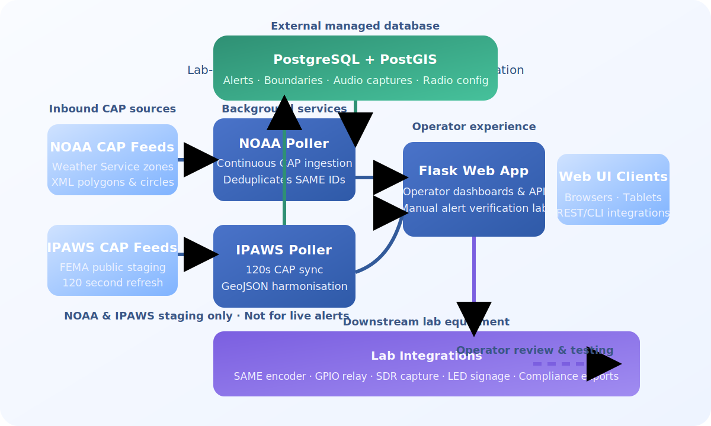

# 📡 EAS Station

> A complete Emergency Alert System (EAS) platform for ingesting, broadcasting, and verifying NOAA and IPAWS Common Alerting Protocol (CAP) alerts. Features FCC-compliant SAME encoding, multi-source aggregation, PostGIS spatial intelligence, SDR verification, and integrated LED signage.

## Vision: A Software Drop-In Replacement

Commercial EAS decoders are expensive, power-hungry appliances that demand rack space and proprietary maintenance. EAS Station is being engineered as a software-first, off-the-shelf alternative that can fulfill the same duties on commodity hardware. The target build centers on a Raspberry Pi 4 paired with HATs that expose dry-contact GPIO relays, RS-232 control, broadcast-quality audio input/output, and HDMI program confidence monitoring—backed by one or more SDR front-ends for verification. With disciplined software integration, repeatable setup, and demonstrable reliability in place, the project can pursue FCC Part 11 certification as a credible drop-in replacement. The roadmap focuses on delivering:

- **Functional Parity** – Automated alert ingestion, SAME generation, playout, verification, and compliance logging equivalent to a certified encoder/decoder pair.
- **Operational Resilience** – High availability, watchdog services, failover-ready storage, and verifiable audit trails so the platform can stand in for purpose-built hardware.
- **Accessible Deployment** – Containerized services, reproducible images, and minimal peripheral requirements so integrators can assemble a station with readily available parts.
- **Certification Readiness** – Compliance evidence, automated self-tests, and documentation packages that streamline the eventual FCC certification process.

This vision guides the feature backlog, documentation, and governance decisions captured throughout the repository.

### Reference Commodity Hardware Stack

While the codebase remains hardware-agnostic, the following Raspberry Pi-based stack is the reference platform the roadmap optimises around:

- **Compute:** Raspberry Pi 4 Model B (4 GB or 8 GB) with active cooling to survive 24/7 service.
- **Dry-Contact Control:** Multi-relay GPIO HAT supplying normally-open and normally-closed contacts for transmitter keying.
- **Serial Automation:** RS-232 HAT or USB interface to drive legacy EAS peripherals and studio controllers.
- **Audio I/O:** Pi-compatible sound card (balanced line in/out) or USB audio interface for program and monitor buses.
- **Monitoring:** Native HDMI for confidence monitoring plus network dashboards for remote operators.
- **Verification:** Dual SDR receivers (e.g., RTL-SDR, Airspy) to capture air-chain audio and validate retransmission.

All documentation and tooling emphasise a guided setup process so integrators can reproduce the build with off-the-shelf components instead of bespoke rack units.

[](https://www.docker.com/)
[](https://www.python.org/)
[](https://flask.palletsprojects.com/)
[](https://gunicorn.org/)
[](https://www.postgresql.org/)
[](https://postgis.net/)
[](https://www.sqlalchemy.org/)
[](https://getbootstrap.com/)
[](https://leafletjs.com/)
[](https://www.weather.gov/)
[](https://www.fema.gov/emergency-managers/practitioners/integrated-public-alert-warning-system)
[](https://www.fcc.gov/general/emergency-alert-system-eas)
[](https://en.wikipedia.org/wiki/Software-defined_radio)
[](https://www.arrl.org/)
[](https://github.com/KR8MER/eas-station/issues)
[](https://github.com/KR8MER/eas-station/stargazers)
[](https://github.com/KR8MER/eas-station/network)
[](https://github.com/KR8MER/eas-station/commits)
[](LICENSE)

**Built for:** Amateur Radio Emergency Communications (KR8MER) | Putnam County, Ohio

### About the Maintainer

Timothy Kramer (KR8MER) is an amateur radio operator and public-safety technologist based in Putnam County, Ohio. First licensed in 2004 and upgraded to General Class in 2025, he combines two decades of field experience with a passion for resilient communications. Kramer previously spent 17 years as a deputy sheriff, where mission-critical Motorola land-mobile radio systems were part of his daily toolkit. He now works as a full-time electrical panel electrician with a focus on keeping complex infrastructure reliable and safe.

Outside of the day job, Kramer is an active Skywarn spotter and maintains a diverse bench of professional-grade radios, trunked monitoring infrastructure, SDR capture nodes, and digital paging systems. His interests extend to RF engineering, SDRTrunk operations, ADS-B and APRS telemetry, drone operations, Ubiquiti networking, Raspberry Pi experimentation, 3D printing, and hands-on Emergency Alert System integration. He created EAS Station to prove that a disciplined software stack running on commodity hardware can cover the entire alerting workflow traditionally reserved for specialized rack units.

---

## ⚠️ Important Safety Notice

- **Development-phase software.** EAS Station is an experimental research project validated against open-source tools such as
  [multimon-ng](https://github.com/EliasOenal/multimon-ng) for decoder parity. The remainder of the platform and all generated
  content are original and community-maintained.
- **Certification pending.** The goal is to satisfy every functional requirement of commercial Emergency Alert System encoders
  and decoders; however, the software is **not yet** FCC-certified and must not be deployed where certified hardware is mandated.
- **No life-safety reliance—yet.** Until the roadmap items in [`docs/master_todo.md`](docs/master_todo.md) are completed and the
  system is validated, keep operations confined to lab and training environments.
- **Read the legal docs.** Review the [Terms of Use](TERMS_OF_USE.md) and [Privacy Policy](PRIVACY_POLICY.md) before sharing data
  or inviting collaborators to test deployments.

---

## 🎯 What is EAS Station?

EAS Station transforms Common Alerting Protocol (CAP) data from NOAA and IPAWS into FCC-compliant SAME/EAS broadcasts. Unlike simple alert monitors, it provides:

- **Automatic SAME encoding and broadcast** - No manual intervention required for routine weather alerts
- **Multi-source intelligence** - Aggregates NOAA Weather Service and FEMA IPAWS feeds with deduplication
- **Spatial awareness** - Uses PostGIS to determine which geographic boundaries are affected
- **Verification loop** - Captures broadcasts via SDR and decodes SAME headers to confirm delivery
- **Compliance documentation** - Automatic audit logs and CSV exports for FCC reporting

### 👥 Who Should Use This?

- **Amateur Radio Emergency Services (ARES/RACES)** - Volunteer-operated EAS relay stations
- **County Emergency Operations Centers** - Multi-jurisdictional alert aggregation and mapping
- **Public Safety Answering Points (PSAPs)** - Real-time situational awareness for dispatch
- **Emergency Management Agencies** - Compliance tracking and alert verification
- **Community Radio Stations** - Open-source alternative to commercial EAS encoders
- **Educational Institutions** - Campus alert systems with geographic boundary management

---

## ✨ What Makes EAS Station Different

EAS Station is not just an alert monitor—it's a **complete emergency broadcast platform** that automates the entire CAP-to-EAS workflow:

### 🎙️ Broadcast & Encoding
- **FCC-Compliant SAME Encoding** – Generates proper SAME headers at 520⅔ baud with 3-burst transmission per § 11.31.
- **Automatic EAS Audio Generation** – Produces complete WAV packages with attention tones, narration, and EOM bursts from the workflow UI in `webapp/eas/workflow.py`.
- **GPIO Relay Control** – Hardware transmitter automation with configurable pre/post hold times powered by helpers in `app_utils/eas.py`.
- **Manual Broadcast Builder** – Full encoder interface with hierarchical SAME code picker and live header preview, plus presets for routine RWT/RMT activations.

### 📡 Multi-Source Aggregation
- **NOAA Weather Service** – Continuous polling of NWS CAP feeds with configurable intervals handled by the poller services under `poller/`.
- **IPAWS/FEMA Integration** – Dedicated poller modes translate IPAWS payloads into the shared storage pipeline (`app_core/alerts.py`).
- **Manual CAP Injection** – CLI helpers such as `manual_eas_event.py` and `tools/generate_sample_audio.py` support drills and operator-crafted scenarios.
- **Intelligent Deduplication** – Cross-feed alert matching by identifier with source tracking across the dashboard and exports.

### 🗺️ Geographic Intelligence
- **PostGIS Spatial Queries** – Real-time alert-boundary intersection calculations with polygon geometry in `app_core/boundaries.py` and `app_core/location.py`.
- **Multi-Layer Boundary Support** – Counties, townships, fire districts, EMS zones, utilities, waterways, and custom polygons remain first-class citizens in the admin UI.
- **Interactive Map Dashboard** – Real-time Leaflet visualization with color-coded alert severity.
- **Automated Geometry Processing** – Converts CAP polygons and circles to PostGIS-compatible formats for downstream analytics.

### 🎛️ Radio & Capture Orchestration
- **Radio Manager Abstractions** – `app_core/radio/manager.py` coordinates multiple receivers, normalises status telemetry, and issues synchronized capture requests.
- **Extensible SDR Drivers** – Built-in SoapySDR-backed drivers in `app_core/radio/drivers.py` support RTL2832U and Airspy hardware with IQ or PCM output.
- **Database-Backed Configuration** – Receiver inventory, health history, and capture paths persist via `RadioReceiver` and `RadioReceiverStatus` models in `app_core/models.py`.
- **Operator Controls** – The `/settings/radio` UI and `/api/radio/receivers` endpoints in `webapp/routes_settings_radio.py` expose CRUD management, auto-start toggles, and live status readouts.

### 📊 Compliance & Verification
- **Compliance Dashboard** – `/admin/compliance` summarises received vs. relayed alerts, weekly tests, receiver health, and audio path status using `app_core/eas_storage.py` and `app_core/system_health.py`.
- **Delivery Analytics** – The alert verification portal (`/admin/alert-verification`) correlates CAP ingestion with downstream playout, highlighting latency and per-target results.
- **Audio Decode Laboratory** – Operators can upload WAV/MP3 captures for SAME decoding, store the results, and review generated segments through `webapp/routes/alert_verification.py`.
- **Regulatory Exports** – CSV and PDF log exports provide FCC-ready documentation directly from the compliance view.

### 🖥️ Operations & Control
- **LED Signage Synchronization** – Alpha Protocol display control with priority queuing and per-line formatting lives under `led_sign_controller.py` and `webapp/routes_led.py`.
- **Real-Time System Health** – CPU, memory, disk, network, temperature, receiver, and audio pipeline metrics aggregate through `app_core/system_health.py`.
- **Session-Based Admin Portal** – User authentication, boundary management, and broadcast controls reside in Flask blueprints within `webapp/`.
- **Searchable Alert Archive** – Filter by severity, status, date, and geographic impact across the admin dashboard.
- **RESTful API** – JSON endpoints surface inventory, status, and export data for external integration.

### 🔧 Deployment & Infrastructure
- **Docker-First Architecture** - Single-command deployment with automatic database migrations
- **External PostGIS Database** - Bring your own managed PostgreSQL/PostGIS instance (no vendor lock-in)
- **Auto-Recovery** - Containers restart on failure with health checks
- **Environment-Based Configuration** - All settings via `.env` file with template-based setup
- **Dark/Light Theme** - Consistent UI across all pages with persistent user preferences

---

## 🏛️ Governance & Contributions

- **License:** Source code is provided under the [MIT License](LICENSE); copyright remains with Timothy Kramer (K8R8MER).
- **Contribution workflow:** All commits must include a Developer Certificate of Origin sign-off (`Signed-off-by`) as described in the [CONTRIBUTING guide](CONTRIBUTING.md).
- **Roadmap alignment:** Issues and pull requests should call out which drop-in replacement requirement from [`docs/master_todo.md`](docs/master_todo.md) they advance to keep hardware parity measurable.
- **Legal notices:** Review the [Terms of Use](TERMS_OF_USE.md) and [Privacy Policy](PRIVACY_POLICY.md) before deploying test systems or sharing data.

## 🧾 Release Integrity & Audit Trails

- **Version numbering is mandatory.** Every deployable build must set `APP_BUILD_VERSION` (surfaced in the UI footer) so operators and auditors can immediately identify what is running. Bumping that version goes hand in hand with publishing a `CHANGELOG` entry.
- **Single source of truth for releases.** Bump the root [`VERSION`](VERSION) file and mirror the value in `.env.example` whenever behaviour changes. The guardrail test (`pytest tests/test_release_metadata.py`) fails fast if the version, changelog, or template drift out of sync.
- **CHANGELOG-first pull requests.** Any change that alters behaviour—no matter how small—should append a note under the `[Unreleased]` section of [`CHANGELOG.md`](CHANGELOG.md) summarising the impact and highlighting regression testing that protects previously working workflows.
- **Regression checks before merge.** Contributors are expected to confirm that critical features (alert ingest, SAME generation, GPIO triggers, audio playout) still function. Document manual or automated verification in the PR description so upgrade decisions can be audited later.
- **Git history is the audit trail.** Keep commits focused and well described; reference issue numbers where applicable and avoid force-pushes to shared branches so the trail remains trustworthy.
- **Post-upgrade validation.** Every deployment should run the operator verification checklist (alert ingest, SAME playback, GPIO relay test, audio monitoring) immediately after `tools/inplace_upgrade.py` completes so you can roll back before lab exercises resume.

## 📚 Additional Documentation

- [ℹ️ About the Project](ABOUT.md) – Overview of the mission, core services, and full software stack powering the system.
- [🆘 Help Guide](HELP.md) – Day-to-day operations, troubleshooting workflows, and reference commands for operators.
- [⚖️ Terms of Use](TERMS_OF_USE.md) – Development-only license terms, acceptable use, and critical safety disclaimers.
- [🛡️ Privacy Policy](PRIVACY_POLICY.md) – Guidance for handling configuration data, test records, and optional integrations.
- [🗂️ Master Implementation Roadmap](docs/master_todo.md) – Drop-in replacement requirements with implementation plans that map the path to hardware parity and production readiness.
- In-app versions of both guides are reachable from the navigation bar via the new <strong>About</strong> and <strong>Help</strong> pages for quick operator reference.

---

## 🚀 Quick Start

### Prerequisites
- **Docker Engine 24+** with Docker Compose V2
- **Git** for cloning the repository
- **Dedicated PostgreSQL/PostGIS database** – provision the spatial database separately (managed service, bare container, or on-prem host) and point the application at it via `.env`.
- **4GB RAM** recommended (2GB minimum)
- **Network Access** for NOAA CAP API polling

### One-Command Installation

```bash
bash -c "git clone https://github.com/KR8MER/eas-station.git && cd eas-station && cp .env.example .env && docker compose up -d --build"
```

> 💡 Update `.env` before or immediately after the first launch so `POSTGRES_HOST`, `POSTGRES_PASSWORD`, and related settings point at your database deployment.

> ⚠️ **Important:** The `.env.example` file only contains placeholder secrets so the
> containers can boot. **Immediately after the first launch, open `.env` and change**
> the `SECRET_KEY`, database password, and any other sensitive values, then restart
> the stack so the new credentials are applied.

If you prefer to run each step manually, the equivalent sequence is:

```bash
git clone https://github.com/KR8MER/eas-station.git
cd eas-station
# Copy the template environment file and edit it before exposing services.
cp .env.example .env
# IMPORTANT: Edit .env and set SECRET_KEY and POSTGRES_PASSWORD!
# Launch the application services once your database connection details are in place.
docker compose up -d --build
```

**Access the application at:** http://localhost:5000

### Configuration Before First Run

1. **Copy and review the environment template:**
   Run `cp .env.example .env` (already done in the quick start commands above)
   and treat the result as your local configuration. The defaults mirror the
   sample Portainer stack, but every secret and environment-specific value must
   be replaced before production use.

2. **Generate a secure SECRET_KEY:**
   ```bash
   python3 -c "import secrets; print(secrets.token_hex(32))"
   ```

3. **Edit `.env` and update:**
   - `SECRET_KEY` - Use the generated value
   - `POSTGRES_PASSWORD` - Change from defaults (the application builds `DATABASE_URL` automatically from the `POSTGRES_*` values)
  - `POSTGRES_HOST` - Point at your existing PostGIS host (hostname or IP)
  - `TZ`, `WATCHTOWER_*`, or other infrastructure metadata as needed

4. **Start the system:**
  ```bash
  docker compose up -d --build
  ```

### In-Place Upgrades (Keep Containers Running)

```bash
# Ensure your worktree is clean, then run:
python tools/inplace_upgrade.py --checkout v2.3.0

# Skip --checkout to stay on the current branch.
```

The helper performs a `git fetch`, optionally checks out a tag/branch, fast-forwards the repository, rebuilds the Docker image, reapplies the stack with `docker compose up -d --build`, runs Alembic migrations, and restarts the pollers—without destroying volumes or replacing containers unnecessarily. Pass `--skip-migrations` if you only need to refresh static assets, and combine it with `tools/create_backup.py` for a pre-flight snapshot before every upgrade.
Operators can trigger the same workflow from **Admin → System Operations** using the “Run Upgrade” button, which launches the helper asynchronously and reports the last run status in the dashboard.

### IPAWS Poller Configuration

- The dedicated **ipaws-poller** service is enabled by default and runs the shared CAP poller
  every **120 seconds** against the URLs listed in `IPAWS_CAP_FEED_URLS`.
- Edit `.env` to point `IPAWS_CAP_FEED_URLS` at your preferred staging or production IPAWS
  feeds. Provide multiple endpoints by separating them with commas.
- IPAWS feeds return CAP XML; the poller now converts those payloads (including polygons and
  circles) into the same GeoJSON-like structure used for NOAA alerts so downstream processing
  continues to work without code changes.
- Alerts fetched across NOAA and IPAWS feeds are deduplicated by CAP identifier and stamped with
  their source so the dashboard, statistics, and exports reflect the originating system.
- The dedicated container advertises `CAP_POLLER_MODE=IPAWS`, so if you do not provide
  `IPAWS_CAP_FEED_URLS` the poller automatically falls back to the FEMA staging public feed
  (12-hour lookback by default). Override the fallback window or template with
  `IPAWS_DEFAULT_LOOKBACK_HOURS`, `IPAWS_DEFAULT_START`, or `IPAWS_DEFAULT_ENDPOINT_TEMPLATE`.
- You can supply alternative feed URLs at runtime by passing `--cap-endpoint` arguments or a
  `CAP_ENDPOINTS` environment variable to any poller service. When unset, the original NOAA
  poller continues targeting the Weather Service zone feeds derived from your location settings.
- Remove or comment out the `ipaws-poller` section in `docker-compose.yml` if you do not need the
  additional feed in a given deployment.

---

## 🏗️ System Architecture



### Service Components

| Service | Purpose | Technology |
|---------|---------|------------|
| **app** | Web UI & REST API | Flask 2.3, Gunicorn, Bootstrap 5 |
| **poller** | Background NOAA alert polling | Python 3.11, continuous daemon |
| **ipaws-poller** | Dedicated IPAWS CAP feed polling | Python 3.11, continuous daemon |
| *(external service)* | Spatial database | PostgreSQL/PostGIS |

> **Deployment Note:** Host the PostgreSQL/PostGIS database outside of these containers (managed service, dedicated VM, or standalone container). Update the connection variables in `.env` so the application can reach it.

---

## 📖 Usage Guide

### Starting and Stopping Services

```bash
# Start the application services (requires an external PostGIS host)
docker compose up -d

# Stop all services
docker compose down

# Restart specific service
docker compose restart app

# View all logs in real-time
docker compose logs -f

# View logs for specific service
docker compose logs -f app       # Web application
docker compose logs -f poller    # Alert poller
```

### Accessing the Application

| URL | Description |
|-----|-------------|
| http://localhost:5000 | Main interactive map dashboard |
| http://localhost:5000/alerts | Alert history with search and filters |
| http://localhost:5000/stats | Statistics dashboard with charts |
| http://localhost:5000/system_health | System health and performance monitoring |
| http://localhost:5000/admin | Admin panel for boundary management |
| http://localhost:5000/led_control | LED sign control interface (if enabled) |

### Authentication & User Management

The admin panel now requires an authenticated session backed by the database. Passwords are stored as salted SHA-256 hashes and never written in plain text.

1. **Create the first administrator account** (only required once):
   - Open http://localhost:5000/admin and complete the **First-Time Administrator Setup** card to provision the initial user through the UI, **or**
   - run the CLI helper if you prefer the terminal:
     ```bash
     docker compose run --rm app flask create-admin-user
     ```
   Both flows enforce the same username rules (letters, numbers, `.`, `_`, `-`) and require a password with at least 8 characters.

2. **Sign in** at http://localhost:5000/login using the credentials created above. Successful login redirects to the admin dashboard.

3. **Manage additional accounts** from the **User Accounts** tab inside the admin panel:
   - Create new users with individual credentials
   - Reset passwords when rotating access
   - Remove users (at least one administrator must remain active)

If you forget all credentials, run the CLI command again to create another administrator account.

### SAME / EAS Broadcast Integration

When enabled, the poller generates full SAME header bursts, raises an optional GPIO-controlled relay, and stores the alert audio alongside a JSON summary that can be reviewed from the dedicated **EAS Workflow** console (available from the top navigation after signing in).

1. **Enable the broadcaster** by adding the following to your `.env` file (a sample configuration is provided in `.env.example`):
   ```ini
   EAS_BROADCAST_ENABLED=true
   # Optional overrides:
   # EAS_OUTPUT_DIR=static/eas_messages        # Files must remain within the Flask static directory for web access
   # EAS_OUTPUT_WEB_SUBDIR=eas_messages        # Subdirectory under /static used for download links
   # EAS_ORIGINATOR=WXR                        # SAME originator code (3 characters)
   # EAS_STATION_ID=EASNODES                   # Call sign or station identifier (up to 8 characters)
   # EAS_AUDIO_PLAYER="aplay"                  # Command used to play generated WAV files
   # EAS_ATTENTION_TONE_SECONDS=8              # Duration of the two-tone attention signal
   # EAS_GPIO_PIN=17                           # BCM pin number controlling a relay (optional)
   # EAS_GPIO_ACTIVE_STATE=HIGH                # HIGH or LOW depending on your relay hardware
   # EAS_GPIO_HOLD_SECONDS=5                   # Minimum seconds to hold relay after playback completes
   ```

2. **Install audio / GPIO dependencies** on the device that runs the poller container (e.g., `alsa-utils` for `aplay`, `RPi.GPIO` for Raspberry Pi hardware). The broadcaster automatically detects when `RPi.GPIO` is unavailable and will log a warning instead of raising an exception.

3. **Review generated assets**:
   - Each alert produces a `*.wav` file that contains three SAME bursts, the selected attention tone (or no tone when omitted), and an automatically generated EOM data burst sequence.
   - A matching `*.txt` file stores the JSON metadata (identifier, timestamps, SAME header, and narrative).
   - The admin console lists the most recent transmissions, allowing operators to play audio or download the summary directly from the browser.

#### Build practice activations from the workflow console

The **Manual Broadcast Builder** in the EAS Workflow console mirrors the workflow of a commercial encoder:

1. Open the **EAS Workflow** console from the top navigation (visible once you are authenticated) and build your SAME target list with the hierarchical picker: choose a state or territory, select the county or statewide PSSCCC entry, and click **Add Location**. The textarea still accepts pasted codes for bulk entry, and the running list is de-duplicated automatically with a hard stop at the 31-code SAME limit.
2. Confirm the ORG, EEE, purge time (TTTT), and station identifier (LLLLLLLL). The originator selector now reflects the four production codes (EAS, CIV, WXR, PEP), the event dropdown hides the legacy `??*` placeholders, and the live header preview renders the complete `ZCZC-ORG-EEE-PSSCCC+TTTT-JJJHHMM-LLLLLLLL-` sequence so you can verify every field before you transmit.
3. Need a test in a hurry? Tap **Quick Weekly Test** to preload the Required Weekly Test template: the tool drops in the configured SAME counties, forces the alert into `Test` status, seeds the headline/message, and omits the attention signal (FCC does not require tones for RWTs). A confirmation dialog appears before the workflow automatically generates the new activation. Switch the attention selector if you need to add it back in.
4. Click **Generate Package** to produce discrete WAV files for the SAME bursts, attention signal (dual-tone, 1050 Hz, or omit entirely), optional narration, and the EOM burst. A composite file is also produced so you can audition the full activation end-to-end. SAME headers always transmit in three bursts automatically per the FCC specification, with one-second guard intervals between each section.

The header breakdown card reiterates the commercial nomenclature (preamble, ORG, EEE, PSSCCC, +TTTT, -JJJHHMM, -LLLLLLLL-, and the trailing `NNNN` EOM burst) and includes the FCC/FEMA guidance for each field so operators and trainees can cross-check the encoding rules.

> 📻 Under the hood the digital bursts now honour the FCC SAME framing: 520 5⁄6 baud, seven LSB-first ASCII bits with a trailing null bit, and fractional-bit timing that keeps the 2083⅓ Hz/1562.5 Hz AFSK tones locked on spec. Each section carries a full one-second pause, and the End Of Message burst transmits the canonical `NNNN` payload exactly three times.

Prefer scripts or automated testing? The legacy helper at `tools/generate_sample_audio.py` is still shipped with the project for command-line use.

### Multi-SDR Capture Orchestration

- Configure receivers on **Admin → Radio Settings**. Each entry tracks the driver, tuned frequency, sample rate, and optional gain overrides. The UI persists configurations to Postgres and surfaces the latest lock/signal telemetry.
- Expose your SDR hardware by mapping <code>/dev/bus/usb</code> into the container rather than running it in privileged mode. The [USB passthrough guide](static/docs/radio_usb_passthrough.html) includes a ready-to-use Docker Compose snippet.
- Optional environment controls are available in `.env`: `RADIO_CAPTURE_DIR` (output directory), `RADIO_CAPTURE_DURATION` (seconds captured per SAME event), and `RADIO_CAPTURE_MODE` (`iq` for complex32 IQ data or `pcm` for float32 audio).
- During polling the CAP ingestor automatically triggers IQ captures for new SAME activations and records status snapshots that appear under **/api/monitoring/radio** and the health endpoint.

#### Optional text-to-speech voiceovers

The encoder can append a spoken narration after the SAME bursts and attention tone using either an online Azure AI voice or an offline pyttsx3 engine.

##### Azure AI voiceover

1. Install the optional SDK:
   ```bash
   pip install azure-cognitiveservices-speech
   ```
2. Configure the environment (for example in `.env`):
   ```ini
   EAS_TTS_PROVIDER=azure
   AZURE_SPEECH_KEY=your-azure-speech-key
   AZURE_SPEECH_REGION=your-region
   # Optional overrides
   # AZURE_SPEECH_VOICE=en-US-AriaNeural
   # AZURE_SPEECH_SAMPLE_RATE=24000
   ```

When the credentials are present, generated audio files include the AI narration after a short pause. If the SDK or API key is missing, the system gracefully falls back to the traditional data-only output.

##### Offline pyttsx3 voiceover

1. Install the speech engine:
   ```bash
   pip install pyttsx3
   ```
2. Configure the environment:
   ```ini
   EAS_TTS_PROVIDER=pyttsx3
   # Optional overrides
   # PYTTSX3_VOICE=com.apple.speech.synthesis.voice.Alex
   # PYTTSX3_RATE=180
   # PYTTSX3_VOLUME=0.8
   ```

The pyttsx3 backend runs entirely on the local host. Provide part of a voice identifier or display name to select a specific voice on the system; otherwise, the default driver voice is used.

#### Manual CAP / RWT / RMT Broadcasts

Use the `manual_eas_event.py` helper to ingest a raw CAP XML document (for example, a Required Weekly or Monthly Test) and play it through the SAME encoder while recording an audit trail:

```bash
./manual_eas_event.py path/to/manual_test.xml
```

The script validates that at least one FIPS/SAME code in the CAP payload matches the configured allow-list before forwarding the message. Configure the allow-list with `EAS_MANUAL_FIPS_CODES` in your environment (comma-separated, defaults to `039137`). You can also provide extra codes per run:

```bash
./manual_eas_event.py manual_rwt.xml --fips 039135 --fips 039137
```

Add `--dry-run` to verify the CAP file and confirm matching FIPS codes without storing records or playing audio.

Manual broadcasts also enforce SAME event code filtering so the encoder only fires for authorized products. Use the `EAS_MANUAL_EVENT_CODES` environment variable (comma-separated, `ALL`, or the `TESTS` preset) or the `--event` CLI flag to extend the allow-list for a single run:

```bash
export EAS_MANUAL_EVENT_CODES=TESTS  # RWT/RMT/DMO/NPT
./manual_eas_event.py manual_rwt.xml --event TOR
```

The repository now ships with the complete nationwide FIPS/SAME registry in `app_utils/fips_codes.py`. Set `EAS_MANUAL_FIPS_CODES=ALL` (or `US`/`USA`) to authorize every code, or keep a smaller allow-list for tighter control. CLI output and audit logs include the friendly county/parish names so operators can double-check the targeted areas.

Similarly, the full SAME event registry in `app_utils/event_codes.py` mirrors the 47 CFR §11.31(d–e) tables so headers, logs, and CLI summaries stay aligned with the authorised originator and event nomenclature.

> **Tip:** Keep the output directory inside Flask's `static/` tree so the files can be served via `url_for('static', ...)`. If you relocate the directory, update both `EAS_OUTPUT_DIR` and `EAS_OUTPUT_WEB_SUBDIR` to maintain access from the UI.

### Uploading GIS Boundaries

1. **Prepare GeoJSON File:**
   - Ensure valid UTF-8 encoding
   - Must contain a `features` array
   - Supported geometries: Polygon, MultiPolygon
   - Validate at [geojson.io](https://geojson.io)

2. **Upload via Admin Panel:**
   - Navigate to http://localhost:5000/admin
   - Select boundary type (county, district, zone, etc.)
   - Choose GeoJSON file
   - Click "Upload Boundaries"

3. **Verify Upload:**
   - Check admin panel for boundary count
   - View on interactive map
   - Check logs: `docker compose logs app`

---

## 🔧 Configuration Reference

### Environment Variables (.env)

Create your `.env` file from the provided template:

```bash
cp .env.example .env
nano .env  # or use your preferred editor
```

#### Flask Application

| Variable | Default | Description |
|----------|---------|-------------|
| `FLASK_ENV` | `production` | Environment mode (production/development) |
| `FLASK_APP` | `app.py` | Main application file |
| `SECRET_KEY` | *(required)* | **MUST be set to secure random value!** |
| `SESSION_LIFETIME_HOURS` | `12` | Hours before an authenticated session expires |
| `SESSION_COOKIE_SECURE` | `true` (disabled automatically when `FLASK_ENV=development`) | Enforce secure cookies over HTTPS |
| `CORS_ALLOWED_ORIGINS` | *(empty)* | Comma-separated list of origins allowed to call `/api/*` endpoints |
| `CORS_ALLOW_CREDENTIALS` | `false` | Enable `Access-Control-Allow-Credentials` for approved origins |

#### Database Configuration

| Variable | Default | Description |
|----------|---------|-------------|
| `POSTGRES_HOST` | `host.docker.internal` | Database hostname (override to `alerts-db` when using the embedded profile) |
| `POSTGRES_PORT` | `5432` | Database port |
| `POSTGRES_DB` | `alerts` | Database name |
| `POSTGRES_USER` | `postgres` | Database username |
| `POSTGRES_PASSWORD` | `change-me` | **Change in production!** |
| `DATABASE_URL` | *(computed)* | Full connection string |

**Docker Networking Note:** When running everything via Docker Compose with the embedded database service, override `POSTGRES_HOST` to `alerts-db` (the service name, also reachable via the alias `postgres`). When connecting back to an existing host-managed Postgres instance, the default `host.docker.internal` works across Windows, macOS, and modern Linux Docker releases.

#### Alert Poller Settings

| Variable | Default | Description |
|----------|---------|-------------|
| `POLL_INTERVAL_SEC` | `180` | Seconds between polling cycles |
| `CAP_TIMEOUT` | `30` | HTTP timeout for CAP API requests |

#### Optional LED Sign Integration

| Variable | Default | Description |
|----------|---------|-------------|
| `LED_SIGN_IP` | *(none)* | IP address of Alpha Protocol LED sign |
| `LED_SIGN_PORT` | `10001` | LED sign communication port |

---

## 🗃️ Database Management

### Accessing the Database

**Using Docker exec:**
```bash
docker compose exec postgresql psql -U postgres -d alerts
```

**From host machine (if psql installed):**
```bash
psql -h localhost -p 5432 -U postgres -d alerts
# Password: change-me (or your custom password from .env)
```

### Database Schema

The system automatically creates the following tables:

| Table | Purpose |
|-------|---------|
| `cap_alerts` | NOAA CAP alert records with PostGIS geometries |
| `boundaries` | Geographic boundary polygons (counties, districts) |
| `intersections` | Pre-calculated alert-boundary relationships |
| `system_logs` | Application event logs |
| `poll_history` | CAP poller execution history |
| `led_messages` | LED sign message queue (if enabled) |

### Backup and Restore

**Recommended snapshot workflow:**

```bash
# Create a timestamped backup folder under ./backups/
python tools/create_backup.py --label pre-upgrade
```

The helper copies your `.env` and compose files, runs `pg_dump` against the configured database (via the running container when available), and writes a `metadata.json` manifest capturing the git revision and app version for audit trails. The Admin console mirrors this workflow under **Admin → System Operations** with a “Run Backup” button that triggers the helper asynchronously and surfaces the latest run status.

**Manual database dump (fallback):**

```bash
docker compose exec alerts-db pg_dump -U "$POSTGRES_USER" "$POSTGRES_DB" > backup_$(date +%Y%m%d_%H%M%S).sql
```

**Restore from backup:**

```bash
cat backup_20250128_120000.sql | docker compose exec -T alerts-db psql -U "$POSTGRES_USER" -d "$POSTGRES_DB"
```

**Reset database (WARNING: deletes all data):**

```bash
docker compose down -v
docker compose up -d
```

### Enable PostGIS Extension (if needed)

```sql
-- Connect to database first
CREATE EXTENSION IF NOT EXISTS postgis;
CREATE EXTENSION IF NOT EXISTS postgis_topology;

-- Verify installation
SELECT PostGIS_Version();
```

---

## 🔌 API Endpoints

### Public Endpoints

| Endpoint | Method | Description | Response |
|----------|--------|-------------|----------|
| `/` | GET | Interactive map dashboard | HTML |
| `/alerts` | GET | Alert history page | HTML |
| `/stats` | GET | Statistics dashboard | HTML |
| `/system_health` | GET | System health monitor | HTML |
| `/health` | GET | Health check | JSON |
| `/ping` | GET | Simple ping test | JSON |
| `/version` | GET | Application version | JSON |

### API Endpoints (JSON)

All `/api/*` endpoints require an authenticated admin session and include CSRF protection. Invoke them from the admin UI or ensure your integration maintains a logged-in session and forwards the `X-CSRF-Token` header obtained from the UI.

| Endpoint | Method | Description |
|----------|--------|-------------|
| `/api/alerts` | GET | Get all active alerts |
| `/api/alerts/<id>` | GET | Get specific alert details |
| `/api/alerts/<id>/geometry` | GET | Get alert geometry as GeoJSON |
| `/api/alerts/historical` | GET | Get historical alerts (paginated) |
| `/api/boundaries` | GET | Get all boundaries with geometry |
| `/api/system_status` | GET | System status summary |
| `/api/system_health` | GET | Detailed system health metrics |

### Admin Endpoints (POST)

| Endpoint | Method | Description |
|----------|--------|-------------|
| `/admin/trigger_poll` | POST | Manually trigger alert polling |
| `/admin/mark_expired` | POST | Mark expired alerts |
| `/admin/recalculate_intersections` | POST | Recalculate all intersections |
| `/admin/calculate_intersections/<id>` | POST | Calculate for specific alert |
| `/admin/upload_boundaries` | POST | Upload GeoJSON boundaries |
| `/admin/clear_boundaries/<type>` | DELETE | Clear boundaries by type |

### LED Control Endpoints (if enabled)

These endpoints are also session-protected and expect the CSRF header when called programmatically.

| Endpoint | Method | Description |
|----------|--------|-------------|
| `/api/led/send_message` | POST | Send custom message |
| `/api/led/send_canned` | POST | Send pre-configured message |
| `/api/led/clear` | POST | Clear LED display |
| `/api/led/brightness` | POST | Adjust brightness |
| `/api/led/status` | GET | Get LED sign status |

---

## 🛡️ Security Best Practices

### Before Production Deployment

- [x] **Generate Strong SECRET_KEY** - Use `python3 -c "import secrets; print(secrets.token_hex(32))"`
- [x] **Change POSTGRES_PASSWORD** - Never use default password in production
- [ ] **Use HTTPS** - Deploy behind reverse proxy with SSL/TLS (nginx, Caddy, Traefik)
- [ ] **Restrict Database Port** - Remove PostgreSQL port exposure or firewall it
- [ ] **Enable Rate Limiting** - Use nginx or Flask-Limiter for API endpoints
- [ ] **Configure CORS** - Restrict API access to known domains
- [ ] **Regular Backups** - Automate database backups
- [ ] **Monitor Logs** - Set up log aggregation and alerting
- [ ] **Keep Updated** - Regularly update Docker images and Python packages

### Environment File Security

The `.env` file contains sensitive credentials and is **excluded from git** via `.gitignore`.

**Never commit `.env` to version control!**

Use `.env.example` as a template for team members or deployment automation.

---

## 📊 Monitoring and Observability

### System Health Dashboard

Access real-time system metrics at http://localhost:5000/system_health

**Monitored Metrics:**
- CPU usage (overall and per-core)
- Memory and swap usage
- Disk space across all mount points
- Network interfaces and connectivity
- Top processes by CPU usage
- Database connection status
- System uptime and load average
- Temperature sensors (if available)

### Log Management

**View Logs:**
```bash
# All services
docker compose logs -f

# Specific service with timestamps
docker compose logs -f --timestamps app

# Last 100 lines
docker compose logs --tail=100 poller

# Follow errors only
docker compose logs -f app 2>&1 | grep ERROR
```

**Log Locations (if volumes mounted):**
- `logs/app.log` - Flask application logs
- `logs/poller.log` - CAP poller execution logs
- Docker logs - `docker compose logs`

### Health Checks

```bash
# Application health
curl http://localhost:5000/health

# Ping test
curl http://localhost:5000/ping

# System metrics
curl http://localhost:5000/api/system_status

# Check container status
docker compose ps

# Resource usage
docker stats
```

---

## 🐛 Troubleshooting

### Common Issues and Solutions

#### Database Connection Errors

**Error:** `psycopg2.OperationalError: could not connect to server`

**Solutions:**
1. Verify `POSTGRES_HOST` in `.env`:
   - Inside Docker: Use `postgresql` (service name)
   - From host: Use `localhost` or `host.docker.internal`
2. Check PostgreSQL is running: `docker compose ps postgresql`
3. Check logs: `docker compose logs postgresql`
4. Verify port: `docker compose port postgresql 5432`

#### Poller Not Fetching Alerts

**Error:** Alerts not appearing on dashboard

**Solutions:**
1. Check poller logs: `docker compose logs -f poller`
2. Verify network connectivity: `docker compose exec poller ping -c 3 api.weather.gov`
3. Check poll interval: Review `POLL_INTERVAL_SEC` in `.env`
4. Manual test: `docker compose run --rm poller python poller/cap_poller.py`

#### GeoJSON Upload Failures

**Error:** Upload fails or boundaries not appearing

**Solutions:**
1. Validate GeoJSON format at [geojson.io](https://geojson.io)
2. Ensure UTF-8 encoding (not UTF-16 or other)
3. Check PostGIS extension: `docker compose exec postgresql psql -U postgres -d alerts -c "SELECT PostGIS_Version();"`
4. Verify upload folder permissions: `docker compose exec app ls -la /app/uploads`
5. Check file size limits in Flask configuration

#### Port Already in Use

**Error:** `Error starting userland proxy: listen tcp 0.0.0.0:5000: bind: address already in use`

**Solutions:**
1. Change port in `docker-compose.yml`: `"8080:5000"` instead of `"5000:5000"`
2. Stop conflicting service: `lsof -ti:5000 | xargs kill -9`
3. Use different port in `.env`: `FLASK_RUN_PORT=8080`

#### Container Keeps Restarting

**Error:** Container in restart loop

**Solutions:**
1. Check logs for errors: `docker compose logs app`
2. Verify `.env` configuration is valid
3. Ensure `SECRET_KEY` is set
4. Check database connectivity
5. Inspect container: `docker compose exec app bash` (if it stays up long enough)

#### Missing Dependencies or Import Errors

**Error:** `ModuleNotFoundError: No module named 'xyz'`

**Solutions:**
1. Rebuild containers: `docker compose build --no-cache`
2. Verify `requirements.txt` is complete
3. Check Python version: `docker compose exec app python --version`
4. Clear Docker build cache: `docker system prune -a` (WARNING: removes all unused images)

---

## 💻 Development

### Local Development (Without Docker)

**For development and testing outside Docker:**

1. **Create Python virtual environment:**
   ```bash
   python3 -m venv venv
   source venv/bin/activate  # Linux/Mac
   # OR
   venv\Scripts\activate  # Windows
   ```

2. **Install dependencies:**
   ```bash
   pip install -r requirements.txt
   ```

3. **Set up local PostgreSQL:**
   ```bash
   # Install PostgreSQL and PostGIS
   # Ubuntu/Debian:
   sudo apt install postgresql postgresql-contrib postgis

   # macOS:
   brew install postgresql postgis

   # Create database
   createdb alerts
   psql -d alerts -c "CREATE EXTENSION postgis;"
   ```

4. **Configure `.env` for local development:**
   ```bash
   POSTGRES_HOST=localhost  # Changed from postgresql
   # ... rest of configuration
   ```

5. **Run Flask application:**
   ```bash
   flask run
   # OR
   python app.py
   ```

6. **Run poller manually:**
   ```bash
   python poller/cap_poller.py
   ```

### Making Code Changes

1. **Edit code** in your preferred IDE
2. **Test changes:**
   ```bash
   # Syntax check
   python3 -m py_compile app.py

   # Run tests (if available)
   pytest tests/

   # Manual testing
   flask run
   ```
3. **Rebuild Docker image:**
   ```bash
   docker compose build app
   docker compose up -d app
   ```

### Debugging

**Enable Flask debug mode** (development only):
```bash
# In .env
FLASK_ENV=development

# Restart container
docker compose restart app
```

**Interactive debugging:**
```bash
# Access container shell
docker compose exec app bash

# Install debugging tools
pip install ipdb

# Add breakpoints in code
import ipdb; ipdb.set_trace()
```

**Test API endpoints:**
```bash
# Use included debug script
docker compose exec app bash
./debug_apis.sh

# Or use curl directly
curl http://localhost:5000/api/alerts
curl http://localhost:5000/health
```

---

## 📦 Technology Stack

### Backend
- **Python 3.11** - Core programming language
- **Flask 2.3** - Web framework
- **SQLAlchemy 2.0** - ORM and database toolkit
- **GeoAlchemy2** - Spatial database extensions for SQLAlchemy
- **psycopg2** - PostgreSQL adapter
- **Gunicorn 21.2** - Production WSGI server
- **pytz** - Timezone handling (Eastern Time support)

### Database
- **PostgreSQL 15** - Relational database
- **PostGIS 3.x** - Spatial database extension for geographic queries

### Frontend
- **Bootstrap 5.3** - Responsive UI framework
- **Font Awesome 6.4** - Icon library
- **Highcharts 11.4** - Interactive charts and data visualization
- **Leaflet.js** - Interactive mapping library (for map view)
- **Vanilla JavaScript** - Theme switching, notifications, AJAX

### Infrastructure
- **Docker Engine 24+** - Containerization platform
- **Docker Compose V2** - Multi-container orchestration
- **Alpine Linux** - Minimal base image for containers

---

## 📄 Project Structure

```
eas-station/
├── app.py                    # Main Flask application
├── requirements.txt          # Python dependencies
├── Dockerfile                # Container image definition
├── docker-compose.yml        # Multi-container orchestration
├── .env.example              # Environment template
├── .gitignore                # Git ignore rules
├── README.md                 # This file
├── AGENTS.md                 # AI/agent development guidelines
│
├── poller/
│   └── cap_poller.py         # Background alert polling daemon
│
├── templates/                # Jinja2 HTML templates
│   ├── base.html             # Base layout with theme support
│   ├── index.html            # Interactive map dashboard
│   ├── alerts.html           # Alert history page
│   ├── alert_detail.html     # Individual alert view
│   ├── stats.html            # Statistics dashboard
│   ├── system_health.html    # System monitoring page
│   ├── admin.html            # Admin control panel
│   ├── led_control.html      # LED sign interface
│   └── logs.html             # System logs viewer
│
├── static/                   # Static tree for generated/downloadable assets
│   └── .gitkeep              # Placeholder; EAS outputs populate subdirectories at runtime
│
├── logs/                     # Created at runtime for log output (ignored in git)
└── uploads/                  # GeoJSON uploads (if mounted)
```

---

## 🤝 Contributing

Contributions are welcome! Whether it's bug fixes, new features, documentation improvements, or reporting issues.

### How to Contribute

1. **Fork the repository**
2. **Create a feature branch:** `git checkout -b feature/amazing-feature`
3. **Follow coding standards** (see `AGENTS.md`)
4. **Test your changes** thoroughly
5. **Commit your changes:** `git commit -m 'Add amazing feature'`
6. **Push to the branch:** `git push origin feature/amazing-feature`
7. **Open a Pull Request**

### Code Standards

- Use 4 spaces for indentation (Python PEP 8)
- Follow existing code style and conventions
- Add docstrings to functions and classes
- Update documentation for new features
- Test with Docker before submitting PR

See `AGENTS.md` for detailed development guidelines.

---

## 📜 License

This project is provided as-is for emergency communications and public safety purposes.

**Disclaimer:** This system polls public NOAA data and is intended for informational purposes. Always follow official emergency management guidance and local authorities during actual emergencies.

---

## 🙏 Acknowledgments

- **NOAA National Weather Service** - CAP alert data provider
- **PostGIS Development Team** - Spatial database extensions
- **Flask Community** - Web framework and extensions
- **Bootstrap & Font Awesome** - UI components and icons
- **Amateur Radio Community** - Emergency communications support
- **[multimon-ng](https://github.com/EliasOenal/multimon-ng)** - SAME/EAS decoder algorithm reference used for testing and debugging our Python implementation

---

## 📞 Support

### Getting Help

1. **Check Documentation:** Review this README and troubleshooting section
2. **Review Logs:** `docker compose logs -f`
3. **Check System Health:** http://localhost:5000/system_health
4. **Search Issues:** Look for similar problems on GitHub
5. **Open an Issue:** Provide logs, configuration (redact secrets!), and steps to reproduce

### Useful Resources

- [NOAA CAP Documentation](https://www.weather.gov/documentation/services-web-api)
- [PostGIS Documentation](https://postgis.net/documentation/)
- [Flask Documentation](https://flask.palletsprojects.com/)
- [Docker Documentation](https://docs.docker.com/)
- [GeoJSON Specification](https://geojson.org/)

---

## 📈 Changelog

### Version 2.0 - Security & UI Improvements (2025-01-28)
- ✨ Enhanced security with proper SECRET_KEY handling
- 🔒 Removed debug endpoints for production safety
- 🎨 Unified dark/light theme across all pages
- 🧹 Code cleanup: removed duplicate endpoints
- 📚 Comprehensive documentation rewrite
- 🔐 Improved .gitignore and secrets management
- ♻️ Refactored system_health page for consistency

### Version 1.0 - Initial Release
- 🚀 Docker-first deployment with single-command setup
- 📡 Continuous CAP alert polling
- 🗺️ Interactive map with Leaflet integration
- 📊 Statistics dashboard with Highcharts
- 🗄️ PostGIS spatial queries
- 🎛️ Admin panel for GIS boundary management
- 📺 Optional LED sign integration (Alpha Protocol)

---

**Made with ☕ and 📻 for Amateur Radio Emergency Communications**

**73 de KR8MER** 📡
