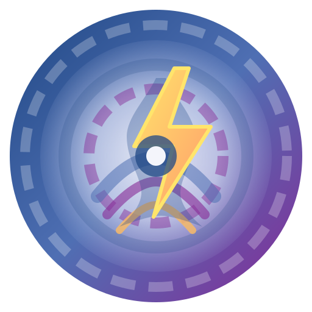

#  EAS Station

> A complete Emergency Alert System (EAS) platform for ingesting, broadcasting, and verifying NOAA and IPAWS Common Alerting Protocol (CAP) alerts. Features FCC-compliant SAME encoding, multi-source aggregation, PostGIS spatial intelligence, SDR verification, and integrated LED signage.

> 🚨 **IMPORTANT**: This software is for experimental/laboratory use only. Not for production emergency alerting.

## 🚀 Quick Start

### Prerequisites
- **Docker Engine 24+** with Docker Compose V2
- **Git** for cloning the repository
- **Dedicated PostgreSQL/PostGIS database** 
- **4GB RAM** recommended (2GB minimum)
- **Network access** for NOAA CAP API polling

### One-Command Installation

```bash
bash -c "git clone https://github.com/KR8MER/eas-station.git && cd eas-station && cp .env.example .env && docker compose up -d --build"
```

> 💡 Update `.env` before or immediately after first launch to configure database settings.
> 
> ⚠️ **Security**: Change `SECRET_KEY`, database passwords, and other sensitive values in `.env` immediately after first launch, then restart the stack.

### Access Your Installation

- **Main Interface**: http://localhost:5000
- **Setup Wizard**: http://localhost:5000/setup (if configuration incomplete)
- **Admin Panel**: http://localhost:5000/admin
- **System Health**: http://localhost:5000/system_health

## 📚 Documentation

| For Users | For Developers |
|-----------|----------------|
| [🔧 Help & Operations Guide](docs/guides/HELP.md) | [🏗️ Architecture Overview](docs/architecture/) |
| [🐳 Portainer Deployment](docs/guides/PORTAINER_DEPLOYMENT.md) | [🛠️ Development Setup](docs/development/) |
| [📡 SDR Setup Guide](docs/guides/sdr_setup_guide.md) | [📋 Contributing Guide](docs/process/CONTRIBUTING.md) |
| [🔄 Environment Migration](docs/guides/ENV_MIGRATION_GUIDE.md) | [🗺️ Project Roadmap](docs/roadmap/) |

## 🎯 What is EAS Station?

EAS Station is a software-first replacement for commercial EAS decoder hardware (typically $5,000–$7,000 appliances). It runs on commodity hardware like Raspberry Pi 5 and provides the same functionality:

- **Automated alert ingestion** from NOAA and IPAWS sources
- **FCC-compliant SAME encoding** for broadcast transmission  
- **Geographic filtering** using PostGIS spatial queries
- **SDR verification** of transmitted alerts
- **Web-based administration** and monitoring
- **LED signage integration** for visual alerts

## 🎯 Who Should Use This?

- **Amateur radio operators** experimenting with emergency communications
- **Broadcast engineers** seeking a cost-effective EAS solution
- **Emergency management** organizations needing flexible alerting
- **Researchers** studying CAP protocols and alert systems
- **Developers** building emergency alert applications

## ✨ Key Features

### 📻 Broadcast & Encoding
- FCC Part 11 compliant SAME header generation
- Attention tone and message encoding
- Automated transmitter keying via GPIO/serial interfaces

### 📡 Multi-Source Aggregation
- NOAA Weather CAP alerts (all 50 states)
- IPAWS national alerts integration
- Configurable polling intervals and sources
- Alert deduplication and filtering

### 🗺️ Geographic Intelligence
- PostGIS spatial database for location-based filtering
- County, state, and custom polygon definitions
- SAME code geographic validation
- Interactive alert mapping with Leaflet

### 📻 Radio & Capture
- RTL-SDR and Airspy receiver support
- Automated transmission verification
- Audio quality monitoring and confidence scoring
- Multiple receiver coordination

### 🖥️ Web Interface
- Responsive Bootstrap-based UI
- Real-time alert dashboard
- Statistics and reporting with Highcharts
- Mobile-friendly administration panel

## 🏗️ Architecture

### Core Components
- **Web Application**: Flask-based interface with Bootstrap UI
- **Alert Poller**: Continuous CAP monitoring service
- **Database**: PostgreSQL with PostGIS for spatial operations
- **Broadcast Service**: Audio generation and transmitter control
- **SDR Service**: Receiver management and verification

### Reference Hardware
- **Compute**: Raspberry Pi 5 (4GB baseline, 8GB recommended)
- **Control**: Multi-relay GPIO HAT for transmitter keying
- **Audio**: USB or Pi-compatible sound cards for I/O
- **Verification**: RTL-SDR or Airspy receivers
- **Storage**: External SSD for database and logs

## 🛠️ Installation Guides

### Docker Deployment (Recommended)

1. **Clone and configure:**
   ```bash
   git clone https://github.com/KR8MER/eas-station.git
   cd eas-station
   cp .env.example .env
   # Edit .env with your database settings
   ```

2. **Start the services:**
   ```bash
   docker compose up -d --build
   ```

3. **Access the web interface** at http://localhost:5000

### Portainer Deployment

For containerized environments, see the [Portainer Deployment Guide](docs/guides/PORTAINER_DEPLOYMENT.md) for complete setup and maintenance instructions.

### Database Setup

EAS Station requires PostgreSQL with PostGIS extension. Options include:
- Managed database service (AWS RDS, Azure Database, etc.)
- Dedicated PostgreSQL container
- On-premises PostgreSQL server

See [Database Configuration](docs/guides/DATABASE_CONSISTENCY_FIXES.md) for detailed setup instructions.

## 📊 Usage

### Basic Operation

1. **Configure Sources**: Add NOAA and IPAWS alert sources via admin panel
2. **Define Coverage**: Set up geographic areas for alert filtering  
3. **Configure Hardware**: Set up GPIO relays and SDR receivers
4. **Monitor Activity**: View real-time alerts and system status

### Advanced Features

- **Custom Alert Filters**: Create complex geographic and content rules
- **LED Sign Integration**: Connect Alpha Protocol signs for visual alerts
- **API Access**: RESTful API for integration with external systems
- **Historical Analysis**: Archive and analyze alert patterns

## 🆘 Troubleshooting

### Common Issues

- **Database Connection**: Check `POSTGRES_*` settings in `.env`
- **Missing Audio**: Verify audio device permissions and ALSA setup
- **GPIO Errors**: Ensure `RPi.GPIO` is available and permissions are correct
- **SDR Problems**: Check USB device permissions and driver installation

### Getting Help

1. **Check Documentation**: Review guides in `docs/guides/`
2. **Review Logs**: `docker compose logs -f`
3. **System Health**: http://localhost:5000/system_health
4. **Search Issues**: [GitHub Issues](https://github.com/KR8MER/eas-station/issues)
5. **Create New Issue**: Include logs and configuration (redact secrets)

## 🤝 Contributing

We welcome contributions! See the [Contributing Guide](docs/process/CONTRIBUTING.md) for:

- Development environment setup
- Code submission guidelines
- Issue reporting procedures
- Documentation standards

## 📈 Roadmap

Key development milestones tracked in [`docs/roadmap/`](docs/roadmap/):

- **Functional Parity** - Match commercial encoder/decoder features
- **Operational Resilience** - High availability and failover capabilities  
- **Certification Readiness** - FCC Part 11 compliance documentation
- **Hardware Integration** - Expanded peripheral support

## 📄 License

This project is licensed under the MIT License - see the [LICENSE](LICENSE) file for details.

## 🙏 Acknowledgments

- **NOAA/NWS** - Weather alert data and CAP specifications
- **FEMA/IPAWS** - National alert system integration
- **PostGIS Team** - Spatial database technology
- **Flask & Bootstrap** - Web framework and UI components
- **RTL-SDR Project** - Software-defined radio tools

## 📞 Support

### Resources
- [NOAA CAP Documentation](https://www.weather.gov/documentation/services-web-api)
- [PostGIS Documentation](https://postgis.net/documentation/)
- [Flask Documentation](https://flask.palletsprojects.com/)
- [Docker Documentation](https://docs.docker.com/)

### Community
- **Discussions**: [GitHub Discussions](https://github.com/KR8MER/eas-station/discussions)
- **Issues**: [GitHub Issues](https://github.com/KR8MER/eas-station/issues)
- **Amateur Radio**: Join our community forums

---

**Made with ☕ and 📻 for Amateur Radio Emergency Communications**

**73 de KR8MER** 📡