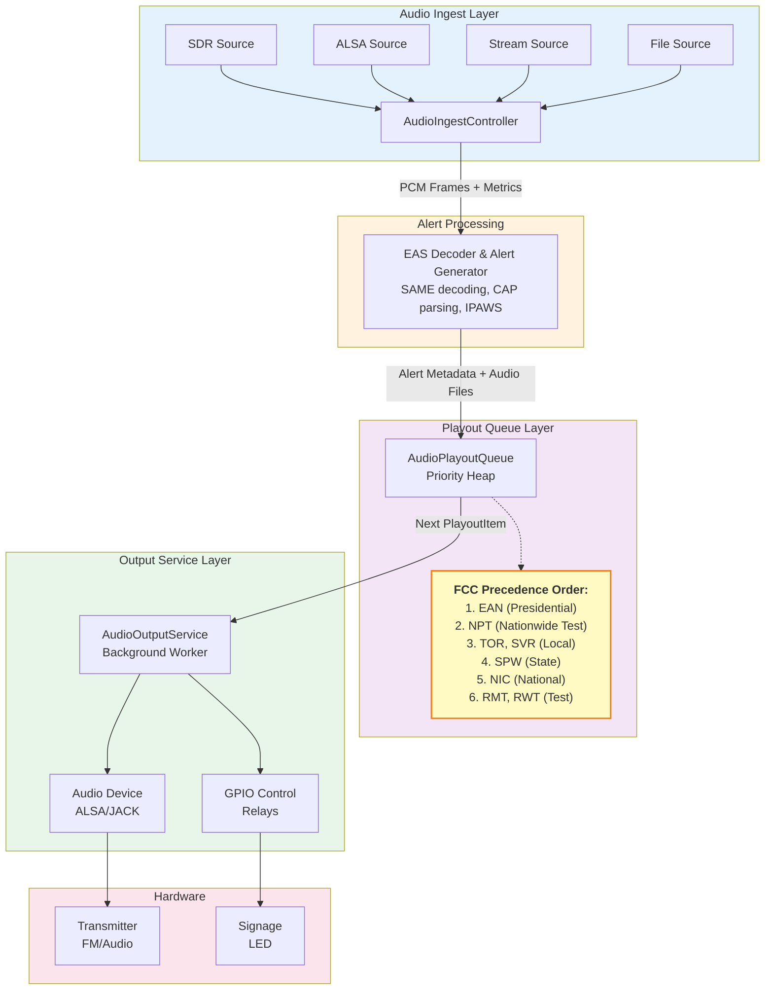
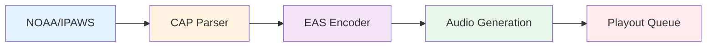
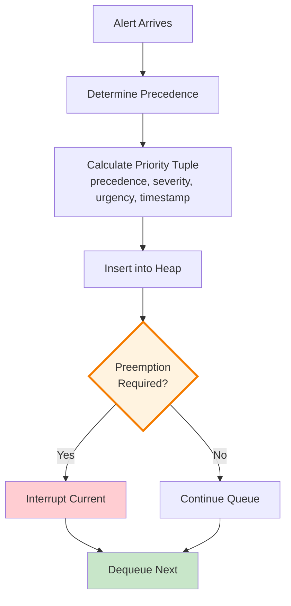
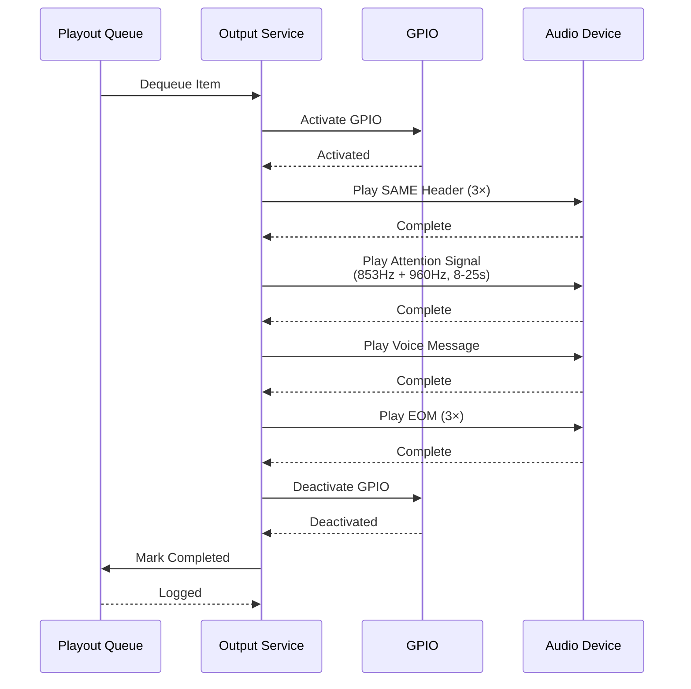
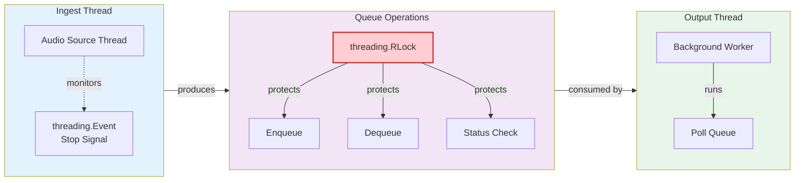
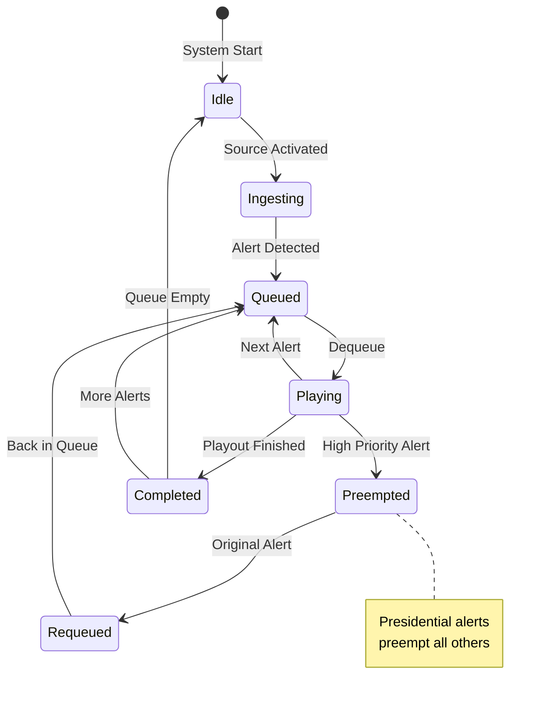

# Audio Pipeline Architecture

## Overview

The EAS Station audio pipeline provides **reliable baseband capture** and **deterministic audio playout** for FCC-compliant emergency alert broadcasting. This document describes the complete architecture from audio ingest through queue management to final playout.

## Components

### 1. Audio Ingest (`app_core/audio/ingest.py`)

The audio ingest subsystem provides unified capture from multiple sources with standardized PCM output, metering, and health monitoring.

#### Features
- **Multi-source support**: SDR, ALSA/Pulse, file, and stream inputs
- **Pluggable adapters**: Abstract base class for custom sources
- **Real-time metering**: Peak/RMS levels, silence detection
- **Priority-based failover**: Automatic source switching
- **Synchronized metering**: Frame-accurate level monitoring

#### Key Classes
- `AudioIngestController`: Central controller for managing sources
- `AudioSourceAdapter`: Abstract base for source implementations
- `AudioSourceConfig`: Configuration for each source
- `AudioMetrics`: Real-time metrics dataclass

#### Status: ✅ **Complete** (PR #315, #343)

### 2. Audio Playout Queue (`app_core/audio/playout_queue.py`)

The playout queue implements FCC-compliant precedence logic per 47 CFR Part 11 for deterministic alert ordering.

#### FCC Precedence Levels
Per 47 CFR § 11.31, alerts are prioritized as follows:

1. **Presidential** (EAN) - Emergency Action Notification (highest priority)
2. **Nationwide Test** (NPT) - National Periodic Test
3. **Local** - Local weather/emergency alerts
4. **State** - State/regional alerts
5. **National** - National non-Presidential alerts
6. **Test** - Required Monthly/Weekly Tests (RMT, RWT)

#### Priority Algorithm
Within each precedence level, alerts are further prioritized by:
1. **Severity**: Extreme > Severe > Moderate > Minor > Unknown
2. **Urgency**: Immediate > Expected > Future > Past > Unknown
3. **Timestamp**: Older alerts first
4. **Queue ID**: Tie-breaker for simultaneous alerts

#### Features
- **Thread-safe operations**: RLock-protected queue
- **Automatic preemption**: Presidential alerts interrupt current playback
- **Re-queue support**: Interrupted alerts return to queue
- **Completion tracking**: Success/failure logging
- **Queue snapshots**: Real-time status for UI

#### Key Classes
- `AudioPlayoutQueue`: Thread-safe priority queue
- `PlayoutItem`: Prioritized queue item with metadata
- `PrecedenceLevel`: FCC precedence enumeration
- `SeverityLevel`: CAP severity enumeration
- `UrgencyLevel`: CAP urgency enumeration

#### Status: ✅ **Complete** (PR #372)

### 3. Audio Output Service (`app_core/audio/output_service.py`)

The output service coordinates queue management with hardware (audio devices, GPIO relays) for reliable alert broadcasting.

#### Features
- **Background worker**: Threaded service for continuous operation
- **Hardware integration**: Audio devices, GPIO, and Icecast streaming
- **Event tracking**: Complete audit trail with timestamps
- **Latency monitoring**: Playout timing for compliance
- **Error handling**: Graceful failure recovery

#### Alert Playout Sequence
For each alert, the service plays the complete FCC-required sequence:

1. **SAME Header** (3× transmission)
   - Preamble: `ZCZC`
   - Originator, Event, Location, Valid Time
   - Attention Signal (853 Hz + 960 Hz, 8-25 seconds)

2. **Voice Message**
   - Synthesized or recorded alert message
   - Event details, affected areas, instructions

3. **End-of-Message** (3× transmission)
   - EOM marker: `NNNN`
   - Confirms complete transmission

#### Key Classes
- `AudioOutputService`: Service coordinator
- `PlayoutEvent`: Event tracking dataclass
- `PlayoutStatus`: Playout state enumeration

#### Status: ✅ **Complete** (PR #372)

## Architecture Diagram



## Data Flow

### 1. Alert Ingestion Flow



### 2. Queue Priority Flow



### 3. Playout Execution Flow



## Threading Model

### Thread Safety



### Concurrency Patterns



## Configuration

### Audio Ingest Configuration
```python
{
    'source_type': AudioSourceType.ALSA,
    'name': 'primary_receiver',
    'enabled': True,
    'priority': 100,
    'sample_rate': 44100,
    'channels': 1,
    'buffer_size': 4096,
    'silence_threshold_db': -60.0,
    'device_params': {'device_name': 'hw:0'}
}
```

### Audio Output Configuration
```python
{
    'audio_output': {
        'enabled': True,
        'device': 'default',
        'player': 'aplay',
    },
    'gpio': {
        'enabled': True,
        'pins': [17, 18],
        'active_high': True,
    }
}
```

## Testing

### Unit Tests
- **test_audio_ingest.py**: Source adapters, metering, health monitoring
- **test_audio_playout_queue.py**: FCC precedence, priority ordering, preemption
- **test_audio_output_service.py**: Service initialization, GPIO integration, error handling

### Integration Tests
- **test_audio_pipeline_integration.py**: End-to-end alert flow, deterministic playout, FCC compliance

### Test Coverage
- 44 tests for playout queue
- 30 tests for output service  
- 15 integration tests
- Total: 89+ test cases

## Performance Characteristics

### Latency
- **Ingest → Queue**: < 10 ms (frame buffer time)
- **Queue → Output**: < 50 ms (context switch + dequeue)
- **Total Pipeline**: < 100 ms (sub-second alert start)

### Throughput
- **Queue Capacity**: Unlimited (heap-based)
- **Concurrent Alerts**: Multiple alerts queued while one plays
- **Preemption Response**: < 100 ms (interrupt current playback)

## FCC Compliance

### 47 CFR Part 11 Requirements
✅ **§ 11.31** - Mandatory Presidential alert precedence
✅ **§ 11.33** - SAME encoding (event code, location, time)
✅ **§ 11.51** - Attention signal (853 Hz + 960 Hz, 8-25 sec)
✅ **§ 11.52** - Required weekly/monthly tests

### Audit Trail
All playout operations are logged with:
- Alert ID and event code
- Precedence and priority
- Timestamp (enqueue, dequeue, complete)
- Success/failure status
- GPIO activation records

## Failure Modes & Recovery

### Ingest Failures
- **Source unavailable**: Failover to next priority source
- **Signal loss**: Silence detection → alert operator
- **Buffer overflow**: Drop frames, log warning

### Queue Failures
- **Memory exhaustion**: Limit completed item history to 100
- **Lock contention**: RLock ensures eventual consistency
- **Invalid item**: Log error, skip to next

### Output Failures
- **Audio device error**: Log error, mark failed, continue
- **GPIO error**: Log error, attempt recovery
- **File not found**: Mark failed, continue to next alert

## Maintenance & Operations

### Monitoring
- Queue size and depth
- Playout latency metrics
- Audio level monitoring
- GPIO activation logs
- Error rate tracking

### Health Checks
```python
# Queue health
status = queue.get_status()
print(f"Queue size: {status['queue_size']}")
print(f"Current: {status['current_item']}")

# Ingest health
metrics = source.metrics
print(f"Peak: {metrics.peak_level_db} dB")
print(f"RMS: {metrics.rms_level_db} dB")
```

### Debugging
1. Enable debug logging: `logger.setLevel(logging.DEBUG)`
2. Check queue snapshot: `queue.get_queue_snapshot()`
3. Review completed items: `status['recent_completed']`
4. Verify FCC precedence: Test with known event codes

## Future Enhancements

### Planned
- [ ] Multi-channel output (FM transmitter + Icecast + GPIO)
- [ ] Playout scheduling (delayed activation)
- [ ] Audio ducking (background music suppression)
- [ ] Network streaming (Icecast/SHOUTcast integration)

### Under Consideration
- [ ] Jitter buffer for network sources
- [ ] Quality-of-service metrics
- [ ] Automated regression testing with SDR verification
- [ ] WebRTC streaming for remote monitoring

## References

### FCC Regulations
- [47 CFR Part 11](https://www.ecfr.gov/current/title-47/chapter-I/subchapter-A/part-11) - Emergency Alert System
- [FCC Public Safety and Homeland Security Bureau](https://www.fcc.gov/public-safety-and-homeland-security)

### Related Documentation
- `docs/PROFESSIONAL_AUDIO_SUBSYSTEM.md` - Audio subsystem overview
- `app_core/audio/README.md` - Audio module implementation notes
- `tests/test_audio_*.py` - Test suite documentation

### Implementation References
- PR #315: Audio Ingest Unification
- PR #343: Audio Ingest Enhancements
- PR #372: Deterministic Audio Playout
