# EAS Station Visual Documentation

This page provides an index of all professional diagrams and flowcharts available in the EAS Station documentation. These visual resources complement the written documentation and help understand system architecture, workflows, and deployment configurations.

## 📊 Professional SVG Diagrams

### System Architecture & Workflows

#### 1. Alert Processing Pipeline

**Complete CAP alert ingestion workflow** showing data flow from external sources (NOAA/IPAWS) through validation, parsing, spatial processing, duplicate checking, and database storage.


**Key Features:**
- External CAP feed sources
- XML parsing and schema validation
- Geometry processing (polygon/circle/SAME codes)
- Duplicate detection
- Spatial intelligence with PostGIS
- Database persistence

**Use Cases:**
- Understanding how alerts enter the system
- Debugging alert ingestion issues
- Planning CAP feed integrations

**File:** [`assets/diagrams/alert-processing-pipeline.svg`](assets/diagrams/alert-processing-pipeline.svg)

---

#### 2. EAS Broadcast Workflow

**Step-by-step EAS message generation and transmission** from operator initiation through SAME encoding, TTS narration, and final broadcast.


**Key Features:**
- Alert source selection (manual vs. CAP)
- Message configuration
- SAME header generation and validation
- Optional TTS narration
- Complete audio assembly (header × 3, attention signal, narration, EOM × 3)
- Operator approval process
- Transmission via GPIO-controlled transmitter

**Use Cases:**
- Training new operators
- Understanding broadcast procedures
- Troubleshooting workflow errors

**File:** [`assets/diagrams/broadcast-workflow.svg`](assets/diagrams/broadcast-workflow.svg)

---

#### 3. SDR Setup & Configuration Flow

**Complete visual guide for setting up Software-Defined Radio receivers** including hardware selection, software configuration, and testing procedures.


**Key Features:**
- **Phase 1:** Hardware setup (RTL-SDR, Airspy, antennas)
- **Phase 2:** Software configuration via web UI
  - Access settings
  - Run diagnostics
  - Discover devices
  - Apply presets
  - Fine-tune parameters
- **Phase 3:** Testing and verification
  - Monitor receiver status
  - Verify signal quality
  - Troubleshooting guide

**Use Cases:**
- Initial SDR receiver setup
- Adding new receivers
- Troubleshooting receiver issues

**File:** [`assets/diagrams/sdr-setup-flow.svg`](assets/diagrams/sdr-setup-flow.svg)

**Related Documentation:** [SDR Setup Guide](guides/sdr_setup_guide.md)

---

#### 4. Audio Source Routing Architecture

**Multi-source audio ingestion system** showing how different audio sources are routed through adapters, controllers, and monitoring systems.


**Key Features:**
- **Audio Sources:** SDR, ALSA, PulseAudio, File playback
- **Source Adapters:** Convert various formats to unified PCM
- **Audio Controller:** Priority selection and buffer management
- **Monitoring:** Peak/RMS metering, silence detection, health scoring
- **Database Integration:** Metrics, health status, alerts
- **Web UI:** Real-time monitoring and API access

**Use Cases:**
- Understanding audio pipeline architecture
- Configuring audio sources
- Debugging audio issues
- Implementing new source types

**File:** [`assets/diagrams/audio-source-routing.svg`](assets/diagrams/audio-source-routing.svg)

**Related Documentation:** [Audio Documentation](audio.md)

---

#### 5. Hardware Deployment Architecture

**Physical deployment diagram** showing the complete Raspberry Pi 5 reference configuration with all peripherals, storage, and external connections.


**Key Features:**
- **Raspberry Pi 5 Core:** 8GB RAM, Docker containers
- **USB Peripherals:** RTL-SDR, Airspy, USB audio DAC
- **GPIO Connections:** Relay HAT for transmitter control
- **Storage:** NVMe SSD via PCIe Gen 2
- **Network:** Gigabit Ethernet
- **Display:** HDMI monitor support
- **External Systems:** FM transmitter, LED signs, web browser access
- **Cost Analysis:** ~$585 vs. $5,000-$7,000 for commercial systems

**Use Cases:**
- Planning hardware purchases
- Physical installation
- Understanding connections
- Troubleshooting hardware issues

**File:** [`assets/diagrams/system-deployment-hardware.svg`](assets/diagrams/system-deployment-hardware.svg)

**Related Documentation:** [README - System Requirements](https://github.com/KR8MER/eas-station/blob/main/README.md#system-requirements)

---

## 🗺️ Legacy Architecture Diagrams (SVG)

These diagrams were created earlier and provide high-level system overviews:

### System Architecture Overview

**High-level platform architecture** showing major components and data flows.


**File:** [`assets/diagrams/eas-station-architecture.svg`](assets/diagrams/eas-station-architecture.svg)

---

### Core Services Overview

**Core services diagram** showing three main operational areas in a dark theme design.



**File:** [`assets/diagrams/core-services-overview.svg`](assets/diagrams/core-services-overview.svg)

---

## 📐 Mermaid Diagrams in Documentation

In addition to the professional SVG diagrams above, the following documentation files contain embedded Mermaid.js diagrams that render in GitHub, GitLab, and compatible markdown viewers:

### Data Flow Sequences (Mermaid) ⭐ NEW

**File:** [docs/architecture/DATA_FLOW_SEQUENCES.md](architecture/DATA_FLOW_SEQUENCES.md)

**Contains:**
- **Alert Processing Data Flow** - Complete CAP alert path from fetch to storage
- **SDR Continuous Monitoring Data Flow** - RF signal to digital samples conversion
- **Multi-Source Audio Ingest Data Flow** - Audio from multiple sources through adapters
- **Radio Capture Coordination Data Flow** - Coordinated capture triggering during broadcast
- **EAS Message Generation Data Flow** - Alert to SAME to audio file generation
- **Complete Alert-to-Broadcast Pipeline** - End-to-end flow with all components

**Rendering:**
- ✅ **GitHub**: Native Mermaid rendering in markdown
- ✅ **MkDocs Site**: Automatic rendering via pymdownx.superfences
- ✅ **Local Viewing**: Renders in any Mermaid-compatible markdown viewer

**Use Cases:**
- Understanding how data moves through the system
- Tracing data transformations at each stage
- Debugging data flow issues
- Onboarding developers to system architecture
- Planning modifications to data processing paths

### System Architecture (Mermaid)

**File:** [docs/architecture/SYSTEM_ARCHITECTURE.md](architecture/SYSTEM_ARCHITECTURE.md)

**Contains:**
- High-level architecture graph
- Component dependency map
- Alert processing sequence diagram
- Alert ingestion flowchart
- Spatial processing flowchart
- Audio ingest architecture
- Audio source lifecycle state diagram
- Audio metrics sequence diagram
- EAS workflow flowchart
- SAME generation flowchart
- Audio generation pipeline sequence
- SDR capture & verification flowchart
- Verification workflow sequence
- Database entity-relationship diagram
- Data flow diagrams
- Web request flow sequence
- System health monitoring flowchart
- Multi-service coordination diagram
- Deployment architecture diagrams

### Theory of Operation (Mermaid)

**File:** [docs/architecture/THEORY_OF_OPERATION.md](architecture/THEORY_OF_OPERATION.md)

**Contains:**
- High-level flow diagram
- Conceptual overview of system operation
- Historical context and SAME protocol details

### README Architecture (Mermaid)

**File:** [README.md](https://github.com/KR8MER/eas-station/blob/main/README.md)

**Contains:**
- Simple architecture overview
- Component technology stack

---

## 📖 Usage Guidelines

### Viewing Diagrams

- **On GitHub/GitLab:** All diagrams render automatically
- **Locally:** Open SVG files in any modern web browser
- **In Documentation:** Embedded images display inline
- **Full Size:** Click any diagram to view at full resolution

### Embedding Diagrams

To embed these diagrams in your own documentation:

```markdown

```

Or with a link to full-size view:

```markdown
[](path/to/diagram.svg)
```

### Diagram Standards

All professional SVG diagrams follow these standards:

- **Format:** SVG 1.1 with embedded metadata
- **Accessibility:** Include `<title>` and `<desc>` tags
- **Resolution:** Optimized for both web and print
- **Color Scheme:** Consistent palette across all diagrams
- **Typography:** Arial/sans-serif for maximum compatibility
- **Icons:** Semantic shapes and colors for clarity

### Contributing New Diagrams

When adding new diagrams:

1. Save as SVG in `docs/assets/diagrams/` directory
2. Use consistent color scheme and typography
3. Include accessibility metadata (title, description)
4. Add to this index page
5. Reference in relevant documentation
6. Update the changelog

---

## 🔗 Related Documentation

- **[System Architecture](architecture/SYSTEM_ARCHITECTURE.md)** - Complete technical architecture with Mermaid diagrams
- **[Theory of Operation](architecture/THEORY_OF_OPERATION.md)** - Conceptual overview and operational theory
- **[SDR Setup Guide](guides/sdr_setup_guide.md)** - Radio receiver configuration
- **[Audio Documentation](audio.md)** - Audio system details
- **[README](https://github.com/KR8MER/eas-station/blob/main/README.md)** - Project overview and quick start

---

**Last Updated:** 2025-11-05
**Diagram Count:** 7 professional SVG diagrams + 31+ embedded Mermaid diagrams (6 new data flow sequences)
**Total Documentation Coverage:** Complete system from hardware to software, including detailed data processing flows
