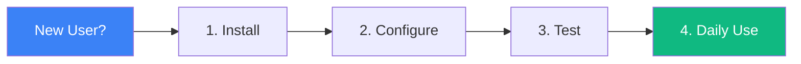
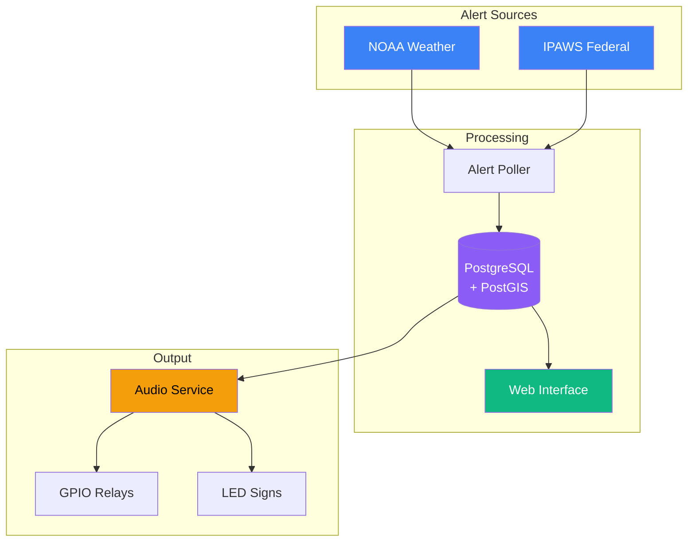
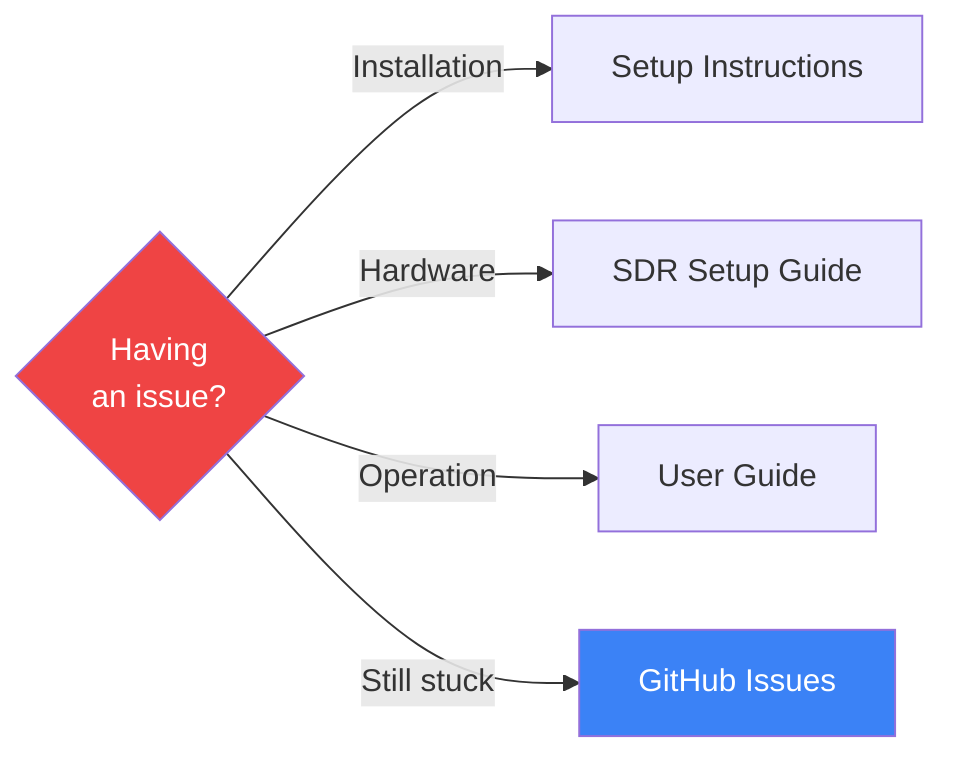

# 📚 EAS Station Documentation

**Welcome!** This is your complete guide to the EAS Station emergency alert system.

> ⚠️ **IMPORTANT**: This software is experimental and for laboratory use only. Not FCC-certified for production emergency alerting.

---

## 🚀 Getting Started



**5-Minute Quick Start:**
1. **[Installation](../README.md#quick-start)** - One command to get running
2. **[Setup Wizard](guides/SETUP_INSTRUCTIONS)** - First-run configuration
3. **[User Guide](guides/HELP)** - Daily operations

---

## 📖 Documentation by Role

### 🎯 For Operators

**Daily operations and monitoring**

| Guide | What You'll Learn |
|-------|-------------------|
| **[User Guide](guides/HELP)** | Dashboard, alerts, monitoring |
| **[Audio Monitoring](audio/AUDIO_MONITORING)** | Live audio streams, troubleshooting |
| **[Setup Instructions](guides/SETUP_INSTRUCTIONS)** | First-time configuration |

### 🔧 For Administrators

**Deployment, security, and maintenance**

| Guide | What You'll Learn |
|-------|-------------------|
| **[Portainer Deployment](guides/PORTAINER_DEPLOYMENT)** | Complete deployment guide |
| **[SDR Setup](hardware/SDR_SETUP)** | Radio receiver configuration |
| **[HTTPS Setup](guides/HTTPS_SETUP)** | SSL/TLS certificates |
| **[Database Setup](guides/DATABASE_CONSISTENCY_FIXES)** | PostgreSQL troubleshooting |

### 💻 For Developers

**Architecture, APIs, and contributing**

| Guide | What You'll Learn |
|-------|-------------------|
| **[Developer Guidelines](development/AGENTS)** | Code standards, architecture, testing |
| **[Frontend Documentation](frontend/FRONTEND_INDEX)** | UI components, theming |
| **[JavaScript API](frontend/JAVASCRIPT_API)** | REST API reference |
| **[Contributing](process/CONTRIBUTING)** | How to contribute |

---

## 🗺️ System Overview

### Architecture



**[View Full Architecture Details →](architecture/SYSTEM_ARCHITECTURE)**

### Key Features

- 🌐 Multi-source alert aggregation (NOAA, IPAWS, custom)
- 📻 FCC-compliant SAME encoding
- 🗺️ PostGIS spatial filtering
- 📡 SDR broadcast verification
- 🔒 Built-in HTTPS with Let's Encrypt
- ⚡ GPIO relay and LED sign control

---

## 📂 Documentation Structure

```
docs/
├── guides/              ← How-to guides for operators
├── hardware/            ← SDR, GPIO, Raspberry Pi setup
├── audio/               ← Audio system documentation
├── development/         ← Developer documentation
├── architecture/        ← System design and theory
├── deployment/          ← Deployment guides
├── reference/           ← Technical reference
└── roadmap/             ← Future features
```

**[Complete Index](INDEX)** - Searchable list of all topics

---

## 🎯 Common Tasks

### Setup & Configuration

- [Install EAS Station](../README.md#quick-start)
- [Configure SDR receivers](hardware/SDR_SETUP)
- [Set up HTTPS](guides/HTTPS_SETUP)
- [Connect to IPAWS](guides/ipaws_feed_integration)

### Daily Operations

- [Monitor alerts](guides/HELP#monitoring-alerts)
- [Manage boundaries](guides/HELP#managing-boundaries-and-alerts)
- [View audio streams](audio/AUDIO_MONITORING)
- [Check system health](guides/HELP#routine-operations)

### Troubleshooting

- [Database connection issues](guides/DATABASE_CONSISTENCY_FIXES)
- [SDR not detecting](hardware/SDR_SETUP#troubleshooting)
- [Audio problems](audio/AUDIO_MONITORING#troubleshooting)
- [Common errors](guides/HELP#troubleshooting)

---

## 🆘 Getting Help



1. **Check the documentation** - Start with [INDEX](INDEX)
2. **Review troubleshooting** - See [Common Issues](guides/HELP#troubleshooting)
3. **Run diagnostics** - Use built-in diagnostic tools
4. **Ask for help** - [GitHub Discussions](https://github.com/KR8MER/eas-station/discussions)
5. **Report bugs** - [GitHub Issues](https://github.com/KR8MER/eas-station/issues)

---

## 📊 Project Information

| Resource | Link |
|----------|------|
| **About** | [Project Overview](reference/ABOUT) |
| **Changelog** | [Version History](reference/CHANGELOG) |
| **Roadmap** | [Future Features](roadmap/master_todo) |
| **License** | [AGPL v3](../LICENSE) (Open Source) / [Commercial](../LICENSE-COMMERCIAL) |

### Legal & Compliance

- [Terms of Use](policies/TERMS_OF_USE)
- [Privacy Policy](policies/PRIVACY_POLICY)
- [FCC Compliance Information](reference/ABOUT#legal--compliance)

---

## 🤝 Contributing

We welcome contributions! See:

- [Contributing Guide](process/CONTRIBUTING)
- [Developer Guidelines](development/AGENTS)
- [Code Standards](development/AGENTS#code-standards)

---

**Last Updated**: 2025-11-25
**Documentation Version**: 2.1.x+

**[Return to Main README](../README.md)** | **[View Complete Index](INDEX)**
