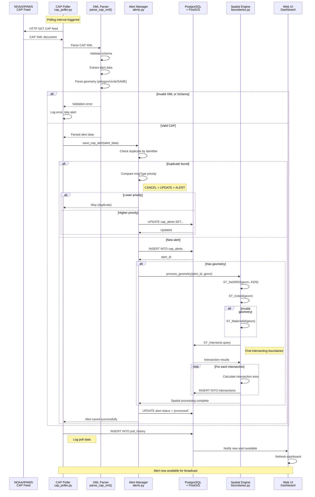
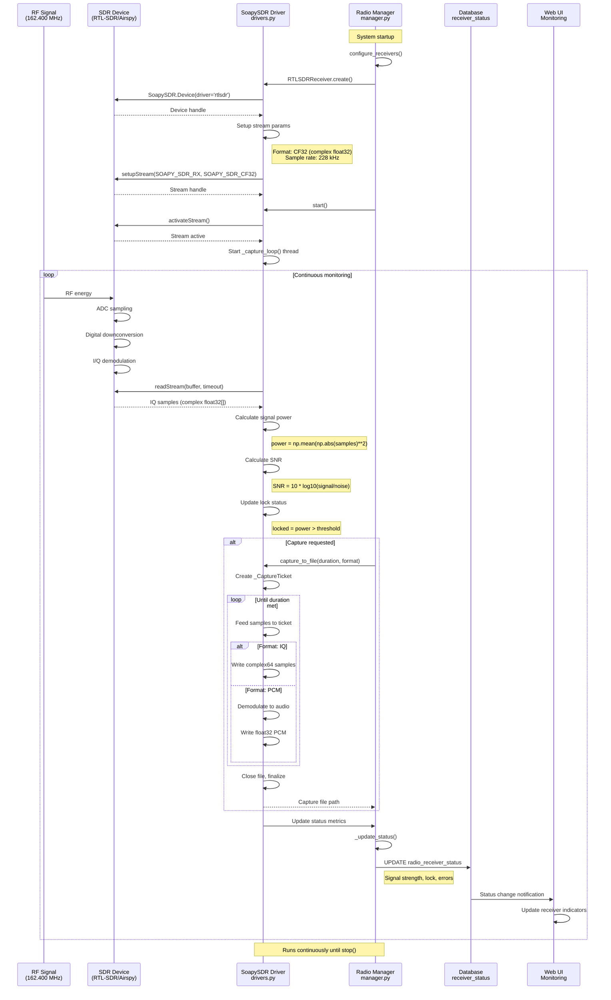
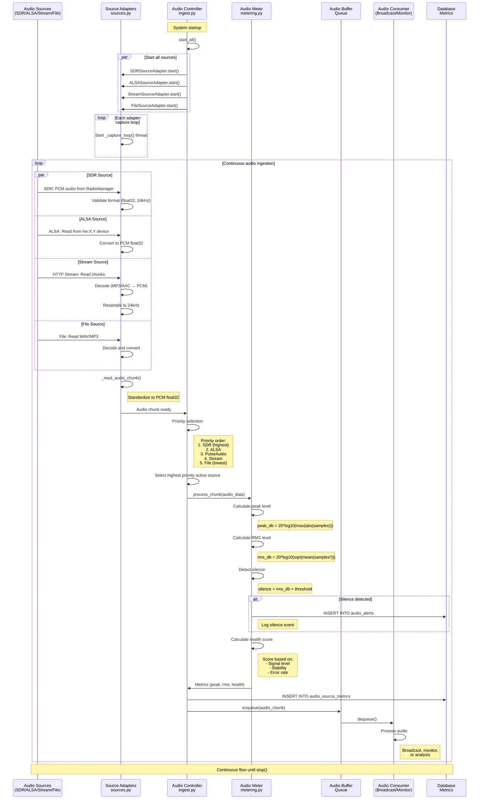
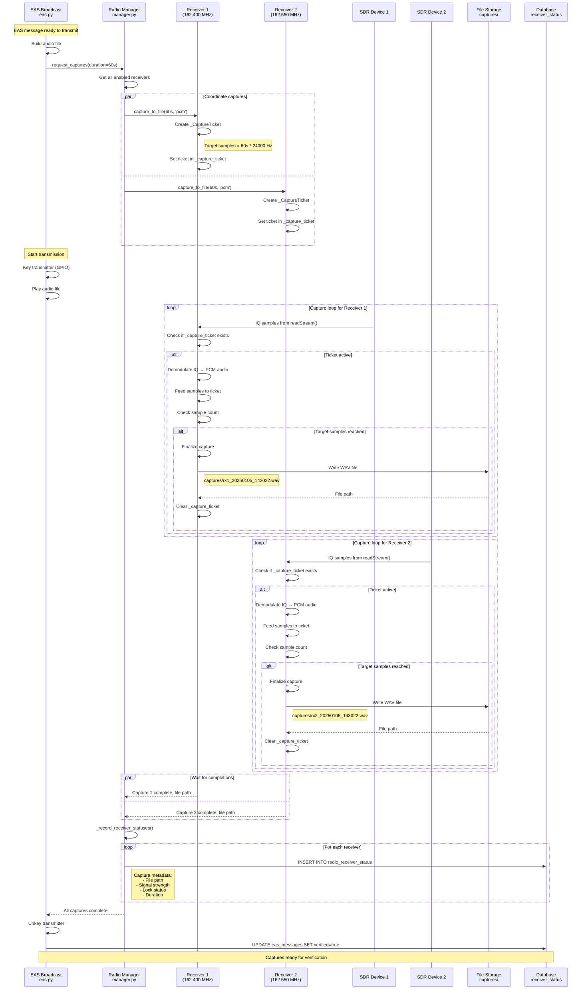
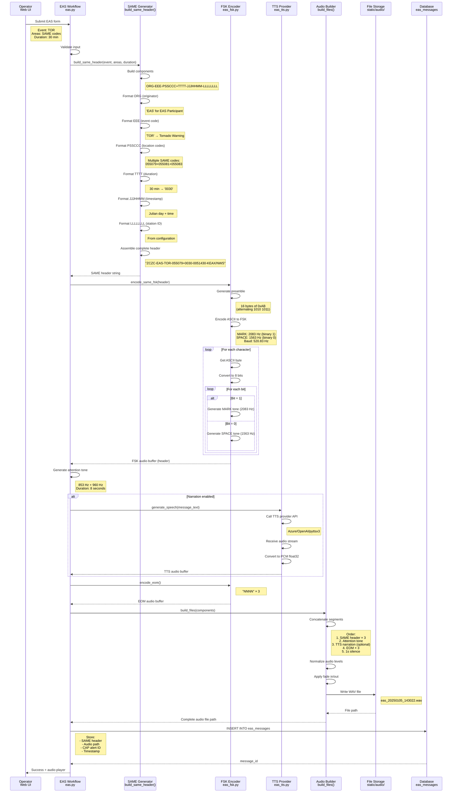
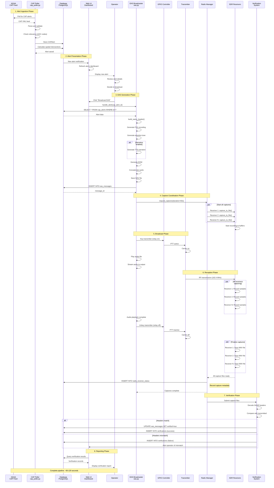

# EAS Station Data Flow Sequence Diagrams

This document provides detailed sequence diagrams showing how data flows through the EAS Station system, from initial ingestion through processing to final output. These diagrams focus on the actual data paths and transformations as data moves through components like SDR receivers, audio streams, CAP pollers, and broadcast systems.

## Document Overview

**Purpose:** Visualize complete data processing paths through the system
**Audience:** Developers, system architects, and operators understanding data flows
**Related:** [System Architecture](SYSTEM_ARCHITECTURE.md), [Theory of Operation](THEORY_OF_OPERATION.md)

---

## Table of Contents

1. [Alert Processing Data Flow](#alert-processing-data-flow)
2. [SDR Continuous Monitoring Data Flow](#sdr-continuous-monitoring-data-flow)
3. [Multi-Source Audio Ingest Data Flow](#multi-source-audio-ingest-data-flow)
4. [Radio Capture Coordination Data Flow](#radio-capture-coordination-data-flow)
5. [EAS Message Generation Data Flow](#eas-message-generation-data-flow)
6. [Complete Alert-to-Broadcast Pipeline](#complete-alert-to-broadcast-pipeline)

---

## Alert Processing Data Flow

This sequence shows the complete path of a CAP alert from external sources through validation, storage, spatial processing, and availability to operators.

**Key Components:**
- `poller/cap_poller.py` - Fetches and orchestrates alert processing
- `app_core/alerts.py` - Alert management and deduplication
- `app_core/boundaries.py` - Spatial geometry processing
- PostgreSQL + PostGIS - Data persistence and spatial queries

**Data Transformations:**
1. **CAP XML → Parsed dictionary** (XML parsing)
2. **Geometry string → PostGIS geometry** (ST_SetSRID, validation)
3. **Geometry → Intersection records** (ST_Intersects, area calculation)
4. **Alert data → Database record** (CAPAlert model)

**Files:** `poller/cap_poller.py:2166`, `app_core/alerts.py`, `app_core/boundaries.py`

---

## SDR Continuous Monitoring Data Flow

This sequence shows how SDR receivers continuously capture RF signals, convert them to audio samples, and monitor signal quality.

**Key Components:**
- `app_core/radio/manager.py` - Radio coordinator
- `app_core/radio/drivers.py` - SoapySDR device wrappers
- SoapySDR library - Hardware abstraction layer

**Data Transformations:**
1. **RF energy → ADC samples** (Hardware ADC)
2. **ADC samples → I/Q samples** (Digital downconversion)
3. **I/Q samples → Complex float32** (SoapySDR format conversion)
4. **I/Q samples → Audio PCM** (FM demodulation for PCM format)
5. **Samples → Power/SNR metrics** (Statistical calculations)

**Files:** `app_core/radio/manager.py:233`, `app_core/radio/drivers.py:408`

---

## Multi-Source Audio Ingest Data Flow

This sequence shows how audio data from multiple sources (SDR, ALSA, PulseAudio, streams) flows through adapters into a unified audio controller.

**Key Components:**
- `app_core/audio/sources.py` - Source adapter implementations
- `app_core/audio/ingest.py` - AudioIngestController
- `app_core/audio/metering.py` - Audio level monitoring

**Data Transformations:**
1. **Raw audio → PCM float32** (Format conversion)
2. **Variable sample rate → 24 kHz** (Resampling)
3. **PCM samples → dB levels** (Peak/RMS calculation)
4. **Levels → Health score** (Health algorithm)
5. **Audio chunks → Buffer queue** (Priority selection)

**Files:** `app_core/audio/ingest.py:356`, `app_core/audio/sources.py:~500`, `app_core/audio/metering.py`

---

## Radio Capture Coordination Data Flow

This sequence shows how EAS broadcasts trigger coordinated radio captures across all receivers for verification.

**Key Components:**
- `app_utils/eas.py` - EASBroadcaster
- `app_core/radio/manager.py` - Radio capture coordinator
- `app_core/radio/drivers.py` - Individual receiver drivers

**Data Transformations:**
1. **Capture request → _CaptureTicket** (Ticket creation)
2. **IQ samples → PCM audio** (FM demodulation)
3. **PCM samples → WAV file** (File writing)
4. **Capture metadata → Database record** (Status recording)

**Files:** `app_utils/eas.py:1076`, `app_core/radio/manager.py:233`, `app_core/radio/drivers.py:408`

---

## EAS Message Generation Data Flow

This sequence shows the complete data flow for generating an EAS message from alert selection through SAME encoding to final audio file.

**Key Components:**
- `app_utils/eas.py` - EASBroadcaster and SAME generation
- `app_utils/eas_fsk.py` - FSK encoding
- `app_utils/eas_tts.py` - Text-to-speech providers

**Data Transformations:**
1. **Form input → SAME header string** (String formatting)
2. **SAME header → ASCII bytes** (Text encoding)
3. **ASCII bytes → FSK audio** (Frequency-shift keying)
4. **Text message → TTS audio** (Text-to-speech synthesis)
5. **Audio segments → Complete WAV file** (Audio concatenation)
6. **WAV file → Database record** (Metadata persistence)

**Files:** `app_utils/eas.py:1076`, `app_utils/eas_fsk.py`, `app_utils/eas_tts.py`

---

## Complete Alert-to-Broadcast Pipeline

This sequence shows the end-to-end data flow from CAP alert fetch to broadcast transmission and verification.

**Key Components:** All major system components involved in complete pipeline

**Complete Data Path:**
1. **CAP XML** (NOAA) → **CAPAlert record** (Database)
2. **CAPAlert** → **SAME header string** (EAS Generator)
3. **SAME header** → **FSK audio** (FSK Encoder)
4. **FSK + TTS + Tones** → **Complete WAV file** (Audio Builder)
5. **WAV file** → **RF signal** (Transmitter)
6. **RF signal** → **IQ samples** (SDR Receivers)
7. **IQ samples** → **Demodulated audio** (FM Demodulator)
8. **Demodulated audio** → **Decoded SAME header** (Verification)
9. **Decoded vs. Original** → **Verification record** (Database)

**Timeline:** Complete flow typically takes 60-120 seconds from alert fetch to verified broadcast.

**Files:** Multiple components across entire codebase

---

## Summary

These sequence diagrams illustrate the major data processing paths through the EAS Station system:

1. **Alert Processing** - CAP alerts flow from external sources through validation and spatial processing to storage
2. **SDR Monitoring** - RF signals are continuously converted to digital samples and monitored for quality
3. **Audio Ingest** - Multiple audio sources flow through adapters into a unified controller with priority selection
4. **Radio Capture** - Broadcast triggers coordinated capture across all receivers for verification
5. **EAS Generation** - Alert data transforms through SAME encoding, FSK modulation, and audio assembly
6. **Complete Pipeline** - End-to-end flow from CAP fetch to verified broadcast

Each diagram shows:
- **Components involved** with file references
- **Data transformations** at each step
- **Decision points** and error handling
- **Timing and synchronization** between components

**Key Insights:**
- Data flows through well-defined layers with clear transformations
- Spatial processing (PostGIS) is critical for alert relevance
- Radio captures are coordinated but operate independently
- Verification closes the loop by comparing transmitted vs. received data
- The system maintains comprehensive audit trails at each stage

**Related Documentation:**
- [System Architecture](SYSTEM_ARCHITECTURE.md) - Component diagrams and relationships
- [Theory of Operation](THEORY_OF_OPERATION.md) - Conceptual overview
- [DIAGRAMS Index](../DIAGRAMS.md) - All available diagrams

---

**Last Updated:** 2025-11-05
**Diagram Count:** 6 comprehensive sequence diagrams
**Coverage:** Complete data processing paths from input to output
