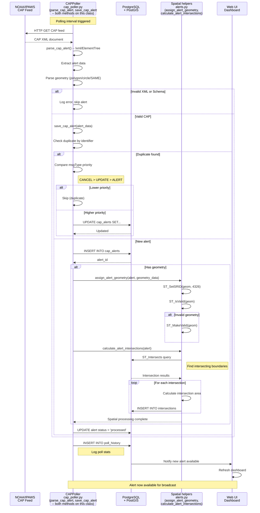
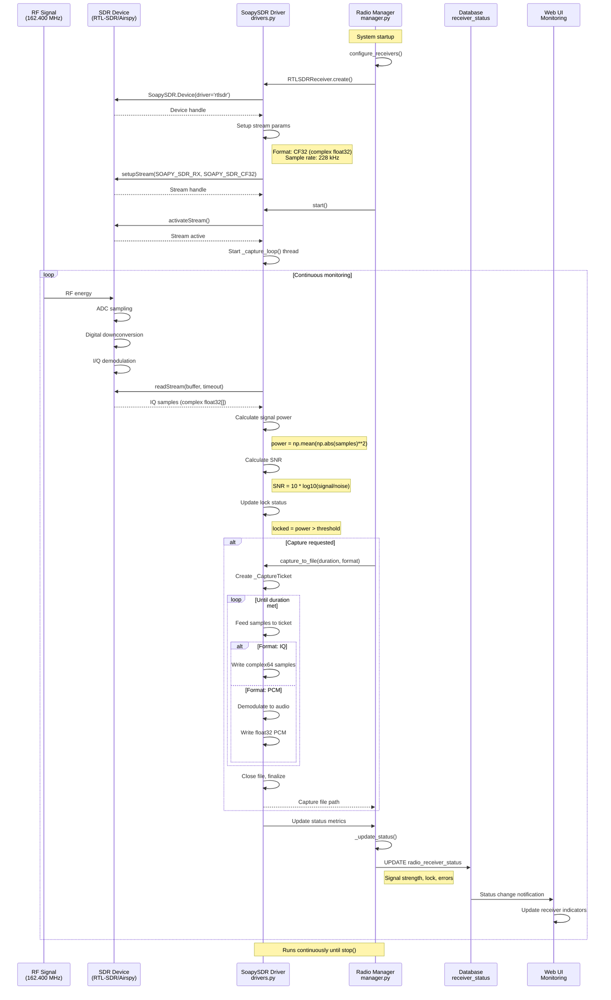
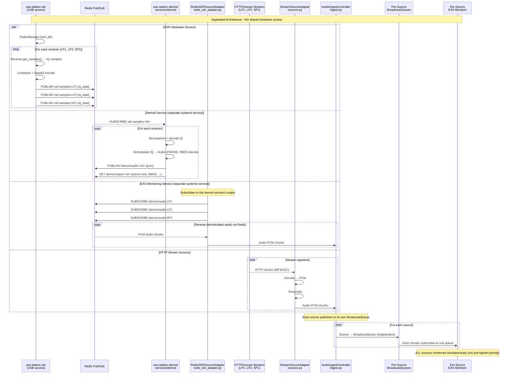
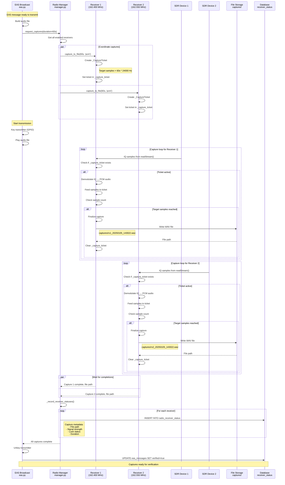
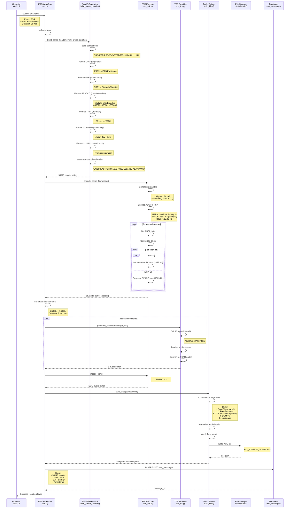
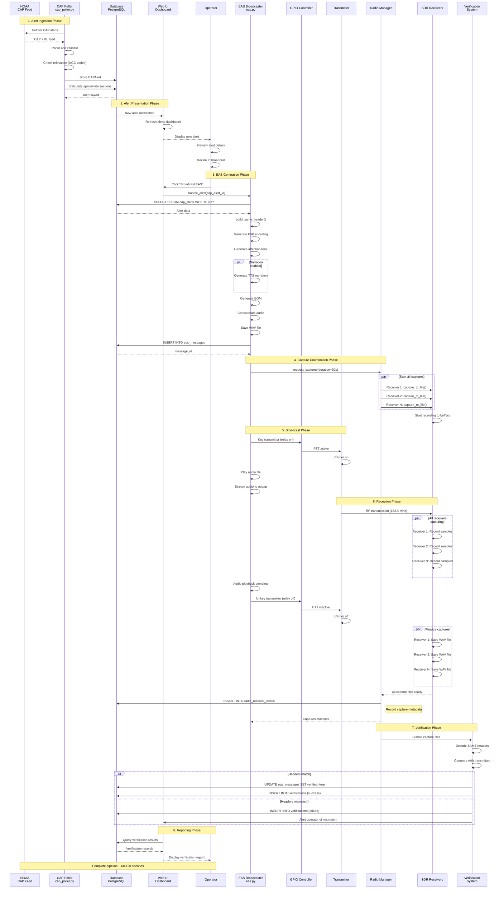

# EAS Station™ Data Flow Sequence Diagrams

This document provides detailed sequence diagrams showing how data flows through the EAS Station™ system, from initial ingestion through processing to final output. These diagrams focus on the actual data paths and transformations as data moves through components like SDR receivers, audio streams, CAP pollers, and broadcast systems.

## Document Overview

**Purpose:** Visualize complete data processing paths through the system
**Audience:** Developers, system architects, and operators understanding data flows
**Related:** [System Architecture](SYSTEM_ARCHITECTURE.md), [Theory of Operation](THEORY_OF_OPERATION.md)

---

## Table of Contents

1. [Alert Processing Data Flow](#alert-processing-data-flow)
2. [SDR Continuous Monitoring Data Flow](#sdr-continuous-monitoring-data-flow)
3. [Multi-Source Audio Ingest Data Flow](#multi-source-audio-ingest-data-flow-separated-architecture)
4. [Radio Capture Coordination Data Flow](#radio-capture-coordination-data-flow)
5. [EAS Message Generation Data Flow](#eas-message-generation-data-flow)
6. [Complete Alert-to-Broadcast Pipeline](#complete-alert-to-broadcast-pipeline)

---

## Alert Processing Data Flow

This sequence shows the complete path of a CAP alert from external sources through validation, storage, spatial processing, and availability to operators.

**Key Components:**
- `poller/cap_poller.py` - Fetches and orchestrates alert processing
- `app_core/alerts.py` - Alert management and deduplication
- `app_core/boundaries.py` - Spatial geometry processing
- PostgreSQL + PostGIS - Data persistence and spatial queries

```mermaid
sequenceDiagram
    participant NOAA as NOAA/IPAWS<br>CAP Feed
    participant Poller as CAPPoller<br>cap_poller.py<br>(parse_cap_alert, save_cap_alert<br>-- both methods on this class)
    participant DB as PostgreSQL<br>+ PostGIS
    participant Spatial as Spatial helpers<br>alerts.py<br>(assign_alert_geometry,<br>calculate_alert_intersections)
    participant WebUI as Web UI<br>Dashboard

    Note over Poller: Polling interval triggered

    Poller->>NOAA: HTTP GET CAP feed
    NOAA-->>Poller: CAP XML document

    Poller->>Poller: parse_cap_alert() -- lxml/ElementTree
    Poller->>Poller: Extract alert data
    Poller->>Poller: Parse geometry (polygon/circle/SAME)

    alt Invalid XML or Schema
        Poller->>Poller: Log error, skip alert
    else Valid CAP
        Poller->>Poller: save_cap_alert(alert_data)
        Poller->>Poller: Check duplicate by identifier

        alt Duplicate found
            Poller->>Poller: Compare msgType priority
            Note right of Poller: CANCEL > UPDATE > ALERT

            alt Lower priority
                Poller->>Poller: Skip (duplicate)
            else Higher priority
                Poller->>DB: UPDATE cap_alerts SET...
                DB-->>Poller: Updated
            end
        else New alert
            Poller->>DB: INSERT INTO cap_alerts
            DB-->>Poller: alert_id

            alt Has geometry
                Poller->>Spatial: assign_alert_geometry(alert, geometry_data)
                Spatial->>Spatial: ST_SetSRID(geom, 4326)
                Spatial->>Spatial: ST_IsValid(geom)

                alt Invalid geometry
                    Spatial->>Spatial: ST_MakeValid(geom)
                end

                Poller->>Spatial: calculate_alert_intersections(alert)
                Spatial->>DB: ST_Intersects query
                Note right of Spatial: Find intersecting boundaries
                DB-->>Spatial: Intersection results

                loop For each intersection
                    Spatial->>Spatial: Calculate intersection area
                    Spatial->>DB: INSERT INTO intersections
                end

                Spatial-->>Poller: Spatial processing complete
            end

            Poller->>DB: UPDATE alert status = 'processed'
        end
    end

    Poller->>DB: INSERT INTO poll_history
    Note right of Poller: Log poll stats

    DB->>WebUI: Notify new alert available
    WebUI->>WebUI: Refresh dashboard

    Note over Poller,WebUI: Alert now available for broadcast
```

**Data Transformations:**
1. **CAP XML → Parsed dictionary** (XML parsing)
2. **Geometry string → PostGIS geometry** (ST_SetSRID, validation)
3. **Geometry → Intersection records** (ST_Intersects, area calculation)
4. **Alert data → Database record** (CAPAlert model)

**Files:** `poller/cap_poller.py` (`CAPPoller.parse_cap_alert`, `CAPPoller.save_cap_alert`), `app_core/alerts.py` (`assign_alert_geometry`, `calculate_alert_intersections`)

---

## SDR Continuous Monitoring Data Flow

This sequence shows how SDR receivers continuously capture RF signals, convert them to audio samples, and monitor signal quality.

**Key Components:**
- `app_core/radio/manager.py` - Radio coordinator
- `app_core/radio/drivers.py` - SoapySDR device wrappers
- SoapySDR library - Hardware abstraction layer

```mermaid
sequenceDiagram
    participant RF as RF Signal<br>(162.400 MHz)
    participant Device as SDR Device<br>(RTL-SDR/Airspy)
    participant Driver as SoapySDR Driver<br>drivers.py
    participant Manager as Radio Manager<br>manager.py
    participant DB as Database<br>receiver_status
    participant WebUI as Web UI<br>Monitoring

    Note over Manager: System startup

    Manager->>Manager: configure_receivers()
    Manager->>Driver: RTLSDRReceiver.create()
    Driver->>Device: SoapySDR.Device(driver='rtlsdr')
    Device-->>Driver: Device handle

    Driver->>Driver: Setup stream params
    Note right of Driver: Format: CF32 (complex float32)<br>Sample rate: 228 kHz

    Driver->>Device: setupStream(SOAPY_SDR_RX, SOAPY_SDR_CF32)
    Device-->>Driver: Stream handle

    Manager->>Driver: start()
    Driver->>Device: activateStream()
    Device-->>Driver: Stream active

    Driver->>Driver: Start _capture_loop() thread

    loop Continuous monitoring
        RF->>Device: RF energy
        Device->>Device: ADC sampling
        Device->>Device: Digital downconversion
        Device->>Device: I/Q demodulation

        Driver->>Device: readStream(buffer, timeout)
        Device-->>Driver: IQ samples (complex float32[])

        Driver->>Driver: Calculate signal power
        Note right of Driver: power = np.mean(np.abs(samples)**2)

        Driver->>Driver: Calculate SNR
        Note right of Driver: SNR = 10 * log10(signal/noise)

        Driver->>Driver: Update lock status
        Note right of Driver: locked = power > threshold

        alt Capture requested
            Manager->>Driver: capture_to_file(duration, format)
            Driver->>Driver: Create _CaptureTicket

            loop Until duration met
                Driver->>Driver: Feed samples to ticket

                alt Format: IQ
                    Driver->>Driver: Write complex64 samples
                else Format: PCM
                    Driver->>Driver: Demodulate to audio
                    Driver->>Driver: Write float32 PCM
                end
            end

            Driver->>Driver: Close file, finalize
            Driver-->>Manager: Capture file path
        end

        Driver->>Manager: Update status metrics
        Manager->>Manager: _update_status()
        Manager->>DB: UPDATE radio_receiver_status
        Note right of Manager: Signal strength, lock, errors

        DB->>WebUI: Status change notification
        WebUI->>WebUI: Update receiver indicators
    end

    Note over Driver,Manager: Runs continuously until stop()
```

**Data Transformations:**
1. **RF energy → ADC samples** (Hardware ADC)
2. **ADC samples → I/Q samples** (Digital downconversion)
3. **I/Q samples → Complex float32** (SoapySDR format conversion)
4. **I/Q samples → Audio PCM** (FM demodulation for PCM format)
5. **Samples → Power/SNR metrics** (Statistical calculations)

**Files:** `app_core/radio/manager.py:233`, `app_core/radio/drivers.py:408`

---

## Multi-Source Audio Ingest Data Flow (Separated Architecture)

This sequence shows how audio data from multiple sources flows through adapters in the **separated architecture** where SDR hardware is isolated.

**Key Components:**
- `sdr_hardware_service.py` - Exclusive SDR hardware access (`eas-station-sdr.service`)
- `services/demod/` - FM/AM demodulation, split into its own process (`eas-station-demod.service`)
- `eas_monitoring_service.py` - Audio processing + EAS monitoring (`eas-station-audio.service`)
- `app_core/audio/redis_sdr_adapter.py` - `RedisSDRSourceAdapter`, subscribes to the demod service's output
- `app_core/audio/sources.py` - Other source adapters
- `app_core/audio/ingest.py` - AudioIngestController

```mermaid
sequenceDiagram
    participant SDR_HW as eas-station-sdr<br>(USB access)
    participant Redis as Redis Pub/Sub
    participant Demod as eas-station-demod<br>services/demod
    participant RedisAdapter as RedisSDRSourceAdapter<br>redis_sdr_adapter.py
    participant Streams as HTTP/Icecast Streams<br>(LP1, LP2, SP1)
    participant StreamAdapter as StreamSourceAdapter<br>sources.py
    participant Controller as AudioIngestController<br>ingest.py
    participant BroadcastQ as Per-Source<br>BroadcastQueues
    participant EAS_Mon as Per-Source<br>EAS Monitors

    Note over SDR_HW,EAS_Mon: Separated Architecture - NO shared hardware access

    par SDR Hardware Service
        SDR_HW->>SDR_HW: RadioManager.start_all()
        loop For each receiver (LP1, LP2, SP1)
            SDR_HW->>SDR_HW: Receiver.get_samples() → IQ samples
            SDR_HW->>SDR_HW: Compress + base64 encode
            SDR_HW->>Redis: PUBLISH sdr:samples:LP1 {iq_data}
            SDR_HW->>Redis: PUBLISH sdr:samples:LP2 {iq_data}
            SDR_HW->>Redis: PUBLISH sdr:samples:SP1 {iq_data}
        end
    and Demod Service (separate systemd service)
        Redis-->>Demod: SUBSCRIBE sdr:samples:<id>
        loop For each receiver
            Demod->>Demod: Decompress + decode IQ
            Demod->>Demod: Demodulate IQ → Audio (FM/AM), RBDS decode
            Demod->>Redis: PUBLISH demod:audio:<id> {pcm}
            Demod->>Redis: SET demod:status:<id> {stereo lock, RBDS, ...}
        end
    and EAS Monitoring Service (separate systemd service)
        Note over RedisAdapter: Subscribes to the demod service's output
        RedisAdapter->>Redis: SUBSCRIBE demod:audio:LP1
        RedisAdapter->>Redis: SUBSCRIBE demod:audio:LP2
        RedisAdapter->>Redis: SUBSCRIBE demod:audio:SP1

        loop Receive demodulated audio via Redis
            Redis-->>RedisAdapter: PCM audio chunks
            RedisAdapter->>Controller: Audio PCM chunks
        end
    and HTTP Stream Sources
        loop Stream ingestion
            Streams-->>StreamAdapter: HTTP chunks (MP3/AAC)
            StreamAdapter->>StreamAdapter: Decode → PCM
            StreamAdapter->>StreamAdapter: Resample
            StreamAdapter->>Controller: Audio PCM chunks
        end
    end

    Note over Controller: Each source publishes to its own BroadcastQueue
    
    loop For each source
        Controller->>BroadcastQ: Source → BroadcastQueue (independent)
        BroadcastQ->>EAS_Mon: Each monitor subscribes to one queue
    end
    
    Note over EAS_Mon: ALL sources monitored simultaneously (not just highest priority)
```

**Critical Architecture Changes (v2.16.0, demod split later):**

1. **SDR Hardware Separation**:
   - SDR hardware access ONLY in `sdr_hardware_service.py` (`eas-station-sdr.service`, USB access)
   - FM/AM demodulation later split out into its own `eas-station-demod.service` (`services/demod/`), so a demodulation crash can't take Icecast output down with it
   - `eas-station-audio.service` (`eas_monitoring_service.py`) receives already-demodulated PCM audio, not raw IQ
   - Communication via Redis pub/sub: `sdr:samples:{receiver_id}` (raw IQ) → `demod:audio:{receiver_id}` / `demod:status:{receiver_id}` (demodulated audio + decoder status)

2. **Per-Source EAS Monitoring**:
   - Each source has its own BroadcastQueue
   - Each source has its own EAS monitor instance
   - ALL sources monitored simultaneously (not priority-based selection)
   - Fixed bug where only highest-priority source was monitored

3. **Data Transformations:**
   - **IQ samples (SDR)**: Complex → Demodulated PCM (FM/AM/NFM), performed in the demod service
   - **HTTP streams**: Compressed (MP3/AAC) → PCM
   - **All sources**: Variable rate → Configured rate (16-48 kHz)
   - **PCM samples → dB levels**: Peak/RMS for metering
   - **Audio chunks → Per-source queues**: Independent broadcast queues

**Service Files:**
- `sdr_hardware_service.py` - SDR hardware operations (`eas-station-sdr.service`)
- `services/demod/` - FM/AM demodulation (`eas-station-demod.service`)
- `eas_monitoring_service.py` - Audio processing + EAS monitoring (`eas-station-audio.service`)
- `app_core/audio/redis_sdr_adapter.py` - Redis IQ sample subscriber
- `app_core/audio/ingest.py` - Audio controller with per-source queues

---

## Radio Capture Coordination Data Flow

This sequence shows how EAS broadcasts trigger coordinated radio captures across all receivers for verification.

**Key Components:**
- `app_utils/eas.py` - EASBroadcaster
- `app_core/radio/manager.py` - Radio capture coordinator
- `app_core/radio/drivers.py` - Individual receiver drivers

```mermaid
sequenceDiagram
    participant Broadcast as EAS Broadcast<br>eas.py
    participant Manager as Radio Manager<br>manager.py
    participant Receiver1 as Receiver 1<br>(162.400 MHz)
    participant Receiver2 as Receiver 2<br>(162.550 MHz)
    participant Device1 as SDR Device 1
    participant Device2 as SDR Device 2
    participant Storage as File Storage<br>captures/
    participant DB as Database<br>receiver_status

    Note over Broadcast: EAS message ready to transmit

    Broadcast->>Broadcast: Build audio file
    Broadcast->>Manager: request_captures(duration=60s)

    Manager->>Manager: Get all enabled receivers

    par Coordinate captures
        Manager->>Receiver1: capture_to_file(60s, 'pcm')
        Receiver1->>Receiver1: Create _CaptureTicket
        Note right of Receiver1: Target samples = 60s * 24000 Hz

        Receiver1->>Receiver1: Set ticket in _capture_ticket

        and

        Manager->>Receiver2: capture_to_file(60s, 'pcm')
        Receiver2->>Receiver2: Create _CaptureTicket
        Receiver2->>Receiver2: Set ticket in _capture_ticket
    end

    Note over Broadcast: Start transmission
    Broadcast->>Broadcast: Key transmitter (GPIO)
    Broadcast->>Broadcast: Play audio file

    loop Capture loop for Receiver 1
        Device1->>Receiver1: IQ samples from readStream()
        Receiver1->>Receiver1: Check if _capture_ticket exists

        alt Ticket active
            Receiver1->>Receiver1: Demodulate IQ → PCM audio
            Receiver1->>Receiver1: Feed samples to ticket
            Receiver1->>Receiver1: Check sample count

            alt Target samples reached
                Receiver1->>Receiver1: Finalize capture
                Receiver1->>Storage: Write WAV file
                Note right of Receiver1: captures/rx1_20250105_143022.wav
                Storage-->>Receiver1: File path
                Receiver1->>Receiver1: Clear _capture_ticket
            end
        end
    end

    loop Capture loop for Receiver 2
        Device2->>Receiver2: IQ samples from readStream()
        Receiver2->>Receiver2: Check if _capture_ticket exists

        alt Ticket active
            Receiver2->>Receiver2: Demodulate IQ → PCM audio
            Receiver2->>Receiver2: Feed samples to ticket
            Receiver2->>Receiver2: Check sample count

            alt Target samples reached
                Receiver2->>Receiver2: Finalize capture
                Receiver2->>Storage: Write WAV file
                Note right of Receiver2: captures/rx2_20250105_143022.wav
                Storage-->>Receiver2: File path
                Receiver2->>Receiver2: Clear _capture_ticket
            end
        end
    end

    par Wait for completions
        Receiver1-->>Manager: Capture 1 complete, file path
        and
        Receiver2-->>Manager: Capture 2 complete, file path
    end

    Manager->>Manager: _record_receiver_statuses()

    loop For each receiver
        Manager->>DB: INSERT INTO radio_receiver_status
        Note right of Manager: Capture metadata:<br>- File path<br>- Signal strength<br>- Lock status<br>- Duration
    end

    Manager-->>Broadcast: All captures complete

    Broadcast->>Broadcast: Unkey transmitter
    Broadcast->>DB: UPDATE eas_messages SET verified=true

    Note over Broadcast,DB: Captures ready for verification
```

**Data Transformations:**
1. **Capture request → _CaptureTicket** (Ticket creation)
2. **IQ samples → PCM audio** (FM demodulation)
3. **PCM samples → WAV file** (File writing)
4. **Capture metadata → Database record** (Status recording)

**Files:** `app_utils/eas.py`, `app_core/radio/manager.py:233`, `app_core/radio/drivers.py:408`

---

## EAS Message Generation Data Flow

This sequence shows the complete data flow for generating an EAS message from alert selection through SAME encoding to final audio file.

**Key Components:**
- `app_utils/eas.py` - EASBroadcaster and SAME generation
- `app_utils/eas_fsk.py` - FSK encoding
- `app_utils/eas_tts.py` - Text-to-speech providers

```mermaid
sequenceDiagram
    participant Operator as Operator<br>Web UI
    participant Workflow as EAS Workflow<br>eas.py
    participant SAME as SAME Generator<br>build_same_header()
    participant FSK as FSK Encoder<br>eas_fsk.py
    participant TTS as TTS Provider<br>eas_tts.py
    participant Audio as Audio Builder<br>build_files()
    participant Storage as File Storage<br>static/audio/
    participant DB as Database<br>eas_messages

    Operator->>Workflow: Submit EAS form
    Note right of Operator: Event: TOR<br>Areas: SAME codes<br>Duration: 30 min

    Workflow->>Workflow: Validate input
    Workflow->>SAME: build_same_header(event, areas, duration)

    SAME->>SAME: Build components
    Note right of SAME: ORG-EEE-PSSCCC+TTTT-JJJHHMM-LLLLLLLL

    SAME->>SAME: Format ORG (originator)
    Note right of SAME: 'EAS' for EAS Participant

    SAME->>SAME: Format EEE (event code)
    Note right of SAME: 'TOR' → Tornado Warning

    SAME->>SAME: Format PSSCCC (location codes)
    Note right of SAME: Multiple SAME codes:<br>055079+055081+055083

    SAME->>SAME: Format TTTT (duration)
    Note right of SAME: 30 min → '0030'

    SAME->>SAME: Format JJJHHMM (timestamp)
    Note right of SAME: Julian day + time

    SAME->>SAME: Format LLLLLLLL (station ID)
    Note right of SAME: From configuration

    SAME->>SAME: Assemble complete header
    Note right of SAME: "ZCZC-EAS-TOR-055079+0030-0051430-KEAX/NWS"

    SAME-->>Workflow: SAME header string

    Workflow->>FSK: encode_same_fsk(header)

    FSK->>FSK: Generate preamble
    Note right of FSK: 16 bytes of 0xAB<br>(alternating 1010 1011)

    FSK->>FSK: Encode ASCII to FSK
    Note right of FSK: MARK: 2083 Hz (binary 1)<br>SPACE: 1563 Hz (binary 0)<br>Baud: 520.83 Hz

    loop For each character
        FSK->>FSK: Get ASCII byte
        FSK->>FSK: Convert to 8 bits

        loop For each bit
            alt Bit = 1
                FSK->>FSK: Generate MARK tone (2083 Hz)
            else Bit = 0
                FSK->>FSK: Generate SPACE tone (1563 Hz)
            end
        end
    end

    FSK-->>Workflow: FSK audio buffer (header)

    Workflow->>Workflow: Generate attention tone
    Note right of Workflow: 853 Hz + 960 Hz<br>Duration: 8 seconds

    alt Narration enabled
        Workflow->>TTS: generate_speech(message_text)
        TTS->>TTS: Call TTS provider API
        Note right of TTS: Azure/OpenAI/pyttsx3
        TTS->>TTS: Receive audio stream
        TTS->>TTS: Convert to PCM float32
        TTS-->>Workflow: TTS audio buffer
    end

    Workflow->>FSK: encode_eom()
    Note right of FSK: "NNNN" × 3
    FSK-->>Workflow: EOM audio buffer

    Workflow->>Audio: build_files(components)

    Audio->>Audio: Concatenate segments
    Note right of Audio: Order:<br>1. SAME header × 3<br>2. Attention tone<br>3. TTS narration (optional)<br>4. EOM × 3<br>5. 1s silence

    Audio->>Audio: Normalize audio levels
    Audio->>Audio: Apply fade in/out
    Audio->>Storage: Write WAV file
    Note right of Storage: eas_20250105_143022.wav

    Storage-->>Audio: File path
    Audio-->>Workflow: Complete audio file path

    Workflow->>DB: INSERT INTO eas_messages
    Note right of Workflow: Store:<br>- SAME header<br>- Audio path<br>- CAP alert ID<br>- Timestamp

    DB-->>Workflow: message_id

    Workflow-->>Operator: Success + audio player
```

**Data Transformations:**
1. **Form input → SAME header string** (String formatting)
2. **SAME header → ASCII bytes** (Text encoding)
3. **ASCII bytes → FSK audio** (Frequency-shift keying)
4. **Text message → TTS audio** (Text-to-speech synthesis)
5. **Audio segments → Complete WAV file** (Audio concatenation)
6. **WAV file → Database record** (Metadata persistence)

**Files:** `app_utils/eas.py`, `app_utils/eas_fsk.py`, `app_utils/eas_tts.py`

---

## Complete Alert-to-Broadcast Pipeline

This sequence shows the end-to-end data flow from CAP alert fetch to broadcast transmission and verification.

**Key Components:** All major system components involved in complete pipeline

```mermaid
sequenceDiagram
    participant NOAA as NOAA<br>CAP Feed
    participant Poller as CAP Poller<br>cap_poller.py
    participant DB as Database<br>PostgreSQL
    participant WebUI as Web UI<br>Dashboard
    participant Operator as Operator
    participant EAS as EAS Broadcaster<br>eas.py
    participant GPIO as GPIO Controller
    participant TX as Transmitter
    participant Radio as Radio Manager
    participant SDR as SDR Receivers
    participant Verify as Verification<br>System

    Note over NOAA,Poller: 1. Alert Ingestion Phase

    Poller->>NOAA: Poll for CAP alerts
    NOAA-->>Poller: CAP XML feed
    Poller->>Poller: Parse and validate
    Poller->>Poller: Check relevance (UGC codes)
    Poller->>DB: Store CAPAlert
    Poller->>DB: Calculate spatial intersections
    DB-->>Poller: Alert saved

    Note over DB,WebUI: 2. Alert Presentation Phase

    DB->>WebUI: New alert notification
    WebUI->>WebUI: Refresh alerts dashboard
    WebUI-->>Operator: Display new alert

    Operator->>Operator: Review alert details
    Operator->>Operator: Decide to broadcast

    Note over Operator,EAS: 3. EAS Generation Phase

    Operator->>WebUI: Click "Broadcast EAS"
    WebUI->>EAS: handle_alert(cap_alert_id)

    EAS->>DB: SELECT * FROM cap_alerts WHERE id=?
    DB-->>EAS: Alert data

    EAS->>EAS: build_same_header()
    EAS->>EAS: Generate FSK encoding
    EAS->>EAS: Generate attention tone

    alt Narration enabled
        EAS->>EAS: Generate TTS narration
    end

    EAS->>EAS: Generate EOM
    EAS->>EAS: Concatenate audio
    EAS->>EAS: Save WAV file

    EAS->>DB: INSERT INTO eas_messages
    DB-->>EAS: message_id

    Note over EAS,Radio: 4. Capture Coordination Phase

    EAS->>Radio: request_captures(duration=60s)

    par Start all captures
        Radio->>SDR: Receiver 1: capture_to_file()
        Radio->>SDR: Receiver 2: capture_to_file()
        Radio->>SDR: Receiver N: capture_to_file()
    end

    SDR->>SDR: Start recording to buffers

    Note over EAS,TX: 5. Broadcast Phase

    EAS->>GPIO: Key transmitter (relay on)
    GPIO->>TX: PTT active
    TX->>TX: Carrier on

    EAS->>EAS: Play audio file
    EAS->>EAS: Stream audio to output

    Note over TX,SDR: 6. Reception Phase

    TX->>SDR: RF transmission (162.4 MHz)

    par All receivers capturing
        SDR->>SDR: Receiver 1: Record samples
        SDR->>SDR: Receiver 2: Record samples
        SDR->>SDR: Receiver N: Record samples
    end

    EAS->>EAS: Audio playback complete
    EAS->>GPIO: Unkey transmitter (relay off)
    GPIO->>TX: PTT inactive
    TX->>TX: Carrier off

    par Finalize captures
        SDR->>SDR: Receiver 1: Save WAV file
        SDR->>SDR: Receiver 2: Save WAV file
        SDR->>SDR: Receiver N: Save WAV file
    end

    SDR-->>Radio: All capture files ready

    Radio->>DB: INSERT INTO radio_receiver_status
    Note right of Radio: Record capture metadata

    Radio-->>EAS: Captures complete

    Note over Radio,Verify: 7. Verification Phase

    Radio->>Verify: Submit capture files
    Verify->>Verify: Decode SAME headers
    Verify->>Verify: Compare with transmitted

    alt Headers match
        Verify->>DB: UPDATE eas_messages SET verified=true
        Verify->>DB: INSERT INTO verifications (success)
    else Headers mismatch
        Verify->>DB: INSERT INTO verifications (failure)
        Verify->>WebUI: Alert operator of mismatch
    end

    Note over WebUI,Operator: 8. Reporting Phase

    WebUI->>DB: Query verification results
    DB-->>WebUI: Verification records
    WebUI-->>Operator: Display verification report

    Note over NOAA,Operator: Complete pipeline: ~60-120 seconds
```

**Complete Data Path:**
1. **CAP XML** (NOAA) → **CAPAlert record** (Database)
2. **CAPAlert** → **SAME header string** (EAS Generator)
3. **SAME header** → **FSK audio** (FSK Encoder)
4. **FSK + TTS + Tones** → **Complete WAV file** (Audio Builder)
5. **WAV file** → **RF signal** (Transmitter)
6. **RF signal** → **IQ samples** (SDR Receivers)
7. **IQ samples** → **Demodulated audio** (FM Demodulator)
8. **Demodulated audio** → **Decoded SAME header** (Verification)
9. **Decoded vs. Original** → **Verification record** (Database)

**Timeline:** Complete flow typically takes 60-120 seconds from alert fetch to verified broadcast.

**Files:** Multiple components across entire codebase

---

## Automatic Alert Forwarding Pipeline (v2.52.0+)

This sequence shows the **automatic** forwarding path where received alerts are forwarded to the air chain with zero operator intervention. This covers all three alert sources (IPAWS, NOAA CAP, and OTA) and includes cross-source deduplication to prevent duplicate broadcasts.

**Key Components:**
- `app_core/audio/auto_forward.py` - Automatic forwarding orchestration and cross-source deduplication
- `poller/cap_poller.py` - CAP alert reception and auto-forward trigger
- `app_core/audio/alert_forwarding.py` - OTA alert forwarding with air chain trigger
- `app_utils/eas.py` - EASBroadcaster for SAME generation, audio playback, and GPIO control

```mermaid
sequenceDiagram
    participant IPAWS as FEMA IPAWS<br>CAP Feed
    participant NOAA as NOAA Weather<br>CAP Feed
    participant OTA as OTA Receiver<br>EAS Monitor
    participant Poller as CAP Poller<br>cap_poller.py
    participant Monitor as EAS Monitor<br>eas_monitor.py
    participant AutoFwd as Auto-Forward<br>auto_forward.py
    participant Dedup as Cross-Source<br>Dedup Engine
    participant DB as Database<br>PostgreSQL
    participant Broadcaster as EAS Broadcaster<br>eas.py
    participant AudioSvc as eas-station-audio<br>(owns Icecast injection)
    participant GPIO as GPIO Controller
    participant TX as Transmitter

    Note over IPAWS,TX: Path 1: IPAWS/NOAA CAP Alert → Automatic Broadcast

    alt IPAWS source
        IPAWS->>Poller: HTTP GET CAP feed
    else NOAA source
        NOAA->>Poller: HTTP GET CAP feed
    end

    Poller->>Poller: Parse CAP XML
    Poller->>Poller: Check duplicate by identifier
    Poller->>DB: INSERT INTO cap_alerts
    DB-->>Poller: alert_id

    Poller->>AutoFwd: auto_forward_cap_alert(alert, data)

    opt Gated-alerts hold-off timer enabled (optional, v2.158.0+)
        AutoFwd->>AutoFwd: Immediate urgency or Extreme severity?
        alt Bypasses gate
            Note right of AutoFwd: Falls through unchanged, no delay
        else Held
            AutoFwd->>DB: INSERT INTO gated_alerts (status=pending)
            AutoFwd->>DB: UPDATE cap_alerts SET eas_forwarded=false, reason='Pending...'
            AutoFwd-->>Poller: Pending (held for operator review / timer)
            Note over AutoFwd,DB: Later: operator Approve/Cancel, or scheduler<br>releases on hold_until -- release re-invokes<br>auto_forward_cap_alert() and the gate steps aside
        end
    end

    AutoFwd->>Dedup: is_duplicate_broadcast(event_code, fips)
    Dedup->>DB: Query EASMessage (15-min window)
    Dedup->>DB: Query ManualEASActivation (15-min window)

    alt Cross-source duplicate found
        Dedup-->>AutoFwd: True (duplicate)
        AutoFwd->>DB: UPDATE cap_alerts SET eas_forwarded=false, reason='duplicate'
        AutoFwd-->>Poller: Skipped (already broadcast)
    else No duplicate
        Dedup-->>AutoFwd: False (proceed)

        AutoFwd->>Broadcaster: EASBroadcaster.handle_alert(alert, payload)

        Broadcaster->>Broadcaster: build_same_header()
        Note right of Broadcaster: ECIG §3.4.1.1: uses the CAP alert's own<br>EAS-ORG parameter if present;<br>station config is only a fallback

        Broadcaster->>Broadcaster: Generate FSK + attention tone
        Broadcaster->>Broadcaster: Generate TTS narration
        Broadcaster->>Broadcaster: Generate EOM
        Broadcaster->>Broadcaster: Concatenate audio

        Broadcaster->>DB: INSERT INTO eas_messages
        DB-->>Broadcaster: message_id

        Broadcaster->>GPIO: Activate relay (key transmitter, via Redis marker)
        GPIO->>TX: PTT active
        Broadcaster->>Broadcaster: Play audio file (local, if configured)

        alt Controller registered in this process<br/>(eas_stream_injector.has_controller)
            Broadcaster->>Broadcaster: inject_eas_audio() direct in-process call
        else No controller (running as eas-station-poller)
            Broadcaster->>AudioSvc: AudioCommandPublisher.inject_raw_eas_audio()<br/>over Redis
            AudioSvc-->>Broadcaster: injected (or failure)
        end
        Broadcaster->>DB: UPDATE eas_messages SET<br/>metadata_payload.icecast_injected

        Broadcaster->>GPIO: Deactivate relay (unkey)
        GPIO->>TX: PTT inactive

        Broadcaster-->>AutoFwd: {same_triggered: true, ...}
        AutoFwd->>DB: UPDATE cap_alerts SET eas_forwarded=true
        AutoFwd-->>Poller: Forwarded successfully

        opt Icecast injection failed
            Note over Poller,DB: CAPPoller.retry_failed_icecast_injections()<br/>re-sends via inject_eas_audio(message_id) over Redis,<br/>once per poll cycle, up to 3 attempts
        end
    end

    Note over OTA,TX: Path 2: OTA (Over-the-Air) Alert → Automatic Broadcast

    OTA->>Monitor: SAME header decoded from RF
    Monitor->>Monitor: Parse event_code, FIPS codes
    Monitor->>Monitor: FIPS filtering (configured locations)

    alt FIPS match
        Monitor->>DB: INSERT INTO received_eas_alerts (10-min dedup)

        Monitor->>AutoFwd: auto_forward_ota_alert(alert_dict)

        AutoFwd->>Dedup: is_duplicate_broadcast(event_code, fips)

        alt Cross-source duplicate
            Dedup-->>AutoFwd: True (already broadcast via IPAWS/NOAA)
            AutoFwd-->>Monitor: Skipped (cross-source duplicate)
        else No duplicate
            AutoFwd->>AutoFwd: Build CAPAlert-like object from OTA data

            opt Gated-alerts hold-off timer enabled (optional, v2.158.0+)
                AutoFwd->>AutoFwd: Immediate urgency or Extreme severity?
                alt Held
                    AutoFwd->>DB: INSERT INTO gated_alerts (status=pending, ota_payload, ota_audio_wav)
                    AutoFwd-->>Monitor: Pending (held for operator review / timer)
                end
            end

            AutoFwd->>Broadcaster: EASBroadcaster.handle_alert(alert_obj, payload)

            Note right of Broadcaster: Same broadcast pipeline as CAP path --<br/>this path runs inside eas-station-audio itself,<br/>so the controller is always registered and<br/>inject_eas_audio() is called directly in-process

            Broadcaster->>GPIO: Key transmitter
            Broadcaster->>Broadcaster: Play audio
            Broadcaster->>Broadcaster: inject_eas_audio() direct in-process call
            Broadcaster->>GPIO: Unkey transmitter
            Broadcaster-->>AutoFwd: {same_triggered: true}
            AutoFwd-->>Monitor: Forwarded successfully
        end
    else No FIPS match
        Monitor->>DB: INSERT received_eas_alerts (decision='ignored')
    end

    Note over IPAWS,TX: All paths fully automatic - zero operator intervention
```

**Cross-Source Deduplication Strategy:**

| Check | Source | Method |
|-------|--------|--------|
| Within-source CAP | IPAWS/NOAA | Unique `identifier` constraint on `cap_alerts` table |
| Within-source OTA | Over-the-air | 10-minute window on `raw_same_header` in `received_eas_alerts` |
| Cross-source broadcast | All | 15-minute window checking `eas_messages` + `manual_eas_activations` by event code + overlapping FIPS codes |

**Originator Resolution (ECIG §3.4.1.1):**
- The incoming CAP alert's own `EAS-ORG` parameter (e.g., `WXR` from NWS, `PEP` from FEMA) is used when present and a recognised value
- The station's configured originator (`eas_settings.originator`, set via the Broadcast admin tab) is only a fallback for alerts that don't specify one — it does not override a valid source originator
- Resolved in `build_same_header()` in `app_utils/eas.py`

**Cross-process Icecast injection:** `EASBroadcaster.handle_alert()` pushes generated audio into the live Icecast air-chain via `app_core/audio/eas_stream_injector.py`, whose registered controller only exists inside `eas-station-audio.service`. When `handle_alert()` runs elsewhere — every CAP/IPAWS auto-forward (`eas-station-poller.service`) and every gated-alert release from the web UI (`eas-station-web.service`) — it falls back to `app_core/audio/redis_commands.py`'s `AudioCommandPublisher.inject_raw_eas_audio()` over Redis, asking `eas-station-audio` to perform the injection. A failed injection is recorded on the `EASMessage` row and retried by `CAPPoller.retry_failed_icecast_injections()` (up to 3 attempts, once per poll cycle).

**Files:** `app_core/audio/auto_forward.py`, `poller/cap_poller.py`, `app_core/audio/alert_forwarding.py`, `app_utils/eas.py` (`EASBroadcaster.handle_alert`), `app_core/audio/eas_stream_injector.py`, `app_core/audio/redis_commands.py`

---

## Summary

These sequence diagrams illustrate the major data processing paths through the EAS Station™ system:

1. **Alert Processing** - CAP alerts flow from external sources through validation and spatial processing to storage
2. **SDR Monitoring** - RF signals are continuously converted to digital samples and monitored for quality
3. **Audio Ingest** - Multiple audio sources flow through adapters into a unified controller with priority selection
4. **Radio Capture** - Broadcast triggers coordinated capture across all receivers for verification
5. **EAS Generation** - Alert data transforms through SAME encoding, FSK modulation, and audio assembly
6. **Complete Pipeline** - End-to-end flow from CAP fetch to operator-triggered verified broadcast
7. **Automatic Forwarding** - Zero-intervention forwarding with cross-source deduplication and originator substitution

Each diagram shows:
- **Components involved** with file references
- **Data transformations** at each step
- **Decision points** and error handling
- **Timing and synchronization** between components

**Key Insights:**
- Data flows through well-defined layers with clear transformations
- Spatial processing (PostGIS) is critical for alert relevance
- Radio captures are coordinated but operate independently
- Verification closes the loop by comparing transmitted vs. received data
- The system maintains comprehensive audit trails at each stage

**Related Documentation:**
- [System Architecture](SYSTEM_ARCHITECTURE.md) - Component diagrams and relationships
- [Theory of Operation](THEORY_OF_OPERATION.md) - Conceptual overview
- [Alert Geometry and Coverage Calculation](ALERT_GEOMETRY_COVERAGE.md) - Geometry priority chain, SAME/FIPS fallback, and coverage button flow
- [Diagrams Index](../reference/DIAGRAMS.md) - All available diagrams

---

**Last Updated:** 2026-02-17
**Diagram Count:** 7 comprehensive sequence diagrams
**Coverage:** Complete data processing paths from input to output, including automatic alert forwarding
