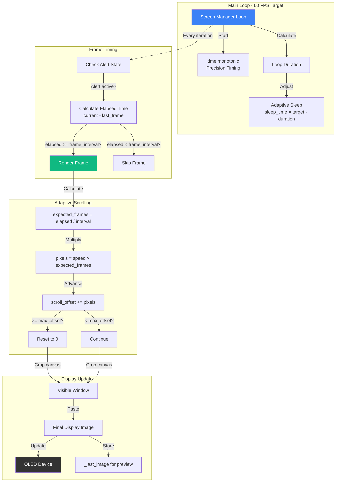
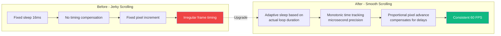
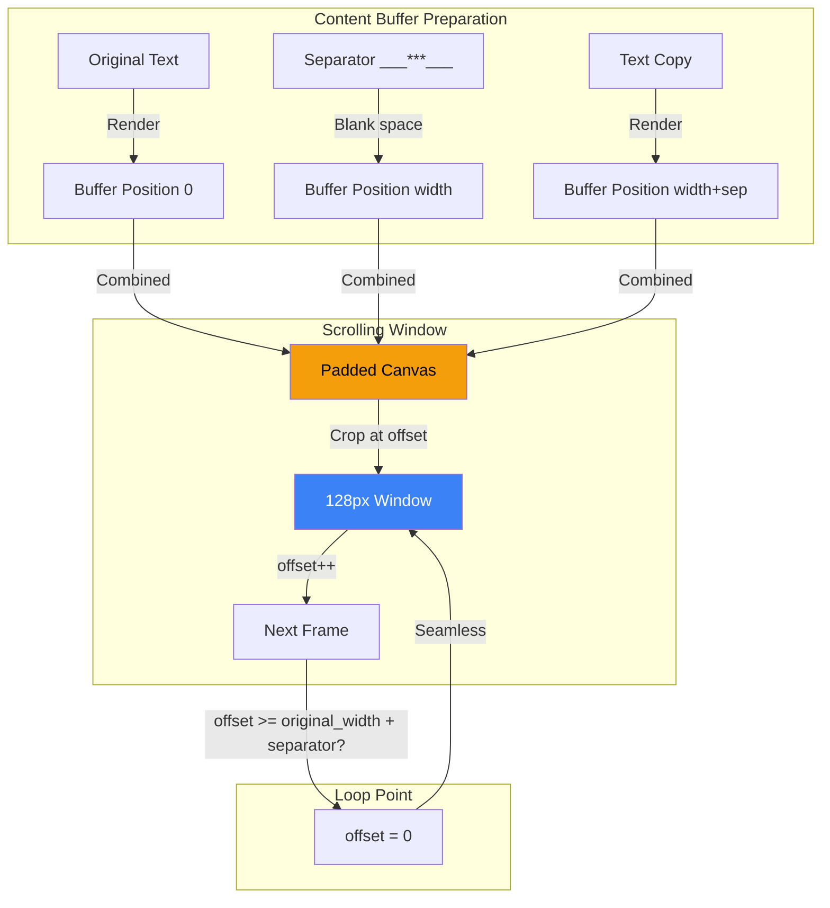
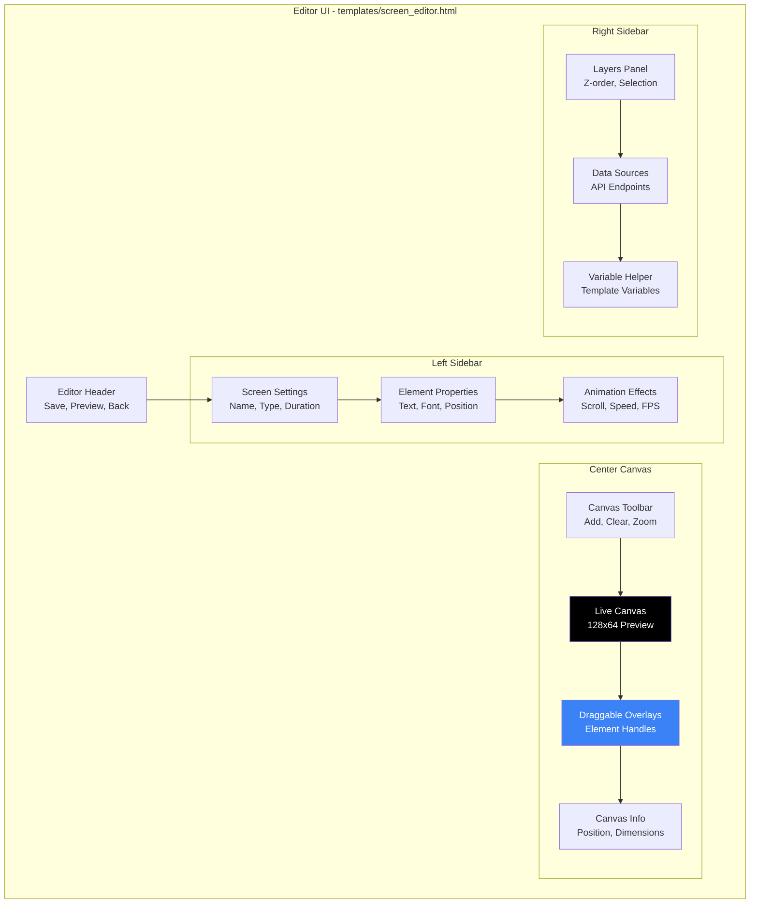
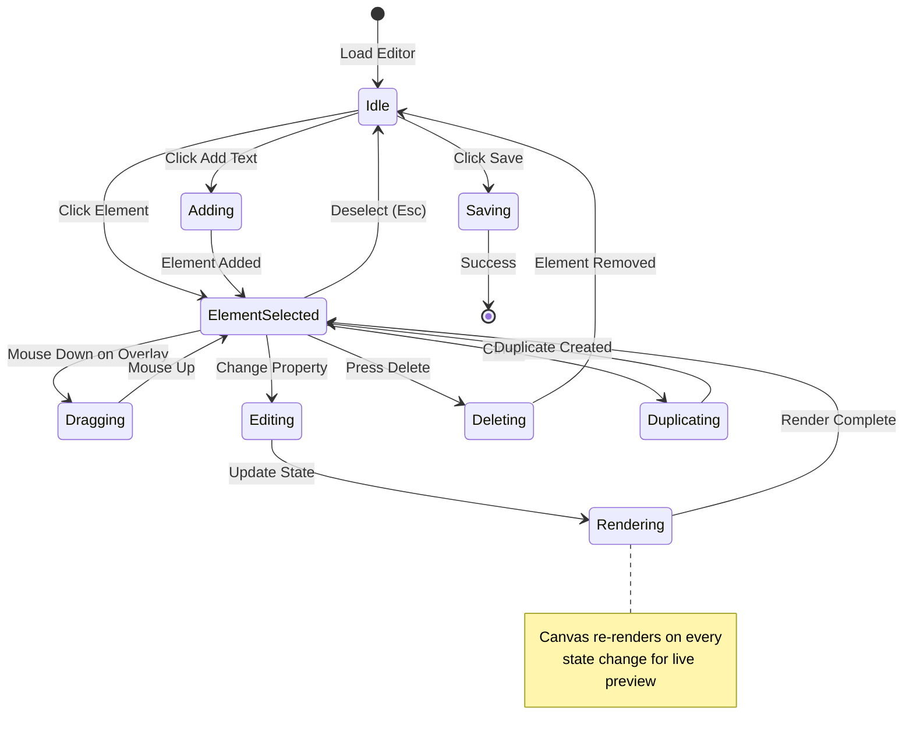
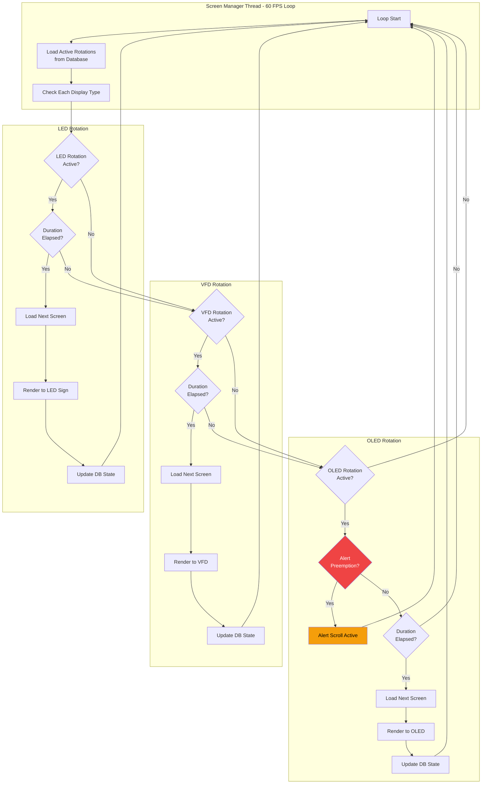
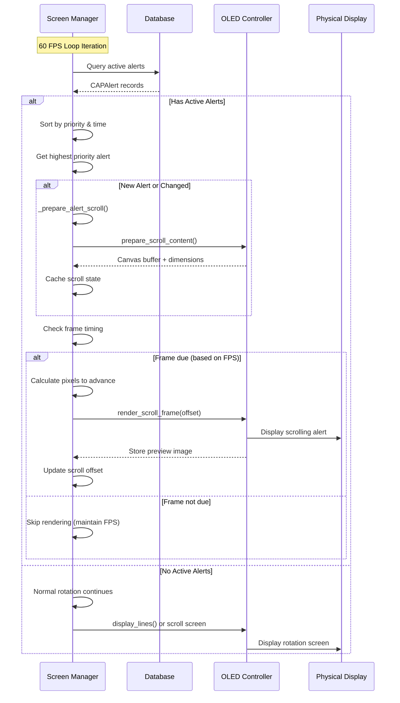
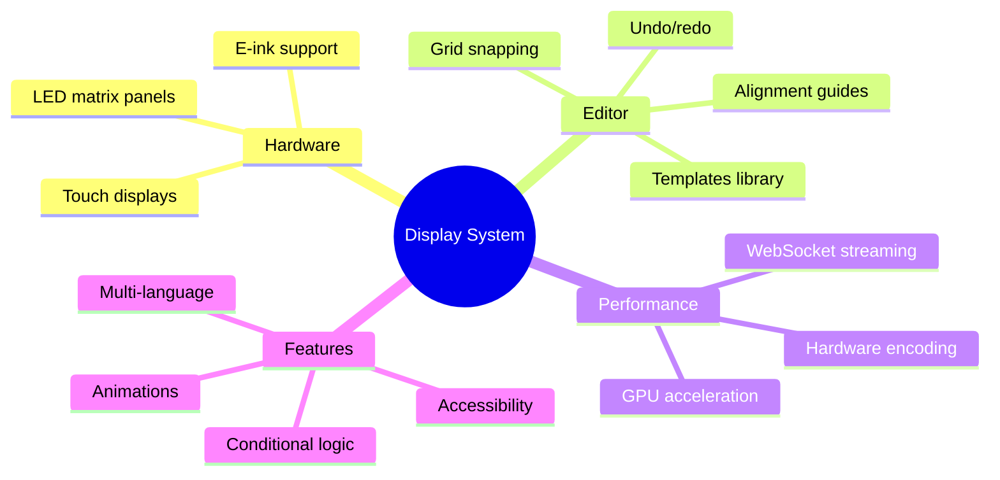

# Display System Architecture

This document provides comprehensive architectural diagrams for the EAS Station display system, including OLED/VFD/LED screen management, the visual editor, and real-time preview functionality.

---

## Table of Contents

1. [OLED Display Preview System](#oled-display-preview-system)
2. [OLED Scrolling Performance Architecture](#oled-scrolling-performance-architecture)
3. [Visual Screen Editor Architecture](#visual-screen-editor-architecture)
4. [Screen Rendering Pipeline](#screen-rendering-pipeline)
5. [Display Manager Workflow](#display-manager-workflow)

---

## OLED Display Preview System

### Overview
The OLED preview system captures actual pixel data from the OLED controller and streams it to the web UI for real-time visualization.

```mermaid
graph TB
    subgraph "Hardware Layer"
        OLED[SSD1306 OLED Display<br/>128x64 I2C]
    end

    subgraph "Python Backend - app_core/oled.py"
        Controller[ArgonOLEDController]
        Buffer[_last_image: Image<br/>Monochrome Buffer]

        Controller -->|display_lines| Render[Render to PIL Image]
        Render -->|Store copy| Buffer
        Render -->|Send to device| OLED

        Controller -->|render_scroll_frame| ScrollRender[Scroll Frame Render]
        ScrollRender -->|Store copy| Buffer
        ScrollRender -->|Send to device| OLED

        Buffer -->|get_preview_image_base64| Export[Convert to RGB PNG<br/>Base64 Encode]
    end

    subgraph "API Layer - webapp/routes_screens.py"
        API[/api/displays/current-state]
        API -->|Get controller| Controller
        API -->|Call method| Export
        Export -->|Return| JSON[JSON Response<br/>preview_image: data:image/png;base64,...]
    end

    subgraph "Frontend - templates/displays_preview.html"
        Poll[Polling Timer<br/>500ms interval]
        Canvas[HTML5 Canvas<br/>128x64]

        Poll -->|fetch| API
        JSON -->|Parse response| Decode[Decode Base64]
        Decode -->|Create Image| Img[Image Object]
        Img -->|drawImage| Canvas
    end

    subgraph "User"
        Browser[Web Browser]
        Browser -->|View| Canvas
        Browser -->|Navigate to| Preview[/displays/preview]
    end

    style OLED fill:#333,color:#fff
    style Canvas fill:#4a9eff,color:#fff
    style Export fill:#f59e0b,color:#000
```

### Data Flow

```mermaid
sequenceDiagram
    participant SM as Screen Manager
    participant OC as OLED Controller
    participant Dev as SSD1306 Device
    participant API as API Endpoint
    participant UI as Browser Canvas

    Note over SM,Dev: Display Update Cycle
    SM->>OC: display_lines(elements)
    OC->>OC: Render to PIL Image
    OC->>OC: Store _last_image.copy()
    OC->>Dev: device.display(image)
    Dev-->>Dev: I2C Write

    Note over API,UI: Preview Fetch Cycle (500ms)
    UI->>API: GET /api/displays/current-state
    API->>OC: get_preview_image_base64()
    OC->>OC: Convert monochrome → RGB
    OC->>OC: Save to BytesIO as PNG
    OC->>OC: Base64 encode
    OC-->>API: data:image/png;base64,...
    API-->>UI: JSON with preview_image
    UI->>UI: Create Image from base64
    UI->>UI: drawImage to canvas

    Note over UI: User sees exact OLED output
```

---

## OLED Scrolling Performance Architecture

### Smooth Scrolling System



### Timing Precision Improvements



### Seamless Loop Algorithm



---

## Visual Screen Editor Architecture

### Editor Component Structure



### Editor State Management



### Data Binding Flow

```mermaid
graph LR
    subgraph "Editor State"
        State[JavaScript State Object<br/>elements: []<br/>selectedElement: id<br/>zoom: 1<br/>dataSources: []]
    end

    subgraph "UI Components"
        Form[Property Form<br/>Inputs & Selects]
        Canvas[Canvas Renderer<br/>HTML5 Canvas]
        Layers[Layers List<br/>Element Cards]
    end

    subgraph "Event Handlers"
        Input[Input Events<br/>onChange, onInput]
        Mouse[Mouse Events<br/>click, drag, move]
        Keyboard[Keyboard Events<br/>Delete, Ctrl+D]
    end

    Input -->|Update| State
    Mouse -->|Update| State
    Keyboard -->|Update| State

    State -->|Render| Canvas
    State -->|Update| Form
    State -->|Update| Layers

    Form -.->|Two-way binding| State

    style State fill:#f59e0b,color:#000
```

---

## Screen Rendering Pipeline

### Template to Display Flow

```mermaid
graph TB
    subgraph "Screen Definition"
        DB[(Database<br/>DisplayScreen)]
        Template[Template Data JSON<br/>lines: []<br/>scroll_effect: string]
    end

    subgraph "Data Fetching"
        Sources[Data Sources<br/>/api/system_status<br/>/api/audio/metrics]
        Fetch[Fetch API Data]
        Vars[Variable Map<br/>{status.cpu}: 45.2]
    end

    subgraph "Rendering - scripts/screen_renderer.py"
        Renderer[ScreenRenderer]
        Substitute[Variable Substitution<br/>Replace {vars}]
        Build[Build OLEDLine Objects]
    end

    subgraph "Display - app_core/oled.py"
        Controller[ArgonOLEDController]
        Prepare[prepare_scroll_content<br/>Pre-render buffer]
        Display[display_lines<br/>Render to device]
    end

    subgraph "Output"
        OLED[SSD1306 Display]
        Preview[Web Preview<br/>Base64 Image]
    end

    DB -->|Load| Template
    Template -->|Configure| Sources
    Sources -->|Fetch| Fetch
    Fetch -->|Build| Vars

    Template & Vars -->|Process| Renderer
    Renderer -->|Substitute| Substitute
    Substitute -->|Build| Build

    Build -->|Send to| Controller
    Controller -->|Scrolling?| Prepare
    Controller -->|Static?| Display
    Prepare --> Display

    Display -->|I2C| OLED
    Display -->|Capture| Preview

    style OLED fill:#333,color:#fff
    style Preview fill:#4a9eff,color:#fff
```

### Variable Substitution Engine

```mermaid
graph TB
    subgraph "Input"
        Text["Text: CPU {status.cpu_usage_percent}%"]
        Data["Data: {status: {cpu_usage_percent: 45.2}}"]
    end

    subgraph "Processing"
        Pattern[Regex: \{([^}]+)\}]
        Extract[Extract: status.cpu_usage_percent]
        Split[Split: ['status', 'cpu_usage_percent']]
        Navigate[Navigate object path]
        Value[Get value: 45.2]
        Format[Format: float → '45.2']
    end

    subgraph "Output"
        Result["Result: CPU 45.2%"]
    end

    Text & Data --> Pattern
    Pattern --> Extract
    Extract --> Split
    Split --> Navigate
    Navigate --> Value
    Value --> Format
    Format --> Result

    style Result fill:#10b981,color:#fff
```

---

## Display Manager Workflow

### Screen Rotation System



### Alert Preemption Flow



---

## Integration Points

### Visual Editor to Display Flow

```mermaid
graph TB
    subgraph "User Interaction"
        User[User in Browser]
        Editor[Visual Screen Editor<br/>/screens/new]
    end

    subgraph "Frontend Processing"
        Canvas[Canvas Preview<br/>Visual Feedback]
        State[JavaScript State<br/>elements: []]
        Build[buildTemplateData<br/>Generate JSON]
    end

    subgraph "API Layer"
        Save[POST /api/screens]
        Validate[Validate JSON]
        Store[(Store in Database<br/>DisplayScreen)]
    end

    subgraph "Rotation System"
        Manager[Screen Manager<br/>Background Thread]
        Fetch[Load from Database]
        Render[Screen Renderer]
    end

    subgraph "Display Output"
        OLED[OLED Display]
        Preview[Web Preview]
    end

    User -->|Drag elements| Editor
    Editor -->|Update| State
    State -->|Render| Canvas
    User -->|Click Save| Build

    Build -->|JSON payload| Save
    Save --> Validate
    Validate --> Store

    Manager -->|Poll database| Fetch
    Fetch --> Render
    Render --> OLED
    OLED --> Preview

    Preview -.->|User sees result| User

    style Editor fill:#3b82f6,color:#fff
    style Store fill:#8b5cf6,color:#fff
    style OLED fill:#333,color:#fff
```

---

## Performance Characteristics

### Frame Timing Analysis

```mermaid
gantt
    title OLED Scrolling Performance - 60 FPS Target
    dateFormat X
    axisFormat %L ms

    section Before (Jerky)
    Frame 1 :f1, 0, 16
    Processing :p1, 16, 20
    Sleep 16ms :s1, 20, 36
    Frame 2 :f2, 36, 52
    Inconsistent timing :crit, 52, 70

    section After (Smooth)
    Frame 1 :done, 100, 116
    Processing :done, 116, 119
    Adaptive Sleep 13ms :done, 119, 132
    Frame 2 :done, 132, 148
    Processing :done, 148, 151
    Adaptive Sleep 13ms :done, 151, 164
    Frame 3 :done, 164, 180
    Consistent 60 FPS :milestone, 180, 0
```



---

## System Metrics

### Display System Overview

| Component | Technology | Performance | Capabilities |
|-----------|-----------|-------------|--------------|
| **OLED Controller** | Python + luma.oled + PIL | 60 FPS scrolling | Monochrome 128x64, I2C, hardware acceleration |
| **Preview System** | Base64 PNG + Canvas | 500ms polling, <50KB per frame | Real-time browser visualization |
| **Visual Editor** | Vanilla JS + Canvas API | Real-time rendering | Drag-drop, layer management, live preview |
| **Screen Manager** | Python threading | 60 FPS loop, <1ms overhead | Multi-display rotation, alert preemption |
| **Variable System** | Regex substitution | <1ms per screen | Dynamic data from 5+ API endpoints |

---

## Architecture Highlights

### Key Innovations

1. **Zero-Copy Preview**: OLED controller stores rendered image once, exports to web without re-rendering
2. **Adaptive Frame Timing**: Scroll speed adjusts to maintain consistent motion despite processing variations
3. **Seamless Looping**: Pre-rendered padded buffer eliminates visible wrap point in scrolling text
4. **Drag-Drop Precision**: Canvas overlays enable pixel-perfect element positioning
5. **JSON Bridge**: Visual editor generates same JSON structure as manual entry for full compatibility

### Design Principles

- **Performance First**: 60 FPS target with microsecond-precision timing
- **User Experience**: Visual tools eliminate JSON editing errors
- **Backward Compatible**: All changes work with existing screens and hardware
- **Scalable**: Architecture supports future display types (e-ink, matrix, etc.)
- **Observable**: Real-time preview enables debugging and validation

---

## Future Enhancements



---

**Document Version**: 1.0
**Last Updated**: 2025-11-17
**Author**: KR8MER with Claude AI
**Related Files**:
- `app_core/oled.py` - OLED controller implementation
- `scripts/screen_manager.py` - Display rotation manager
- `templates/screen_editor.html` - Visual editor UI
- `static/js/screen-editor.js` - Editor logic
- `webapp/routes_screens.py` - API routes
