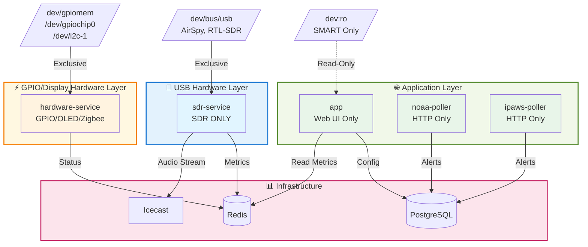
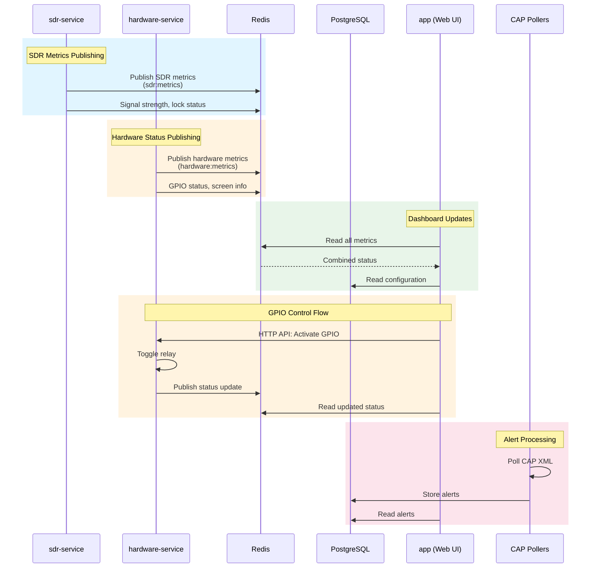
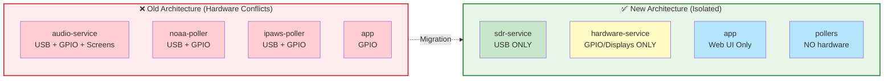

# Complete Hardware Isolation Architecture

## Problem

Previously, hardware access was scattered across multiple containers, causing:
- **USB contention** - Multiple containers trying to access the same SDR device
- **Fault propagation** - SDR crashes affecting displays, GPIO crashes affecting audio
- **Unclear ownership** - Multiple containers with overlapping hardware access
- **Difficult debugging** - Hardware failures cascading across services

## Solution: Complete Hardware Isolation

### **Three-Layer Hardware Architecture**



**Fault Isolation Benefits:**
- 🔴 **SDR fails** → GPIO/displays keep working, web UI stays up
- 🟡 **Displays fail** → SDR keeps monitoring, audio keeps streaming
- 🟢 **Web UI fails** → All hardware continues running independently

---

## Container Responsibilities

### **sdr-service** (SDR + Audio)
**Hardware**: `/dev/bus/usb` only

**Purpose**: SDR hardware management and real-time audio processing

**Runs**: `audio_service.py`

**Handles**:
- SDR device initialization (AirSpy, RTL-SDR)
- IQ sample capture
- FM/NFM demodulation
- EAS/SAME decoding
- RBDS data extraction
- Icecast streaming
- Audio metrics publishing

**Why together**: Audio processing requires microsecond-latency access to SDR samples. Splitting them would add inter-container overhead and increase latency.

**Privileges**: `privileged: true`, `CAP_SYS_RAWIO`, `CAP_SYS_ADMIN` (USB only)

---

### **hardware-service** (GPIO + Displays + Zigbee)
**Hardware**: `/dev/gpiomem`, `/dev/gpiochip0`, `/dev/i2c-1`

**Purpose**: Local hardware control (non-SDR)

**Runs**: `hardware_service.py`

**Handles**:
- GPIO pin control (relays, transmitter PTT)
- OLED display rendering (128x64 SSD1306, etc.)
- LED matrix displays
- VFD displays
- Screen rotation and scheduling
- Zigbee coordinator management (if configured)
- Hardware status metrics

**Environment Variables**:
- `GPIO_ENABLED` - Enable/disable GPIO (default: false)
- `SCREENS_AUTO_START` - Auto-start screen rotation (default: true)

**Privileges**: `privileged: true` (GPIO/I2C access on Pi 5)

---

### **app** (Web UI)
**Hardware**: `/dev:ro` (read-only for SMART only)

**Purpose**: User interface and configuration

**Runs**: Flask application (`app.py`)

**Handles**:
- Web routes and API endpoints
- User authentication
- Configuration management
- System dashboards
- SMART disk monitoring (read-only)
- Metrics aggregation from Redis

**NO direct hardware access** (except read-only `/dev` for SMART)

**Privileges**: None (unprivileged container)

---

### **noaa-poller** / **ipaws-poller** (Alert Polling)
**Hardware**: None

**Purpose**: CAP XML feed polling

**Handles**:
- HTTP polling of NOAA/IPAWS feeds
- CAP XML parsing
- Alert database storage
- NO hardware access needed

**Privileges**: None (unprivileged container)

---

## Hardware Device Mapping

### Base Configuration (`docker-compose.yml`)
Works on all platforms (x86, ARM, Pi, etc.):

```yaml
sdr-service:
  devices:
    - /dev/bus/usb:/dev/bus/usb  # USB SDR devices

hardware-service:
  # No devices in base config - added via Pi override
  # Works on all platforms with hardware features disabled

app:
  # No devices in base config
```

### Raspberry Pi Override (`docker-compose.pi.yml`)
Adds Pi-specific hardware:

```yaml
app:
  devices:
    - /dev:/dev:ro  # Read-only for SMART monitoring

hardware-service:
  devices:
    - /dev/gpiomem:/dev/gpiomem
    - /dev/gpiochip0:/dev/gpiochip0
    - /dev/i2c-1:/dev/i2c-1
  environment:
    GPIO_ENABLED: "true"
    SCREENS_AUTO_START: "true"
```

---

## Fault Isolation Benefits

### **SDR Failure Scenarios**
If `sdr-service` crashes or SDR device disconnects:
- ✅ GPIO relays continue working
- ✅ OLED displays continue updating
- ✅ Web UI remains accessible
- ✅ Alert polling continues
- 🔄 SDR automatically retries connection with exponential backoff

### **Display Failure Scenarios**
If `hardware-service` crashes or display fails:
- ✅ SDR continues monitoring
- ✅ Audio continues streaming
- ✅ EAS decoding continues
- ✅ Web UI remains accessible
- 🔄 Hardware service restarts independently

### **Web UI Failure Scenarios**
If `app` container crashes:
- ✅ SDR continues monitoring
- ✅ Displays continue updating
- ✅ GPIO continues functioning
- ✅ Alert polling continues
- 🔄 Web UI restarts without affecting hardware

---

## Communication Architecture

### **Inter-Service Communication**



### **Metrics Flow**
1. `sdr-service` publishes SDR metrics to Redis (`sdr:metrics`)
2. `hardware-service` publishes hardware metrics to Redis (`hardware:metrics`)
3. `app` reads all metrics from Redis for dashboards

### **Control Flow**
1. User clicks GPIO button in web UI
2. `app` sends HTTP request to `hardware-service` API
3. `hardware-service` activates GPIO pin
4. Status published back via Redis

---

## Migration Guide

### From Old Architecture



**Before**: Multiple containers fighting over USB and GPIO → **Device contention**
**After**: Each container has exclusive hardware access → **Zero contention**

### Deployment Steps

1. **Pull latest code**:
```bash
git pull origin main
```

2. **Stop all containers**:
```bash
docker-compose down
```

3. **Deploy with new architecture**:
```bash
# Standard deployment
docker-compose up -d

# Raspberry Pi deployment
docker-compose -f docker-compose.yml -f docker-compose.pi.yml up -d
```

4. **Verify isolation**:
```bash
# Check sdr-service has USB
docker exec eas-sdr-service ls -l /dev/bus/usb

# Check hardware-service has GPIO (Pi only)
docker exec eas-hardware-service ls -l /dev/gpiomem

# Check app has no GPIO
docker exec eas-station-app-1 ls -l /dev/gpiomem 2>&1 | grep "No such file"
```

---

## Troubleshooting

### SDR Not Working
**Check**: Only `sdr-service` should have `/dev/bus/usb`

```bash
# Should show USB devices
docker inspect eas-sdr-service | grep -A5 Devices

# Should NOT show USB
docker inspect eas-hardware-service | grep -A5 Devices
```

**Logs**:
```bash
docker logs -f eas-sdr-service
```

### GPIO/Displays Not Working
**Check**: Only `hardware-service` should have GPIO

```bash
# Should show GPIO devices (Pi only)
docker inspect eas-hardware-service | grep -A10 Devices
```

**Logs**:
```bash
docker logs -f eas-hardware-service
```

### SMART Monitoring Not Working
**Check**: `app` container needs read-only `/dev`

```bash
# Should show read-only device access
docker inspect eas-station-app-1 | grep -A5 Devices
```

---

## Security Benefits

### Principle of Least Privilege
- **sdr-service**: Only USB access, no GPIO
- **hardware-service**: Only GPIO/I2C, no USB
- **app**: Read-only devices, no write access
- **pollers**: Zero hardware access

### Attack Surface Reduction
- USB exploits contained to `sdr-service`
- GPIO exploits contained to `hardware-service`
- Web vulnerabilities can't access hardware directly
- Each service can be restarted without affecting others

### Audit Trail
- Clear hardware ownership
- Isolated logs per service
- Easy to trace hardware operations

---

## Files Changed

- `docker-compose.yml` - Added hardware-service, updated device mappings
- `docker-compose.pi.yml` - Moved GPIO from app to hardware-service
- `hardware_service.py` - New dedicated hardware service
- `sdr_service.py` - Optional standalone SDR entrypoint
- `docs/architecture/SDR_SERVICE_ISOLATION.md` - SDR-specific documentation
- `docs/architecture/HARDWARE_ISOLATION.md` - This document

---

## Related Documentation

- [SDR Service Isolation](SDR_SERVICE_ISOLATION.md) - USB/SDR-specific isolation
- [System Architecture](SYSTEM_ARCHITECTURE.md) - Overall system design
- [SDR Setup Guide](../hardware/SDR_SETUP.md) - SDR hardware configuration
- [GPIO Configuration](../hardware/GPIO_SETUP.md) - GPIO setup guide

---

## Summary

**Complete hardware isolation achieved:**
- ✅ SDR isolated to `sdr-service`
- ✅ GPIO/displays isolated to `hardware-service`
- ✅ Web UI has zero hardware write access
- ✅ Pollers have zero hardware access
- ✅ Each service can fail independently
- ✅ Clear fault boundaries
- ✅ Better security posture
- ✅ Easier debugging
