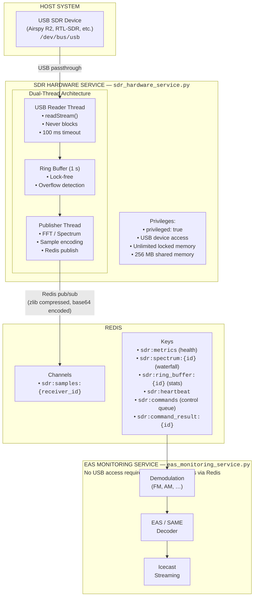
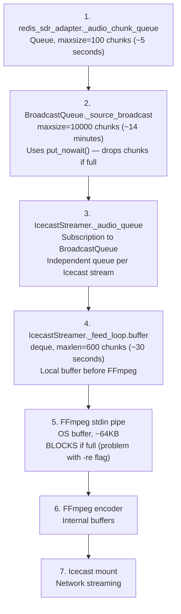

# SDR Service Architecture

## Overview

The EAS Station™ uses a **dual-service architecture** for SDR (Software Defined Radio) operations to ensure reliable 24/7 operation required for life-safety systems. This document describes the architecture, components, and operational details.

> **Service naming:** The two processes live at the repo root and run as the `eas-station-sdr.service` and `eas-station-audio.service` systemd units. They were historically referenced as `sdr_service.py` and `audio_service.py`; the actual files are `sdr_hardware_service.py` and `eas_monitoring_service.py`. A separate `eas-station-eas.service` (`eas_service.py`) used to run a second, independent EAS/SAME decoder against the same audio stream; it was retired as a redundant duplicate (see `docs/reference/CHANGELOG.md`) — `eas_monitoring_service.py` is now the sole decoder.

## Architecture Diagram



## Components

### 1. SDR Hardware Service (`sdr_hardware_service.py`)

**Purpose:** Dedicated service for SDR hardware operations only.

**Responsibilities:**
- SoapySDR device management (open, configure, stream)
- Dual-thread USB reading for jitter absorption
- IQ sample publishing to Redis
- Health metrics publishing
- Control command processing

**Runtime Requirements (bare metal systemd):**
- Runs as the `eas-station-sdr.service` unit (see `systemd/eas-station-sdr.service`).
- Direct USB access via the host's `/dev/bus/usb` tree (the service runs as a user in the `plugdev` group).
- `RLIMIT_MEMLOCK` lifted so SoapySDR can lock pages for high-rate IQ capture.
- Started by `install.sh` / `update.sh`; control via `systemctl status|restart eas-station-sdr.service`.

### 2. Ring Buffer (`app_core/radio/ring_buffer.py`)

**Purpose:** Lock-free buffer for USB jitter absorption.

**Features:**
- Single producer, single consumer (SPSC) design
- 1-second buffer capacity (configurable)
- Overflow/underflow detection
- Health statistics

**Configuration:**
```python
# Buffer sizing
MIN_SIZE = 262144   # ~0.1s at 2.5 MHz
MAX_SIZE = 4194304  # ~1.6s at 2.5 MHz

# Default: 1 second of buffer
buffer_size = sample_rate * 1.0
```

### 3. Single-Thread Capture Loop (CURRENT IMPLEMENTATION)

**Status:** As of 2025-12-04, the dual-thread architecture code was removed as it was never activated.

**Current Implementation:** Single-threaded capture loop in `_SoapySDRReceiver._capture_loop()`
- Reads samples from USB
- Performs FFT for spectrum analysis
- Updates signal strength metrics
- Maintains ring buffer for USB jitter absorption
- Handles capture requests

**Note:** A dual-thread architecture was prototyped but never integrated. The mixin code was removed during refactoring. If needed in future, it can be re-implemented based on the single-thread foundation.

~~**Previous Design (Not Implemented):**~~
~~1. USB Reader Thread (Producer) - read from hardware~~
~~2. Processing Thread (Consumer) - FFT and analysis~~

### 4. EAS Monitoring Service (`eas_monitoring_service.py`)

**Purpose:** Audio processing and EAS decoding.

**Responsibilities:**
- Subscribe to SDR sample channels
- Demodulation (FM, AM, etc.)
- EAS/SAME header detection
- Icecast streaming output
- Web audio streaming

**Runtime Requirements:**
- Runs as the `eas-station-audio.service` systemd unit (see `systemd/`).
- No USB access needed
- Redis connectivity only (publishes/subscribes on the channels listed above)

## Redis Data Flow

### Sample Publishing

```
Channel: sdr:samples:{receiver_id}
Format: JSON with zlib+base64 encoded samples

{
  "receiver_id": "noaa-1",
  "timestamp": 1701532800.123,
  "sample_count": 32768,
  "sample_rate": 2500000,
  "center_frequency": 162550000,
  "encoding": "zlib+base64",
  "samples": "<base64 encoded zlib compressed interleaved float32>"
}
```

### Spectrum Data (Waterfall)

```
Key: sdr:spectrum:{receiver_id}
TTL: 5 seconds

{
  "identifier": "noaa-1",
  "spectrum": [0.1, 0.2, ...],  // Normalized 0-1
  "fft_size": 2048,
  "sample_rate": 2500000,
  "center_frequency": 162550000,
  "timestamp": 1701532800.123,
  "status": "available"
}
```

### Health Metrics

```
Key: sdr:metrics
TTL: 30 seconds

{
  "service": "sdr_service",
  "timestamp": 1701532800.123,
  "pid": 12345,
  "receivers": {
    "noaa-1": {
      "running": true,
      "locked": true,
      "signal_strength": 0.42,
      "frequency_hz": 162550000,
      "sample_rate": 2500000,
      "ring_buffer": {
        "fill_percentage": 25.5,
        "overflow_count": 0
      }
    }
  }
}
```

### Control Commands

```
Queue: sdr:commands (LPUSH/LPOP)

{
  "action": "restart",  // restart, stop, start
  "receiver_id": "noaa-1",
  "command_id": "cmd-12345"
}

Result: sdr:command_result:{command_id}
TTL: 30 seconds

{
  "command_id": "cmd-12345",
  "success": true,
  "message": "Receiver noaa-1 restarted"
}
```

## Benefits of Separation

### Fault Isolation
- SDR crashes don't affect audio processing
- Audio crashes don't affect SDR streaming
- Either service can be restarted independently

### Security
- USB privileges isolated to the SDR service only
- Audio processing runs with minimal privileges
- Reduced attack surface

### Performance
- USB reading never blocked by FFT or encoding
- Ring buffer absorbs USB latency jitter
- Processing can run on different CPU cores

### Scalability
- SDR service can run on dedicated hardware
- Audio processing can be distributed
- Multiple audio consumers can subscribe

## Configuration

### Environment Variables

```bash
# Redis Connection
REDIS_HOST=localhost
REDIS_PORT=6379
REDIS_DB=0

# Database Connection
DATABASE_URL=postgresql+psycopg2://eas_station:<secure_password>@127.0.0.1:5432/alerts

# Application Config (defaults to /opt/eas-station/.env)
CONFIG_PATH=/opt/eas-station/.env
```

### systemd Files

| File | Description |
|------|-------------|
| `systemd/eas-station-sdr.service` | SDR hardware service unit (runs `sdr_hardware_service.py`) |
| `systemd/eas-station-audio.service` | Audio/EAS monitoring service unit (runs `eas_monitoring_service.py`) |

## Troubleshooting

### SDR Service Not Starting

1. Check USB device access:
   ```bash
   lsusb | grep -E "RTL|Airspy|Realtek"
   ```

2. Check SoapySDR detection:
   ```bash
   SoapySDRUtil --find
   ```

3. Check service logs:
   ```bash
   sudo journalctl -u eas-station-sdr -n 100 --no-pager
   ```

### Buffer Overflows

Symptoms: "Ring buffer overflow" warnings in logs

Causes:
- Processing thread too slow
- Insufficient CPU
- High sample rate without adequate resources

Solutions:
- Reduce sample rate
- Increase ring buffer size
- Use faster hardware
- Check for CPU throttling

### No Spectrum Data

1. Check Redis connectivity:
   ```bash
   redis-cli ping
   ```

2. Check spectrum key:
   ```bash
   redis-cli keys 'sdr:spectrum:*'
   ```

3. Verify receiver is locked:
   ```bash
   python3 scripts/diagnostics/check_sdr_status.py
   ```

## Monitoring

### Health Check Endpoints

The SDR service publishes a heartbeat to Redis:

```bash
# Check heartbeat
redis-cli get sdr:heartbeat

# Expected output:
{"timestamp": 1701532800.123, "pid": 12345, "receiver_count": 1}
```

### Ring Buffer Statistics

```bash
# Check ring buffer health (logged periodically by the SDR service)
sudo journalctl -u eas-station-sdr -n 200 --no-pager | grep -i "ring buffer"

# Expected fields:
# fill_percentage: 25.5
# overflow_count: 0
# underflow_count: 0
# total_samples_written: 1234567890
```

### Service Health

```bash
# Check all EAS Station services
systemctl list-units 'eas-station-*' --no-pager

# Check SDR service specifically
systemctl status eas-station-sdr
```

## Performance Tuning

### Buffer Sizes

For Airspy R2 at 2.5 MHz:
```python
# USB read buffer: 50ms of samples
read_buffer = int(2_500_000 * 0.050)  # 125,000 samples

# Ring buffer: 1 second of samples  
ring_buffer = int(2_500_000 * 1.0)    # 2,500,000 samples
```

### CPU Affinity

For multi-core systems, consider pinning threads:
```yaml
sdr-service:
  cpuset: "0,1"  # Use cores 0 and 1
```

### Memory

```yaml
sdr-service:
  shm_size: '512mb'  # Increase for higher sample rates
  mem_limit: 1g       # Limit total memory
```

## Icecast Streaming Architecture

### Overview

After SDR samples are demodulated to PCM audio, they are streamed to Icecast for network distribution. The streaming pipeline uses FFmpeg to encode audio (MP3/OGG) and push to Icecast server.

**CRITICAL**: The FFmpeg `-re` flag behavior is **source-dependent** and must be configured correctly to prevent stalling or incorrect resampling.

### FFmpeg `-re` Flag: Source-Specific Behavior

The `-re` flag in FFmpeg means "read input at native frame rate" and is designed for **file playback** simulation. Its use depends entirely on the audio source type:

#### SDR Sources (Live Hardware Capture)

**DO NOT use `-re` flag**

- **Why**: Audio is already captured in real-time by SDR hardware
- **Problem if used**: Creates fatal backpressure in the pipe buffer
  - FFmpeg throttles stdin reads to exactly real-time rate (e.g., 44.1kHz)
  - Audio chunks arrive faster than FFmpeg consumes them
  - Pipe buffer (64KB) fills up in <1 second
  - `stdin.write()` blocks, freezing the feed loop
  - Audio queue fills, stream stalls completely after 5-6 seconds
- **Symptom**: "Buffering..." message in player, never recovers
- **Solution**: Remove `-re` flag, let FFmpeg consume stdin as fast as available

**Flow without `-re` (CORRECT for SDR)**:
```
SDR Hardware → IQ Samples → Demodulator → PCM Audio → 
  Feed Loop → FFmpeg stdin → Encoder → Icecast
  (no throttling, natural buffer pace)
```

#### HTTP/Stream Sources (Network Streams)

**DO use `-re` flag**

- **Why**: Remote streams need throttling for correct resampling
- **Problem if omitted**: FFmpeg processes too fast, resampling is incorrect
  - Network stream arrives at network speed (can be faster than real-time)
  - Without `-re`, FFmpeg decodes/resamples at maximum CPU speed
  - Timing relationships are lost, resampling produces wrong output
- **Solution**: Use `-re` flag to maintain proper timing

**Flow with `-re` (CORRECT for HTTP streams)**:
```
HTTP Stream → FFmpeg (with -re) → Decode → Resample → 
  PCM Audio → Feed Loop → FFmpeg stdin → Encoder → Icecast
  (throttled to real-time, correct resampling)
```

### Implementation

The conditional logic in `app_core/audio/icecast_output.py`:

```python
def _start_ffmpeg(self) -> bool:
    # Determine if -re flag should be used based on source type
    use_re_flag = False
    source_type_name = type(self.audio_source).__name__
    
    # Network stream sources NEED -re flag
    if source_type_name in ('StreamSourceAdapter', 'IcecastIngestSource', 'HTTPIngestSource'):
        use_re_flag = True
        logger.debug(f"Using -re flag for {source_type_name} (network stream)")
    
    # SDR sources must NOT use -re flag
    elif 'SDR' in source_type_name or 'sdr' in source_type_name.lower():
        use_re_flag = False
        logger.debug(f"NOT using -re flag for {source_type_name} (live hardware)")
    
    # Fallback: check AudioSourceConfig.source_type enum
    elif hasattr(self.audio_source, 'config'):
        from .ingest import AudioSourceType
        config = self.audio_source.config
        if hasattr(config, 'source_type'):
            if config.source_type == AudioSourceType.SDR:
                use_re_flag = False
            elif config.source_type == AudioSourceType.STREAM:
                use_re_flag = True
    
    # Build FFmpeg command with conditional -re flag
    cmd = ['ffmpeg']
    if use_re_flag:
        cmd.append('-re')
    cmd.extend(['-f', 's16le', '-ar', str(sample_rate), ...])
```

### Source Type Detection

**Priority order:**

1. **Class name pattern matching**:
   - `StreamSourceAdapter` → use `-re`
   - `RedisSDRSourceAdapter` → no `-re`
   - `IcecastIngestSource` → use `-re`
   - `HTTPIngestSource` → use `-re`

2. **AudioSourceConfig.source_type enum**:
   - `AudioSourceType.STREAM` → use `-re`
   - `AudioSourceType.SDR` → no `-re`

3. **Default fallback**: No `-re` (safer, prevents stalling)

### Buffer Architecture

Understanding the buffer chain helps diagnose issues:



### Troubleshooting Streaming Issues

#### Symptom: Stalling after 5-6 seconds

**Diagnosis**: `-re` flag on SDR source

```bash
# Check source type
grep "Using -re flag\|NOT using -re" /var/log/eas-station/audio-service.log

# Should see:
# "NOT using -re flag for RedisSDRSourceAdapter (live hardware)"
```

**Fix**: Ensure conditional logic detects SDR source correctly

#### Symptom: Incorrect resampling on HTTP streams

**Diagnosis**: Missing `-re` flag on network stream

```bash
# Check source type
grep "Using -re flag\|NOT using -re" /var/log/eas-station/audio-service.log

# Should see:
# "Using -re flag for StreamSourceAdapter (network stream)"
```

**Fix**: Ensure conditional logic detects stream source correctly

#### Symptom: Buffer overflow warnings

```bash
# Check buffer health
redis-cli GET "sdr:ring_buffer:{receiver_id}"

# Look for:
# "fill_percentage": >80%
# "overflow_count": >0
```

**Causes**:
- Downstream processing too slow
- Network congestion (Icecast streaming)
- CPU throttling

**Solutions**:
- Check network bandwidth
- Monitor CPU usage
- Reduce number of concurrent streams
- Increase buffer sizes

### Performance Considerations

#### CPU Usage

- **Without `-re`**: FFmpeg encodes as fast as possible
  - Higher burst CPU usage
  - Lower average CPU (finishes encoding faster)
  - Better for SDR (no blocking)
  
- **With `-re`**: FFmpeg throttles to real-time
  - Steady CPU usage
  - Slightly higher average CPU
  - Required for HTTP streams (correct resampling)

#### Network Bandwidth

- Each Icecast stream: ~128kbps (MP3) or ~64-96kbps (OGG)
- Multiple SDR receivers = multiple streams
- Consider bandwidth limits on shared networks

#### Memory Usage

- Each IcecastStreamer: ~100MB peak
- Buffer memory: ~50MB per stream
- Monitor with: `docker stats`

### Best Practices

1. **Always check logs** for `-re` flag usage during startup
2. **Test SDR streams** for >60 seconds continuously
3. **Verify HTTP stream audio quality** after any changes
4. **Monitor buffer health** via Redis metrics
5. **Use appropriate bitrates** (128kbps for MP3, 96kbps for OGG)
6. **Limit concurrent streams** based on available resources

### Related Files

- `app_core/audio/icecast_output.py` - FFmpeg streaming logic
- `app_core/audio/redis_sdr_adapter.py` - SDR demodulation
- `app_core/audio/sources.py` - HTTP stream sources
- `app_core/audio/auto_streaming.py` - Stream management
- `docs/audio/AUDIO_MONITORING.md` - Audio monitoring guide

### Version History

- **v2.42.5**: Removed `-re` flag (broke HTTP streams)
- **v2.42.6**: Added conditional `-re` flag based on source type (current)
