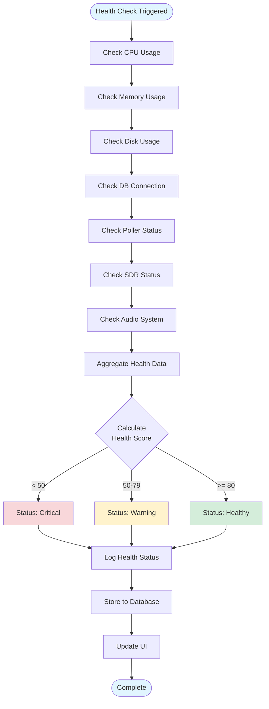

# EAS Station System Architecture

## Document Overview

This document provides comprehensive architectural diagrams and flowcharts for the entire EAS Station system, covering all major components, data flows, and operational workflows. It serves as a visual reference for understanding how the system operates from end to end.

**Related Documents:**
- [Data Flow Sequences](DATA_FLOW_SEQUENCES) - Detailed sequence diagrams showing data processing paths ⭐ NEW
- [Theory of Operation](THEORY_OF_OPERATION) - Conceptual overview and protocol details
- [Audio Ingest Documentation](../audio) - Audio ingest system specifics
- [Help Guide](../guides/HELP) - Operational procedures

---

## Table of Contents

1. [System Overview](#system-overview)
2. [Core Components](#core-components)
3. [Alert Processing Pipeline](#alert-processing-pipeline)
4. [Audio Ingest System](#audio-ingest-system)
5. [Broadcast Workflow](#broadcast-workflow)
6. [Verification System](#verification-system)
7. [Data Flow Diagrams](#data-flow-diagrams)
8. [Component Interactions](#component-interactions)
9. [Deployment Architecture](#deployment-architecture)
10. [Professional Diagrams](#professional-diagrams)

---

## System Overview

### High-Level Architecture

EAS Station uses a **separated service architecture** where hardware access is isolated into dedicated containers for reliability and security:


### Service Responsibilities

| Service | Hardware Access | Purpose | Config Source |
|---------|----------------|---------|---------------|
| **app** | None | Web UI, API, configuration | `/app-config/.env` |
| **noaa-poller** | None | NOAA CAP XML polling | `/app-config/.env` |
| **ipaws-poller** | None | FEMA IPAWS polling | `/app-config/.env` |
| **sdr-service** | USB (`/dev/bus/usb`) | SDR capture, audio processing, SAME decoding | `/app-config/.env` |
| **hardware-service** | GPIO, I2C | Relay control, displays (OLED/VFD/LED) | `/app-config/.env` |
| **nginx** | None | HTTPS termination, reverse proxy | Environment vars |
| **redis** | None | Cache, inter-service communication | Volume-based |
| **icecast** | None | Audio streaming | `/app-config/.env` |

### System Layers

| Layer | Purpose | Key Components |
|-------|---------|----------------|
| **External Sources** | Alert origins and RF monitoring | NOAA, IPAWS, SDR receivers |
| **Ingestion** | Fetch and validate CAP alerts | Pollers, validators |
| **Data** | Persistent storage and spatial processing | PostgreSQL, PostGIS |
| **Processing** | Business logic and orchestration | Alert manager, audio/radio controllers |
| **Application** | User interface and APIs | Flask web app, REST endpoints |
| **Output** | Broadcast generation | SAME encoder, TTS, GPIO, LED |
| **Verification** | Capture and validate broadcasts | SDR capture, SAME decoder |

---

## Core Components

### Component Dependency Map


---

## Alert Processing Pipeline

### End-to-End Alert Flow


### Alert Ingestion Flowchart


### Spatial Processing Detail


---

## Audio Ingest System

### Audio Ingest Architecture


### Audio Source Lifecycle


### Audio Metrics Flow


---

## Broadcast Workflow

### EAS Workflow Process


### SAME Generation Detail


### Audio Generation Pipeline


---

## Verification System

### SDR Capture & Verification Flow


### Verification Workflow


---

## Data Flow Diagrams

### Database Entity Relationships


### Data Flow: CAP to Broadcast


---

## Component Interactions

### Web Request Flow


### System Health Monitoring



### Multi-Service Coordination


### Service Communication Patterns


---

## Deployment Architecture

### Single-Host Deployment (Raspberry Pi 5)


### External Database Deployment

```mermaid
graph TB
    subgraph "Application Server"
        APP[EAS Station Application<br>Docker Compose]
        POLL[CAP Pollers<br>Docker Containers]
    end

    subgraph "Database Server"
        PG[PostgreSQL 17<br>Dedicated Server]
        PGIS[PostGIS 3.4<br>Extension]
        BACKUP[Automated Backups<br>pg_dump]
    end

    subgraph "Network"
        FW[Firewall<br>Port 5432]
        VPN[VPN Tunnel<br>Optional]
    end

    subgraph "Monitoring"
        PROM[Prometheus<br>Metrics]
        GRAF[Grafana<br>Dashboards]
    end

    APP --> FW
    POLL --> FW
    FW --> PG
    PG --> PGIS
    PG --> BACKUP

    VPN --> FW

    APP --> PROM
    PG --> PROM
    PROM --> GRAF

    style APP fill:#d4edda
    style PG fill:#fff3cd
    style FW fill:#f8d7da
```

---

## Summary

This architecture document provides visual representations of:

1. **System Overview** - High-level component layout and data flows
2. **Core Components** - Module dependencies and relationships
3. **Alert Processing** - End-to-end CAP ingestion and validation
4. **Audio Ingest** - Real-time audio monitoring architecture
5. **Broadcast Workflow** - EAS message generation and transmission
6. **Verification System** - SDR capture and SAME decoding
7. **Data Flows** - Database entities and information routing
8. **Component Interactions** - Service coordination and communication
9. **Deployment** - Physical and logical deployment architectures

These diagrams serve as living documentation that should be updated as the system evolves.

**Related Resources:**
- [Data Flow Sequences](DATA_FLOW_SEQUENCES) - Detailed data processing paths ⭐ NEW
- [Theory of Operation](THEORY_OF_OPERATION) - Detailed operational concepts
- [Developer Guide](../development/AGENTS) - Code standards and practices
- [Help Guide](../guides/HELP) - Operational procedures

---

## Professional Diagrams

For enhanced clarity and presentation, the following professional SVG diagrams are available:

### Alert Processing Pipeline

Detailed flowchart showing the complete CAP alert ingestion workflow from external sources through validation, parsing, spatial processing, and database storage.


**File:** [../assets/diagrams/alert-processing-pipeline.svg](../assets/diagrams/alert-processing-pipeline.svg)

---

### EAS Broadcast Workflow

Step-by-step workflow diagram illustrating the complete EAS message generation and transmission process, from alert selection through SAME encoding to broadcast completion.


**File:** [../assets/diagrams/broadcast-workflow.svg](../assets/diagrams/broadcast-workflow.svg)

---

### Audio Source Routing Architecture

Block diagram showing multi-source audio ingestion architecture with adapters, priority selection, monitoring systems, and database integration.


**File:** [../assets/diagrams/audio-source-routing.svg](../assets/diagrams/audio-source-routing.svg)

---

### Hardware Deployment Architecture

Physical deployment diagram showing Raspberry Pi 5 hardware configuration with all peripherals, storage, and external connections.


**File:** [../assets/diagrams/system-deployment-hardware.svg](../assets/diagrams/system-deployment-hardware.svg)

---

**Last Updated:** 2025-11-05
**Diagram Format:** Mermaid.js (Markdown) and SVG (Professional graphics)
