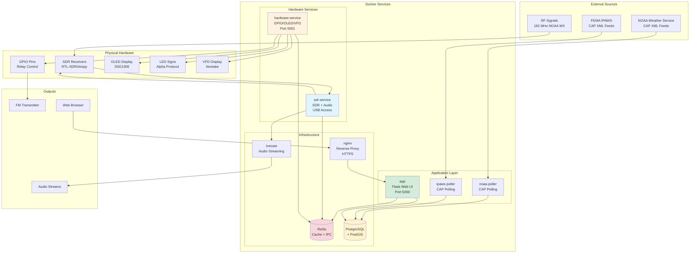
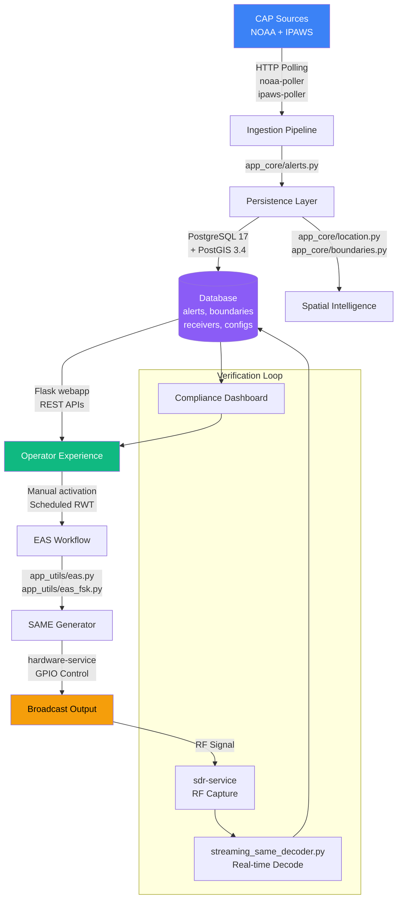
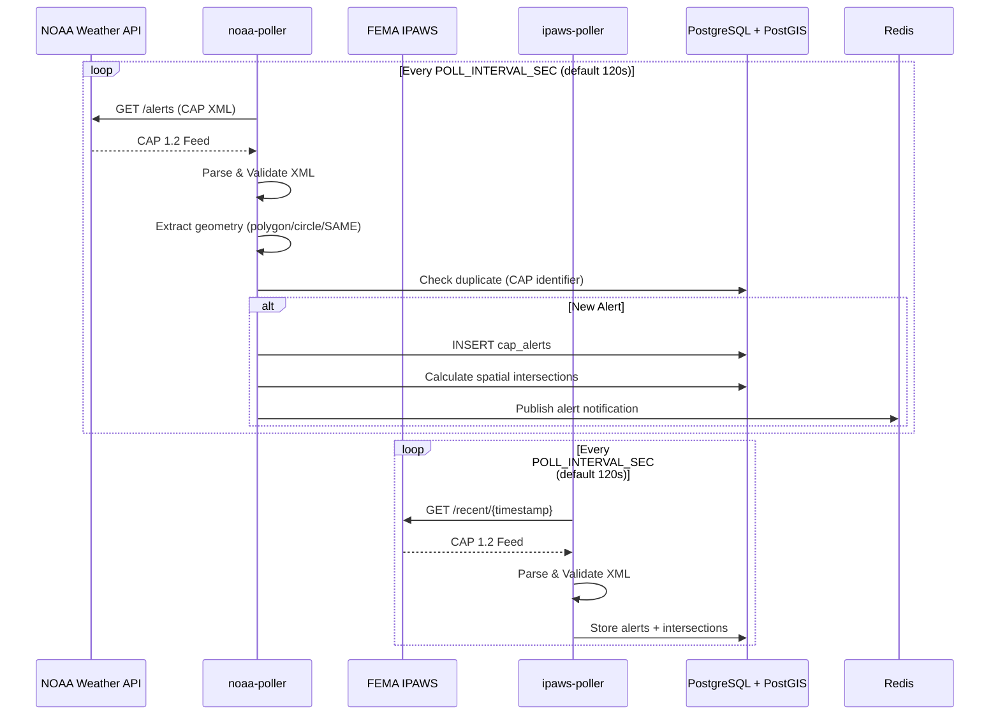
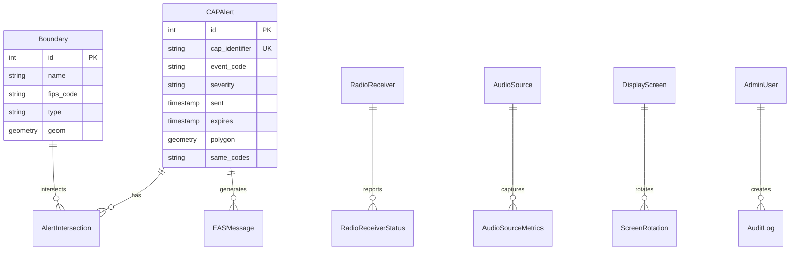
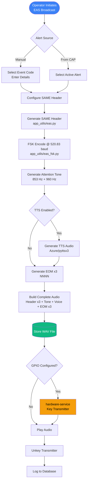
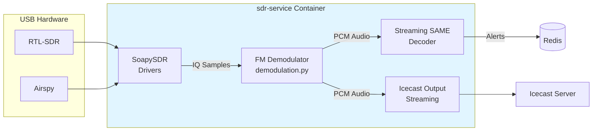
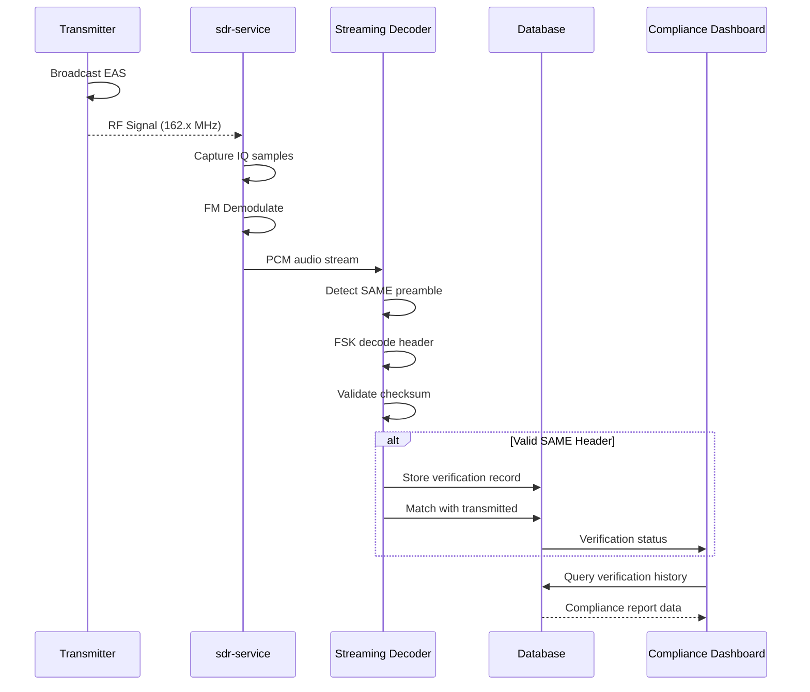

# EAS Station Theory of Operation

The EAS Station platform orchestrates NOAA and IPAWS Common Alerting Protocol (CAP) messages from ingestion to FCC-compliant broadcast and verification. This document explains the end-to-end data flow, highlights the subsystems that participate in each phase, and provides historical context for the Specific Area Message Encoding (SAME) protocol that anchors the audio workflow.

---

## System Architecture Overview

EAS Station uses a **separated service architecture** with complete hardware isolation for reliability and fault tolerance:

### Service Responsibilities

| Service | Hardware Access | Purpose |
|---------|----------------|---------|
| **app** | None (read-only /dev for SMART) | Web UI, API, configuration |
| **noaa-poller** | None | NOAA CAP XML feed polling |
| **ipaws-poller** | None | FEMA IPAWS feed polling |
| **sdr-service** | USB (`/dev/bus/usb`) | SDR capture, audio processing, SAME decoding |
| **hardware-service** | GPIO, I2C (`/dev/gpiomem`, `/dev/i2c-1`) | Relay control, displays (OLED/VFD/LED) |

---

## High-Level Data Flow

Each node references an actual module, package, or service in the repository so operators and developers can trace the implementation.

## Pipeline Stages

### 1. Ingestion & Validation

The CAP polling system runs as two separate containers for fault isolation:

- **Pollers (`poller/cap_poller.py`)** fetch CAP 1.2 feeds from NOAA Weather Service and FEMA IPAWS on configurable intervals (default 120 seconds via `POLL_INTERVAL_SEC`)
- **Schema Enforcement** validates XML against CAP schema and normalises polygons, circles, and SAME location codes
- **Deduplication (`app_core/alerts.py`)** compares CAP identifiers, message types, and sent timestamps
- **Configuration** is read from the persistent `/app-config/.env` file, accessible via Settings → Environment

### 2. Persistence & Spatial Context

- **Database** runs PostgreSQL 17 with PostGIS 3.4 extension
- **ORM Models (`app_core/models.py`)** describe alerts, boundaries, receivers, audio sources, displays
- **Spatial Processing** uses PostGIS `ST_Intersects` for geographic matching

### 3. Operator Experience

- **Flask Web Application (`webapp/`)** provides Bootstrap 5 responsive interface
- **Setup Wizard (`/setup`)** manages ALL configuration—no hardcoded environment variables
- **Settings Pages** (`/settings/*`) expose:
  - Environment variables (`/settings/environment`)
  - Location settings, Audio/SDR configuration
  - Hardware (GPIO, OLED, VFD, LED signs)
  - IPAWS/NOAA feed configuration
- **System Health (`app_core/system_health.py`)** monitors CPU, memory, SDR state, audio pipeline

### 4. Broadcast Orchestration

- **Workflow UI (`webapp/eas/`)** guides operators through alert selection and SAME header preview
- **SAME Generator (`app_utils/eas.py`, `app_utils/eas_fsk.py`)** creates FCC-compliant 520⅔ baud FSK audio
- **Hardware Integration** via isolated `hardware-service` container for GPIO relay control

### 5. Audio Processing & SDR Monitoring

The `sdr-service` container handles all SDR hardware and audio processing:

- **Real-Time Streaming Decoder (`app_core/audio/streaming_same_decoder.py`)** — <200ms latency, <5% CPU
- **Audio Source Manager (`app_core/audio/source_manager.py`)** — multi-source with automatic failover
- **Icecast Integration** streams demodulated audio for remote monitoring

### 6. Verification & Compliance

- **SDR Capture** via SoapySDR drivers (`app_core/radio/drivers.py`)
- **Alert Verification** supports WAV/MP3 uploads and automated SDR captures
- **Compliance Dashboard** reconciles alerts for FCC reporting
## SAME Protocol Deep Dive

The Specific Area Message Encoding protocol is the broadcast payload EAS Station produces for on-air activation. Key characteristics:

- **Encoding Format** – ASCII characters transmitted with 520⅔ baud frequency-shift keying (FSK) using mark and space tones at 2083.3 Hz and 1562.5 Hz. The generator in `app_utils/eas.py` honours this cadence and injects the mandated three-header burst sequence (Preamble, ZCZC, message body, End of Message).
- **Message Structure** – SAME headers follow `ZCZC-ORG-EEE-PSSCCC+TTTT-JJJHHMM-LLLLLLLL-`. EAS Station assembles each component from CAP payloads: ORG from `senderName`, EEE from the CAP event code, PSSCCC from matched FIPS/SAME codes, TTTT for duration, and `LLLLLLLL` for the station identifier configured in the admin UI.
- **Attention Signal** – After the third header, the attention signal is generated using simultaneous 853 Hz and 960 Hz sine waves for a configurable duration (defaults defined in `app_utils/eas.py`).
- **End of Message** – The `NNNN` EOM triplet terminates the activation. The workflow enforces the three-EOM rule and logs playout with timestamps in `app_core/eas_storage.py`.

> 📑 **Cross-Reference:** Sections 4.1–4.3 of the DASDEC3 *Version 5.1 Software User’s Guide* describe identical header, audio, and relay sequencing. Keep `docs/Version 5.1 Software_Users Guide_R1.0 5-31-23.pdf` open when editing this document so the nomenclature stays aligned.

### Historical Background

- **1994 Rollout** – The FCC adopted SAME to replace the two-tone Attention Signal, enabling geographically targeted alerts and automated receiver activation.
- **2002 IPAWS Integration** – FEMA’s Integrated Public Alert and Warning System standardised CAP 1.2 feeds, which EAS Station ingests via dedicated pollers.
- **Ongoing Enforcement** – FCC Enforcement Bureau cases such as the 2015 iHeartMedia consent decree (The Bobby Bones Show) and the 2014 Olympus Has Fallen trailer settlement demonstrate the penalties for misuse. The `/about` page links to the official notices to reinforce best practices.

### Raspberry Pi Platform Evolution

EAS Station’s quest to deliver a software-first encoder/decoder is tightly coupled with the Raspberry Pi roadmap:

- **Model B (2012):** Early tests proved a $35 board could poll CAP feeds and render SAME tones with USB DACs, albeit with limited concurrency.
- **Pi 3 (2016):** Integrated Wi-Fi and quad-core CPUs enabled simultaneous NOAA/IPAWS polling and text-to-speech without overruns.
- **Pi 4 (2020):** Gigabit Ethernet and USB 3.0 stabilised dual-SDR capture alongside GPIO relay control, unlocking continuous lab deployments.
- **Pi 5 (2023):** PCIe 2.0 storage, LPDDR4X memory, and the BCM2712 SoC provided the horsepower for SDR verification, compliance analytics, and narration on a single board—the reference build documented in [`README.md`](https://github.com/KR8MER/eas-station/blob/main/README.md).
- **Pi 5 Production Runs (2024+):** Hardened kits with UPS-backed power, relay breakouts, and CM4-based carrier boards were documented alongside vendor references (`docs/QSG_DASDEC-G3_R5.1.docx`, `docs/D,GrobSystems,ADJ06182024A.pdf`) to mirror field requirements captured in the DASDEC3 manual.

The reference stack—Pi 5 (8 GB), balanced audio HAT, dual SDR receivers, NVMe storage, GPIO relay bank, and UPS-backed power—totals **~$585 USD** in 2025. Equivalent DASDEC3 racks list for **$5,000–$7,000 USD**, illustrating the leverage gained by investing in software quality rather than proprietary hardware.

For roadmap parity tracking against the Digital Alert Systems DASDEC3 manual, consult [`docs/roadmap/DASDEC3_COMPARISON.md`](../roadmap/DASDEC3_COMPARISON).

## Operational Checklist

When deploying or evaluating the system:

1. **Start Services** – Launch the `app`, `poller`, and `ipaws-poller` services alongside the PostGIS database (see `docker-compose.embedded-db.yml`).
2. **Verify CAP Connectivity** – Confirm polling logs in `logs/` show successful fetches and schema validation.
3. **Map Boundaries** – Populate counties and polygons through the admin interface (`/settings/geo`) or import via the CLI tools in `tools/`.
4. **Configure Broadcast Outputs** – Set the station identifier, text-to-speech provider, GPIO pinout, and LED sign parameters in `/settings`.
5. **Exercise the Workflow** – Use `/eas/workflow` to run a Required Weekly Test (RWT) and inspect stored WAV files under `static/audio/`.
6. **Validate Verification Loop** – Upload the generated WAV to the decoder lab to confirm headers decode as issued.

Refer back to this document whenever you need a grounded explanation of what happens between CAP ingestion and verified broadcast.
