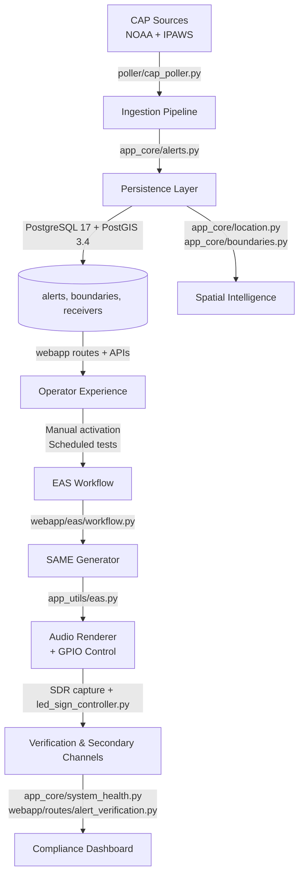

# EAS Station Theory of Operation

The EAS Station platform orchestrates NOAA and IPAWS Common Alerting Protocol (CAP) messages from ingestion to FCC-compliant broadcast and verification. This document explains the end-to-end data flow, highlights the subsystems that participate in each phase, and provides historical context for the Specific Area Message Encoding (SAME) protocol that anchors the audio workflow.

## High-Level Flow

Each node references an actual module, package, or service in the repository so operators and developers can trace the implementation.

## Pipeline Stages

### 1. Ingestion & Validation
- **Pollers (`poller/cap_poller.py`)** fetch CAP 1.2 feeds from NOAA Weather Service and FEMA IPAWS endpoints on independent cadences.
- **Schema Enforcement (`manual_eas_event.parse_cap_xml`, `poller/cap_poller.py::_parse_cap_polygon`)** validates XML against the CAP schema and normalises polygons, circles, and SAME location codes before storage.
- **Deduplication (`app_core/alerts.py`)** compares CAP identifiers, message types, and sent timestamps to ensure a single source of truth for each alert.

### 2. Persistence & Spatial Context
- **Database Layer** runs on PostgreSQL 17 with the PostGIS 3.4 extension, provisioned through the `postgis/postgis:17-3.4` container in `docker-compose.embedded-db.yml`.
- **ORM Models (`app_core/models.py`)** describe CAP alerts, geographic boundaries, receiver inventory, and verification artefacts.
- **Spatial Processing (`app_core/boundaries.py`, `app_core/location.py`)** translates CAP geometry into actionable intersections that drive downstream routing and LED sign targeting.

### 3. Operator Experience
- **Flask Blueprints (`webapp/`)** surface dashboards, manual broadcast tools, and administrative controls. The navigation is defined in `templates/base.html` and cascades through page-specific templates.
- **Documentation Integration** ensures `/help`, `/about`, `/terms`, and `/privacy` mirror the repository’s guidance so lab operators receive the same warnings as developers.
- **System Health (`app_core/system_health.py`)** exposes CPU, memory, SDR receiver state, and audio pipeline metrics for 24/7 monitoring.

### 4. Broadcast Orchestration
- **Workflow UI (`webapp/eas/workflow.py`)** guides operators through selecting alert types, confirming text-to-speech narration, and previewing SAME headers before release.
- **SAME Generator (`app_utils/eas.py`)** constructs precise 520⅔ baud SAME bursts, attention tones, and EOM triplets, adhering to § 11.31 timing.
- **Hardware Integration** controls GPIO relays for transmitter keying and drives Alpha LED signage through `led_sign_controller.py`.

### 5. Verification & Compliance
- **SDR Capture** uses SoapySDR-compatible drivers configured in `app_core/radio/drivers.py` and orchestrated by `app_core/radio/manager.py` to record on-air audio.
- **Decode Laboratory (`webapp/routes/alert_verification.py`)** accepts WAV/MP3 uploads, runs them through the decoder pipeline, and stores checksum-anchored verification artefacts.
- **Compliance Dashboard (`webapp/routes/admin.py`, `app_core/eas_storage.py`)** reconciles received, relayed, and verified alerts for FCC weekly/monthly reporting.

## SAME Protocol Deep Dive

The Specific Area Message Encoding protocol is the broadcast payload EAS Station produces for on-air activation. Key characteristics:

- **Encoding Format** – ASCII characters transmitted with 520⅔ baud frequency-shift keying (FSK) using mark and space tones at 2083.3 Hz and 1562.5 Hz. The generator in `app_utils/eas.py` honours this cadence and injects the mandated three-header burst sequence (Preamble, ZCZC, message body, End of Message).
- **Message Structure** – SAME headers follow `ZCZC-ORG-EEE-PSSCCC+TTTT-JJJHHMM-LLLLLLLL-`. EAS Station assembles each component from CAP payloads: ORG from `senderName`, EEE from the CAP event code, PSSCCC from matched FIPS/SAME codes, TTTT for duration, and `LLLLLLLL` for the station identifier configured in the admin UI.
- **Attention Signal** – After the third header, the attention signal is generated using simultaneous 853 Hz and 960 Hz sine waves for a configurable duration (defaults defined in `app_utils/eas.py`).
- **End of Message** – The `NNNN` EOM triplet terminates the activation. The workflow enforces the three-EOM rule and logs playout with timestamps in `app_core/eas_storage.py`.

### Historical Background

- **1994 Rollout** – The FCC adopted SAME to replace the two-tone Attention Signal, enabling geographically targeted alerts and automated receiver activation.
- **2002 IPAWS Integration** – FEMA’s Integrated Public Alert and Warning System standardised CAP 1.2 feeds, which EAS Station ingests via dedicated pollers.
- **Ongoing Enforcement** – FCC Enforcement Bureau cases such as the 2015 iHeartMedia consent decree (The Bobby Bones Show) and the 2014 Olympus Has Fallen trailer settlement demonstrate the penalties for misuse. The `/about` page links to the official notices to reinforce best practices.

### Raspberry Pi Platform Evolution

EAS Station’s quest to deliver a software-first encoder/decoder is tightly coupled with the Raspberry Pi roadmap:

- **Model B (2012):** Early tests proved a $35 board could poll CAP feeds and render SAME tones with USB DACs, albeit with limited concurrency.
- **Pi 3 (2016):** Integrated Wi-Fi and quad-core CPUs enabled simultaneous NOAA/IPAWS polling and text-to-speech without overruns.
- **Pi 4 (2020):** Gigabit Ethernet and USB 3.0 stabilised dual-SDR capture alongside GPIO relay control, unlocking continuous lab deployments.
- **Pi 5 (2023):** PCIe 2.0 storage, LPDDR4X memory, and the BCM2712 SoC provided the horsepower for SDR verification, compliance analytics, and narration on a single board—the reference build documented in [`README.md`](../../README.md).

The reference stack—Pi 5 (8 GB), balanced audio HAT, dual SDR receivers, NVMe storage, GPIO relay bank, and UPS-backed power—totals **~$585 USD** in 2025. Equivalent DASDEC3 racks list for **$5,000–$7,000 USD**, illustrating the leverage gained by investing in software quality rather than proprietary hardware.

For roadmap parity tracking against the Digital Alert Systems DASDEC3 manual, consult [`docs/roadmap/DASDEC3_COMPARISON.md`](../roadmap/DASDEC3_COMPARISON.md).

## Operational Checklist

When deploying or evaluating the system:

1. **Start Services** – Launch the `app`, `poller`, and `ipaws-poller` services alongside the PostGIS database (see `docker-compose.embedded-db.yml`).
2. **Verify CAP Connectivity** – Confirm polling logs in `logs/` show successful fetches and schema validation.
3. **Map Boundaries** – Populate counties and polygons through the admin interface (`/settings/geo`) or import via the CLI tools in `tools/`.
4. **Configure Broadcast Outputs** – Set the station identifier, text-to-speech provider, GPIO pinout, and LED sign parameters in `/settings`.
5. **Exercise the Workflow** – Use `/eas/workflow` to run a Required Weekly Test (RWT) and inspect stored WAV files under `static/audio/`.
6. **Validate Verification Loop** – Upload the generated WAV to the decoder lab to confirm headers decode as issued.

Refer back to this document whenever you need a grounded explanation of what happens between CAP ingestion and verified broadcast.
