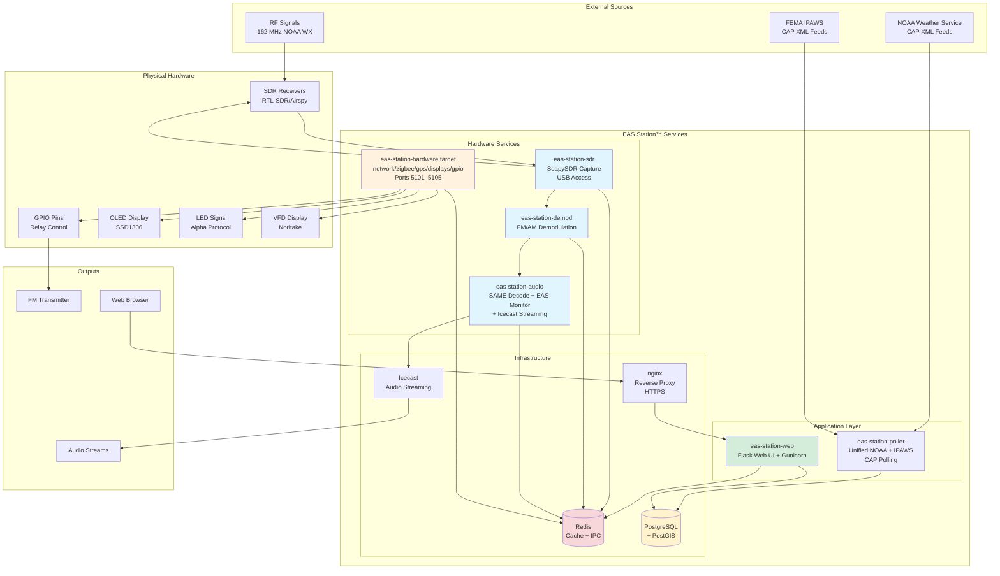
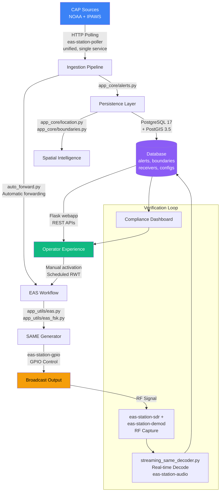
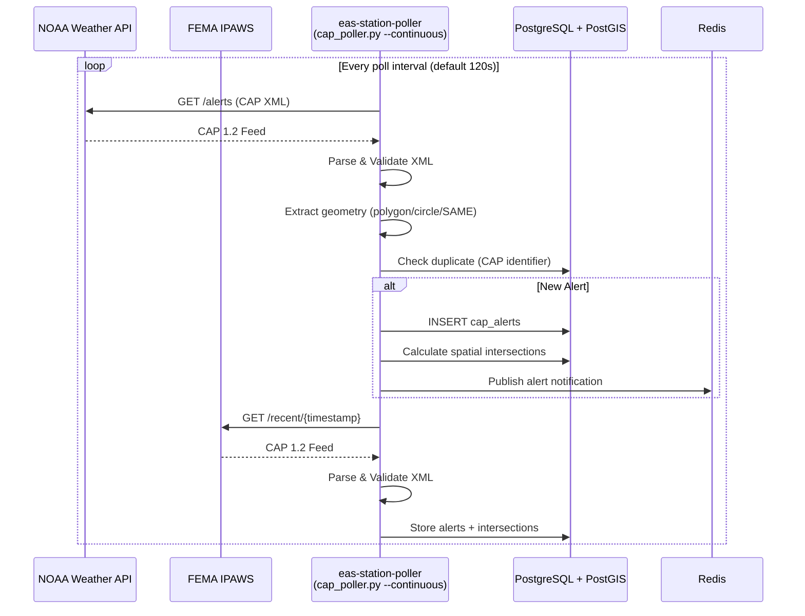
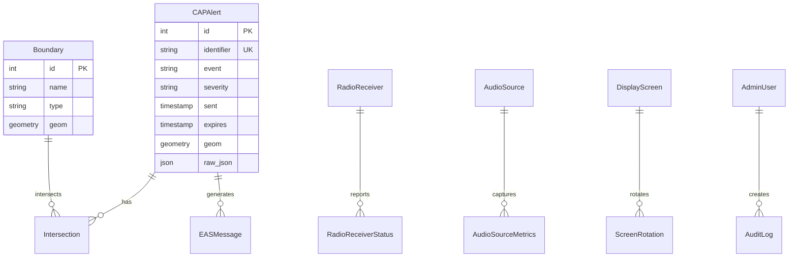
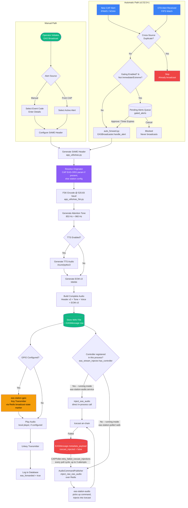
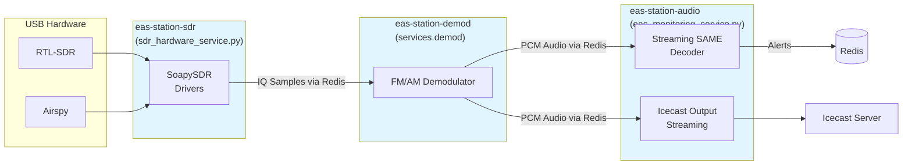
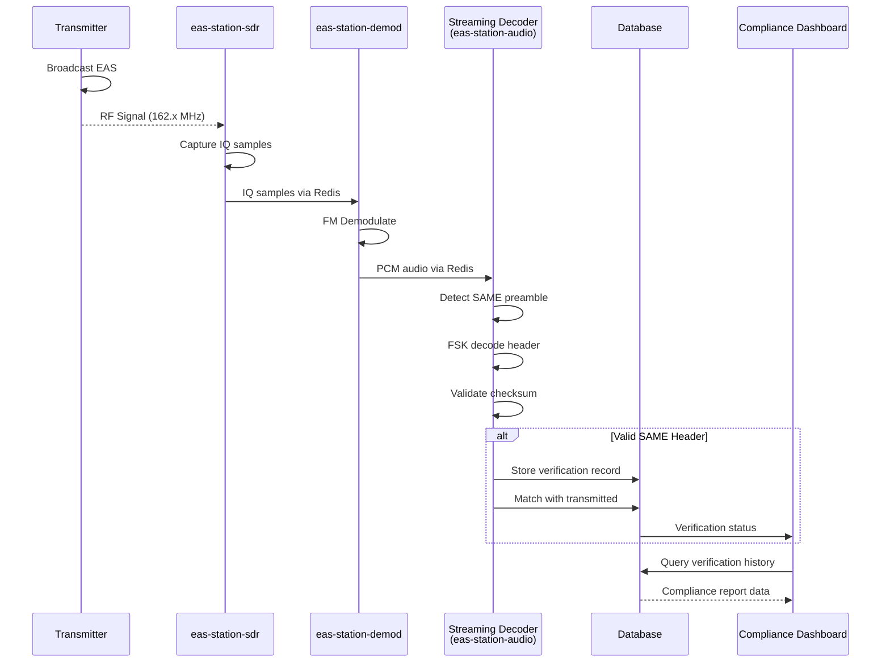

# EAS Station™ Theory of Operation

The EAS Station™ platform orchestrates NOAA and IPAWS Common Alerting Protocol (CAP) messages from ingestion to FCC-compliant broadcast and verification. This document explains the end-to-end data flow, highlights the subsystems that participate in each phase, and provides historical context for the Specific Area Message Encoding (SAME) protocol that anchors the audio workflow.

---

## System Architecture Overview

EAS Station™ uses a **separated service architecture** with complete hardware isolation for reliability and fault tolerance:

```mermaid
graph TB
    subgraph External["External Sources"]
        NOAA[NOAA Weather Service<br/>CAP XML Feeds]
        IPAWS[FEMA IPAWS<br/>CAP XML Feeds]
        RF[RF Signals<br/>162 MHz NOAA WX]
    end

    subgraph EASServices["EAS Station™ Services"]
        subgraph AppLayer["Application Layer"]
            APP[eas-station-web<br/>Flask Web UI + Gunicorn]
            POLLER[eas-station-poller<br/>Unified NOAA + IPAWS<br/>CAP Polling]
        end

        subgraph HardwareLayer["Hardware Services"]
            SDR[eas-station-sdr<br/>SoapySDR Capture<br/>USB Access]
            DEMOD[eas-station-demod<br/>FM/AM Demodulation]
            AUDIO[eas-station-audio<br/>SAME Decode + EAS Monitor<br/>+ Icecast Streaming]
            HW[eas-station-hardware.target<br/>network/zigbee/gps/displays/gpio<br/>Ports 5101–5105]
        end

        subgraph Infrastructure["Infrastructure"]
            REDIS[(Redis<br/>Cache + IPC)]
            DB[(PostgreSQL<br/>+ PostGIS)]
            ICECAST[Icecast<br/>Audio Streaming]
            NGINX[nginx<br/>Reverse Proxy<br/>HTTPS]
        end
    end

    subgraph Hardware["Physical Hardware"]
        SDR_DEV[SDR Receivers<br/>RTL-SDR/Airspy]
        GPIO[GPIO Pins<br/>Relay Control]
        OLED[OLED Display<br/>SSD1306]
        LED[LED Signs<br/>Alpha Protocol]
        VFD_DEV[VFD Display<br/>Noritake]
    end

    subgraph Output["Outputs"]
        TX[FM Transmitter]
        BROWSER[Web Browser]
        STREAM[Audio Streams]
    end

    %% Data flows
    NOAA --> POLLER
    IPAWS --> POLLER
    POLLER --> DB
    RF --> SDR_DEV --> SDR

    APP --> DB
    APP --> REDIS
    SDR --> REDIS
    SDR --> DEMOD --> REDIS
    DEMOD --> AUDIO
    AUDIO --> REDIS
    AUDIO --> ICECAST
    HW --> REDIS

    SDR --> SDR_DEV
    HW --> GPIO --> TX
    HW --> OLED
    HW --> LED
    HW --> VFD_DEV

    NGINX --> APP
    BROWSER --> NGINX
    ICECAST --> STREAM

    style APP fill:#d4edda
    style SDR fill:#e1f5ff
    style DEMOD fill:#e1f5ff
    style AUDIO fill:#e1f5ff
    style HW fill:#fff3e0
    style DB fill:#fff3cd
    style REDIS fill:#f8d7da
```

### Service Responsibilities

| Service | Hardware Access | Purpose |
|---------|----------------|---------|
| **eas-station-web** | None (read-only /dev for SMART) | Web UI, API, configuration (Gunicorn) |
| **eas-station-poller** | None | Unified NOAA + IPAWS CAP feed polling (`poller/cap_poller.py --continuous`) — a single process alternates both feeds, not two separate services |
| **eas-station-sdr** | USB (`/dev/bus/usb`) | SoapySDR capture (`sdr_hardware_service.py`) |
| **eas-station-demod** | None | FM/AM demodulation (`services.demod`), reads raw samples from `eas-station-sdr` over Redis |
| **eas-station-audio** | None | SAME FSK decode, EAS monitor, Icecast streaming, and the audio-forwarding pipeline (`eas_monitoring_service.py`) |
| **eas-station-hardware.target** | GPIO, I2C (`/dev/gpiomem`, `/dev/i2c-1`) | Bundles 5 per-subsystem services — `eas-station-network`, `-zigbee`, `-gps`, `-displays`, `-gpio` (ports 5101–5105) — relay control and displays (OLED/VFD/LED) |

---

## High-Level Data Flow

```mermaid
flowchart TD
    A[CAP Sources<br/>NOAA + IPAWS] -->|HTTP Polling<br/>eas-station-poller<br/>unified, single service| B[Ingestion Pipeline]
    B -->|app_core/alerts.py| C[Persistence Layer]
    C -->|PostgreSQL 17<br/>+ PostGIS 3.5| D[(Database<br/>alerts, boundaries<br/>receivers, configs)]
    C -->|app_core/location.py<br/>app_core/boundaries.py| E[Spatial Intelligence]
    D -->|Flask webapp<br/>REST APIs| F[Operator Experience]
    B -->|auto_forward.py<br/>Automatic forwarding| G
    F -->|Manual activation<br/>Scheduled RWT| G[EAS Workflow]
    G -->|app_utils/eas.py<br/>app_utils/eas_fsk.py| H[SAME Generator]
    H -->|eas-station-gpio<br/>GPIO Control| I[Broadcast Output]
    
    subgraph Verification["Verification Loop"]
        J[eas-station-sdr +<br/>eas-station-demod<br/>RF Capture]
        K[streaming_same_decoder.py<br/>Real-time Decode<br/>eas-station-audio]
        L[Compliance Dashboard]
    end
    
    I -->|RF Signal| J
    J --> K
    K --> D
    D --> L
    L --> F

    style A fill:#3b82f6,color:#fff
    style D fill:#8b5cf6,color:#fff
    style F fill:#10b981,color:#fff
    style I fill:#f59e0b,color:#000
```

Each node references an actual module, package, or service in the repository so operators and developers can trace the implementation.

## Pipeline Stages

### 1. Ingestion & Validation

The CAP polling system runs as a single unified `eas-station-poller.service`, alternating both feeds each cycle (not two separate services):

```mermaid
sequenceDiagram
    participant NOAA as NOAA Weather API
    participant IPAWS as FEMA IPAWS
    participant P as eas-station-poller<br/>(cap_poller.py --continuous)
    participant DB as PostgreSQL + PostGIS
    participant REDIS as Redis

    loop Every poll interval (default 120s)
        P->>NOAA: GET /alerts (CAP XML)
        NOAA-->>P: CAP 1.2 Feed
        P->>P: Parse & Validate XML
        P->>P: Extract geometry (polygon/circle/SAME)
        P->>DB: Check duplicate (CAP identifier)
        alt New Alert
            P->>DB: INSERT cap_alerts
            P->>DB: Calculate spatial intersections
            P->>REDIS: Publish alert notification
        end

        P->>IPAWS: GET /recent/{timestamp}
        IPAWS-->>P: CAP 1.2 Feed
        P->>P: Parse & Validate XML
        P->>DB: Store alerts + intersections
    end
```

- **Pollers (`poller/cap_poller.py`)** fetch CAP 1.2 feeds from NOAA Weather Service and FEMA IPAWS on configurable intervals (default 120 seconds, configured at Settings → Poller and persisted in `poller_settings.poll_interval_sec`)
- **Schema Enforcement** validates XML against CAP schema and normalises polygons, circles, and SAME location codes
- **Deduplication (`app_core/alerts.py`)** compares CAP identifiers, message types, and sent timestamps
- **Configuration** for runtime settings (polling, EAS broadcast, notifications, application logging) lives in dedicated database tables editable from the admin UI; only boot-time infrastructure (`SECRET_KEY`, `DATABASE_URL`, hostnames, paths) is read from the persistent `/opt/eas-station/.env` file
- **Combined feed-loss alarm** (`app_core/system_health.py`): the two feeds are tracked *independently* within the single unified poller process — each feed's own last-success timestamp is compared against `poller_settings.feed_stall_threshold_sec`, since a working NOAA fetch says nothing about whether the separate IPAWS fetch is also succeeding. A live NOAA feed must never mask a dead IPAWS feed (or vice versa), so the Alert Feeds card on `/system_health` surfaces both staleness values, and the compliance alert only fires when *both* feeds have stalled past the threshold. This is a liveness check on top of the per-message deduplication above, not a replacement for it.

### 2. Persistence & Spatial Context

```mermaid
erDiagram
    CAPAlert ||--o{ Intersection : has
    Boundary ||--o{ Intersection : intersects
    CAPAlert ||--o{ EASMessage : generates
    RadioReceiver ||--o{ RadioReceiverStatus : reports
    AudioSource ||--o{ AudioSourceMetrics : captures
    DisplayScreen ||--o{ ScreenRotation : rotates
    AdminUser ||--o{ AuditLog : creates

    CAPAlert {
        int id PK
        string identifier UK
        string event
        string severity
        timestamp sent
        timestamp expires
        geometry geom
        json raw_json
    }

    Boundary {
        int id PK
        string name
        string type
        geometry geom
    }
```

- **Database** runs PostgreSQL 17 with PostGIS 3.5 extension
- **ORM Models (`app_core/models.py`)** describe alerts, boundaries, receivers, audio sources, displays
- **Spatial Processing** uses PostGIS `ST_Intersects` for geographic matching

### 3. Operator Experience

- **Flask Web Application (`webapp/`)** provides Bootstrap 5 responsive interface
- **Setup Wizard (`/setup`)** manages ALL configuration—no hardcoded environment variables
- **Settings Pages** (`/settings/*`) expose:
  - Environment variables (`/settings/environment`)
  - Location settings, Audio/SDR configuration
  - Hardware (GPIO, OLED, VFD, LED signs)
  - IPAWS/NOAA feed configuration
- **System Health (`app_core/system_health.py`)** monitors CPU, memory, SDR state, audio pipeline

### 4. Broadcast Orchestration

Broadcast can be triggered **automatically** (zero intervention) or **manually** by an operator:

```mermaid
flowchart TD
    subgraph AutoPath["Automatic Path (v2.52.0+)"]
        CAP_IN[New CAP Alert<br/>IPAWS / NOAA] --> DEDUP{Cross-Source<br/>Duplicate?}
        OTA_IN[OTA Alert Received<br/>FIPS Match] --> DEDUP
        DEDUP -->|No| GATE{Gating Enabled? &<br/>Not Immediate/Extreme?}
        DEDUP -->|Yes| SKIP[Skip<br/>Already broadcast]
        GATE -->|No| AUTO_FWD[auto_forward.py<br/>EASBroadcaster.handle_alert]
        GATE -->|Yes| PENDING[(Pending Alerts Queue<br/>gated_alerts)]
        PENDING -->|Approve / Timer Expires| AUTO_FWD
        PENDING -->|Cancel| BLOCKED[Blocked<br/>Never broadcasts]
    end

    subgraph ManualPath["Manual Path"]
        START([Operator Initiates<br/>EAS Broadcast]) --> SELECT{Alert Source}
        SELECT -->|Manual| MANUAL[Select Event Code<br/>Enter Details]
        SELECT -->|From CAP| CAP[Select Active Alert]
        MANUAL --> CONFIG
        CAP --> CONFIG[Configure SAME Header]
    end

    AUTO_FWD --> SAME
    CONFIG --> SAME[Generate SAME Header<br/>app_utils/eas.py]

    SAME --> ORIGINATOR[Resolve Originator<br/>CAP EAS-ORG param if present,<br/>else station config]
    ORIGINATOR --> FSK[FSK Encode @ 520.83 baud<br/>app_utils/eas_fsk.py]
    FSK --> TONE[Generate Attention Tone<br/>853 Hz + 960 Hz]

    TONE --> TTS{TTS Enabled?}
    TTS -->|Yes| NARRATE[Generate TTS Audio<br/>Azure/pyttsx3]
    TTS -->|No| EOM
    NARRATE --> EOM[Generate EOM x3<br/>NNNN]

    EOM --> AUDIO[Build Complete Audio<br/>Header x3 + Tone + Voice + EOM x3]
    AUDIO --> STORE[(Store WAV File<br/>+ EASMessage row)]

    STORE --> GPIO{GPIO Configured?}
    GPIO -->|Yes| KEY[eas-station-gpio<br/>Key Transmitter<br/>via Redis broadcast-state marker]
    GPIO -->|No| PLAY
    KEY --> PLAY[Play Audio<br/>local player, if configured]
    PLAY --> UNKEY[Unkey Transmitter]

    STORE --> CTRL{Controller registered<br/>in this process?<br/>eas_stream_injector.has_controller}
    CTRL -->|Yes -- running inside<br/>eas-station-audio.service| DIRECT[inject_eas_audio<br/>direct in-process call]
    CTRL -->|No -- running inside<br/>eas-station-poller/-web| REDISCMD[AudioCommandPublisher<br/>.inject_raw_eas_audio<br/>over Redis]
    REDISCMD --> AUDIOSVC[eas-station-audio<br/>picks up command,<br/>injects into Icecast]
    DIRECT --> ICECAST_OUT[Icecast air-chain]
    AUDIOSVC --> ICECAST_OUT

    UNKEY --> LOG[Log to Database<br/>eas_forwarded = true]
    ICECAST_OUT -->|Failed| RETRY[(EASMessage.metadata_payload<br/>icecast_injected = false)]
    RETRY -->|CAPPoller.retry_failed_icecast_injections<br/>every poll cycle, up to 3 attempts| REDISCMD

    style CAP_IN fill:#3b82f6,color:#fff
    style OTA_IN fill:#3b82f6,color:#fff
    style START fill:#10b981,color:#fff
    style ORIGINATOR fill:#8b5cf6,color:#fff
    style STORE fill:#10b981,color:#fff
    style KEY fill:#f59e0b,color:#000
    style SKIP fill:#ef4444,color:#fff
    style RETRY fill:#ef4444,color:#fff
```

**Automatic Forwarding (v2.52.0+):**
- **CAP alerts** (`poller/cap_poller.py`) — after saving a new alert, calls `auto_forward_cap_alert()` which triggers `EASBroadcaster.handle_alert()` for full SAME + audio + GPIO broadcast
- **OTA alerts** (`app_core/audio/alert_forwarding.py`) — when a FIPS-matched OTA alert is received, calls `auto_forward_ota_alert()` through the same broadcast pipeline
- **Gated-alerts hold-off timer (v2.158.0+, optional)** — when enabled, alerts that are not Immediate urgency / Extreme severity are held in a `gated_alerts` queue instead of broadcasting immediately; an operator can approve them early or cancel them, or a background scheduler auto-releases them once the configured hold-off timer expires. See `docs/guides/GATED_ALERTS.md`.
- **Cross-source deduplication** (`app_core/audio/auto_forward.py`) — checks `eas_messages` and `manual_eas_activations` tables within a 15-minute window for same event code + overlapping FIPS codes to prevent duplicate broadcasts when the same alert arrives via IPAWS + NOAA + OTA
- **Originator resolution** (ECIG §3.4.1.1) — `build_same_header()` (`app_utils/eas.py`, ~line 1417) uses the incoming CAP alert's own `EAS-ORG` parameter when present and a recognised value; the station's configured originator (`eas_settings.originator`) is only a fallback for alerts that don't specify one, not an override of the source
- **Cross-process Icecast injection (v3.10.3+)** — `EASBroadcaster.handle_alert()` (`app_utils/eas.py`) pushes the generated audio into the live Icecast air-chain via `app_core/audio/eas_stream_injector.py`. That module's `_controller` is only registered inside `eas-station-audio.service`, so `handle_alert()` checks `has_controller()` first: when true (a live OTA relay decoded inside the audio service) it calls `inject_eas_audio()` directly, in-process; when false (every CAP/IPAWS auto-forward from `eas-station-poller.service`, and every gated-alert "Approve" from `eas-station-web.service`) it instead publishes `AudioCommandPublisher.inject_raw_eas_audio()` over Redis, asking `eas-station-audio` — the process that actually owns the running `IcecastStreamer` threads — to perform the injection. The outcome is recorded on the `EASMessage` row (`metadata_payload['icecast_injected']`); `CAPPoller.retry_failed_icecast_injections()` re-sends a failed injection (up to 3 attempts, once per poll cycle) via the same resend command the manual "Resend" button uses, so a transient failure (the audio service briefly down) doesn't silently and permanently lose the broadcast.

**ECIG V1.0 compliance gates** (applied by `auto_forward_cap_alert` in order; first failure short-circuits with a `reason` citing the spec section):

| Order | Section | Check |
|-------|---------|-------|
| 1 | §3.1 | `<status>` MUST be `Actual`; Test / Exercise / Draft suppressed |
| 2 | §3.2 | `<scope>` MUST be `Public` |
| 3 | §3.8 | `<msgType>` MUST be `Alert` or `Update`; `Cancel`/`Ack`/`Error` suppressed |
| 4 | §3.3 | `<expires>` MUST be in the future and after `<sent>` |
| 5 | §3.4.1.7 | If `EAS-Must-Carry=True`, the event-code allowlist and default RWT suppression are bypassed for this alert (steps 6-7 are skipped). Location filter and dedupe still apply. |
| 6 | — | Operator's `forwarded_event_codes` allowlist (RWT also requires explicit opt-in) |
| 7 | VTEC | `VTEC_SKIP_ACTIONS` (CON/ROU/COR) and `VTEC_TERMINAL_ACTIONS` (CAN/EXP) suppressed; UPG bypasses dedupe |
| 8 | — | Gated-alerts hold-off timer (optional; skipped for Immediate urgency / Extreme severity) — see above |
| 9 | — | Cross-source dedupe (event code + FIPS within 15 min) |

Audio / text rendering also follows the guide: `_fetch_embedded_audio` enforces ECIG §3.5.1 fetch timeouts (120 s downloadable, 30 s streaming) and `_normalize_text_for_tts` converts the §3.5.2 / §3.5.4 `***` text-deletion marker into an audible sentence pause for every TTS backend.

**Manual Path:**
- **Workflow UI (`webapp/eas/`)** guides operators through alert selection and SAME header preview
- **SAME Generator (`app_utils/eas.py`, `app_utils/eas_fsk.py`)** creates FCC-compliant 520⅔ baud FSK audio
- **Hardware Integration** via the isolated `eas-station-gpio` service (part of `eas-station-hardware.target`) for GPIO relay control

**Aborting a broadcast in progress:** every playback path — RWT (`app_core/rwt_scheduler.py::_drive_rwt_airchain()`), manual "Send" (`webapp/eas/workflow.py`), resend (`scripts/resend_eas_broadcast.py`), and live/forwarded alerts (`app_utils.eas.EASBroadcaster`) — launches its player through `app_utils/eas.py::play_broadcast_audio()` (a thin wrapper around `_run_command()`, which the live/forwarded path calls directly since it lives in the same module). That single chokepoint publishes the playback subprocess's PID to Redis (`eas:broadcast_pid`) for the duration of the call, clearing it on completion, and — critically — also publishes the isolated EOM tone-burst WAV for whatever's currently playing (`eas:broadcast_eom_wav`, base64-encoded since the Redis client decodes every value as UTF-8 and raw audio bytes are not valid UTF-8).

`app_core/audio/gpio_input_actions.py::abort_current_broadcast()` — reachable from a physical GPIO `Dump / Abort Broadcast` input (a sustained 3-second hold, so a momentary bump can never abort a live broadcast) or from the full-screen browser countdown overlay's on-screen "Hold to Abort Broadcast" button (`POST /api/broadcast/abort`, `webapp/routes/broadcast_control.py`, gated on the `eas.cancel` permission, requiring the same 3-second press-and-hold gesture client-side as its safety equivalent) — stops the broadcast on **both** surfaces it can reach: a local playback subprocess, if the station has one configured (reads the published PID and sends `SIGTERM`, escalating to `SIGKILL` after a grace period if needed), and audio already queued into the live Icecast air-chain (`app_core/audio/eas_stream_injector.py::abort_injected_audio()`, called over the audio-service's Redis command channel — a separate pipeline the local kill never touches, and the only one that exists at all on an Icecast-only station with no local player configured). But per 47 CFR 11.61(a), an EAS message must always end with an EOM burst — a broadcast must never simply go silent — so abort does not stop at cutting the message: it synchronously plays the isolated EOM audio it read from Redis locally (via the configured audio player) *and* injects that same EOM burst into the Icecast air-chain (via `abort_injected_audio()`), so both a local monitor and stream listeners hear a compliant sign-off instead of a hard cut to dead air. Only once both attempts have completed (successfully or not — an unrecoverable failure such as no audio player configured must not leave the relay stuck forever) does it call the same `clear_broadcast_active()` a normal broadcast completion already uses, which is what causes the GPIO subprocess to drop the transmitter relay on its next poll. An operator-forced abort writes an entry to the tamper-evident audit ledger (`AuditAction.EAS_CANCELLATION`), including `eom_sent: true/false`, `injected_audio_cleared` (how many queued Icecast chunks were purged), and the operator identity (the logged-in username for a web-triggered abort, `gpio-input` for a physical button), so a compliance review can see who ended the broadcast and whether the EOM burst was actually sent — the same class of event a normal broadcast completion does not need to record, since nothing was cut short.

**Countdown overlay phase awareness:** `set_broadcast_active()` additionally accepts `header_seconds`/`eom_seconds` — elapsed-time thresholds marking the end of the SAME header burst and the start of the EOM burst — computed by each of the four playback paths from the WAV segment durations they already have on hand (folding any pre-/post-alert chime duration into the adjacent phase, since chimes play immediately before the header or after the EOM). The browser overlay (`templates/base.html`) uses these to show which phase the broadcast is currently in — Sending Header, Narration, or Sending EOM — falling back to a plain phase-less countdown when a caller doesn't supply them (both default to `0.0`).

### 5. Audio Processing & SDR Monitoring

SDR hardware capture, FM/AM demodulation, and SAME decode/Icecast streaming are three separate systemd services (split apart so a demodulation crash can't take Icecast output down with it):

```mermaid
flowchart LR
    subgraph sdr_svc["eas-station-sdr\n(sdr_hardware_service.py)"]
        SDR[SoapySDR<br/>Drivers]
    end

    subgraph demod_svc["eas-station-demod\n(services.demod)"]
        DEMOD[FM/AM Demodulator]
    end

    subgraph audio_svc["eas-station-audio\n(eas_monitoring_service.py)"]
        DECODE[Streaming SAME<br/>Decoder]
        ICEOUT[Icecast Output<br/>Streaming]
    end

    subgraph Hardware["USB Hardware"]
        RTL[RTL-SDR]
        AIR[Airspy]
    end

    RTL --> SDR
    AIR --> SDR
    SDR -->|IQ Samples via Redis| DEMOD
    DEMOD -->|PCM Audio via Redis| DECODE
    DEMOD -->|PCM Audio via Redis| ICEOUT
    DECODE -->|Alerts| REDIS[(Redis)]
    ICEOUT --> ICECAST[Icecast Server]

    style sdr_svc fill:#e1f5ff
    style demod_svc fill:#e1f5ff
    style audio_svc fill:#e1f5ff
```

- **Real-Time Streaming Decoder (`app_core/audio/streaming_same_decoder.py`)** — <200ms latency, <5% CPU
- **Audio Source Manager (`app_core/audio/source_manager.py`)** — multi-source with automatic failover
- **Icecast Integration** streams demodulated audio for remote monitoring, and is also the injection point for generated EAS broadcast audio (see the Cross-process Icecast injection note above)

### 6. Verification & Compliance

```mermaid
sequenceDiagram
    participant TX as Transmitter
    participant SDR as eas-station-sdr
    participant DEMOD as eas-station-demod
    participant DECODE as Streaming Decoder<br/>(eas-station-audio)
    participant DB as Database
    participant UI as Compliance Dashboard

    TX->>TX: Broadcast EAS
    TX-->>SDR: RF Signal (162.x MHz)
    SDR->>SDR: Capture IQ samples
    SDR->>DEMOD: IQ samples via Redis
    DEMOD->>DEMOD: FM Demodulate
    DEMOD->>DECODE: PCM audio via Redis
    
    DECODE->>DECODE: Detect SAME preamble
    DECODE->>DECODE: FSK decode header
    DECODE->>DECODE: Validate checksum
    
    alt Valid SAME Header
        DECODE->>DB: Store verification record
        DECODE->>DB: Match with transmitted
        DB->>UI: Verification status
    end
    
    UI->>DB: Query verification history
    DB-->>UI: Compliance report data
```

- **SDR Capture** via SoapySDR drivers (`app_core/radio/drivers.py`)
- **Alert Verification** supports WAV/MP3 uploads and automated SDR captures
- **Compliance Dashboard** reconciles alerts for FCC reporting
## SAME Protocol Deep Dive

The Specific Area Message Encoding protocol is the broadcast payload EAS Station™ produces for on-air activation. Key characteristics:

- **Encoding Format** – ASCII characters transmitted with 520⅔ baud frequency-shift keying (FSK) using mark and space tones at 2083.3 Hz and 1562.5 Hz. The generator in `app_utils/eas.py` honours this cadence and injects the mandated three-header burst sequence (Preamble, ZCZC, message body, End of Message).
- **Message Structure** – SAME headers follow `ZCZC-ORG-EEE-PSSCCC+TTTT-JJJHHMM-LLLLLLLL-`. EAS Station™ assembles each component from CAP payloads: ORG from `senderName`, EEE from the CAP event code, PSSCCC from matched FIPS/SAME codes, TTTT for duration, and `LLLLLLLL` for the station identifier configured in the admin UI.
  - **EEE resolution** – `app_utils/eas.py::build_same_header()` calls `resolve_event_code()`, which first tries the CAP `<eventCode>` block's `SAME`-valueName candidates (`_collect_event_code_candidates()`) and only falls back to matching the plain-English `event` field against the registry (`app_utils/event_codes.py`) when no `eventCode` is present. NWS's `api.weather.gov` CAP-JSON feed includes `eventCode` natively; the IPAWS-OPEN XML feed does not parse itself — `poller/cap_poller.py::CAPPoller._extract_cap_event_codes()` extracts it from the raw CAP 1.2 `<info>` block (same `<valueName>`/`<value>` shape as `<parameter>`). Both shapes normalise to `{"SAME": [...], ...}` in `properties['eventCode']`. `app_core/audio/auto_forward.py::_resolve_event_code()` (used for the `forwarded_event_codes` allowlist gate, separate from SAME-header generation) delegates to the same resolver so the two paths cannot disagree about an alert's event code.
- **Attention Signal** – After the third header, the attention signal is generated using simultaneous 853 Hz and 960 Hz sine waves for a configurable duration (defaults defined in `app_utils/eas.py`).
- **End of Message** – The `NNNN` EOM triplet terminates the activation. The workflow enforces the three-EOM rule and logs playout with timestamps in `app_core/eas_storage.py`.

> 📑 **Cross-Reference:** Sections 4.1–4.3 of the DASDEC3 *Version 5.1 Software User’s Guide* describe identical header, audio, and relay sequencing. Keep `docs/resources/vendor/Version 5.1 Software_Users Guide_R1.0 5-31-23.pdf` open when editing this document so the nomenclature stays aligned.

### Historical Background

- **1994 Rollout** – The FCC adopted SAME to replace the two-tone Attention Signal, enabling geographically targeted alerts and automated receiver activation.
- **2002 IPAWS Integration** – FEMA’s Integrated Public Alert and Warning System standardised CAP 1.2 feeds, which EAS Station™ ingests via dedicated pollers.
- **Ongoing Enforcement** – FCC Enforcement Bureau cases such as the 2015 iHeartMedia consent decree (The Bobby Bones Show) and the 2014 Olympus Has Fallen trailer settlement demonstrate the penalties for misuse. The `/about` page links to the official notices to reinforce best practices.

### Raspberry Pi Platform Evolution

EAS Station™’s quest to deliver a software-first encoder/decoder is tightly coupled with the Raspberry Pi roadmap:

- **Model B (2012):** Early tests proved a $35 board could poll CAP feeds and render SAME tones with USB DACs, albeit with limited concurrency.
- **Pi 3 (2016):** Integrated Wi-Fi and quad-core CPUs enabled simultaneous NOAA/IPAWS polling and text-to-speech without overruns.
- **Pi 4 (2020):** Gigabit Ethernet and USB 3.0 stabilised dual-SDR capture alongside GPIO relay control, unlocking continuous lab deployments.
- **Pi 5 (2023):** PCIe 2.0 storage, LPDDR4X memory, and the BCM2712 SoC provided the horsepower for SDR verification, compliance analytics, and narration on a single board—the reference build documented in [`README.md`](https://github.com/KR8MER/eas-station/blob/main/README.md).
- **Pi 5 Production Runs (2024+):** Hardened kits with UPS-backed power, relay breakouts, and CM4-based carrier boards were documented alongside vendor references (`docs/resources/vendor/QSG_DASDEC-G3_R5.1.docx`, `docs/resources/vendor/D,GrobSystems,ADJ06182024A.pdf`) to mirror field requirements captured in the DASDEC3 manual.

The reference stack—Pi 5 (8 GB), balanced audio HAT, dual SDR receivers, NVMe storage, GPIO relay bank, and UPS-backed power—totals **~$585 USD** in 2025. Equivalent DASDEC3 racks list for **$5,000–$7,000 USD**, illustrating the leverage gained by investing in software quality rather than proprietary hardware.

## Operational Checklist

When deploying or evaluating the system:

2. **Verify CAP Connectivity** – Confirm polling logs in `logs/` show successful fetches and schema validation.
3. **Map Boundaries** – Populate counties and polygons through the admin interface (`/settings/geo`) or import via the CLI tools in `tools/`.
4. **Configure Broadcast Outputs** – Set the station identifier, text-to-speech provider, GPIO pinout, and LED sign parameters in `/settings`.
5. **Exercise the Workflow** – Use `/eas/workflow` to run a Required Weekly Test (RWT) and inspect stored WAV files under `static/audio/`.
6. **Validate Verification Loop** – Upload the generated WAV to the decoder lab to confirm headers decode as issued.

Refer back to this document whenever you need a grounded explanation of what happens between CAP ingestion and verified broadcast.

---

**Last Updated:** 2026-09-17
**Related Documents:** [System Architecture](SYSTEM_ARCHITECTURE.md), [Data Flow Sequences](DATA_FLOW_SEQUENCES.md), [Diagrams Index](../reference/DIAGRAMS.md)
