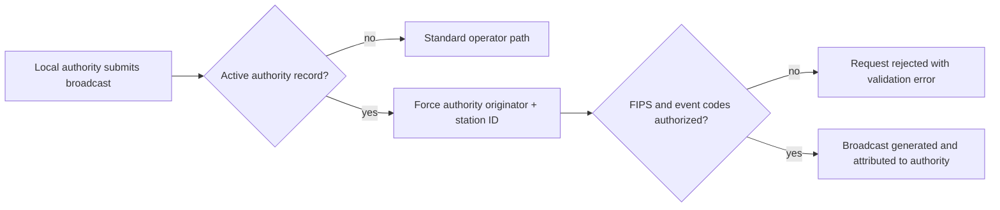

# Local Authority EAS Access

EAS Station™ lets a station administrator delegate limited EAS origination rights to trusted **local authorities** — for example a county sheriff's office or emergency management agency. A local authority gets its own login that can build and broadcast EAS messages through the Broadcast Builder, but only with its assigned station identifier and originator code, and only for the FIPS codes and event codes the administrator has authorized.

> **Important:** EAS Station™ is experimental software and is not FCC-certified equipment. Delegated origination must only be used in controlled, isolated testing environments.

---

## What a Local Authority Is

A local authority is a record (`local_authorities` table) tied 1:1 to a user account. It defines:

| Field | Description | Example |
|-------|-------------|---------|
| **User Account** | The login the authority uses (one authority per account) | `putnam-so` |
| **Authority Name** | Full organization name | `Putnam County Sheriff's Office` |
| **Short Name** | Optional abbreviation (up to 32 characters) | `Putnam Co SO` |
| **Station Identifier** | SAME station ID stamped into every header (1–8 characters; letters, digits, and `/` only; padded to 8) | `PUTNCOSO` |
| **Originator Code** | SAME originator: `EAS`, `CIV`, `WXR`, or `PEP` | `CIV` |
| **Authorized FIPS Codes** | The 6-digit SAME location codes the authority may target (empty = no restriction) | `039137` |
| **Authorized Event Codes** | The event codes the authority may issue (empty = all codes allowed) | `CEM, LAE, RWT` |
| **Active** | Whether the assignment is currently enabled | Yes |

When you register a local authority, the selected user account is automatically switched to the **`local_authority`** role if that role exists. The role grants alert viewing/creation, EAS viewing, broadcasting and manual activation, read-only configuration access, log viewing, receiver/GPIO viewing, and API read access — but no user management or system configuration rights.

---

## Managing Local Authorities

### Opening the Page

1. Navigate to the **Settings** hub (`/settings`) and click the **Local Authorities** card, or use the **Local Authorities** link in the Admin dashboard (`/admin`) navigation.
2. The management page lives at `/admin/local-authorities`.

All management routes require the `system.manage_users` permission (the **admin** role).

### Creating an Authority

1. Click **Register Authority** to expand the creation form.
2. Select the **User Account**. Only active accounts without an existing authority assignment are listed (create the account first under **Admin → Users**).
3. Enter the **Authority Name**, optional **Short Name**, **Station Identifier**, and **Originator Code**.
4. Enter the **Authorized FIPS Codes** and **Authorized Event Codes**. Codes may be separated by commas, semicolons, or whitespace; they are normalized to uppercase.
5. Submit. The authority is created active, and the action is recorded in the system log (`local_authority` module).

### Editing an Authority

Click **Edit** on an authority card to change any field, including the **Active** toggle. Deactivating an authority leaves the record in place but stops its restrictions/identity from being applied — use it to suspend access without deleting the assignment (also remove or downgrade the user account if you want to block login entirely).

### Removing an Authority

Click **Delete** to remove the assignment. This deletes only the authority record — the user account remains and keeps whatever role it currently has, so review the account afterwards. Removal is logged at WARNING level in the system log.

---

## How Restrictions Are Enforced

Enforcement happens server-side in the Broadcast Builder workflow (`/eas/`), not just in the UI. When a user with an **active** local authority assignment generates a broadcast:

1. **Originator and station ID are overridden.** Whatever the form submits, the server replaces the originator and station identifier with the authority's configured values, so every SAME header carries the authority's identity.
2. **FIPS codes are checked.** If the authority has authorized FIPS codes, every location code in the request must be in that list. Any unauthorized code rejects the whole request with a validation error naming the offending codes.
3. **Event codes are checked.** If the authority has authorized event codes, the requested event code must be in the list or the request is rejected. An empty list permits any event code.
4. **The broadcast is attributed.** The generated EAS message's metadata records the authority's ID, name, and station identifier, and an INFO entry is written to the application log.

The Broadcast Builder page also pre-fills the authority's originator for the user, but the override above is what guarantees compliance.



---

## API Reference

All endpoints require the `system.manage_users` permission and a logged-in session. JSON request/response bodies; state-changing requests need the standard CSRF header (`X-CSRF-Token`).

| Method | Route | Purpose |
|--------|-------|---------|
| `GET` | `/admin/local-authorities` | Management page (HTML) |
| `GET` | `/admin/local-authorities/list` | List all authorities (JSON) |
| `POST` | `/admin/local-authorities` | Create an authority |
| `GET` | `/admin/local-authorities/<id>` | Fetch one authority |
| `PATCH` | `/admin/local-authorities/<id>` | Update fields (partial) |
| `DELETE` | `/admin/local-authorities/<id>` | Remove an authority |
| `GET` | `/admin/local-authorities/available-users` | Active users without an assignment |

**Create payload example:**

```json
{
  "user_id": 7,
  "name": "Putnam County Sheriff's Office",
  "short_name": "Putnam Co SO",
  "station_id": "PUTNCOSO",
  "originator": "CIV",
  "authorized_fips_codes": "039137",
  "authorized_event_codes": ["CEM", "LAE", "RWT"]
}
```

Validation rules: a user account is required and may hold only one assignment; the station ID must match `[A-Z0-9/]{1,8}`; the originator must be one of `EAS`, `CIV`, `WXR`, `PEP`.

---

## Recommended Practice

- **Grant the narrowest possible scope.** List only the FIPS codes for the authority's jurisdiction and only the event codes it is permitted to issue (e.g. `CEM`, `LAE`). An empty event-code list means *all* codes are allowed — set it deliberately.
- **Use `CIV` for civil authorities.** Reserve `WXR` and `PEP` for their proper originators.
- **Review the system log.** Authority registration, updates, and removals are recorded in the system log under the `local_authority` module, and every authority broadcast is logged with the username, authority name, station ID, and originator.

---

## Related Guides

- [Manual EAS Events & Broadcast Builder](MANUAL_EAS_EVENTS.md) — the workflow local authorities use to issue alerts
- [Audit Log Review](AUDIT_LOG_REVIEW.md) — reviewing who did what
