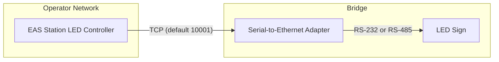
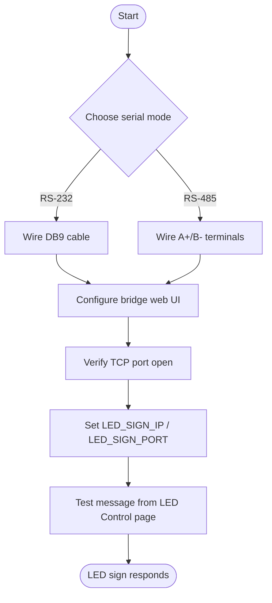

# Serial-to-Ethernet Bridge Setup Guide

This guide explains how to connect the EAS Station LED sign controller to either a Lantronix UDS/UDS-like adapter or the Linovision IOT-C101 serial-to-Ethernet bridge. Both devices expose an RS-232 or RS-485 serial port as a TCP socket that the LED controller uses to deliver the Alpha M-Protocol.

## How the Link Works

1. **EAS Station** opens a TCP socket to the bridge IP/port configured in `LED_SIGN_IP` / `LED_SIGN_PORT`.
2. **The bridge** forwards each byte to the serial port using the mode and baud rate set in its web console.
3. **The LED sign** receives the Alpha M-Protocol frames and renders the requested message.

> ℹ️ EAS Station only stores the serial parameters for documentation. Actual serial mode/baud must be programmed on the hardware bridge.

## Recommended Settings

| Setting | Lantronix UDS-10/1100 | Linovision IOT-C101 | Notes |
|---------|----------------------|---------------------|-------|
| TCP Role | **Server** | **Server** | Allows EAS Station to initiate connections |
| TCP Port | `10001` | `10001` | Match `LED_SIGN_PORT` (configurable) |
| Serial Interface | RS-232 or RS-485 | RS-232 or RS-485 | Match the sign wiring |
| Baud Rate | 9600 bps (typical) | 9600 bps (typical) | Adjust if your sign requires a different rate |
| Data Bits | 8 | 8 | Alpha protocol uses 8 data bits |
| Parity | None | None | Confirm with LED sign documentation |
| Stop Bits | 1 | 1 | Standard for Alpha protocol |
| Flow Control | Disabled | Disabled | Hardware flow control is optional |
| Idle Timeout | Disabled | Disabled | Prevents the bridge from closing idle sockets |

## Provisioning Checklist

### 1. Hardware Preparation

- Mount the bridge near the LED sign.
- Provide a stable DC power source within the supported voltage range (Lantronix: 9–30VDC, Linovision: 5–36VDC).
- Connect Ethernet to your operations LAN.

### 2. Serial Wiring

**RS-232:**
- Use the DB9 female-to-female cable from the bridge kit.
- Pin 2 (TX) on the bridge connects to the LED sign RX; pin 3 (RX) connects to TX.
- Pin 5 provides signal ground.

**RS-485 (2-wire):**
- Terminals labeled `A+` and `B-` connect to the LED sign differential pair.
- Ensure the pull-up/pull-down resistors on the bridge match your RS-485 bus requirements.

### 3. Configure the Bridge Web UI

1. Assign a static IP address or DHCP reservation so EAS Station can reliably reach the bridge.
2. Enable **TCP Server** mode and set the listening port (default `10001`).
3. Select the serial interface type (RS-232 or RS-485) that matches your wiring.
4. Set the baud rate, data bits, parity, and stop bits to the values required by your LED sign.
5. Disable idle timeouts or keepalive disconnects that would close long-lived idle sessions.

### 4. Update EAS Station

1. Edit your deployment environment file (`stack.env`, `stack.env.example`, or Docker secret) to set:
   - `LED_SIGN_IP` to the static address of the bridge.
   - `LED_SIGN_PORT` if you changed it from the default.
2. In the **Admin → LED Serial Config** page, select the serial mode and baud rate you configured on the bridge. This stores the settings for future operators.
3. Deploy or restart services so the new environment variables take effect.

### 5. Test the Link

- Navigate to **LED Control** in the web UI.
- Use **Send Feature Test** or **Send Default Message** to confirm the sign updates.
- If the sign does not respond, verify:
  - The bridge shows an active TCP session.
  - Serial LEDs on the bridge blink when sending data.
  - Network firewalls allow outbound TCP from EAS Station to the bridge port.
  - The LED sign cable pinout matches the configured serial mode.

## Troubleshooting Tips

- **Connection refused:** The bridge is not listening on the configured port, or TCP server mode is disabled.
- **Timeout/no response:** EAS Station cannot reach the bridge IP address—check routing, VLANs, or firewall rules.
- **Partial or garbled text:** Serial parameters (baud rate, parity, stop bits) do not match the LED sign requirements.
- **Frequent disconnects:** Disable idle timeout or enable TCP keepalive on the bridge.
- **RS-485 line noise:** Add termination resistors or ensure only one biasing source exists on the bus.

## Reference Links

- [Lantronix UDS Series Documentation](https://www.lantronix.com/products/uds1100/)
- [Linovision IOT-C101 Product Page](https://linovision.com/products/iot-c101)
- [Alpha M-Protocol Reference (adaptive micro systems)](https://bitsavers.org/pdf/adaptiveMicroSystems/Alpha)

With these settings aligned, either bridge operates as a transparent serial tunnel, and EAS Station can drive the LED sign without additional code changes.
