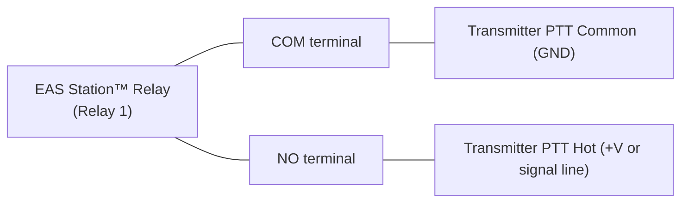

# GPIO Comprehensive Guide

## 1. Overview

EAS Station™ provides GPIO integration for relay control, visual indicators, and OLED status displays. The GPIO subsystem runs as its own subprocess — `python -m services.gpio` (systemd unit `eas-station-gpio.service`, health endpoint on port 5105) — so a stuck GPIO ioctl can never freeze OLED rendering, GPS sampling, or the web app. This guide covers relay wiring, the alert-lifecycle **behavior matrix**, the OLED status screen, configurable flash patterns for stack lights, and the event-driven tower-light / NeoPixel indicators.

**Supported GPIO configurations:**
- **Raspberry Pi** (all models with 40-pin header) — via `gpiochip0`
- **Raspberry Pi 5** — via the modern `lgpio` backend (imported lazily so it never deadlocks the web workers)
- **Raspberry Pi with relay HAT** — Waveshare, Sequent Microsystems, SB Components, and similar
- Systems with `libgpiod`-compatible GPIO chips
- **Non-Pi / container hosts** — automatically fall back to a sysfs backend, then a simulated null backend, so the app still boots and the UI shows configured pins

The software uses `gpiozero` (with optional `lgpio`) for GPIO access, which does not require root privileges when the `eas-station` user is added to the `gpio` group.

> **All hardware settings are configured in the web UI** at **Admin → Hardware Settings** and stored in the database. Environment variables / `.env` keys are **not** read for GPIO, relays, NeoPixel, or the tower light.

---

## 2. Relay Wiring

EAS Station™ uses GPIO-controlled relays to key transmitters, activate external equipment, and signal alert states. This section covers physical wiring, pin assignments, configuration, and safety procedures.

### Overview

The GPIO relay integration is driven by the alert pipeline (the broadcaster and the RWT scheduler) through a **behavior matrix**: you assign each pin one or more *lifecycle behaviors* (see [§5. GPIO Behaviors](#5-gpio-behaviors)) and the system keys those pins at the matching moment of an alert. When an EAS alert is broadcast, pins assigned a transmit-capable behavior close to key the transmitter, and optionally additional relays fire for auxiliary equipment, audio muting, or flashing beacons.

---

### Relay HAT Wiring

A relay HAT sits directly on the Raspberry Pi's 40-pin header. Each relay on the HAT is controlled by a specific BCM GPIO pin.

#### Common Relay HAT Pin Assignments

**Waveshare RPi Relay Board (3-channel):**

| Relay | BCM Pin | Physical Pin | Function |
|-------|---------|-------------|----------|
| Relay 1 | BCM 26 | Pin 37 | Transmit (TX) key |
| Relay 2 | BCM 20 | Pin 38 | Auxiliary 1 |
| Relay 3 | BCM 21 | Pin 40 | Auxiliary 2 |

**4-channel relay HAT (generic):**

| Relay | BCM Pin | Physical Pin | Common Use |
|-------|---------|-------------|------------|
| CH1 | BCM 5 | Pin 29 | TX key |
| CH2 | BCM 6 | Pin 31 | Aux power |
| CH3 | BCM 13 | Pin 33 | Alert lamp |
| CH4 | BCM 19 | Pin 35 | Spare |

!!! note "Check your specific HAT"
    Pin assignments vary between HAT manufacturers. Always consult your HAT's schematic or documentation. Some HATs are active-low (relay closes when GPIO is LOW); EAS Station™ supports configuring pin polarity.

---

### Transmitter Connection

The transmit relay provides a dry contact closure to key an external transmitter or control system.

#### PTT (Push-to-Talk) Wiring

A relay in the transmit path replaces or augments a PTT switch:



**Use NO (Normally Open):** The relay is open when idle and closes to transmit. This is the safe-fail state — if the relay loses power, the transmitter is not keyed.

#### Contact Ratings

Match the relay contact rating to your transmitter's PTT circuit requirements:

| Specification | Requirement |
|--------------|-------------|
| Contact voltage | Typically 3.3–12V for PTT |
| Contact current | Usually <10mA for PTT logic signals |
| Relay NO rating | Must exceed your application's voltage and current |

For standard ham radio PTT circuits, any relay rated for 10V/100mA is more than adequate.

---

### Reserved GPIO Pins

The following BCM pins are reserved by the Argon HAT OLED display and are rejected for relay use **only when the OLED is enabled** in Hardware Settings:

```python
ARGON_OLED_RESERVED_BCM = {2, 3, 14}   # I2C SDA (BCM2), SCL (BCM3), TXD (BCM14)
```

The hardware settings page lists reserved pins and the pin-config loader logs an error and drops any relay you assign to a reserved pin while OLED is on. When the OLED is disabled, these pins are available for relays like any other.

---

### Configuration

GPIO is configured entirely through the web UI and stored in the database. There is **no `.env` / environment-variable path** for hardware settings.

#### Via the Web Interface

1. Navigate to **Admin → Hardware Settings** and enable **GPIO Relay Control**.
2. Open **Admin → GPIO → Pin Map** (the interactive Raspberry Pi pin map).
3. For each relay, click its BCM pin and set its options. The **pin map** is stored as a JSON object keyed by **BCM pin number** (as a string), with a config object per pin:
   ```json
   {
     "26": {
       "name": "Transmitter PTT",
       "active_high": true,
       "hold_seconds": 5.0,
       "watchdog_seconds": 300.0
     },
     "20": { "name": "Program Audio Mute", "active_high": true },
     "13": { "name": "Alert Beacon", "active_high": true,
             "flash_enabled": true, "flash_interval_ms": 500, "flash_partner_pin": 19 }
   }
   ```
4. Assign each pin one or more **behaviors** in the **behavior matrix**. The matrix is a JSON object keyed by BCM pin number, mapping to a list of *lifecycle behaviors* (NOT alert severities):
   ```json
   {
     "26": ["transmitter_ptt"],
     "20": ["audio_mute"],
     "13": ["flash"]
   }
   ```
   See [§5. GPIO Behaviors](#5-gpio-behaviors) for the full list and what each one does.
5. Click **Save Settings**. The GPIO subprocess reloads its configuration; on a fresh deploy, restart it with `sudo systemctl restart eas-station-gpio`.

> **Startup validation.** When the behavior manager loads, it logs a warning if **no pin** is assigned a transmit-capable behavior (`Transmitter PTT`, `Duration of Alert`, or `Audio Playout`) — i.e. nothing would key your transmitter during a broadcast. It also warns about behaviors assigned to pins that aren't active, and flash partners that aren't themselves flashing. Check the `eas-station-gpio` journal after changing the matrix.

#### Field reference (per pin)

| Field | Type | Default | Description |
|-------|------|---------|-------------|
| `name` | string | `GPIO Pin N` | Friendly label shown in the UI and logs |
| `active_high` | bool | `true` | `true` = relay closes on HIGH; set `false` for active-low HATs |
| `hold_seconds` | float | `5.0` | Minimum time the pin stays active before it can be released (anti-chatter) |
| `watchdog_seconds` | float | `300.0` | Hard ceiling; the pin is force-released if it stays active longer (stuck-relay protection) |
| `flash_enabled` | bool | `false` | Flash this pin when activated directly (manual/test). During alerts, assign the **Flash Beacon** behavior instead |
| `flash_interval_ms` | int | `500` | Flash period, clamped to 50–5000 ms |
| `flash_partner_pin` | int | `null` | BCM pin driven in opposite phase for two-light alternating patterns |

---

### GPIO Activation Log

Every relay activation and deactivation is recorded in the `gpio_activation_log` database table. View the log at **Admin → Hardware → GPIO Statistics**.

The log includes:
- Timestamp
- Relay channel
- Duration (seconds the relay was active)
- Triggering event (alert ID or manual activation)

---

### Testing GPIO Relays

#### Via the Web Interface

1. Go to **Admin → Hardware Settings → GPIO Test**.
2. Click **Pulse Relay** next to each relay to test it independently.
3. You should hear the relay click and any connected equipment activate briefly.

#### Via the API

Pins are addressed by **BCM number**. Activate and then deactivate to pulse:

> **Note:** API-key authentication (`X-API-Key`) is **planned but not yet implemented** — see [API Key Management](../guides/API_KEY_MANAGEMENT.md). Until it ships, these endpoints require an authenticated browser session (log in first and reuse the session cookie).

```bash
# Activate BCM 26 (e.g. the transmit relay)
curl -X POST -H "X-API-Key: <key>" \
  https://your-eas-station.example.com/api/gpio/activate/26
sleep 1
# Release it
curl -X POST -H "X-API-Key: <key>" \
  https://your-eas-station.example.com/api/gpio/deactivate/26
```

Read current pin states (same shape the live dashboard consumes) with
`GET /api/gpio/status`.

#### Via Command Line

```bash
# Test GPIO directly with gpioset (no service needed)
gpioset gpiochip0 26=1   # Close relay
sleep 1
gpioset gpiochip0 26=0   # Open relay
```

---

### Safety Procedures

!!! danger "High-voltage relay contacts"
    If your relay board is wired to mains voltage (AC power) for any reason, follow electrical safety standards and ensure all high-voltage wiring is performed by a licensed electrician. EAS Station™ relays are intended for low-voltage PTT and control circuits only.

#### Before Making or Changing Wiring

1. **Power off** the Raspberry Pi and any connected transmitter before changing wiring.
2. **Discharge** any capacitors in the transmitter PTT circuit.
3. **Use appropriately rated wire** — 22 AWG or heavier for all relay connections.
4. **Insulate exposed terminals** — use heat shrink or terminal covers.

#### Fail-Safe Configuration

Configure all relays to use **Normally Open (NO)** contacts for the transmitter:
- Transmitter is **not keyed** when power is off or the GPIO service is stopped.
- Transmitter is **not keyed** if the GPIO subprocess crashes.
- Transmitter is **keyed only** when EAS Station™ explicitly activates the relay.

On shutdown the GPIO subprocess drives every pin LOW and releases it through three independent paths — the signal handler's `finally` block, an `atexit` backstop (covers non-signal exits), and the behavior manager's `shutdown()` (stops flashing and releases held relays) — so a clean stop never leaves the transmitter keyed.

#### Preventing Stuck Relays

Each pin has a **watchdog** (`watchdog_seconds`, default 300 s). If a pin stays active longer than its watchdog — e.g. a broadcast hangs — the controller force-releases it and marks its state `watchdog_timeout`. This is the last-resort safety net; configure per-pin watchdog and `hold_seconds` values in the pin map (see Configuration above).

---

### Permission Setup

The `eas-station` user needs access to `/dev/gpiochip0`:

```bash
# Add to gpio group
sudo usermod -a -G gpio eas-station

# Or create a udev rule (more reliable for non-Pi systems)
echo 'SUBSYSTEM=="gpio", GROUP="gpio", MODE="0660"' | \
  sudo tee /etc/udev/rules.d/99-gpio.rules
sudo udevadm control --reload-rules
```

Restart the hardware service after making permission changes:

```bash
sudo systemctl restart eas-station-gpio
```

---

### Relay Troubleshooting

#### "Permission denied" accessing GPIO

```bash
sudo usermod -a -G gpio eas-station
# Log out and back in, or restart the service
sudo systemctl restart eas-station-gpio
```

#### Relay activates but transmitter does not key

- Verify NO vs. NC contact selection at the relay terminal.
- Check with a multimeter: with the relay in its active state, the NO contact should measure continuity.
- Confirm the transmitter PTT circuit voltage/polarity.

#### Relay chatters (rapid clicking)

Usually caused by a loose connection or electrical noise on the GPIO line. Add a 0.1µF capacitor between the GPIO pin and GND at the relay driver input.

#### Hardware service crashes on GPIO access

- Confirm `libgpiod2` is installed: `sudo apt-get install libgpiod2`
- Verify the GPIO chip name: `gpiodetect`
- Check for pin conflicts with other software (e.g., WiringPi, pigpio).

#### GPIO Statistics page shows no activations

The `gpio_activation_log` table may not have been created yet. Run:

```bash
cd /opt/eas-station
source venv/bin/activate
alembic upgrade head
sudo systemctl restart eas-station-gpio
```

---

## 3. OLED Status Display

The EAS Station™ now includes a dedicated OLED screen that displays real-time GPIO status information. This screen provides at-a-glance monitoring of GPIO pin activations, making it easy to verify that GPIO relays are functioning correctly.

### Features

- **Real-Time Status**: Updates every 5 seconds with current GPIO state
- **Active Pin Summary**: Shows which GPIO pins are currently active
- **Recent Activity**: Displays the last GPIO activation with time elapsed
- **Daily Statistics**: Shows total activations for the current day
- **Automatic Rotation**: Cycles through other OLED screens when enabled

### Display Layout

#### Screen Elements

| Line | Content | Example | Description |
|------|---------|---------|-------------|
| 1 | Header | `GPIO STATUS` | Screen title with decorative borders |
| 2 | Active Pins | `Active Pins: 2` | Count of currently active GPIO pins |
| 3 | Pin List | `GPIO17, GPIO27` | Comma-separated list of active pins (up to 3 shown) |
| 4 | Last Activation | `Last: GPIO17 15s ago` | Most recent activation with time elapsed |
| 5 | Daily Count | `Today: 24 activations` | Total successful activations today |

### Configuration

The GPIO status screen is automatically created by the database migration `20260218_add_gpio_oled_and_flash.py`. It is configured with:

- **Display Type**: OLED
- **Priority**: 2 (Normal)
- **Refresh Interval**: 5 seconds
- **Display Duration**: 15 seconds
- **Enabled**: Yes (by default)

#### Screen Configuration

The screen uses the following template configuration:

```json
{
  "clear": true,
  "lines": [
    {
      "text": "◢ GPIO STATUS ◣",
      "font": "medium",
      "wrap": false,
      "invert": true,
      "spacing": 1,
      "y": 0
    },
    {
      "text": "Active Pins: {gpio.active_count}",
      "font": "small",
      "wrap": false,
      "y": 15,
      "max_width": 124
    },
    {
      "text": "{gpio.active_pins_summary}",
      "y": 27,
      "max_width": 124,
      "allow_empty": true
    },
    {
      "text": "Last: {gpio.last_activation_summary}",
      "y": 45,
      "wrap": false,
      "max_width": 124,
      "allow_empty": true
    },
    {
      "text": "Today: {gpio.activations_today} activations",
      "y": 56,
      "wrap": false,
      "max_width": 124
    }
  ]
}
```

#### Data Source

The screen fetches data from the `/api/gpio/status` endpoint, which provides:

```json
{
  "success": true,
  "pins": [...],
  "timestamp": "2026-02-18T12:34:56",
  "active_count": 2,
  "active_pins_summary": "GPIO17, GPIO27",
  "last_activation_summary": "GPIO17 15s ago",
  "activations_today": 24
}
```

### Use Cases

#### 1. Operation Verification

Quickly verify that GPIO pins are activating correctly:
- During system testing
- After configuration changes
- When troubleshooting alert forwarding

#### 2. Real-Time Monitoring

Monitor GPIO activity without accessing the web interface:
- At-a-glance status in equipment rooms
- During emergency situations
- For 24/7 operations centers

#### 3. Historical Tracking

Keep track of daily GPIO usage:
- Verify activation frequency
- Monitor system health
- Audit GPIO operations

### Display Behavior

#### Active Pin Summary

The active pins summary adapts based on how many pins are active:

| Active Pins | Display |
|-------------|---------|
| 0 | "No active pins" |
| 1-3 | "GPIO17, GPIO22, GPIO27" |
| 4+ | "GPIO17, GPIO22, GPIO27 +2 more" |

#### Time Formatting

Last activation time is formatted for readability:

| Elapsed Time | Display |
|--------------|---------|
| < 60 seconds | "15s ago" |
| < 60 minutes | "5m ago" |
| ≥ 60 minutes | "2h ago" |

#### No Recent Activity

When there are no recent activations:
- Last activation shows: "No recent activations"
- This indicates the system is idle

### Integration with Screen Rotation

The GPIO status screen is part of the OLED screen rotation system:

1. **Manual Navigation**: Use the OLED button to cycle through screens
2. **Automatic Rotation**: Screen appears every ~2-3 minutes in rotation
3. **Priority System**: Normal priority (2) means it rotates with other standard screens

To adjust rotation behavior:
1. Go to Admin > Hardware Settings > OLED Display
2. Configure screen rotation preferences
3. Enable/disable screens as needed

### Enabling/Disabling

#### Via Database

```sql
-- Disable the GPIO status screen
UPDATE display_screens 
SET enabled = false 
WHERE name = 'oled_gpio_status';

-- Re-enable
UPDATE display_screens 
SET enabled = true 
WHERE name = 'oled_gpio_status';
```

#### Via Web UI

1. Navigate to Admin > Hardware Settings > OLED Display
2. Go to Screen Management section
3. Find "oled_gpio_status" screen
4. Toggle enabled status
5. Save and restart services

### Customization

#### Adjusting Refresh Rate

To update more or less frequently:

```sql
UPDATE display_screens 
SET refresh_interval = 10  -- Update every 10 seconds
WHERE name = 'oled_gpio_status';
```

Valid range: 1-300 seconds

#### Adjusting Display Duration

To show for longer/shorter time in rotation:

```sql
UPDATE display_screens 
SET duration = 20  -- Show for 20 seconds
WHERE name = 'oled_gpio_status';
```

Valid range: 3-60 seconds

#### Changing Priority

To show more/less frequently:

```sql
UPDATE display_screens 
SET priority = 1  -- Higher priority (0=emergency, 1=high, 2=normal, 3=low)
WHERE name = 'oled_gpio_status';
```

### OLED Troubleshooting

#### Screen Not Showing

1. **Check if OLED is enabled**
   - Go to Admin > Hardware Settings
   - Verify "Enable OLED Display" is checked

2. **Verify screen is enabled**
   ```sql
   SELECT name, enabled 
   FROM display_screens 
   WHERE name = 'oled_gpio_status';
   ```

3. **Check screen rotation**
   - Ensure screen rotation is configured
   - Verify the screen is included in rotation

4. **Restart hardware service**
   ```bash
   sudo systemctl restart eas-station-gpio
   ```

#### Data Not Updating

1. **Check API endpoint**
   ```bash
   curl http://localhost:5000/api/gpio/status
   ```

2. **Verify GPIO controller is running**
   - Check if GPIO pins are configured
   - Ensure GPIO control is enabled in settings

3. **Check refresh interval**
   - May be set too long
   - Adjust if needed

#### Incorrect Data

1. **Check GPIO activation logs**
   - Verify database contains GPIO activation records
   - Check for timestamp issues

2. **Verify timezone settings**
   - Ensure system timezone is correct
   - Check database timezone configuration

### API Enhancements

The `/api/gpio/status` endpoint was enhanced to provide summary data for the OLED screen:

#### New Response Fields

```json
{
  "active_count": 2,
  "active_pins_summary": "GPIO17, GPIO27",
  "last_activation_summary": "GPIO17 15s ago",
  "activations_today": 24
}
```

These fields are automatically calculated:
- **active_count**: Number of currently active pins
- **active_pins_summary**: Formatted string of active pin names
- **last_activation_summary**: Most recent successful activation with elapsed time
- **activations_today**: Count of successful activations since midnight (UTC)

### Performance Considerations

- **Low Overhead**: Queries are optimized for minimal database load
- **Caching**: Consider enabling caching for high-traffic systems
- **Indexing**: Database indexes on `activated_at` improve query performance

---

## 4. Flash Patterns

The EAS Station™ GPIO controller supports configurable flash patterns for stack lights and visual indicators. This feature allows you to create attention-grabbing alternating flash patterns with two-phase operation.

### Features

- **Configurable Flash Rate**: Adjust flash interval from 50ms to 5000ms (20Hz to 0.2Hz)
- **Two-Phase Alternating**: Link two GPIO pins to create alternating on/off patterns
- **Independent Operation**: Each pin can flash independently or work with a partner
- **Thread-Safe**: Flash patterns run in dedicated threads with proper cleanup
- **Integrated Lifecycle**: Flash automatically starts/stops with pin activation/deactivation

### Configuration

Flash patterns are configured in the GPIO pin map stored in the database. Each pin can have the following flash-related settings:

```json
{
  "17": {
    "name": "Red Stack Light",
    "active_high": true,
    "hold_seconds": 5.0,
    "watchdog_seconds": 300.0,
    "flash_enabled": true,
    "flash_interval_ms": 500,
    "flash_partner_pin": 27
  },
  "27": {
    "name": "Amber Stack Light",
    "active_high": true,
    "hold_seconds": 5.0,
    "watchdog_seconds": 300.0,
    "flash_enabled": true,
    "flash_interval_ms": 500,
    "flash_partner_pin": 17
  }
}
```

#### Configuration Parameters

| Parameter | Type | Default | Description |
|-----------|------|---------|-------------|
| `flash_enabled` | boolean | `false` | Enable flash pattern for this pin |
| `flash_interval_ms` | integer | `500` | Flash interval in milliseconds (50-5000ms) |
| `flash_partner_pin` | integer | `null` | BCM GPIO pin number of partner pin for alternating pattern |

### Use Cases

#### 1. Single Flashing Light

For a single flashing indicator (e.g., alert beacon):

```json
{
  "17": {
    "name": "Alert Beacon",
    "flash_enabled": true,
    "flash_interval_ms": 1000
  }
}
```

This creates a 1Hz (1 second on, 1 second off) flashing pattern.

#### 2. Alternating Stack Lights

For two-phase alternating lights (common in emergency equipment):

```json
{
  "17": {
    "name": "Red Light",
    "flash_enabled": true,
    "flash_interval_ms": 500,
    "flash_partner_pin": 27
  },
  "27": {
    "name": "Amber Light",
    "flash_enabled": true,
    "flash_interval_ms": 500,
    "flash_partner_pin": 17
  }
}
```

This creates a 2Hz alternating pattern where one light is on while the other is off.

#### 3. Rapid Attention Flash

For critical alerts requiring immediate attention:

```json
{
  "17": {
    "name": "Critical Alert",
    "flash_enabled": true,
    "flash_interval_ms": 100
  }
}
```

This creates a rapid 10Hz flash pattern.

### How It Works

#### Activation
1. When a GPIO pin with `flash_enabled: true` is activated
2. The controller starts a dedicated flash thread for that pin
3. The thread alternates the pin state at the configured interval
4. If a partner pin is configured, it operates in opposite phase

#### Pattern Logic
```
Phase 0: Pin A = ON,  Pin B = OFF
  [wait flash_interval_ms]
Phase 1: Pin A = OFF, Pin B = ON
  [wait flash_interval_ms]
Phase 0: Pin A = ON,  Pin B = OFF
  [repeat...]
```

#### Deactivation
1. When the pin is deactivated, the flash thread receives a stop signal
2. The thread cleanly exits and restores the pin to its proper state
3. If the pin is still marked as "active", it's set to solid ON
4. Otherwise, it's set to OFF

### Logging

Flash pattern operations are logged for diagnostics:

```
INFO: Started flash pattern on GPIO pin 17 (interval=500ms with partner GPIO27)
INFO: Stopped flash pattern on GPIO pin 17
```

Any errors in the flash pattern thread are also logged:
```
ERROR: Error in flash pattern for pin 17: [error details]
ERROR: Flash pattern thread crashed for pin 17: [error details]
```

### Best Practices

1. **Choose Appropriate Intervals**
   - Slow (1000-2000ms): General awareness, non-urgent alerts
   - Medium (500ms): Standard attention-getting, most stack lights
   - Fast (100-200ms): Critical situations, immediate attention required

2. **Partner Pin Selection**
   - Ensure partner pins are properly configured
   - Both pins should have matching flash intervals
   - Test the alternating pattern to ensure correct phasing

3. **Hardware Considerations**
   - Verify your relay/driver can handle the switching frequency
   - Some mechanical relays may have limited switching life at high frequencies
   - Consider solid-state relays for high-frequency applications

4. **Power Management**
   - Flashing reduces average power consumption by ~50% compared to solid on
   - Useful for battery-powered installations
   - Consider duty cycle for heat-sensitive equipment

### API Integration

Flash patterns are automatically handled by the GPIO controller. No special API calls are needed:

```python
# Standard activation - flash starts automatically if configured
controller.activate(
    pin=17,
    activation_type=GPIOActivationType.AUTOMATIC,
    reason="Tornado Warning"
)

# Standard deactivation - flash stops automatically
controller.deactivate(pin=17)
```

### Flash Pattern Troubleshooting

#### Flash Not Working

1. **Check Configuration**
   - Verify `flash_enabled: true` in pin configuration
   - Ensure `flash_interval_ms` is within valid range (50-5000)

2. **Check Logs**
   - Look for "Started flash pattern" messages
   - Check for error messages in flash thread

3. **Verify GPIO Hardware**
   - Ensure basic GPIO operations work
   - Test pin without flash first

#### Partner Pin Not Alternating

1. **Check Partner Configuration**
   - Both pins must reference each other as partners
   - Both pins must have matching flash intervals
   - Both pins must be activated

2. **Check Phasing**
   - Patterns are synchronized at activation time
   - If timing seems off, deactivate and reactivate both pins

### Examples

#### Emergency Alert System Stack Light
```json
{
  "17": {
    "name": "EAS Red Light",
    "active_high": true,
    "flash_enabled": true,
    "flash_interval_ms": 500,
    "flash_partner_pin": 27
  },
  "27": {
    "name": "EAS Amber Light",
    "active_high": true,
    "flash_enabled": true,
    "flash_interval_ms": 500,
    "flash_partner_pin": 17
  }
}
```

#### Warning Beacon
```json
{
  "22": {
    "name": "Warning Beacon",
    "active_high": true,
    "flash_enabled": true,
    "flash_interval_ms": 1000
  }
}
```

#### Multi-Level Alert System
```json
{
  "17": {
    "name": "Level 1 - Advisory",
    "active_high": true,
    "flash_enabled": true,
    "flash_interval_ms": 2000
  },
  "27": {
    "name": "Level 2 - Warning",
    "active_high": true,
    "flash_enabled": true,
    "flash_interval_ms": 500
  },
  "22": {
    "name": "Level 3 - Emergency",
    "active_high": true,
    "flash_enabled": true,
    "flash_interval_ms": 100
  }
}
```

### Technical Details

#### Thread Safety
- Flash threads use threading locks for state access
- Stop events ensure clean shutdown
- Thread cleanup with timeout prevents hanging

#### Performance
- Minimal CPU usage (threads sleep between toggles)
- No impact on other GPIO operations
- Efficient event-driven design

#### Compatibility
- Works with both gpiozero and lgpio backends
- Compatible with mock factory for testing
- No changes needed to existing GPIO code

---

## 5. GPIO Behaviors

A **behavior** ties a GPIO pin to a moment in the alert lifecycle. You assign behaviors per pin in the behavior matrix (Admin → GPIO → Pin Map). A pin may have several behaviors; the controller fires it whenever any assigned behavior is triggered.

| Behavior (matrix value) | Label | When it fires | Hold / pulse |
|-------------------------|-------|---------------|--------------|
| `transmitter_ptt` | Transmitter PTT | The whole broadcast | **Held** for the full alert — assign this to the relay that keys your transmitter |
| `audio_mute` | Audio Mute | The whole broadcast | **Held** — mutes/ducks station program audio (or switches the audio source) while the EAS alert is on air |
| `duration_of_alert` | Duration of Alert | The whole broadcast | **Held** until playout finishes |
| `playout` | Audio Playout | While tones + audio play | **Held** for the playout window |
| `forwarding_alert` | Forwarding Alert | A *forwarded* alert (relayed from a monitoring input) | Pulses ~5 s normally; **held for the full duration** when the alert is forwarded |
| `incoming_alert` | Incoming Alert | An alert is received, before broadcast | Pulses ~3 s |
| `five_seconds` | 5 Second Pulse | Playout begins | Pulses 5 s |
| `flash` | Flash Beacon | The whole broadcast | **Flashes** the pin (and its partner in opposite phase) until the alert ends |

### Transmitter keying (PTT)

To key a transmitter automatically you **must** assign a transmit-capable behavior — `transmitter_ptt` (recommended, purpose-built), or `duration_of_alert` / `playout` — to the relay pin. If no pin carries any of these, the behavior manager logs a startup warning and **the transmitter will not be keyed**. `transmitter_ptt` and `audio_mute` are held for the full broadcast and released (with their `hold_seconds` respected) when playout finishes.

### Audio muting

`audio_mute` is held for the broadcast window, so wire the relay to mute/duck your station's normal program audio (or switch the program feed to the EAS source) while the alert plays, then it releases automatically.

### Flash behavior is the single flash engine

There are two ways a pin can flash, and they no longer fight each other:

- **`flash_enabled` in the pin config** flashes a pin when it is activated *directly* (manual activation, the test API, `activate_all` without a behavior matrix).
- **The `flash` behavior** flashes a pin *during an alert*. It delegates to the same controller flash engine, so exactly one flash thread runs per pin and the configured `flash_partner_pin` is driven in opposite phase.

**Precedence:** if a pin is assigned **both** `flash` and a hold behavior (e.g. `duration_of_alert`), `flash` wins — the pin flashes and is never also driven solid. Held relays are always driven solid even if their config happens to set `flash_enabled`.

---

## 6. Tower Light & NeoPixel Indicators

In addition to GPIO relays, two self-contained visual indicators follow the alert lifecycle. Both are configured under **Admin → Hardware Settings** and run inside the same `eas-station-gpio` subprocess, but are **independent of the relay/behavior matrix** — they have their own state machines.

### USB Tower Light (Adafruit #5125 / ANDONT 7-color)

A USB-serial stack light driven over `/dev/ttyUSB*` (9600 baud by default). Two device protocols are supported, selected under **Admin → Hardware Settings → Tower Light → Device Protocol**:

* **Adafruit #5125** — CH34x tri-color light with three independently switchable segments (red / yellow / green) plus a buzzer, controlled by single-byte commands. State colors are limited to red/yellow/green; anything else falls back to that state's default.
* **ANDONT 7-color USB** — shows **one color at a time** from off / green / blue / red / cyan / yellow / magenta / white. Every state change is a complete `FF <color> <buzzer> <flash> AA` frame (e.g. `FF 02 01 01 AA` = green, buzzer on, steady).

Both follow the same three-state machine, with each state's color configurable (defaults shown):

```
idle (standby color: green) → incoming alert (incoming color: yellow) → active broadcast (alert color: red) → idle
```

For example, set Active Alert to **blue** on an ANDONT light for green-when-ready / blue-when-alerting operation.

Options: `alert_buzzer` (sound buzzer during active alert), `incoming_uses_yellow` (show the incoming pre-alert state), `blink_on_alert` (hardware blink/flash mode vs. solid), plus the three state colors.

### NeoPixel / WS2812B strip

An addressable LED strip on a PWM-capable pin (BCM 18 recommended). Shows a dim **standby color** when idle and the **alert color** (red, flashing by default) during an active broadcast. Configure pin, pixel count, brightness, byte order, colors, and flash. Falls back to a silent null mode when `rpi_ws281x` or DMA access is unavailable, so the rest of the system still runs.

### Event-driven (no polling lag)

The indicators react to two Redis keys, `eas:broadcast_active` and `eas:incoming_alert`, written by the broadcast pipeline. The GPIO subprocess updates the lights two ways at once:

1. **Pub/sub listener** — the pipeline publishes a nudge on the `eas:indicator_events` channel whenever state changes, and a listener thread refreshes the indicators immediately (sub-second).
2. **1-second safety-net poll** — re-reads the keys every second in case a notification is ever missed (e.g. a Redis reconnect).

Both paths drive the same thread-safe monitor, so a single state change is applied exactly once. Previously the lights only updated on the 1-second poll, so they could lag the audio by up to a second at the start and end of an alert.

---

## 7. Resending a Stored Alert

**Admin → EAS Messages → Resend** replays a previously generated alert's stored audio and keys GPIO exactly as a fresh alert would: it loads the same database-backed pin map and behavior matrix, triggers the incoming-alert behavior, holds the playout/transmitter/mute behaviors for the audio duration, then releases them. The original message record is not modified — a `SystemLog` entry records the resend.
