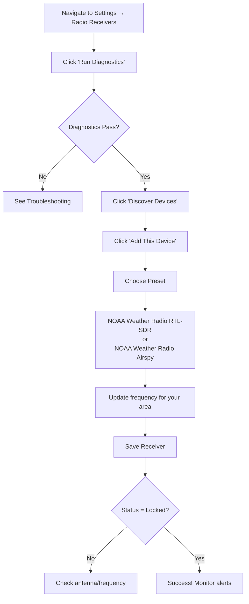

# SDR Setup Guide

**Complete guide for setting up Software Defined Radio (SDR) receivers with EAS Station**

## Quick Navigation

- [5-Minute Quick Start](#quick-start) - Get running fast with Docker
- [Hardware Guide](#hardware-requirements) - Choosing the right SDR
- [Setup Flowchart](#visual-setup-guide) - Visual overview
- [Web UI Setup](#web-ui-configuration) - Easiest configuration method
- [Troubleshooting](#troubleshooting) - Fix common issues

---

## Visual Setup Guide

For a complete visual overview of the SDR setup process:


**[View full-size diagram](../assets/diagrams/sdr-setup-flow.svg)**

---

## Quick Start

**For Docker users - 5 minutes to working SDR**

### What's Included

SoapySDR, RTL-SDR, and Airspy drivers are **pre-installed** in the Docker image:

- ✅ SoapySDR core libraries
- ✅ RTL-SDR drivers (default)
- ✅ Airspy drivers (default)
- ✅ USB device passthrough (pre-configured)
- ✅ No .env configuration needed

### Setup Steps

1. **Plug in your SDR device**
   ```bash
   # Verify device is detected on host
   lsusb | grep -i rtl  # For RTL-SDR
   lsusb | grep -i airspy  # For Airspy
   ```

2. **Start the containers**
   ```bash
   sudo docker compose up -d
   ```

3. **Verify SDR detection**
   ```bash
   # Check SoapySDR can see the device
   sudo docker compose exec app SoapySDRUtil --find

   # Run diagnostic script
   sudo docker compose exec app python scripts/sdr_diagnostics.py
   ```

4. **Configure in Web UI**
   - Open http://localhost (or your server IP)
   - Navigate to **Settings → Radio Receivers**
   - Click **Discover Devices**
   - Click **Add This Device** on your SDR
   - Apply a preset (NOAA Weather Radio recommended)
   - Save and enable

**Done!** Your SDR should now show "Locked" status.

> **Non-root users**: Add yourself to the `docker` group to avoid `sudo`: `sudo usermod -aG docker $USER` (log out and back in)

---

## Hardware Requirements

### Supported SDR Devices

| Device | Frequency Range | Sample Rate | Cost | Best For |
|--------|----------------|-------------|------|----------|
| **RTL-SDR V3** | 24 MHz - 1.7 GHz | Up to 2.4 MSPS | $20-40 | NOAA Weather Radio, budget builds |
| **Airspy Mini** | 24 MHz - 1.7 GHz | Up to 6 MSPS | $100+ | Better sensitivity, professional use |
| **Airspy R2** | 24 MHz - 1.7 GHz | Up to 10 MSPS | $200+ | Maximum performance |

**Recommended starter**: RTL-SDR Blog V3 ($30) with bias-tee for powered antennas

### Antenna Requirements

**For NOAA Weather Radio (162 MHz):**

| Type | Performance | Cost | Notes |
|------|------------|------|-------|
| **Telescoping whip** | Good for testing | $5-10 | Included with most RTL-SDR kits |
| **1/4 wave ground plane** | Excellent | $20-40 | ~19 inches, outdoor mount |
| **Commercial scanner** | Excellent | $30-80 | VHF optimized, weather-resistant |

**Signal improvement tips:**
- Place antenna near window or outdoors
- Higher is better (roof/attic mounting)
- Keep away from computers and USB hubs (RF interference)
- Use quality coaxial cable (low-loss RG-6 or LMR-400)

---

## Software Installation

### Docker Deployment (Recommended)

**No installation needed!** SoapySDR and all drivers are built into the Docker image.

The image includes:
- SoapySDR core libraries and Python bindings
- RTL-SDR and Airspy drivers (via `SOAPYSDR_DRIVERS` build arg)
- USB device support (`libusb`)
- NumPy for signal processing

USB device access is pre-configured in `docker-compose.yml`:
```yaml
devices:
  - /dev/bus/usb:/dev/bus/usb
privileged: true
```

**Optional: Customize driver installation**

To reduce build time, install only the drivers you need in `.env`:
```env
# Only RTL-SDR (faster builds)
SOAPYSDR_DRIVERS=rtlsdr

# Both RTL-SDR and Airspy (default)
SOAPYSDR_DRIVERS=rtlsdr,airspy
```

### Host Installation (Without Docker)

If running EAS Station directly on the host:

```bash
# Ubuntu/Debian
sudo apt update
sudo apt install python3-soapysdr soapysdr-module-rtlsdr soapysdr-module-airspy python3-numpy

# Verify installation
SoapySDRUtil --info
SoapySDRUtil --find
```

---

## Docker USB Passthrough

### Verify USB Access

```bash
# 1. Check if SDR is detected on host
lsusb | grep -i rtl  # Or grep -i airspy

# Expected output:
# Bus 001 Device 005: ID 0bda:2838 Realtek Semiconductor Corp. RTL2838 DVB-T

# 2. Verify container can access USB devices
sudo docker compose exec app ls -la /dev/bus/usb

# 3. Test SoapySDR inside container
sudo docker compose exec app SoapySDRUtil --find
```

### Troubleshooting USB Issues

**Problem: No devices found**

1. **Kernel driver conflict (RTL-SDR only)**

   The DVB-T TV tuner driver blocks RTL-SDR access:
   ```bash
   # On host, create /etc/modprobe.d/blacklist-rtl.conf:
   sudo tee /etc/modprobe.d/blacklist-rtl.conf <<EOF
   blacklist dvb_usb_rtl28xxu
   blacklist rtl2832
   blacklist rtl2830
   EOF

   # Unload the module
   sudo modprobe -r dvb_usb_rtl28xxu

   # Reboot to make permanent
   sudo reboot
   ```

2. **Container needs restart**
   ```bash
   sudo docker compose restart
   ```

3. **USB device path changed**

   Using `/dev/bus/usb:/dev/bus/usb` (already configured) handles this automatically.

---

## Web UI Configuration

**Easiest way to configure SDRs**

### Step-by-Step Setup



### 1. Access Radio Settings

1. Log into EAS Station web interface
2. Navigate to **Settings → Radio Receivers**

### 2. Run Diagnostics

1. Click **Run Diagnostics** button
2. Verify all checks pass:
   - ✓ SoapySDR is installed
   - ✓ NumPy is installed
   - ✓ RTL-SDR or Airspy driver available
   - ✓ At least 1 device detected

If diagnostics fail → [Troubleshooting](#troubleshooting)

### 3. Discover and Add Device

1. Click **Discover Devices**
2. Review detected SDRs
3. Click **Add This Device** on your SDR
4. Form pre-fills with device info

### 4. Apply Preset (Recommended)

1. Click **Use Preset**
2. Choose:
   - **NOAA Weather Radio (RTL-SDR)** - For RTL-SDR dongles
   - **NOAA Weather Radio (Airspy)** - For Airspy receivers
3. Click **Use This Preset**

### 5. Set Your Local Frequency

Find your nearest NOAA Weather Radio station: https://www.weather.gov/nwr/station_listing

**NOAA Frequencies:**
| Channel | Frequency |
|---------|-----------|
| WX1 | 162.400 MHz |
| WX2 | 162.425 MHz |
| WX3 | 162.450 MHz |
| WX4 | 162.475 MHz |
| WX5 | 162.500 MHz |
| WX6 | 162.525 MHz |
| WX7 | 162.550 MHz |

**Convert to Hz**: Multiply MHz × 1,000,000
Example: 162.550 MHz = 162550000 Hz

### 6. Enable and Monitor

1. Check **Enabled** and **Auto-start**
2. Click **Save Receiver**
3. Wait for **Locked** status (green badge)
4. Check signal strength (should be > 0.1 dBFS for good reception)

---

## Manual Configuration

### Configuration Fields

| Field | RTL-SDR Example | Airspy Example | Description |
|-------|----------------|----------------|-------------|
| **Display Name** | `Main NOAA Receiver` | `Backup NOAA` | Friendly name |
| **Identifier** | `rtlsdr_main` | `airspy_backup` | Unique ID (no spaces) |
| **Driver** | `rtlsdr` | `airspy` | SoapySDR driver name |
| **Frequency (Hz)** | `162550000` | `162550000` | 162.55 MHz |
| **Sample Rate** | `2400000` | `2500000` | 2.4/2.5 MSPS |
| **Gain (dB)** | `49.6` | `21` | See gain guide below |
| **Channel** | `0` or empty | `0` or empty | Multi-channel SDRs only |
| **Enabled** | ✓ | ✓ | Start on boot |
| **Auto-start** | ✓ | ✓ | Restart if crashes |

### Gain Settings Guide

**RTL-SDR:**
- Range: 0-50 dB
- **Start with**: 49.6 dB (maximum sensitivity)
- Adjust down if signal is too strong (> 1.0 dBFS)

**Airspy:**
- Range: 0-21 dB (linearity mode) or 0-15 dB (sensitivity mode)
- **Start with**: 21 dB
- Airspy has automatic gain control (AGC) option

**Too much gain** = Overload, distortion
**Too little gain** = Weak signal, poor decoding

---

## Testing and Verification

### Using Diagnostic Tools

```bash
# Full diagnostic check
sudo docker compose exec app python scripts/sdr_diagnostics.py

# Enumerate all devices
sudo docker compose exec app python scripts/sdr_diagnostics.py --enumerate

# Check driver capabilities
sudo docker compose exec app python scripts/sdr_diagnostics.py --capabilities rtlsdr

# Test sample capture (5 seconds at 162.55 MHz)
sudo docker compose exec app python scripts/sdr_diagnostics.py \
  --test-capture --driver rtlsdr --frequency 162550000 --duration 5

# Show available presets
sudo docker compose exec app python scripts/sdr_diagnostics.py --presets
```

### Web UI Status Check

1. Navigate to **Settings → Radio Receivers**
2. Check **Receiver Status** panel:
   - **Locked count** > 0
   - Green "Locked" badges in receiver table
   - Signal strength displayed (dBFS)

### Expected Signal Levels

| Signal Strength | Status | Notes |
|----------------|--------|-------|
| **0.1 - 1.0 dBFS** | Excellent | Strong, clear lock |
| **0.01 - 0.1 dBFS** | Fair | Works but may have dropouts |
| **< 0.01 dBFS** | Poor | Unlikely to decode properly |
| **> 1.0 dBFS** | Overload | Reduce gain to prevent distortion |

---

## Troubleshooting

### "No SDR Devices Found"

**Possible causes and solutions:**

1. **SDR not plugged in**
   - Check USB connection
   - Try different USB port (USB 2.0 often better than USB 3.0)
   - Verify with `lsusb` on host

2. **Kernel driver conflict (RTL-SDR)**
   - See [Docker USB Passthrough](#docker-usb-passthrough) section
   - Blacklist DVB-T drivers

3. **Container needs rebuild**
   ```bash
   sudo docker compose build app
   sudo docker compose up -d
   ```

4. **Restart containers after plugging in device**
   ```bash
   sudo docker compose restart
   ```

### "Receiver shows 'No lock' status"

1. **Wrong frequency**
   - Verify correct NOAA station: https://www.weather.gov/nwr/station_listing
   - Double-check frequency entered in Hz (not MHz)

2. **Weak signal**
   - Improve antenna (see [Hardware Requirements](#hardware-requirements))
   - Move antenna to window or outdoors
   - Increase gain (but watch for overload)

3. **No antenna connected**
   - Ensure antenna is firmly attached to SMA connector

4. **Interference**
   - Move SDR away from computers, power supplies
   - Use shielded USB cable
   - Try powered USB hub for better power delivery

### "Signal strength is 0 or very low"

1. **Check antenna connection** - Firm SMA connection
2. **Verify frequency** - Matches local NOAA station
3. **Increase gain** - Try 49.6 dB for RTL-SDR, 21 dB for Airspy
4. **Test with FM radio** - Tune to 88-108 MHz to verify hardware works

### "SoapySDR not installed" (Shouldn't happen with Docker)

**For Docker:**
```bash
# Rebuild image
sudo docker compose build app
sudo docker compose up -d
```

**For host installation:**
```bash
sudo apt install python3-soapysdr soapysdr-module-rtlsdr python3-numpy
```

### "Permission denied" errors

**Already configured** in docker-compose.yml:
```yaml
devices:
  - /dev/bus/usb:/dev/bus/usb
cap_add:
  - SYS_RAWIO
```

If still having issues, add user to plugdev group:
```bash
sudo usermod -aG plugdev $USER
# Log out and back in
```

---

## Advanced Topics

### Multiple SDR Receivers

Run multiple SDRs simultaneously:

**Use cases:**
- Monitor multiple NOAA frequencies
- Redundancy (backup receivers)
- Different signal types (weather + FM broadcast)

**Configuration:**
1. All SDRs will appear in **Discover Devices**
2. Add each with unique names
3. Configure different frequencies
4. Each runs independently

**Example setup:**
- Receiver 1: `rtlsdr_wx` → 162.550 MHz (NOAA)
- Receiver 2: `rtlsdr_fm` → 95500000 Hz (FM broadcast)
- Receiver 3: `airspy_backup` → 162.550 MHz (backup)

### Capture Modes

Configure in `.env`:

```bash
# IQ mode: Complex 32-bit I/Q samples (for offline analysis)
RADIO_CAPTURE_MODE=iq

# PCM mode: Float32 interleaved I/Q (for direct audio decoders)
RADIO_CAPTURE_MODE=pcm
```

### Capture Duration

```bash
# Capture 30 seconds when SAME burst detected
RADIO_CAPTURE_DURATION=30
```

### Signal Analysis Tools

Analyze captured IQ files with:
- **GNU Radio** - Signal processing and demodulation
- **inspectrum** - Visual spectrum analyzer
- **Custom Python** - NumPy/SciPy analysis

### Performance Optimization

1. **Use USB 3.0 ports** for higher sample rates
2. **Avoid USB hubs** - Direct motherboard connection
3. **Monitor CPU usage** - High sample rates increase CPU load
4. **Check for USB dropouts**:
   ```bash
   dmesg | grep -i usb
   ```

### Security Considerations

**For dedicated SDR stations:**
- `/dev/bus/usb:/dev/bus/usb` passthrough is safe
- No other sensitive USB devices connected

**For shared systems:**
- Consider specific device passthrough
- Use udev rules to restrict by vendor/product ID

---

## Getting Help

If you're still having issues:

1. **Check logs**: `sudo docker compose logs app`
2. **Run diagnostics**: Web UI or `python scripts/sdr_diagnostics.py`
3. **GitHub Issues**: https://github.com/KR8MER/eas-station/issues

**When reporting issues, include:**
- SDR model and driver (RTL-SDR, Airspy, etc.)
- Output of `lsusb` on host
- Output of `SoapySDRUtil --find` in container
- Diagnostic script output
- Relevant log excerpts

---

## Additional Resources

- **SoapySDR Documentation**: https://github.com/pothosware/SoapySDR/wiki
- **RTL-SDR Guide**: https://www.rtl-sdr.com/about-rtl-sdr/
- **Airspy Documentation**: https://airspy.com/
- **NOAA Weather Radio**: https://www.weather.gov/nwr/
- **EAS/SAME Protocol**: https://en.wikipedia.org/wiki/Specific_Area_Message_Encoding

---

**Last Updated**: 2025-11-25
**Tested With**: Docker 24+, RTL-SDR V3, Airspy Mini
