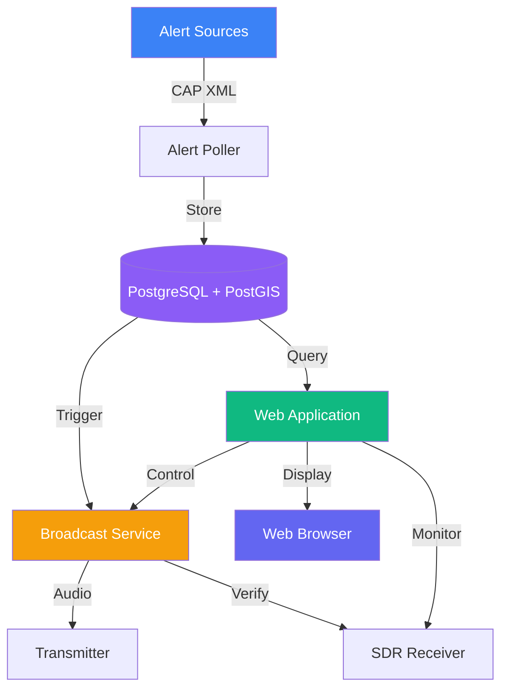

# Welcome to EAS Station

<div align="center">
  
</div>

!!! warning "Experimental Software"
    **EAS Station is experimental software for laboratory use only.** It is not FCC-certified and is not intended for production emergency alerting. Always use in controlled test environments.

## What is EAS Station?

EAS Station is a **software-defined Emergency Alert System (EAS)** platform designed as a drop-in replacement for commercial EAS encoder/decoder hardware. Built on commodity hardware like Raspberry Pi, it provides comprehensive alert monitoring, broadcasting, and verification capabilities for:

- 🚨 **Emergency Alert Monitoring** - NOAA Weather and IPAWS federal alerts
- 📡 **FCC-Compliant Encoding** - SAME (Specific Area Message Encoding) generation
- 🗺️ **Geographic Intelligence** - PostGIS-powered spatial filtering
- 📻 **SDR Verification** - Automated broadcast verification
- 🖥️ **Web Administration** - Modern, responsive interface
- 💡 **Hardware Integration** - GPIO relays, LED signs, audio routing

## Who Uses EAS Station?

<div class="grid cards" markdown>

-   :fontawesome-solid-tower-broadcast:{ .lg .middle } __Broadcasters__

    ---

    Radio and TV stations seeking cost-effective EAS solutions

-   :fontawesome-solid-satellite-dish:{ .lg .middle } __Amateur Radio Operators__

    ---

    Hams experimenting with emergency communications

-   :fontawesome-solid-building-shield:{ .lg .middle } __Emergency Management__

    ---

    Public safety organizations building alert systems

-   :fontawesome-solid-code:{ .lg .middle } __Developers__

    ---

    Building and extending emergency alert applications

</div>

## Key Features

### Multi-Source Alert Aggregation
Ingest alerts from multiple sources:

- ✅ NOAA National Weather Service (all 50 states)
- ✅ IPAWS (Integrated Public Alert & Warning System)
- ✅ Custom CAP feeds
- ✅ Configurable polling intervals
- ✅ Automatic deduplication

### Geographic Filtering
PostGIS spatial intelligence for precise targeting:

- 🗺️ County, state, and custom polygon filtering
- 📍 SAME code geographic validation
- 🌐 Interactive alert mapping with Leaflet
- 📊 Coverage area visualization

### Broadcast & Encoding
FCC Part 11 compliant SAME encoding:

- 🔊 Attention tone generation
- 📻 SAME header/trailer encoding
- 🎙️ Text-to-speech message synthesis
- ⚡ GPIO transmitter keying
- 📡 Multiple audio output routing

### Verification & Monitoring
Automated quality assurance:

- 📻 RTL-SDR and Airspy receiver support
- ✅ Transmission verification
- 📊 Audio confidence scoring
- 📈 System health monitoring

### Modern Web Interface
Responsive, accessible administration:

- 📱 Mobile-first responsive design
- 🌙 Light/dark mode support
- 📊 Real-time statistics with Highcharts
- 🗺️ Interactive alert maps
- ⚡ Live alert updates

## Quick Links

<div class="grid cards" markdown>

-   :material-clock-fast:{ .lg .middle } __Getting Started__

    ---

    Get up and running in 5 minutes

    [:octicons-arrow-right-24: Quick Start](getting-started/quick-start.md)

-   :material-book-open-variant:{ .lg .middle } __User Guide__

    ---

    Learn to operate EAS Station

    [:octicons-arrow-right-24: User Guide](user-guide/index.md)

-   :material-cog:{ .lg .middle } __Admin Guide__

    ---

    Deploy and maintain your system

    [:octicons-arrow-right-24: Admin Guide](admin-guide/index.md)

-   :material-code-braces:{ .lg .middle } __Developer Guide__

    ---

    Contribute and extend EAS Station

    [:octicons-arrow-right-24: Developer Guide](developer-guide/index.md)

-   :material-palette:{ .lg .middle } __Frontend Docs__

    ---

    UI components and theming

    [:octicons-arrow-right-24: Frontend](frontend/index.md)

-   :material-api:{ .lg .middle } __API Reference__

    ---

    REST API documentation

    [:octicons-arrow-right-24: API Docs](api/index.md)

</div>

## System Requirements

### Minimum Requirements

| Component | Requirement |
|-----------|-------------|
| **Docker** | 24.0+ with Compose V2 |
| **Database** | PostgreSQL 14+ with PostGIS 3+ |
| **RAM** | 2GB minimum (4GB recommended) |
| **Storage** | 10GB for application and logs |
| **Network** | Internet access for alert polling |

### Recommended Hardware

For a complete EAS Station deployment:

- **Compute**: Raspberry Pi 5 (8GB) or equivalent
- **Control**: Multi-relay GPIO HAT
- **Audio**: USB sound card or Pi-compatible HAT
- **SDR**: RTL-SDR or Airspy receiver
- **Storage**: External SSD for database

## Installation

=== "One-Command Install"

    ```bash
    git clone https://github.com/KR8MER/eas-station.git && \
    cd eas-station && \
    cp .env.example .env && \
    docker compose up -d --build
    ```

=== "Step-by-Step"

    1. **Clone the repository**
       ```bash
       git clone https://github.com/KR8MER/eas-station.git
       cd eas-station
       ```

    2. **Configure environment**
       ```bash
       cp .env.example .env
       # Edit .env with your settings
       ```

    3. **Start services**
       ```bash
       docker compose up -d --build
       ```

    4. **Access web interface**
       - Main: http://localhost:5000
       - Admin: http://localhost:5000/admin

!!! tip "Next Steps"
    Follow the [Getting Started Guide](getting-started/index.md) for detailed setup instructions.

## Architecture Overview



## Support & Community

- 📖 **Documentation**: You're reading it!
- 💬 **Discussions**: [GitHub Discussions](https://github.com/KR8MER/eas-station/discussions)
- 🐛 **Issues**: [GitHub Issues](https://github.com/KR8MER/eas-station/issues)
- 📡 **Amateur Radio**: Join our community forums

## Legal & Compliance

!!! danger "FCC Compliance Warning"
    **EAS Station generates valid EAS SAME headers and attention tones.** Broadcasting these signals without authorization violates FCC regulations and can result in six-figure fines and license revocation. Always work in shielded test environments. Never connect to production broadcast chains.

    Notable penalties:

    - **iHeartMedia (2015)**: [$1 million settlement](https://docs.fcc.gov/public/attachments/DA-15-199A1.pdf)
    - **"Olympus Has Fallen" (2014)**: [$1.9 million settlement](https://docs.fcc.gov/public/attachments/DA-14-1097A1.pdf)

See [Terms of Use](legal/terms.md) and [FCC Compliance](reference/fcc-compliance.md) for complete details.

## License

EAS Station is licensed under the [MIT License](legal/license.md). See the [LICENSE](https://github.com/KR8MER/eas-station/blob/main/LICENSE) file for details.

---

<div align="center">
  <strong>Made with ☕ and 📻 for Amateur Radio Emergency Communications</strong><br>
  <strong>73 de KR8MER</strong> 📡
</div>
