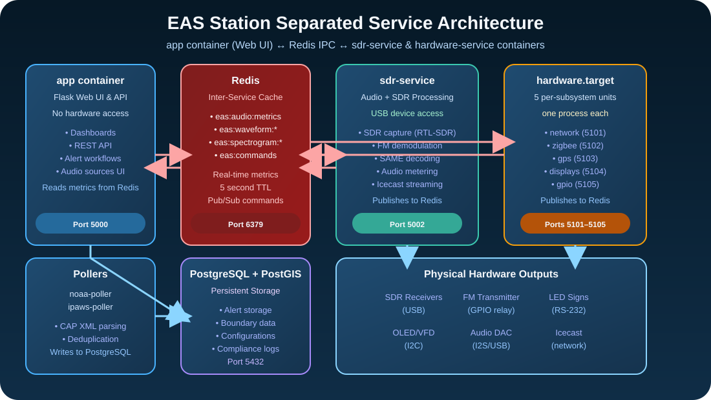

# ℹ️ About EAS Station™

EAS Station™ is a complete Emergency Alert System platform that automates the ingestion, encoding, broadcast, and verification of Common Alerting Protocol (CAP) alerts. Built by amateur radio operat[...]

The long-term vision is to deliver a software-driven, off-the-shelf drop-in replacement for commercial encoder/decoder appliances. Every subsystem is being designed so commodity compute, SDR front-[...]

EAS Station™'s reference build centers on a Raspberry Pi 5 (4 GB RAM baseline, 8 GB recommended when narration and SDR verification share the host) with HATs that expose dry-contact GPIO relays, R[...]

A **GPS/RTC HAT** (Uputronics u-blox MAX-M8Q multi-GNSS or Adafruit Ultimate GPS) brings hardware Pulse-Per-Second to the kernel, letting `chrony` discipline the host as a **true stratum 1 NTP serv[...]

Raspberry Pi 4 systems remain compatible for labs but no longer represent the documented baseline. Deployments are validated on Debian 13 (Trixie) 64-bit builds. The container image uses Debian Bo[...]

### Python Release Strategy

- **Upstream status:** Python 3.13.0 is the newest general-availability CPython release.
- **Current runtime:** The stack uses Python 3.11 to maintain compatibility with Debian bookworm's pre-compiled SoapySDR bindings (`python3-soapysdr`). All key dependencies including `scipy==1.14.[...]
- **Mitigation:** The system is updated regularly with Python 3.11 patch releases, and pinned dependencies are updated alongside security advisories to ensure CVE fixes without destabilizing the h[...]

## Safety Notice
- **Development status:** The project remains experimental and has only been cross-checked against community tools like [multimon-ng](https://github.com/EliasOenal/multimon-ng) for decoding parity[...]
- **Certification pending:** The team is actively building toward hardware parity, but the software is not yet an approved replacement for commercial Emergency Alert System encoders or other FCC-a[...]
- **Lab use only (for now):** Operate EAS Station™ strictly in test environments and never rely on it for live public warning, life safety, or mission-critical decisions until the roadmap is comple[...]
- **Review legal docs:** Before inviting collaborators or storing data, read the repository [Terms of Use](../policies/TERMS_OF_USE) and [Privacy Policy](../policies/PRIVACY_POLICY).
- **Real operational semantics only — not for entertainment or media production:** EAS Station™ is built to emulate the *actual* operational behavior of certified EAS encoder/decoder equipment so that researchers, broadcasters, and Part 97 amateur radio operators can study, decode, and exercise the real protocol. It is **not** a creative or content-production toolkit. Do **not** author fictional, fabricated, satirical, or "what-if" EAS workflows (invented event codes, mock CAP feeds presented as real, joke RWT/RMT cycles, imagined alert scenarios) with this software, and do **not** use any of its generated audio, headers, captures, or screenshots in films, TV, trailers, advertising, podcasts, streaming programming, video games, livestream stunts, prank or "creepypasta" content, ARGs, haunted-attraction sound design, or any other entertainment or media production. Labeling content as fiction does **not** cure the violation — 47 C.F.R. § 11.45 prohibits EAS code/Attention Signal broadcast outside actual emergencies and authorized tests regardless of intent (see the *Olympus Has Fallen* trailer case in [Terms of Use § 4b](../policies/TERMS_OF_USE)).

## Mission and Scope
- **Primary Goal:** Provide emergency communications teams with automated CAP-to-EAS workflow, from alert ingestion through broadcast verification, with complete compliance documentation.
- **Drop-In Replacement Roadmap:** Implement the nine requirement areas in [`docs/roadmap/dasdec3-feature-roadmap.md`](../roadmap/dasdec3-feature-roadmap)—baseband capture, deterministic playout[...]
- **Deployment Model:** Container-first architecture designed for on-premise or field deployments with external PostgreSQL/PostGIS database service.
- **Operational Focus:** Multi-source alert aggregation, automatic SAME broadcast generation, SDR-based verification, spatial boundary awareness, and audit trail management.

## Current Development Status
See the **[Master Roadmap](../roadmap/dasdec3-feature-roadmap)** for detailed progress on all nine requirement areas, including completed features like audio ingest, security controls, and analyti[...]

## Core Services

## Software Stack
The application combines open-source tooling and optional cloud integrations. Versions below match the pinned dependencies in `requirements.txt` unless noted otherwise.

### Application Framework
- Python 3.11 runtime (compatible with Debian bookworm SoapySDR bindings)
- Flask 3.0.3 web framework
- Werkzeug 3.0.6 WSGI utilities
- Flask-SQLAlchemy 3.1.1 ORM integration
- SQLAlchemy 2.0.44 ORM core
- Gunicorn 23.0.0 production WSGI server

### Data and Spatial Layer
- PostgreSQL 15 with the PostGIS extension (external service)
- GeoAlchemy2 0.15.2 for spatial ORM bindings
- psycopg2-binary 2.9.10 PostgreSQL driver

### System and Utilities
- requests 2.32.3 for CAP feed retrieval and IPAWS integration
- pytz 2024.2 timezone utilities
- psutil 6.1.1 system health and receiver monitoring
- python-dotenv 1.0.1 configuration loading
- cryptography ≥ 46.0.5 — Ed25519 signing and SHA-256 hashing backing the tamper-evident `audit_logs` chain (see `app_core/auth/audit.py::AuditLogger.verify_chain`)

### Front-End Tooling
- Bootstrap 5 UI framework
- Font Awesome iconography
- Highcharts visualization library

### Optional Integrations
- Azure Cognitive Services Speech SDK 1.38.0 (optional AI narration)
- Systemd for service orchestration and management

## Data Sources & Attribution

EAS Station™ relies on publicly available geographic data to enable spatial filtering, boundary-aware alert processing, and location-based targeting.

### Geographic Data Providers

- **Putnam County GIS Office** - County and municipal boundary shapefiles, reference geographic data
  - Greg Luersman, GIS Coordinator
  - https://www.putnamcountygis.com/Downloads.html
  - Licensed under Public Domain / Open Data terms

- **Allen County GIS Office** - County and municipal boundary shapefiles, reference geographic data
  - Alexis Foundas, GIS Coordinator
  - Licensed under Public Domain / Open Data terms

- **U.S. Census Bureau** - FIPS county codes and TIGER/Line state/county boundaries
  - Public Domain federal data

- **NOAA National Weather Service** - Weather forecast zone boundaries and definitions
  - Public Domain federal data

For complete attribution details, see [`dependency_attribution.md`](dependency_attribution).

## Governance and Support
- **Issue Tracking:** Use GitHub issues for bug reports and feature requests.
- **Documentation Updates:** User-facing changes must update the README, HELP, and CHANGELOG entries.
- **Environment Variables:** Any new variables must be mirrored in `.env.example` per contributor guidelines.
- **Release Accounting:** Each deployment must surface the repository `VERSION` manifest in the UI, log its commit hash, and append the relevant entry to [`CHANGELOG.md`](CHANGELOG) so the operati[...]
- **Automation Guardrails:** The repository `VERSION` file, shared version resolver, and release metadata test will fail builds when the reported version and changelog drift—keep them aligned be[...]
- **Upgrade & Backup Tooling:** Use `python tools/create_backup.py` for pre-flight snapshots and `python tools/inplace_upgrade.py` to roll forward without wiping containers or volumes. The Admin c[...]

## Maintainer Profile
Timothy Kramer (KR8MER) serves as the project's maintainer. Licensed as an amateur radio operator since 2004 and upgraded to General Class in 2025, Kramer brings 17 years of public-safety service[...]

For setup instructions, operational tips, and troubleshooting guidance, refer to the dedicated [HELP documentation](../guides/HELP).
