# Ohio Emergency Alert System (EAS) Plan Documentation

**Document Version:** December 2018 (FCC Approved: March 18, 2019)  
**Status:** ⚠️ REQUIRES UPDATES - Missing current event codes  
**Last Review:** 2025

---

## Table of Contents

1. [System Overview](#system-overview)
2. [Ohio EAS Authority & Structure](#ohio-eas-authority--structure)
3. [Event Codes Reference](#event-codes-reference)
4. [Missing Event Codes](#missing-event-codes)
5. [Ohio EAS Structure](#ohio-eas-structure)
6. [State & Local Primary Stations](#state--local-primary-stations)
7. [Ohio EAS Monitoring Network](#ohio-eas-monitoring-network)
8. [Notification Procedures](#notification-procedures)
9. [Committee Contacts](#committee-contacts)
10. [NOAA Weather Radio Coverage](#noaa-weather-radio-stations-serving-ohio)

---

## System Overview

### Purpose

The Ohio EAS provides procedures for designated federal, state, and local government officials to issue emergency information, instructions, and warnings to the general public through the broadcast and cable television media.

### Coverage & Scope


---

## Ohio EAS Authority & Structure

### Regulatory Framework


### Key Authority Information

| Element | Details |
|---------|---------|
| **FCC Regulation** | 47 CFR, Part 11 |
| **Coverage** | All 88 Ohio counties grouped into 12 Local Operational Areas |
| **State Primary Station** | WNCI-FM 97.9 (Columbus) |
| **Alternate State Primary** | WBNS-FM 97.1 (Columbus) |
| **FCC Approval Date** | March 18, 2019 |
| **Plan Version** | December 2018 |

### National Primary Stations in Ohio


---

## Event Codes Reference

### Event Code Priority Hierarchy


### ⚠️ REQUIRED WARNING CODES
**All stations MUST program these codes into EAS equipment:**

| Code | Event Name | Description |
|------|------------|-------------|
| **EAN** | Emergency Action Notification | National emergency notification |
| **EAT** | Emergency Action Termination | Terminates EAN |
| **RMT** | Required Monthly Test | Monthly system test |
| **RWT** | Required Weekly Test | Weekly system test |
| **NPT** | National Periodic Test | National system test |
| **CAE** | Child Abduction Emergency | AMBER Alert |
| **CDW** | Civil Danger Warning | Civil/military emergency |
| **CEM** | Civil Emergency Message | Civil emergency instructions |
| **EQW** | Earthquake Warning | Earthquake imminent/occurring |
| **EVI** | Evacuation Immediate | Immediate evacuation required |
| **FRW** | Fire Warning | Uncontrolled fire threat |
| **FFW** | Flash Flood Warning | Flash flooding occurring |
| **HMW** | Hazardous Materials Warning | Toxic chemical/gas release |
| **LEW** | Law Enforcement Warning | Law enforcement emergency |
| **NIC** | National Information Center | Emergency information available |
| **TOE** | 9-1-1 Telephone Outage Emergency | 9-1-1 system failure |
| **NUW** | Nuclear Power Plant Warning | Nuclear facility emergency |
| **RHW** | Radiological Hazard Warning | Radioactive material release |
| **SPW** | Shelter In Place Warning | Shelter indoors immediately |
| **TOR** | Tornado Warning | Tornado sighted or indicated |

### OPTIONAL CODES
**Programming at station discretion:**

| Code | Event Name | Code | Event Name |
|------|------------|------|------------|
| **ADR** | Administrative Message | **BZW** | Blizzard Warning |
| **BLU** | Blue Alert | **EWW** | Extreme Wind Warning |
| **FFA** | Flash Flood Watch | **FFS** | Flash Flood Statement |
| **FLW** | Flood Warning | **FLA** | Flood Watch |
| **FLS** | Flood Statement | **HWW** | High Wind Warning |
| **HWA** | High Wind Watch | **NMN** | Network Message Notification |
| **DMO** | Practice/Demo Warning | **SVR** | Severe Thunderstorm Warning |
| **SVA** | Severe Thunderstorm Watch | **SVS** | Severe Weather Statement |
| **SNW** | Special Marine Warning | **SPS** | Special Weather Statement |
| **TOA** | Tornado Watch | **WSW** | Winter Storm Warning |
| **WSA** | Winter Storm Watch | | |

---

## ⚠️ MISSING EVENT CODES

### Update Status Overview


### Critical Missing Codes (Added Since 2018)

The following event codes have been added to the national EAS system since the 2018 Ohio plan approval and are **NOT** currently included in the Ohio plan:

#### High-Priority Weather Warnings (Ohio-Relevant)

```mermaid
graph TB
    subgraph "CRITICAL - Immediate Implementation Required"
        SQW[SQW - Snow Squall Warning<br>⚠️ Critical for Ohio winters<br>Zero-visibility conditions]
        EQE[EQE - Earthquake Early Warning<br>⚠️ National priority<br>Seconds matter for safety]
        ISW[ISW - Ice Storm Warning<br>⚠️ Critical for Ohio<br>Infrastructure damage]
    end
    
    subgraph "HIGH PRIORITY - Seasonal Threats"
        LSW[LSW - Lake Effect Snow<br>Critical for lakeshore areas]
        WCW[WCW - Wind Chill Warning<br>Dangerous cold exposure]
        LFW[LFW - Lakeshore Flood<br>Lake Erie storm surge]
        DSW[DSW - Dust Storm Warning<br>I-70/I-71 corridor risk]
    end
    
    subgraph "MODERATE PRIORITY - Regional Threats"
        SSW[SSW - Storm Surge Warning<br>Coastal/Lake Erie]
        TSW[TSW - Tsunami Warning<br>Low probability]
        HUW[HUW - Hurricane Warning<br>Rare but possible]
        TRW[TRW - Tropical Storm<br>Remnant systems]
    end
    
    style SQW fill:#8b0000,stroke:#600,stroke-width:3px,color:#fff
    style EQE fill:#8b0000,stroke:#600,stroke-width:3px,color:#fff
    style ISW fill:#8b0000,stroke:#600,stroke-width:3px,color:#fff
    
    style LSW fill:#e74c3c,stroke:#c0392b,stroke-width:2px,color:#fff
    style WCW fill:#e74c3c,stroke:#c0392b,stroke-width:2px,color:#fff
    style LFW fill:#e74c3c,stroke:#c0392b,stroke-width:2px,color:#fff
    style DSW fill:#e74c3c,stroke:#c0392b,stroke-width:2px,color:#fff
    
    style SSW fill:#f39c12,stroke:#e67e22,stroke-width:2px,color:#fff
    style TSW fill:#f39c12,stroke:#e67e22,stroke-width:2px,color:#fff
    style HUW fill:#f39c12,stroke:#e67e22,stroke-width:2px,color:#fff
    style TRW fill:#f39c12,stroke:#e67e22,stroke-width:2px,color:#fff
```



**WEATHER WARNINGS - HIGH PRIORITY:**

| Code | Event Name | Status | Priority | Ohio Relevance |
|------|------------|--------|----------|----------------|
| **SQW** | Snow Squall Warning | ❌ MISSING | **CRITICAL** | Heavy lake-effect, I-90 corridor |
| **DSW** | Dust Storm Warning | ❌ MISSING | HIGH | Farm counties, interstate safety |
| **SSW** | Storm Surge Warning | ❌ MISSING | HIGH | Lake Erie shoreline |
| **TSW** | Tsunami Warning | ❌ MISSING | HIGH | Low probability, national coverage |
| **HUW** | Hurricane Warning | ❌ MISSING | HIGH | Rare but remnants affect Ohio |
| **TRW** | Tropical Storm Warning | ❌ MISSING | HIGH | Remnant systems common |

**ADDITIONAL WEATHER CODES:**

| Code | Event Name | Status | Priority | Ohio Relevance |
|------|------------|--------|----------|----------------|
| **AVW** | Avalanche Warning | ❌ MISSING | MEDIUM | Not applicable to Ohio |
| **AVA** | Avalanche Watch | ❌ MISSING | LOW | Not applicable to Ohio |
| **CFW** | Coastal Flood Warning | ❌ MISSING | MEDIUM | Lake Erie = inland sea |
| **CFA** | Coastal Flood Watch | ❌ MISSING | LOW | Lake Erie shoreline |
| **CFS** | Coastal Flood Statement | ❌ MISSING | LOW | Lake Erie shoreline |
| **EQE** | Earthquake Early Warning | ❌ MISSING | **CRITICAL** | National priority system |
| **ECW** | Extreme Cold Warning | ❌ MISSING | MEDIUM | Common Ohio winter threat |
| **ECA** | Extreme Cold Watch | ❌ MISSING | LOW | Common Ohio winter threat |
| **EHW** | Extreme Heat Warning | ❌ MISSING | MEDIUM | Summer health risk |
| **FWW** | Fire Weather Warning | ❌ MISSING | MEDIUM | Dry season brush fires |
| **FZW** | Freeze Warning | ❌ MISSING | MEDIUM | Agriculture impact |
| **HFW** | Hard Freeze Warning | ❌ MISSING | MEDIUM | Agriculture impact |
| **HTA** | Heat Advisory | ❌ MISSING | LOW | Summer health advisory |
| **HLS** | Hurricane Statement | ❌ MISSING | MEDIUM | Follow-up information |
| **HUA** | Hurricane Watch | ❌ MISSING | MEDIUM | Advance warning |
| **ISW** | Ice Storm Warning | ❌ MISSING | HIGH | Critical Ohio winter threat |
| **LFW** | Lakeshore Flood Warning | ❌ MISSING | MEDIUM | Lake Erie seiche events |
| **LFA** | Lakeshore Flood Watch | ❌ MISSING | LOW | Lake Erie shoreline |
| **LSW** | Lake Effect Snow Warning | ❌ MISSING | MEDIUM | Critical for snow belt |
| **SSA** | Storm Surge Watch | ❌ MISSING | MEDIUM | Lake Erie |
| **TRA** | Tropical Storm Watch | ❌ MISSING | MEDIUM | Advance warning |
| **TSA** | Tsunami Watch | ❌ MISSING | MEDIUM | Not applicable to Ohio |
| **VOW** | Volcano Warning | ❌ MISSING | LOW | Not applicable to Ohio |
| **WCW** | Wind Chill Warning | ❌ MISSING | MEDIUM | Critical Ohio winter threat |
| **WCA** | Wind Chill Watch | ❌ MISSING | LOW | Common Ohio winter condition |

**OTHER CRITICAL CODES:**

| Code | Event Name | Status | Priority |
|------|------------|--------|----------|
| **DMO** | Demo/Practice Warning | ✅ PRESENT | N/A |
| **EQE** | Earthquake Early Warning | ❌ MISSING | **CRITICAL** |

---

## Action Items

### Implementation Roadmap


### Immediate Actions Required

1. **Update Ohio EAS Plan** to include missing event codes
2. **Prioritize encoding/decoding** for:
   - ✅ **SQW** - Snow Squall Warning (CRITICAL for Ohio winters)
   - ✅ **EQE** - Earthquake Early Warning (National priority)
   - ✅ **ISW** - Ice Storm Warning (Critical for Ohio)
   - ✅ **LSW** - Lake Effect Snow Warning (Critical for lakeshore areas)
   - ✅ **WCW** - Wind Chill Warning (Critical for Ohio winters)
   - ✅ **LFW** - Lakeshore Flood Warning (Relevant for Lake Erie)

3. **Test encoder/decoder compatibility** with all current FCC event codes

4. **Submit updated plan** to FCC for approval

5. **Notify all participating stations** of required updates

### Equipment Compatibility Testing


3. **Test encoder/decoder compatibility** with all current FCC event codes

4. **Submit updated plan** to FCC for approval

5. **Notify all participating stations** of required updates

---

## Ohio EAS Structure

### 12 Operational Areas

1. **Central** - Columbus (Franklin County and surrounding)
2. **Central & East Lakeshore** - Cleveland/Lake Erie
3. **East Central** - Canton/Akron region
4. **Lima** - Northwest interior
5. **North Central** - Mansfield/Marion area
6. **Northwest** - Toledo region
7. **South Central** - Portsmouth/Chillicothe
8. **Southeast** - Athens/Marietta region
9. **Southwest** - Cincinnati region
10. **Upper Ohio Valley** - Steubenville/Wheeling border
11. **West Central** - Dayton region
12. **Youngstown** - Northeast region

---

## State & Local Primary Stations

### State Level

| Designation | Call Sign | Frequency | City | Role |
|-------------|-----------|-----------|------|------|
| **NP/LP-1** | WTAM | 1100 AM | Cleveland | National Primary |
| **NP/LP-1** | WLW | 700 AM | Cincinnati | National Primary |
| **SP-1** | WNCI | 97.9 FM | Columbus | State Primary |
| **SP-2** | WBNS-FM | 97.1 FM | Columbus | Alternate State Primary |

### Local Primary Stations by Operational Area

#### Central Area
- **LP-1:** WNCI 97.9 FM (Columbus) - Also State Primary
- **LP-2:** WBNS-FM 97.1 FM (Columbus)
- **LP-3:** WHIZ-FM 92.7 FM (Zanesville)

#### Central & East Lakeshore Area
- **LP-1:** WTAM 1100 AM (Cleveland) - Also National Primary
- **LP-2:** WCPN 90.3 FM (Cleveland)
- **LP-3:** WKSV 89.1 FM (Thompson)

#### East Central Area
- **LP-1:** WHBC-FM 94.1 FM (Canton)
- **LP-2:** WQMX 94.9 FM (Medina)

#### Lima Area
- **LP-1:** WIMT 102.1 FM (Lima)
- **LP-2:** WKXA 100.5 FM (Findlay)

#### North Central Area
- **LP-1:** WVNO 106.1 FM (Mansfield)
- **LP-2:** WNCO-FM 101.3 FM (Ashland)

#### Northwest Area
- **LP-1:** WRVF 101.5 FM (Toledo)
- **LP-2:** WIOT 104.7 FM (Toledo)
- **LP-3:** WDFM 98.1 FM (Defiance)
- **LP-3:** WCKY-FM 103.7 FM (Pemberville)

#### South Central Area
- **LP-1:** WPYK 104.1 FM (Portsmouth)
- **LP-2:** WKKJ 94.3 FM (Chillicothe)

#### Southeast Area
- **LP-1:** WOUB-FM 91.3 FM (Athens)
- **LP-2:** WXTQ 105.5 FM (Athens)

#### Southwest Area
- **LP-1:** WLW 700 AM (Cincinnati) - Also National Primary
- **LP-2:** WRRM 98.5 FM (Cincinnati)

#### Upper Ohio Valley Area
- **LP-1:** WEGW 107.5 FM (Wheeling, WV)
- **LP-2:** WBNV 93.5 FM (Barnesville)
- **LP-3:** WOUC-FM 89.1 FM (Cambridge)

#### West Central Area
- **LP-1:** WHKO 99.1 FM (Dayton)
- **LP-2:** WTUE 104.7 FM (Dayton)
- **LP-3:** WEEC 100.7 FM (Springfield)
- **LP-3:** WHIO-FM 95.7 FM (Piqua)

#### Youngstown Area
- **LP-1:** WMXY 98.9 FM (Youngstown)
- **LP-2:** WYSU 88.5 FM (Youngstown)

---

## Notification Procedures

### Emergency Alert Activation Workflow


### Authorized Notifiers by Level


### Authorized Notifiers

| Level | Officials | Event Types | Method |
|-------|-----------|-------------|--------|
| **State** | Governor of Ohio | All events | IPAWS/OEAS |
| **State** | Ohio EMA Director | State emergencies | IPAWS/OEAS |
| **State** | Ohio State Highway Patrol | Transportation emergencies | IPAWS |
| **Federal** | National Weather Service | Weather alerts only | NOAA WR/IPAWS |
| **County** | County EMA Directors | Local area only | IPAWS/Phone |
| **County** | County Sheriffs | Local area only | Phone Notifier |

### State Activation Process


**Statewide Alerts:**
- Sent from Ohio Emergency Operations Center/Joint Dispatch Facility (EOC/JDF)
- Connected to State Primary (WNCI) via private radio link
- Distributed via IPAWS and Ohio Digital EAS (OEAS)

**Local Alerts:**
- Sent to Local Primary stations (LP-1 or LP-2)
- Can be sent via IPAWS or direct encoder connection
- Coordination through Ohio EMA for regional alerts

### Weather Alerts


- **Sole Authority:** National Weather Service (NWS)
- **Primary Method:** NOAA Weather Radio SAME (Specific Area Message Encoder)
- **Coverage:** Multiple NWS offices serve Ohio (see NOAA station list below)

---

## Test Procedures

### Testing Hierarchy


### Required Weekly Test (RWT)

- Conducted weekly by all stations
- Tests EAS header and end-of-message codes
- FCC mandated
- No audio message required
- Must be logged

### Required Monthly Test (RMT)


**Statewide tests** conducted by Ohio EOC:
- **Schedule:** 2nd Wednesday of each month (except March - see below)
- Tests alternate between day/night and LP-1/LP-2
- Must be retransmitted within 60 minutes
- Full audio message transmitted

#### RMT Schedule

| Month | Week | Time Frame | Time | Relay Station |
|-------|------|------------|------|---------------|
| January | 2nd Wed | Daytime | 9:50 AM | SP/LP-1 |
| February | 2nd Wed | Nighttime | 3:50 AM | SP/LP-2 |
| **March** | **1st Wed*** | **Daytime** | **9:50 AM** | **SP/LP-1** |
| April | 2nd Wed | Nighttime | 3:50 AM | SP/LP-1 |
| May | 2nd Wed | Daytime | 9:50 AM | SP/LP-2 |
| June | 2nd Wed | Nighttime | 3:50 AM | SP/LP-2 |
| July | 2nd Wed | Daytime | 9:50 AM | SP/LP-1 |
| August | 2nd Wed | Nighttime | 3:50 AM | SP/LP-1 |
| September | 2nd Wed | Daytime | 9:50 AM | SP/LP-2 |
| October | 2nd Wed | Nighttime | 3:50 AM | SP/LP-1 |
| November | 2nd Wed | Daytime | 9:50 AM | SP/LP-1 |
| December | 2nd Wed | Nighttime | 3:50 AM | SP/LP-2 |

*March test conducted 1st Wednesday during Severe Weather Awareness Week

### IPAWS & OEAS Testing


- Minimum **4 RMTs annually via IPAWS**
- Minimum **4 RMTs annually via OEAS CAP network**
- Tests verify multiple distribution paths
- Ensures redundancy and reliability

---

## EAS Message Format

### Four-Part Structure

1. **Preamble & EAS Header** (transmitted 3x with 1-second pauses)
   - Originator code
   - Event code
   - Location code (FIPS)
   - Duration
   - Date/time
   - Sender ID (8 characters)

2. **Audio Attention Signal** (8 seconds, two-tone)

3. **Message Text** (maximum 2 minutes)
   - **Ohio Opening:** "WE INTERRUPT THIS PROGRAM TO ACTIVATE THE EMERGENCY ALERT SYSTEM"
   - Message body
   - **Ohio Closing:** "THIS CONCLUDES THIS EMERGENCY ALERT SYSTEM MESSAGE"

4. **End of Message Code** (transmitted 3x with 1-second pauses)

### Station Identification Codes

**Format Examples:**
- **WHBCAMFM** - Combo station (WHBC AM/FM)
- **WHBCFM** - Single FM station
- **WLWAM** - Single AM station
- **NWS/KCLE** - NWS Cleveland
- **STARCOEM** - Stark County EMA
- **STARCOSO** - Stark County Sheriff
- **OHIOSTEM** - State EOC/EMA
- **CLEVOH11** - Cable system (location #11)

---

## Station Requirements

### Equipment Requirements

**All Stations Must Have:**
1. FCC-certified EAS encoder/decoder
2. Audio inputs from LP-1 and LP-2 stations
3. NOAA Weather Radio input (strongly recommended)

**LP Stations Must Also Have:**
4. Telephone coupler for Notifier access
5. Additional monitoring capability for cross-area relay
6. 24-hour operation (attended or automated)

### Decoder Programming

**Radio/TV Stations:**
- Program all **Warning Event Codes** (required)
- Program all county location codes within secondary coverage contour
- Configure for automatic relay if unattended

**Cable Systems:**
- Program all **Warning Event Codes** (required)
- Program county codes for all counties covered (whole or partial)
- Configure per FCC Rules 11.51(g) and 11.51(h)

### Monitoring Assignments

**Required Monitoring:**
- **All stations:** Monitor LP-1 and LP-2 for their operational area
- **LP stations:** Monitor other LP stations per attachment map
- **Recommended:** Monitor appropriate NOAA weather radio

**LP-3 Stations:**
- Designated to bridge operational areas
- Used when LP-1 or LP-2 signal unreliable

---

## Ohio EAS Monitoring Network

### Network Architecture Overview

The Ohio EAS Monitoring Network consists of a hierarchical structure with National Primary (NP), State Primary (SP), and Local Primary (LP) stations across Ohio's 12 operational areas. The following sections break down this network by level and region for clarity.

### National and State Level Hierarchy


**National Primary Stations:**
- **WTAM 1100 AM** (Cleveland) - Serves Northern Ohio
- **WLW 700 AM** (Cincinnati) - Serves Southern Ohio

**State Primary Stations:**
- **WNCI 97.9 FM** (Columbus) - State Primary, receives from NP stations
- **WBNS-FM 97.1 FM** (Columbus) - State Alternate

---

### Central Ohio Region


**Stations:**
- LP-1: WNCI 97.9 FM (Columbus)
- LP-2: WBNS-FM 97.1 FM (Columbus)
- LP-3: WHIZ-FM 92.7 FM (Zanesville)

---

### Northern Ohio Region


**Cleveland/Lakeshore:**
- LP-1: WTAM 1100 AM (Cleveland)
- LP-2: WCPN 90.3 FM (Cleveland)
- LP-3: WKSV 89.1 FM (Thompson)

**Youngstown:**
- LP-1: WMXY 98.9 FM (Youngstown)
- LP-2: WYSU 88.5 FM (Youngstown)

**Canton:**
- LP-1: WHBC-FM 94.1 FM (Canton)
- LP-2: WQMX 94.9 FM (Medina)

---

### Northwest Ohio Region


**Toledo:**
- LP-1: WRVF 101.5 FM (Toledo)
- LP-2: WIOT 104.7 FM (Toledo)
- LP-3: WDFM 98.1 FM (Defiance)
- LP-3: WCKY-FM 103.7 FM (Pemberville)

**Lima:**
- LP-1: WIMT 102.1 FM (Lima)
- LP-2: WKXA 100.5 FM (Findlay)

**Mansfield:**
- LP-1: WVNO 106.1 FM (Mansfield)
- LP-2: WNCO-FM 101.3 FM (Ashland)

---

### Southwest Ohio Region


**Cincinnati:**
- LP-1: WLW 700 AM (Cincinnati)
- LP-2: WRRM 98.5 FM (Cincinnati)

**Dayton:**
- LP-1: WHKO 99.1 FM (Dayton)
- LP-2: WTUE 104.7 FM (Dayton)
- LP-3: WEEC 100.7 FM (Springfield)
- LP-3: WHIO-FM 95.7 FM (Piqua)

---

### Southeast Ohio Region

```mermaid
graph TB
    SP1[State Primary<br>WNCI 97.9 FM]
    
    subgraph "Southeast - Athens"
        SE_LP1[LP-1: WOUB-FM 91.3 FM]
        SE_LP2[LP-2: WXTQ 105.5 FM]
    end

    subgraph "South Central - Portsmouth"
        SC_LP1[LP-1: WPYK 104.1 FM]
        SC_LP2[LP-2: WKKJ 94.3 FM<br>Chillicothe]
    end

    subgraph "Upper Ohio Valley"
        UOV_LP1[LP-1: WEGW 107.5 FM<br>Wheeling, WV]
        UOV_LP2[LP-2: WBNV 93.5 FM<br>Barnesville]
        UOV_LP3[LP-3: WOUC-FM 89.1 FM<br>Cambridge]
    end

    SP1 --> SE_LP1
    SP1 --> SC_LP1
    SP1 --> UOV_LP1
    
    SE_LP1 --> SE_LP2
    SC_LP1 --> SC_LP2
    
    UOV_LP1 --> UOV_LP2
    UOV_LP1 --> UOV_LP3
    UOV_LP2 --> UOV_LP3

    classDef state fill:#3498db,stroke:#2980b9,stroke-width:3px,color:#fff
    classDef lp1 fill:#2ecc71,stroke:#27ae60,stroke-width:2px,color:#fff
    classDef lp2 fill:#f39c12,stroke:#e67e22,stroke-width:2px,color:#fff
    classDef lp3 fill:#9b59b6,stroke:#8e44ad,stroke-width:2px,color:#fff

    class SP1 state
    class SE_LP1,SC_LP1,UOV_LP1 lp1
    class SE_LP2,SC_LP2,UOV_LP2 lp2
    class UOV_LP3 lp3
```

**Athens:**
- LP-1: WOUB-FM 91.3 FM (Athens)
- LP-2: WXTQ 105.5 FM (Athens)

**Portsmouth:**
- LP-1: WPYK 104.1 FM (Portsmouth)
- LP-2: WKKJ 94.3 FM (Chillicothe)

**Upper Ohio Valley:**
- LP-1: WEGW 107.5 FM (Wheeling, WV)
- LP-2: WBNV 93.5 FM (Barnesville)
- LP-3: WOUC-FM 89.1 FM (Cambridge)

### Network Legend

| Color | Designation | Role |
|-------|-------------|------|
| 🔴 **Red** | National Primary (NP) | Receives alerts from federal authorities, distributes to state level |
| 🔵 **Blue** | State Primary (SP) | Receives from NP stations, distributes to all LP-1 stations statewide |
| 🟢 **Green** | Local Primary 1 (LP-1) | Primary monitoring source for each operational area |
| 🟠 **Orange** | Local Primary 2 (LP-2) | Backup to LP-1, monitors LP-1 |
| 🟣 **Purple** | Local Primary 3 (LP-3) | Bridges operational areas, covers gaps in LP-1/LP-2 coverage |

### Monitoring Requirements by Station Type

#### All Participating Stations
- **MUST** monitor both LP-1 and LP-2 for their operational area
- **SHOULD** monitor appropriate NOAA Weather Radio
- **MUST** relay EAN (Emergency Action Notification) immediately

#### LP-1 Stations (Primary)
- **MUST** monitor State Primary (WNCI 97.9 FM)
- **MUST** monitor other LP stations in adjacent areas (per FCC attachment)
- **SHOULD** monitor National Primary stations when practical

#### LP-2 Stations (Secondary)
- **MUST** monitor corresponding LP-1 in their area
- **MUST** monitor State Primary (WNCI 97.9 FM)
- Acts as backup if LP-1 fails or signal unreliable

#### LP-3 Stations (Tertiary/Bridge)
- **MUST** monitor both LP-1 and LP-2 in their area
- **PRIMARY PURPOSE:** Bridge coverage gaps between operational areas
- **SECONDARY PURPOSE:** Provide redundancy when LP-1 or LP-2 signal unreliable
- **DEPLOYMENT:** Strategic placement in border counties or signal-challenged areas

### Alert Flow Path Example

```mermaid
sequenceDiagram
    participant Fed as Federal Authority<br>(FEMA/NWS)
    participant NP as National Primary<br>WTAM/WLW
    participant SP as State Primary<br>WNCI
    participant LP1 as LP-1 Stations<br>(12 Areas)
    participant LP2 as LP-2 Stations<br>(Backup)
    participant LP3 as LP-3 Stations<br>(Bridge)
    participant PS as Participating Stations<br>(Broadcast/Cable)

    Fed->>NP: Emergency Alert Issued
    NP->>SP: Alert Transmitted
    SP->>LP1: Alert Distributed Statewide
    LP1->>LP2: LP-2 Monitors LP-1
    LP1->>LP3: LP-3 Monitors LP-1
    LP2->>LP3: LP-3 Monitors LP-2
    LP1->>PS: All Stations Monitor LP-1
    LP2->>PS: All Stations Monitor LP-2
    LP3->>PS: Bridge Areas Monitor LP-3
    PS->>PS: Stations Relay to Public
```

### Cross-Area Monitoring

Some operational areas have overlapping coverage or require cross-monitoring:

- **Cleveland (CEL)** ↔ **Youngstown**: Geographic proximity requires coordination
- **Toledo (NW)** ↔ **Lima**: LP-3 stations bridge these areas
- **Dayton (WC)** ↔ **Cincinnati (SW)**: I-75 corridor coordination
- **Upper Ohio Valley** ↔ **Southeast**: Appalachian region coverage
- **Central (Columbus)** → **All Areas**: State Primary hub

---

## Committee Contacts

### State Emergency Communications Committee (SECC)

#### Chair

| | |
|---|---|
| **Name** | Greg Savoldi |
| **Organization** | Radio Station WNCI |
| **Address** | 2323 West 5th Avenue, Suite 200<br>Columbus, OH 43204 |
| **Phone** | 614-487-2485 |
| **Mobile** | 614-496-2121 |
| **Email** | [gregsavoldi@iheartmedia.com](mailto:gregsavoldi@iheartmedia.com) |

#### Vice-Chair

| | |
|---|---|
| **Name** | Dave Ford |
| **Organization** | Ohio Emergency Management Agency |
| **Address** | 2855 West Dublin-Granville Road<br>Columbus, OH 43235-2206 |
| **Phone** | 614-889-7154 |
| **24/7 Line** | 614-889-7150 |
| **Email** | [rdford@dps.state.oh.us](mailto:rdford@dps.state.oh.us) |

#### Cable Co-Chair

| | |
|---|---|
| **Name** | Jonathon McGee |
| **Title** | Executive Director |
| **Organization** | Ohio Cable Telecommunications Association |
| **Address** | 50 West Broad Street, Suite 1118<br>Columbus, OH 43215 |
| **Phone** | 614-461-4014 |
| **Email** | [jmcgee@octa.org](mailto:jmcgee@octa.org) |

### Local Area Chairs

Complete contact information for all 12 operational area chairs and vice-chairs is provided in the sections above.

---

## NOAA Weather Radio Stations Serving Ohio

### Primary Stations

| Call Sign | City | Frequency | Counties Served |
|-----------|------|-----------|-----------------|
| **KDO-94** | Akron | 162.40 | Ashland, Carroll, Columbiana, Harrison, Holmes, Jefferson, Mahoning, Medina, Portage, Summit, Trumbull, Tuscarawas, Wayne, Stark |
| **KHB-97** | Bellevue | 162.40 | Ashland, Crawford, Erie, Hancock, Huron, Lorain, Ottawa, Richland, Sandusky, Seneca, Wood, Wyandot |
| **KIG-86** | Columbus | 162.55 | Athens, Champaign, Clark, Delaware, Fairfield, Fayette, Franklin, Greene, Hocking, Knox, Licking, Madison, Marion, Morgan, Morrow, Muskingum, Perry, Pickaway, Pike, Ross, Union, Vinton |
| **WXL-51** | Holland | 162.55 | Fulton, Hancock, Henry, Lucas, Ottawa, Sandusky, Seneca, Wood (Defiance, Williams relay) |
| **WXJ-93** | Lima | 162.40 | Allen, Auglaize, Hancock, Hardin, Logan, Mercer, Paulding, Putnam, Shelby, Van Wert, Wyandot |
| **WWG-57** | Mansfield | 162.450 | Ashland, Crawford, Holmes, Knox, Licking, Marion, Morrow, Richland, Wayne, Wyandot |
| **WXJ-46** | Miamisburg | 162.475 | Butler, Champaign, Clark, Clinton, Darke, Greene, Logan, Miami, Montgomery, Preble, Shelby, Warren |
| **WWG-56** | Youngstown | 162.500 | Carroll, Columbiana, Lawrence, Mahoning, Portage, Stark, Trumbull |

*See full NOAA station list in Attachment II of plan document*

---

## Legal & Compliance

### Participation
- Participation in Ohio EAS is **voluntary at state/local levels**
- If activated, **all participating facilities expected to follow plan**
- Stations have permission to rebroadcast Ohio EAS messages
- Unattended stations must operate in **automatic mode**

### Liability
- Stations retain independent discretion in emergencies
- Originating stations deemed to have conferred rebroadcast authority
- No station prohibited from exercising independent judgment

### FCC Requirements
- **47 CFR Part 11** - Complete EAS regulations
- Stations must follow FCC rules even if not in state plan
- Special provisions for power/hours during EAS activation

---

## Updates & Revisions

### Current Status
- **Plan Date:** December 2018
- **FCC Approval:** March 18, 2019
- **Next Update:** OVERDUE - Event codes missing

### Change Log
| Date | Version | Changes |
|------|---------|---------|
| Dec 2018 | Current | Published version |
| TBD | Next | **Must add missing event codes** |

---

## References

- [FCC EAS Rules - 47 CFR Part 11](https://www.ecfr.gov/current/title-47/chapter-I/subchapter-A/part-11)
- [FCC EAS Operating Handbook](https://www.fcc.gov/public-safety-and-homeland-security/policy-and-licensing-division/alerting/eas)
- Ohio Emergency Management Agency: 614-889-7150 (24/7)
- FCC Public Safety & Homeland Security Bureau

---

## Document Information

**Prepared From:** State of Ohio Emergency Alert System (EAS) Plan, December 2018
**FCC Approval Date:** March 18, 2019
**Documentation Created:** 2025-01-12
**Status:** ⚠️ Requires updates for missing event codes

**Supersedes:** All previously published State EAS Plans

---

*This documentation is derived from the official Ohio EAS Plan approved by the FCC. For official use, refer to the original PDF document.*
