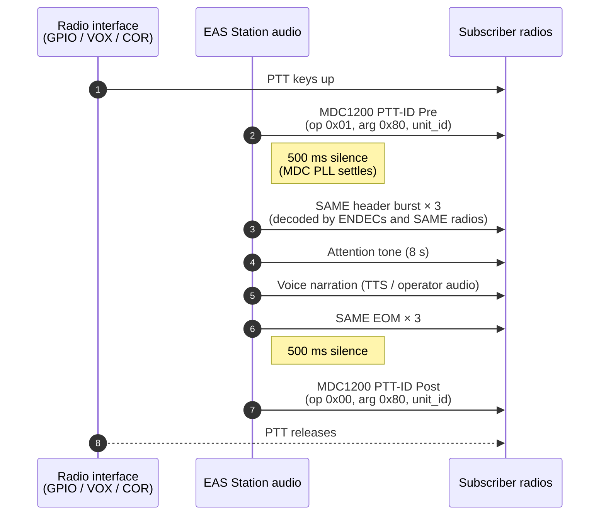
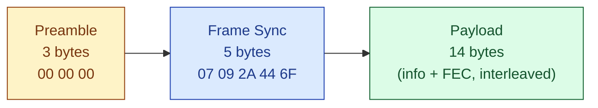
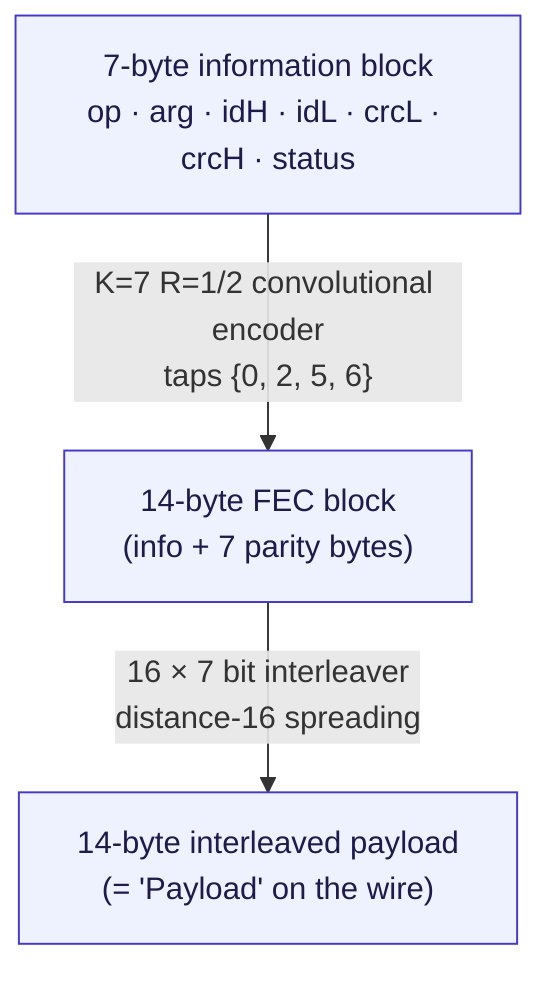

# MDC1200 — Motorola Selective Calling

> **Implementation:** [`app_utils/mdc1200.py`](../../../app_utils/mdc1200.py)
> · **Tests:** [`tests/test_mdc1200.py`](../../../tests/test_mdc1200.py)
> · **Verification:** `multimon-ng -a MDC -t wav <file>.wav`

MDC1200 is Motorola's 1200-baud FFSK signalling protocol for two-way LMR
(Land Mobile Radio) systems. It carries a small amount of digital data —
typically a 16-bit *unit ID* and an op-code/argument pair — over the same
voice audio channel a radio normally uses for speech, so a receiving
subscriber radio can identify *who* is transmitting and *what* event is
being signalled (PTT-ID, emergency alarm, request-to-talk, status update,
etc.).

EAS Station emits MDC1200 as one of the configurable
[pre/post-alert chime profiles](../../guides/ALERT_CHIMES.md). The packet
sits **outside** the SAME signalling — it never overlaps the SAME header,
attention tone, narration, or EOM — so it is invisible to EAS-aware
decoders while being fully decodable by subscriber radios on a shared
LMR channel.

---

## 1. Use case: feeding EAS into an LMR system

The driving design goal of MDC1200 support in EAS Station is **seamless
forwarding of EAS audio into a two-way radio dispatch system**. With MDC1200
chimes enabled and the audio output wired into a base-station radio's
auxiliary input (with PTT keying handled by an external GPIO / VOX / COR
loop), the on-air sequence becomes:



Receiving Motorola (or compatible) subscribers will:

* **Display the calling unit ID** on screen (typically as 4 hex digits).
* **Selectively unmute** for that ID if selective-call is enabled, so EAS
  Station's transmissions only break squelch on radios authorised to hear
  them.
* **Log the call** in the radio's call list / dispatch console.
* **Trigger user-configured tones / lights / vibrate** tied to the unit ID.
* **Cleanly close the call** on the post-ID, so the radio's display
  doesn't latch indefinitely.

Typical fleets where this is useful: county EM dispatch repeaters, volunteer
fire / EMS / Skywarn / RACES nets, school and utility radio systems,
industrial site-wide LMR. Anywhere there is already an MDC1200-capable
fleet, EAS Station can plug in as just another (clearly identified)
talkgroup member.

> **Out of scope (and intentionally so):** EAS Station produces audio. PTT
> keying — the act of putting the radio into transmit — is handled by the
> radio interface (GPIO, COR, VOX, VOIP gateway, etc.) and is **not** part
> of the MDC1200 implementation. Configure your radio interface to key on
> the same trigger that starts EAS Station audio playback.

---

## 2. Physical layer

| Parameter | Value | Notes |
|---|---|---|
| Modulation | **FFSK** (Fast FSK / coherent CPFSK) | Phase-continuous, deviation = ±300 Hz around the 1500 Hz centre |
| Symbol rate | **1200 baud** exactly | |
| Mark frequency (logical 1) | **1200 Hz** | 1 cycle per bit |
| Space frequency (logical 0) | **1800 Hz** | 1.5 cycles per bit |
| Bit order on-air | **MSB-first per byte** | (Note: this differs from SAME, which is LSB-first) |
| Audio channel | Voice band (300–3000 Hz) | Sits in the same audio path as speech, so any narrowband FM voice channel can carry it |
| Required audio bandwidth | ≈ 2.4 kHz | Easily fits in 12.5 kHz / 25 kHz LMR channels |

Phase continuity at mark-to-space transitions is essential — receivers FFSK
demodulate by integrating the phase, so any glitch corrupts the next several
bits. EAS Station re-uses the same `eas_fsk.generate_fsk_samples` renderer
the SAME modem uses, which carries phase across the symbol boundary.

The renderer is parameterised on the audio sample rate (defaults to the
EAS Station-wide setting, typically 16 kHz or 22.05 kHz). At 16 kHz a
complete packet is approximately **147 ms** of audio (~2347 samples).

---

## 3. Frame format

A complete MDC1200 single packet (the only variant EAS Station emits) is
**22 bytes** of pre-modulation data:



After differential ("XOR") modulation is applied across the entire 22-byte
buffer, the on-air bytes are different from the values shown above, but the
*logical* content the receiver recovers is exactly this layout.

### 3.1 Preamble — 3 bytes of `0x00`

After differential modulation, an all-zero input produces a steady stream of
mark tones (because no transitions occur, and the encoder inverts the
"transitioned?" bit so "no change" → 1 → mark). This gives the receiver's
PLL ~20 ms to lock to the 1200 Hz tone before the sync word arrives.

### 3.2 Frame sync — 5 bytes / 40 bits

The canonical Motorola pattern, recognised by every MDC1200 decoder:

| Byte | 0 | 1 | 2 | 3 | 4 |
|---|---|---|---|---|---|
| Hex | `0x07` | `0x09` | `0x2A` | `0x44` | `0x6F` |

Concatenated MSB-first:
```
0000 0111  0000 1001  0010 1010  0100 0100  0110 1111
```

After differential modulation, the on-air sync becomes
`04 8D BF 66 58` (or its bit-inverse `FB 72 40 99 A7` on a polarity-flipped
receiver). EAS Station does not need to care about the on-air form because
the encoder applies the same modulation as the receiver expects.

A receiver typically declares lock when at least 32 of the 40 sync bits
match (a Hamming-distance threshold of ≤8) — this is what `mdc1200.c` style
implementations call `sync_bit_ok_threshold`.

### 3.3 Payload — 14 bytes

Built in three steps from a 7-byte information block, in this order:



The 7-byte information block lays out as:

| Offset | Field | Width | Description |
|---|---|---|---|
| 0 | `opcode` | 8 bits | What event is being signalled |
| 1 | `arg` | 8 bits | Op-code-specific argument |
| 2 | `unit_id` (high) | 8 bits | High byte of the 16-bit subscriber ID |
| 3 | `unit_id` (low) | 8 bits | Low byte of the 16-bit subscriber ID |
| 4 | `CRC` (low byte) | 8 bits | Low byte of CRC-16 over `op,arg,idH,idL` |
| 5 | `CRC` (high byte) | 8 bits | High byte (note: CRC is on-the-wire little-endian) |
| 6 | `status` | 8 bits | `0x00` for PTT-ID variants, `0x76` for STS / MSG |

#### 3.3.1 CRC-16

| Property | Value |
|---|---|
| Polynomial | `x¹⁶ + x¹² + x⁵ + 1` (CRC-CCITT, value `0x1021`) |
| Implementation form | **Reverse polynomial `0x8408`**, LSB-first feedback |
| Initial value | `0x0000` |
| Final XOR | `0xFFFF` |
| Bit order | LSB-first per input byte |
| Coverage | 4 bytes: `op, arg, idH, idL` (the status byte is **not** covered) |

```python
def compute_crc(data):
    crc = 0
    for byte in data:
        crc ^= byte & 0xFF
        for _ in range(8):
            crc = (crc >> 1) ^ 0x8408 if crc & 1 else crc >> 1
    return (crc ^ 0xFFFF) & 0xFFFF
```

**Verified vector:**
```
compute_crc([0x01, 0x80, 0x12, 0x34]) == 0x3E2E
```
On the wire that becomes `2E 3E` (low byte first) at offsets 4–5.

#### 3.3.2 K=7 rate-1/2 convolutional FEC

The 7 information bytes are fed bit-by-bit (LSB-first per byte) into an
**8-bit shift register** that is initialised to zero and **carries state
across all 7 bytes** (it is *not* reset per byte — this is the most common
stumbling block when re-implementing the codec).

For each input bit, one parity bit is generated as:

```
parity = sr[6] ⊕ sr[5] ⊕ sr[2] ⊕ sr[0]
```

where `sr[n]` is bit *n* of the shift register *after* the new input bit
has been shifted in at position 0 and the old bit 7 has fallen off.
Equivalently, the generator polynomial is `g(x) = 1 + x² + x⁵ + x⁶`
(taps at positions {0, 2, 5, 6}).

The 56 generated parity bits are packed back **LSB-first per byte** into 7
output bytes appended to the information block, giving the 14-byte FEC
block.

**Verified vector:**
```
info = [0x01, 0x80, 0x12, 0x34, 0x2E, 0x3E, 0x00]
fec  = [0x65, 0x80, 0xA8, 0x62, 0xDD, 0x88, 0x08]
```

The receiver runs an inverse pass that computes the syndrome over a sliding
4-bit window of `(parity_calc ⊕ parity_received)` and corrects single-bit
errors when ≥ 3 of the last 4 syndrome bits are set, then XORs the syndrome
with `0xA6` to clear the corrected position. In practice this corrects up
to 3–4 corrupted bits per packet.

#### 3.3.3 Bit interleaver — 16 × 7

The 14-byte (112-bit) FEC block is interleaved with a distance-16 mapping
that spreads adjacent FEC bits 16 bits apart on the wire — so a contiguous
burst error on-air becomes scattered single-bit errors in the de-interleaved
stream, exactly the kind the K=7 FEC can repair.

Source-bit walk order (LSB-first per byte) maps to the output bit array as:

```
output_bit_index k = 0
for i in 0 .. 13:
    for bit_num in 0 .. 7:
        output[k] = (payload[i] >> bit_num) & 1
        k += 16
        if k >= 112:
            k -= 111      ← wrap, advances the column by 1
```

This produces the canonical 16-row × 7-column block:

```
output[ 0..15] ← payload bits ( 0, 16, 32, 48, 64, 80, 96, …)
output[16..31] ← payload bits ( 1, 17, 33, 49, 65, 81, 97, …)
…
output[96..111] ← payload bits (15, 31, 47, 63, 79, 95, 111)
```

Output bits are then packed **MSB-first per byte** into the final 14
interleaved bytes that make up the on-air payload.

#### 3.3.4 Differential ("XOR") modulation

After the preamble, sync, and interleaved payload have all been assembled
into a single 22-byte buffer, each bit is replaced by a "did the input bit
change?" flag, MSB-first across the entire buffer, with the previous-bit
register initialised to 0. Each completed output byte is then inverted
(`^ 0xFF`).

```python
prev = 0
for byte in buf:
    out = 0
    for bit_num in (7, 6, 5, 4, 3, 2, 1, 0):
        new_bit = (byte >> bit_num) & 1
        if new_bit != prev:
            out |= 1 << bit_num
        prev = new_bit
    output.append(out ^ 0xFF)
```

The inversion translates "no change" → mark (logical 1), which matches the
on-air convention every MDC1200 receiver expects. This step also makes the
receiver tolerant of audio polarity inversions: a polarity-flipped receiver
sees the **bitwise-inverted** sync word `FB 72 40 99 A7` and trivially
flips its decoded data to recover the original.

---

## 4. Op-code reference

The op-code/arg pair determines what action the receiving radio takes.
EAS Station ships these symbolic presets (defined in
`MDC1200_OP_PRESETS`):

| Preset | `op` | `arg` | Meaning |
|---|---|---|---|
| `ptt_id_pre` | `0x01` | `0x80` | PTT-ID at the start of a transmission |
| `ptt_id_post` | `0x00` | `0x80` | PTT-ID at the end of a transmission |
| `emergency` | `0x40` | `0x80` | Emergency alarm |
| `request_to_talk` | `0x35` | `0x89` | Request-to-talk paging |
| `remote_monitor` | `0x11` | `0x80` | Remote-monitor command |
| *custom* | any | any | Operator-supplied raw bytes |

For a complete-but-not-formally-published list of additional op-codes (status
messages, voice-selective-call, GPS, etc.), the multimon-ng decoder source
and several open-source LMR firmware projects are good cross-references.
Custom raw bytes are accepted for advanced operators who need to interoperate
with non-standard fleets.

### 4.1 Smart pre/post pairing

When **both** the pre and post chimes are set to MDC1200 and the op-code
preset is the default `ptt_id_pre`, EAS Station automatically substitutes
`ptt_id_post` on the post-alert position. This is what
`_resolve_mdc1200_op_for_position()` in `app_utils/eas.py` does — the helper
is intentionally narrow: it **only** rewrites `ptt_id_pre → ptt_id_post`
on the post side, and **only** when `position == 'post'`. All other presets
(including `ptt_id_post` already chosen, `emergency`, `request_to_talk`,
`remote_monitor`, or `custom`) pass through unchanged. This preserves the
behaviour of operators who deliberately want the same op-code on both
sides — for example sandwiching a broadcast in two emergency-alarm packets
to wake every subscriber on a quiet channel.

---

## 5. EAS Station integration

### 5.1 Settings (`eas_settings` table)

| Column | Type | Default | Notes |
|---|---|---|---|
| `mdc1200_unit_id` | `INTEGER NOT NULL` | `1` | 1..65535 (zero is reserved). Stored as a decimal integer; the UI and API accept either decimal (`1234`) or `0x..` hex (`0x04D2`) on input. |
| `mdc1200_op_code` | `VARCHAR(32) NOT NULL` | `'ptt_id_pre'` | One of the preset keys, or `'custom'` |
| `mdc1200_op_code_raw` | `SMALLINT NULL` | `NULL` | 0..255, used only when preset = `'custom'`. Accepts decimal or `0x..` hex on input; rendered as `0xNN` in the UI. |
| `mdc1200_arg_raw` | `SMALLINT NULL` | `NULL` | 0..255, used only when preset = `'custom'`. Accepts decimal or `0x..` hex on input; rendered as `0xNN` in the UI. |

> **Hex input policy.** All three byte/word fields (`mdc1200_unit_id`,
> `mdc1200_op_code_raw`, `mdc1200_arg_raw`) accept full hexadecimal
> notation including the `A`–`F` digits. The HTML inputs use the pattern
> `(0[xX][0-9A-Fa-f]{1,N}|\d{1,M})` and the server parses with
> Python's `int(value, 0)`. This matches Motorola CPS conventions —
> subscriber unit IDs are typically displayed in 4-digit hex on
> programming sheets and on subscriber-radio displays — and lets
> operators paste values directly without conversion. Decimal entry
> remains supported for fleets that prefer it.

These were added by Alembic migration
[`20260505_add_mdc1200_to_eas_settings`](../../../app_core/migrations/versions/20260505_add_mdc1200_to_eas_settings.py).
The auto-heal `_PENDING_MIGRATIONS` block in
[`webapp/admin/maintenance.py`](../../../webapp/admin/maintenance.py) mirrors
the same DDL so installs that update DB-first also self-heal.

### 5.2 Configuration plumbing

`load_config()` (in `app_utils/eas.py`) reads the four DB columns into the
`config` dict, allowing env-var overrides matching the existing pattern:

| Env var | Type | Meaning |
|---|---|---|
| `EAS_MDC1200_UNIT_ID` | int (decimal or `0x..` hex) | Override unit ID |
| `EAS_MDC1200_OP_CODE` | str | Override preset key |
| `EAS_MDC1200_OP_CODE_RAW` | int (decimal or `0x..` hex) | Override raw op byte |
| `EAS_MDC1200_ARG_RAW` | int (decimal or `0x..` hex) | Override raw arg byte |

`_generate_chime()` then routes the config into
`generate_mdc1200_samples(opcode, arg, unit_id, sample_rate, amplitude,
status=0x00)`, which produces the phase-continuous PCM samples.

### 5.3 Audio assembly

The four call sites of `_generate_chime` (`build_files` pre, `build_files`
post, `build_manual_components` pre, `build_manual_components` post) wrap
the op-code in `_resolve_mdc1200_op_for_position(op_code, position)` so
the smart pairing rule (§4.1) is applied uniformly across CAP-forwarded,
OTA-relayed, and manual broadcasts.

### 5.4 Admin UI

`templates/admin.html` exposes the settings under **Admin → EAS Broadcast
Settings → Alert Chimes** with the dropdown options gated by
`data-eas-tone-show="mdc1200"` and `mdc1200-custom`. The `custom`
sub-fields accept either decimal (0..255) or `0x..` hex notation;
`webapp/admin/maintenance.py` parses both via `int(value, 0)`.

---

## 6. Verification & debugging

The single best external verification tool is
[multimon-ng](https://github.com/EliasOenal/multimon-ng):

```bash
# Generate an alert with MDC1200 chimes enabled in admin, then:
multimon-ng -a MDC -t wav /var/www/eas-station/static/eas_messages/<your-alert>.wav

# Expected output line:
#   MDC: 0080 1234 PTT ID POST
#   MDC: 0180 1234 PTT ID PRE
```

Inside the codebase, `tests/test_mdc1200.py` exercises every layer:

| Test | What it pins down |
|---|---|
| `test_compute_crc_known_vector` | CRC-16 implementation matches the published `01 80 12 34 → 0x3E2E` vector |
| `test_apply_fec_known_vector` | K=7 FEC matches `01 80 12 34 2E 3E 00 → 65 80 A8 62 DD 88 08` |
| `test_interleaver_is_a_bit_permutation` | Interleaver loses no bits |
| `test_xor_modulate_zero_buffer_emits_steady_mark` | Preamble assumption (no transitions → all-mark) holds |
| `test_xor_modulate_round_trip` | Differential decode recovers the original |
| `test_encode_packet_length_and_prefix_structure` | 22-byte frame, decoded preamble + sync match canonical values |
| `test_generate_mdc1200_samples_is_phase_continuous` | No glitch ≥ `2·A·sin(π·f/sr)` between any two adjacent samples |
| `test_generate_mdc1200_samples_contains_both_carriers` | Goertzel power at 1200 Hz and 1800 Hz both ≥ 10× off-band power |
| `test_smart_pairing_*` | PTT-ID pre→post substitution, only for the documented case |

Run with `pytest tests/test_mdc1200.py -q`.

---

## 7. Limitations

* Only the **single packet** variant is implemented. The **double packet**
  variant (chained 7-byte info blocks, used to carry e.g. GPS coordinates
  or 4 extra status bytes) is straightforward to add later if a fleet
  needs it — the encoder structure already supports chaining via a second
  `encode_data()` pass.
* EAS Station does not implement an **MDC1200 receiver**. Decoding incoming
  MDC packets from monitored radios would require a full FFSK demodulator
  and the inverse of the encoder pipeline (sync hunt, de-interleave, FEC
  syndrome, CRC verify). Out of scope for the current chime feature; could
  be added as a separate audio-source decoder.
* PTT keying is the responsibility of the radio interface (GPIO, COR, VOX);
  EAS Station only produces audio.

---

## 8. References

* **Algorithmic specification** — public algorithm description in the
  `mdc1200.c` source of the
  [`uv-k5-firmware-custom`](https://github.com/OneOfEleven/uv-k5-firmware-custom/blob/master/mdc1200.c)
  project (GPL-3.0). The algorithm itself (taps {0, 2, 5, 6}, 16×7
  interleaver, reverse-poly CRC-16, differential modulation) is a 1980s
  Motorola specification not subject to copyright; EAS Station's
  implementation is clean-room from that algorithmic description with
  no source code copied.
* **Receiver verification** —
  [multimon-ng](https://github.com/EliasOenal/multimon-ng) MDC decoder.
* **Frame format cross-reference** — `kg-tools` `mdc-encode.c`,
  the `xastir` MDC1200 plugin, and several Motorola Service Manual
  appendices describing CPS programming for MDC-equipped subscribers
  (XPR, CDM, GM340, …) all describe the same wire format.
