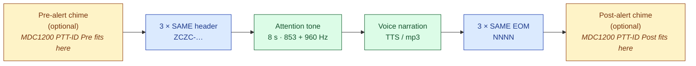

# Protocol References

This directory contains **technical / engineering-level** references for the
on-air signalling protocols EAS Station produces and consumes. They describe
the bit-level frame format, modulation parameters, error-detection and
forward-error-correction schemes, and how each protocol is implemented in
this codebase.

These documents are aimed at developers and operators who need to debug
waveforms, verify implementations against external decoders, or extend the
protocol support. Operator-facing setup instructions live under
[`docs/guides/`](../../guides/) instead.

| Protocol | Document | Modulation | Implementation |
|---|---|---|---|
| **SAME** — Specific Area Message Encoding (FCC 47 CFR §11.31, NRSC-4-B §4) | [SAME.md](SAME.md) | AFSK · 520.83 baud · 2083.33 / 1562.5 Hz | `app_utils/eas_fsk.py`, `app_utils/eas.py`, `app_utils/eas_decode.py`, `app_utils/eas_demod.py` |
| **MDC1200** — Motorola 1200-baud FFSK selective calling | [MDC1200.md](MDC1200.md) | FFSK · 1200 baud · 1200 / 1800 Hz | `app_utils/mdc1200.py` |

For the broader RBDS Annex-D treatment of SAME (as embedded in NRSC-4-B for
FM broadcasters), see also [`../NRSC4B_SAME_STANDARD.md`](../NRSC4B_SAME_STANDARD.md).

## How they are combined

Every EAS Station broadcast — auto-forwarded CAP/IPAWS, OTA EAS relay, or
manually-authored alert — passes through the same composite-audio assembly
in `EASAudioGenerator.build_files` (and `build_manual_components` for
operator-authored events). The on-air timeline is:

The chime slots are protocol-agnostic — they accept any of the profiles
listed in `app_utils/eas.ALERT_CHIME_PROFILES` (`bell`, `beep`, `three_tone`,
`qc2`, `dtmf`, **`mdc1200`**). When MDC1200 is selected for both ends and the
op-code preset is `ptt_id_pre` (the default), the post side automatically
substitutes `ptt_id_post` so subscriber radios see a complete bookend pair.
This is what enables the **two-way LMR forwarding** use case described in
[`MDC1200.md`](MDC1200.md#use-case-feeding-eas-into-an-lmr-system).
