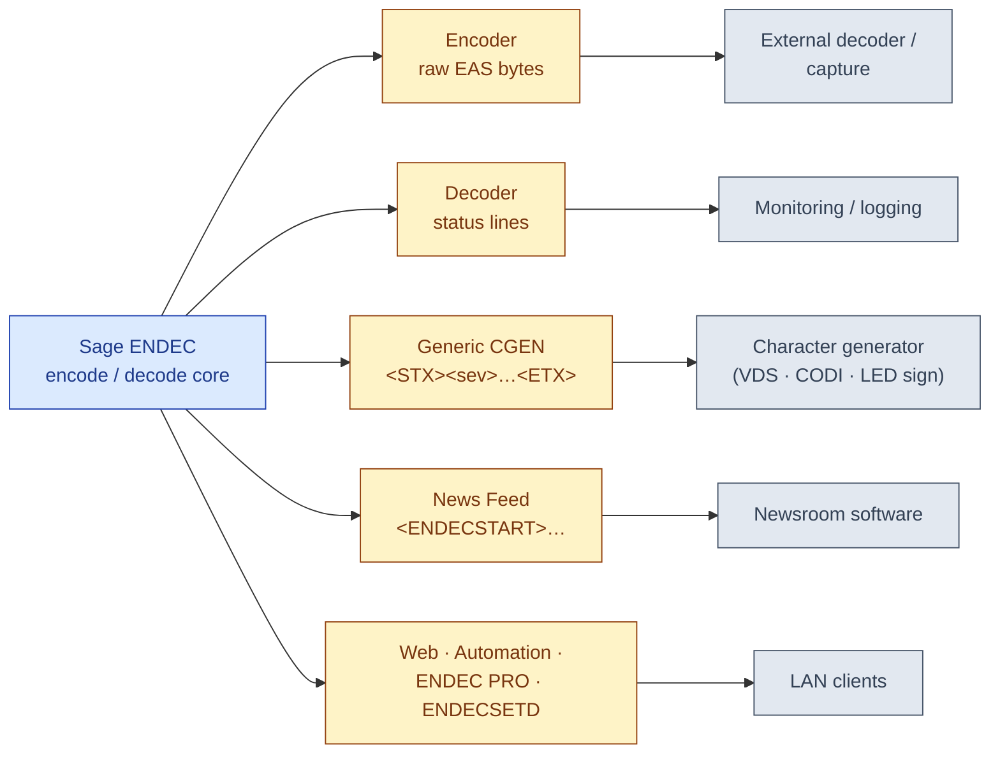
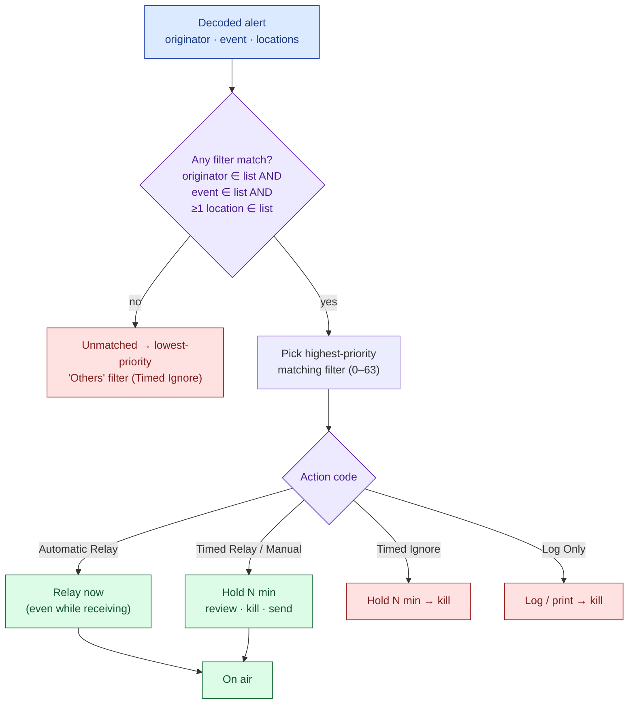
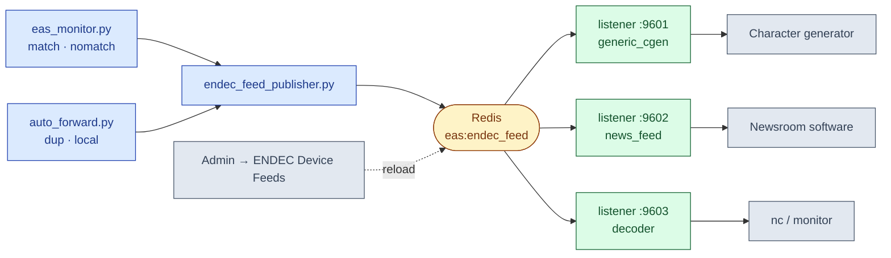

# Sage Digital ENDEC — Protocol & Behavior Reference

> **Source document:** *Sage Alerting Systems — Emergency Alert System
> Encoder/Decoder, Model 3644 (Sage Digital ENDEC), User's Guide and Reference
> Manual*, Rev 1.0e1 (firmware v95), FCC ID `V2W3644`.
> [sagealertingsystems.com/docs/digital_endec_1_0.pdf](https://www.sagealertingsystems.com/docs/digital_endec_1_0.pdf)
>
> **EAS Station implementation referenced below:**
> [`app_utils/eas_fsk.py`](https://github.com/KR8MER/eas-station/blob/main/app_utils/eas_fsk.py),
> [`app_utils/eas.py`](https://github.com/KR8MER/eas-station/blob/main/app_utils/eas.py),
> [`app_utils/eas_decode.py`](https://github.com/KR8MER/eas-station/blob/main/app_utils/eas_decode.py),
> [`app_core/audio/auto_forward.py`](https://github.com/KR8MER/eas-station/blob/main/app_core/audio/auto_forward.py),
> [`app_core/audio/eas_monitor.py`](https://github.com/KR8MER/eas-station/blob/main/app_core/audio/eas_monitor.py).
>
> **Related:** [SAME.md](SAME.md) (our on-air signalling),
> [`../NRSC4B_SAME_STANDARD.md`](../NRSC4B_SAME_STANDARD.md) (the underlying standard).

The Sage Digital ENDEC is the commercial encoder/decoder appliance EAS
Station™ is built to be an open, auditable alternative to. Its manual is the
most complete public description of how a *Part-11-certified* box behaves on
the wire and at its integration ports. This document distills the parts that
matter for our implementation — the SAME wire format as Sage states it, the
serial/network device protocols it exposes, and its incoming-alert filtering
and priority model — and ends with a **gap analysis** (§5) measuring EAS
Station against it.

This is a clean-room behavioral reference compiled from the published manual.
It is **not** Sage firmware, contains no proprietary code, and the
trademarks (Sage®, MHz Sub-Alert™, Chyron CODI™, VDS840EAS™) belong to their
owners.

**Contents**

1. [On-air wire format](#1-on-air-wire-format-as-documented-by-sage)
2. [Serial / network device protocols](#2-serial-network-device-protocols)
3. [Incoming-alert filtering & priority model](#3-incoming-alert-filtering-priority-model-manual-54)
4. [Operational notes worth keeping](#4-operational-notes-worth-keeping)
5. [Gap analysis — EAS Station vs. Sage](#5-gap-analysis-eas-station-vs-sage-digital-endec)
6. [Sources, attribution & IP basis](#6-sources-attribution-ip-basis)

---

## 1. On-air wire format (as documented by Sage)

Sage's description of the EAS alert (manual §2.4) matches FCC 47 CFR §11.31 /
NRSC-4-B §4 and is consistent with our own [SAME.md](SAME.md). Capturing it
here gives us an *independent second source* to validate the encoder against.

| Element | Sage manual value | Notes |
|---|---|---|
| Modulation | FSK, **520.83 baud** | mark **2083.3 Hz**, space **1562.5 Hz** |
| Header repetitions | **3×**, with **1 s of silence** after each | |
| Modulation level | 80% of full channel modulation | Part 11 requirement |
| Two-tone attention | **853 Hz + 960 Hz** simultaneous | each ≥40% (80% combined peak) |
| Two-tone *required for* | Monthly Test, **EAN**, **EAT** only | **not** required for weekly tests |
| EOM | `NNNN`, sent **3×**, same FSK format as header | |
| Preamble | ~¼ second sync sequence | (the `0xAB` byte ×16 — see §2) |

The on-air timeline (manual Figure 2-1):

```mermaid
flowchart LR
    H1["SAME header #1<br/>ZCZC-…"]
    G1["silence<br/>1 s"]
    H2["SAME header #2"]
    G2["silence<br/>1 s"]
    H3["SAME header #3"]
    TONE["Two-tone attention<br/>853 + 960 Hz<br/><i>RMT / EAN / EAT only</i>"]
    AUDIO["Voice / audio message<br/><i>optional</i>"]
    E1["EOM · NNNN"]
    E2["EOM · NNNN"]
    E3["EOM · NNNN"]
    H1 --> G1 --> H2 --> G2 --> H3 --> TONE --> AUDIO --> E1 --> E2 --> E3

    classDef same fill:#dbeafe,stroke:#1e40af,color:#1e3a8a;
    classDef tone fill:#fef3c7,stroke:#92400e,color:#78350f;
    classDef audio fill:#dcfce7,stroke:#166534,color:#14532d;
    classDef gap fill:#f1f5f9,stroke:#94a3b8,color:#475569;
    class H1,H2,H3,E1,E2,E3 same;
    class TONE tone;
    class AUDIO audio;
    class G1,G2 gap;
```



**Header anatomy (manual §2.4, "Parts of an EAS Header"):**

```
ZCZC-ORG-EEE-PSSCCC-PSSCCC…+TTTT-JJJHHMM-LLLLLLLL-
```

| Field | Meaning |
|-------|---------|
| `ORG` | Originator |
| `EEE` | Event code |
| `PSSCCC` | Up to 31 location codes (P = part-of-county, SSCCC = FIPS) |
| `+TTTT` | Duration the alert stays valid |
| `JJJHHMM` | Origination time, UTC (Julian day + HHMM) |
| `LLLLLLLL` | 8-char sending-station ID |

- **Originators (ORG):** Broadcast/Cable (`EAS`), Civil Authorities (`CIV`),
  National Weather Service (`WXR`), Primary Entry Point (`PEP`), Emergency
  Action Notification Network (`EAN`). The last two relay Presidential
  messages.
- **Locations:** up to **31** per header; "about 3300" predefined FIPS land
  codes plus marine codes (manual §18). The relayed ID is the *station that
  relayed to you*, not the originator.
- One header repetition takes 1–4 s depending on location count; all three
  copies plus pauses run 6–16 s.

### 1.1 Event codes (manual Table 5-1)

Sage ships **53** predefined event codes, each with an **English and Spanish**
plain-language phrase. The full table (abbreviated to code → English phrase):

| | | | |
|---|---|---|---|
| EAN Emergency Action Notification | EAT Emergency Action Termination | NIC National Information Center | NPT National Periodic Test |
| RMT Required Monthly Test | RWT Required Weekly Test | TOA Tornado Watch | TOR Tornado Warning |
| SVA Severe Thunderstorm Watch | SVR Severe Thunderstorm Warning | SVS Severe Weather Statement | SPS Special Weather Statement |
| FFA Flash Flood Watch | FFW Flash Flood Warning | FFS Flash Flood Statement | FLA Flood Watch |
| FLW Flood Warning | FLS Flood Statement | WSA Winter Storm Watch | WSW Winter Storm Warning |
| BZW Blizzard Warning | HWA High Wind Watch | HWW High Wind Warning | HUA Hurricane Watch |
| HUW Hurricane Warning | HLS Hurricane Statement | TSA Tsunami Watch | TSW Tsunami Warning |
| EVI Immediate Evacuation | CEM Civil Emergency Message | DMO Practice/Demo Warning | ADR Administrative Message |
| AVW Avalanche Warning | AVA Avalanche Watch | CAE Child Abduction Emergency | CDW Civil Danger Warning |
| CFA Coastal Flood Watch | CFW Coastal Flood Warning | DSW Dust Storm Warning | EQW Earthquake Warning |
| FRW Fire Warning | HMW Hazardous Materials Warning | LEW Law Enforcement Warning | LAE Local Area Emergency |
| NMN Network Message Notification | NUW Nuclear Power Plant Warning | RHW Radiological Hazard Warning | SPW Shelter in Place Warning |
| SMW Special Marine Warning | TOE 911 Telephone Outage Emergency | TRA Tropical Storm Watch | TRW Tropical Storm Warning |
| VOW Volcano Warning | | | |

> The manual predates NWSI 10-1712 (April 2022); EAS Station already tracks the
> newer **EWW, SSW, SSA, BLU** codes in
> [`app_utils/event_codes.py`](https://github.com/KR8MER/eas-station/blob/main/app_utils/event_codes.py). The Spanish
> phrase column is the gap (see §5).

---

## 2. Serial / network device protocols

The ENDEC has a "computer" front port plus COM ports; each is assigned a
**device type** (manual §12.50). These are simple, well-specified wire formats
that any modern integration (or our REST/Socket.IO/Redis stack) can emit as a
compatibility shim. Serial ports are PC-wired (pin 2 RxD, pin 3 TxD, pin 5 GND,
pin 9 = +9 V accessory), use a null-modem cable (swap 2/3), and have a
configurable baud rate (manual §13.1, §12.49).



### 2.1 Device-type catalog (manual §12.50)

| Device type | Purpose | Format ref |
|---|---|---|
| **Encoder** | Raw EAS bytes **in and out** | §2.2 |
| **Decoder** | EAS decoder *status* output | §2.3 |
| **GENERIC CGEN** | Alert text for character generators | §2.4 |
| **News Feed** | Framed alert text for newsroom software | §2.5 |
| **Serial Printer** | Mirror of the thermal-printer log | — |
| **ENDECSET** | `ENDECSETD` config save/restore (PC) | §2.6 |
| **ENDEC PRO** | Point-and-click alert send/relay app | §2.6 |
| **Hand Control** | RC-1 handheld remote | — |
| **LED SIGN**, **VDS CGEN**, **VDS MC**, **CODI CGEN**, **STAR-8** | Specific sign / character-generator models | — |
| Modem, RECON, Sony, CONSOLE | Legacy / niche | — |

### 2.2 Raw EAS — "Encoder" device (manual §9.1)

Same protocol as Part-11 synchronous EAS data, but **async, one stop bit**.
The sync byte `0xAB` (shown as `+`) is expected on input and emitted on output.
Bytes fed *in* are interpreted exactly as FSK heard on an audio port; if they
trigger an alert, the ENDEC pulls audio from its Encoder Audio In. Bytes
sent *out* mirror everything the ENDEC transmits. Sample output:

```
++++++++++++++++ZCZC-EAS-RWT-006013+0015-1020624-SAGE-
++++++++++++++++ZCZC-EAS-RWT-006013+0015-1020624-SAGE-
++++++++++++++++ZCZC-EAS-RWT-006013+0015-1020624-SAGE-
++++++++++++++++NNNN++++++++++++++++NNNN++++++++++++++++NNNN
```

(16 sync bytes precede each of the three headers and each of the three EOMs.)

### 2.3 EAS decoder status — "Decoder" device (manual §9.1)

Emits decoder state whenever a message is received or sent:

```
<type>:<zczc string>
<expanded plain-language text>
```

| `<type>` | Meaning |
|---|---|
| `local:` | An alert is being **sent** by the ENDEC |
| `match:` | Heard, and it **matches an input filter** |
| `nomatch:` | Heard, but **matches no filter** |
| `dup:` | This alert has **already been heard** |

Example:

```
local:ZCZC-EAS-RWT-006013+0015-1020638-SAGE-
A Broadcast station or cable system has issued a Required Weekly Test for
Contra Costa, CA beginning at 02:38 am and ending at 02:53 am (SAGE)
```

### 2.4 Generic Character Generator (manual §9.3)

```
<STX><sev><text><ETX>
```

| Field | Bytes | Meaning |
|---|---|---|
| `STX` | `0x02` | start |
| `sev` | `0x31`/`0x32`/`0x33` (`'1'`/`'2'`/`'3'`) | severity → display color: `1` most severe (TOR, EAN), `2` less (TOA), `3` not (RWT) |
| `text` | UTF/ASCII | expanded message, up to ~2000 bytes if English **and** Spanish are enabled |
| `ETX` | `0x03` | end |

### 2.5 News Feed (manual §9.4)

Each message is wrapped so newsroom software can find boundaries:

```
<ENDECSTART>
Local Alert sent at 02/07/97 22:52:55
The National Weather Service has issued a Severe Thunderstorm Watch for
Aleutian Islands, AK beginning at 10:52 pm and ending at 11:07 pm (SAGE)
ZCZC-WXR-SVA-002010+0015-0390352-SAGE-
<ENDECEND>
```

### 2.6 Network interfaces (manual §6, §12.62, §12.70)

- **Web server** (HTTP config UI).
- **Automation interface** — a TCP port at `portbase`
  (`MENU.NETWORK.PORT BASE`), enabled by `MENU.NETWORK.AUTOMATION`.
- **ENDEC PRO/DJ** LAN interface.
- **ENDECSETD** — config save/restore, over LAN or a serial port.

> **Security note (manual §6.1):** all network services — web server,
> automation interface, PRO/DJ — ship **disabled by default**. The box is
> opt-in over the network. A useful posture to mirror.

---

## 3. Incoming-alert filtering & priority model (manual §5.4)

This is the richest part of the manual for our purposes. Sage's relay logic is
a **filter list**, evaluated against each decoded alert.

**A filter matches when:** the alert's originator is in the filter's originator
list **AND** the event is in its event list **AND** at least one of the alert's
locations is in its location list.

Each matched filter carries an **action**, a **priority** (0–63), an
**attention-tone duration**, and a **hold** time.



### 3.1 Action codes (manual Table 5-2)

| Action | Behavior |
|---|---|
| **Automatic Relay** | Relay immediately, even while still being received |
| **Timed Relay** | Wait *N* minutes (reviewable/killable), then relay |
| **Timed Ignore** | Wait *N* minutes (reviewable), then kill |
| **Manual Relay** | Like Timed Relay, but the hold delay applies even in automatic mode |
| **Log Only** | Print/log, then kill |

### 3.2 Factory-default filters (manual Table 5-3)

| Filter | Originators | Events | Locations | Action | Priority | ATTN | Hold |
|---|---|---|---|---|---|---|---|
| Required EAN | EAN / PEP | EAN, EAT | ANY | Automatic Relay | **63** | 8 s | 0 min |
| Required Monthly Test | CIV, EAS | RMT | local area | Timed Relay | 60 | 8 s | 5 min |
| Required Weekly Test | CIV, EAS | RWT | local area | **Log Only** | 50 | — | — |
| Others | Any | Any | Any | Timed Ignore | 40 | 0 | 10 min |

Key takeaways: the **highest-priority matching filter wins**; the Presidential
filter relays instantly with no hold; weekly tests are logged but **never put
on air**; everything unmatched falls through to a low-priority timed-ignore.

### 3.3 Override / hold-off (manual §9.5, §9.6)

- **Commercial tally / Hold Off** — a relay input lets station automation defer
  a pending alert (max **15 minutes**) so it doesn't interrupt a commercial
  break. The ENDEC can also *close* a relay to tell automation an alert is
  pending (a two-step handshake).
- **`MIN OVERRIDE PRIO`** — filters above this priority **ignore** the hold-off.
  `EAN`/`EAT` always ignore it.
- **Hold Off Night** — for daytime-only stations: overnight RMTs are held
  (exempt from the 15-minute cap) and relayed in the morning.

---

## 4. Operational notes worth keeping

- **Three config surfaces, one state:** front panel, web browser, and serial
  (`ENDECSETD`) all mutate the same parameter store. Good consistency model.
- **Explicit volatility contract** (manual §3.3): the box documents exactly
  what survives a reboot and what doesn't.
- **Blink error codes** (manual §14.1): a small, documented diagnostic
  vocabulary mapping LED patterns to fault classes.
- **TTS fallback:** for CAP alerts without attached audio, the ENDEC
  text-to-speech-renders the CAP text (manual §2.4) — the same strategy EAS
  Station uses.

---

## 5. Gap analysis — EAS Station vs. Sage Digital ENDEC

Measured against the codebase as of this writing. ✅ = parity/better,
⚠️ = partial/different, ❌ = not implemented.

### 5.1 On-air wire format — full parity ✅

| Aspect | Sage | EAS Station | Where |
|---|---|---|---|
| Baud | 520.83 | `SAME_BAUD = Fraction(3125, 6)` | [`eas_fsk.py:28`](https://github.com/KR8MER/eas-station/blob/main/app_utils/eas_fsk.py) |
| Mark / space | 2083.3 / 1562.5 Hz | `SAME_BAUD*4` / `SAME_BAUD*3` | [`eas_fsk.py:29-30`](https://github.com/KR8MER/eas-station/blob/main/app_utils/eas_fsk.py) |
| Preamble | `0xAB` ×16 | `SAME_PREAMBLE_BYTE=0xAB`, `…REPETITIONS=16` | [`eas_fsk.py:31-32`](https://github.com/KR8MER/eas-station/blob/main/app_utils/eas_fsk.py) |
| Header / EOM ×3 | yes | `NRSC4B_BURST_COUNT = 3` | [`eas.py:680`](https://github.com/KR8MER/eas-station/blob/main/app_utils/eas.py) |
| Two-tone | 853 + 960 Hz | `(853.0, 960.0)` | [`eas.py:2701`](https://github.com/KR8MER/eas-station/blob/main/app_utils/eas.py), [`:3095`](https://github.com/KR8MER/eas-station/blob/main/app_utils/eas.py) |
| ≤31 locations | yes | `NRSC4B_MAX_LOCATIONS = 31` (enforced) | [`eas.py:660`](https://github.com/KR8MER/eas-station/blob/main/app_utils/eas.py) |
| Duration `+TTTT` | HHMM | `_duration_code()` | [`eas.py:1084`](https://github.com/KR8MER/eas-station/blob/main/app_utils/eas.py) |
| Time `JJJHHMM` UTC | Julian + UTC | `_julian_time()` | [`eas.py:1078`](https://github.com/KR8MER/eas-station/blob/main/app_utils/eas.py) |
| Header build | `ZCZC-…` | `build_same_header()` | [`eas.py:1160`](https://github.com/KR8MER/eas-station/blob/main/app_utils/eas.py) |

> EAS Station additionally supports the **1050 Hz NWR single tone**
> ([`eas.py:2699`](https://github.com/KR8MER/eas-station/blob/main/app_utils/eas.py), [`:3092`](https://github.com/KR8MER/eas-station/blob/main/app_utils/eas.py)),
> which the Sage manual does not document on the broadcast path.

### 5.2 Two-tone-on-RWT suppression — parity ✅ (and stricter)

Sage says the two-tone is *not required* for weekly tests. EAS Station goes
further and **prohibits** it: RWT relay forces `relay_tone_profile = 'none'`
([`auto_forward.py:960-963`](https://github.com/KR8MER/eas-station/blob/main/app_core/audio/auto_forward.py), citing
FCC §11.61), and RWT is suppressed from forwarding entirely unless the operator
opts in via `forwarded_event_codes`
([`auto_forward.py:579`](https://github.com/KR8MER/eas-station/blob/main/app_core/audio/auto_forward.py),
[`:846`](https://github.com/KR8MER/eas-station/blob/main/app_core/audio/auto_forward.py)).

### 5.3 Filtering — present, but a *different model* ⚠️

| Sage concept | EAS Station |
|---|---|
| Originator + event + location filter match | Location/FIPS match in [`eas_monitor.py`](https://github.com/KR8MER/eas-station/blob/main/app_core/audio/eas_monitor.py) + event-code allowlist `forwarded_event_codes` ([`auto_forward.py:575`](https://github.com/KR8MER/eas-station/blob/main/app_core/audio/auto_forward.py)) |
| Numeric priority 0–63, highest wins | ❌ No numeric priority. Closest analog is the **Must-Carry** boolean (`EAS-Must-Carry`, ECIG §3.4.1.7) at [`auto_forward.py:104`](https://github.com/KR8MER/eas-station/blob/main/app_core/audio/auto_forward.py) |
| Action codes (Auto / Timed Relay / Timed Ignore / Manual / Log Only) | ❌ Effectively Auto-Relay vs. drop; **no timed-relay/timed-ignore hold window** |
| Duplicate detection (`dup:`) | ✅ **Stronger** — 3-tier dedup (header-key, issuer-identity, full-FIPS-set) in `is_duplicate_broadcast()` ([`auto_forward.py:240`](https://github.com/KR8MER/eas-station/blob/main/app_core/audio/auto_forward.py)) |

### 5.4 Hold-off / commercial tally / day-night — not implemented ❌

No commercial-tally relay gate, no `MIN OVERRIDE PRIO`, no Hold-Off-Night for
overnight RMT retention. RWT/relay paths fire immediately or not at all. This
is the clearest *operational* feature gap for broadcaster parity.

### 5.5 Integration output formats — implemented ✅

All four Sage device-feed formats are now emitted over TCP by the
**ENDEC Device Feeds** subsystem (configure under *Admin → ENDEC Device Feeds*):

| Sage device | EAS Station | Where |
|---|---|---|
| Generic CGEN `<STX><sev><text><ETX>` | ✅ | [`endec_feeds.py:format_generic_cgen`](https://github.com/KR8MER/eas-station/blob/main/app_utils/endec_feeds.py) |
| News Feed `<ENDECSTART>…<ENDECEND>` | ✅ | [`endec_feeds.py:format_news_feed`](https://github.com/KR8MER/eas-station/blob/main/app_utils/endec_feeds.py) |
| Decoder status `local:`/`match:`/`nomatch:`/`dup:` | ✅ | [`endec_feeds.py:format_decoder_status`](https://github.com/KR8MER/eas-station/blob/main/app_utils/endec_feeds.py) |
| Raw EAS Encoder byte mirror (`0xAB`-framed) | ✅ (outgoing) | [`endec_feeds.py:format_raw_encoder`](https://github.com/KR8MER/eas-station/blob/main/app_utils/endec_feeds.py) |



**Architecture:** the detection/forwarding pipeline publishes a feed event to
Redis (`eas:endec_feed`) at four points — `match`/`nomatch` in
[`eas_monitor.py`](https://github.com/KR8MER/eas-station/blob/main/app_core/audio/eas_monitor.py) and `dup`/`local` in
[`auto_forward.py`](https://github.com/KR8MER/eas-station/blob/main/app_core/audio/auto_forward.py) — via
[`endec_feed_publisher.py`](https://github.com/KR8MER/eas-station/blob/main/app_core/audio/endec_feed_publisher.py).
The [`services.endec_feeds`](https://github.com/KR8MER/eas-station/tree/main/services/endec_feeds) daemon subscribes,
renders each event into every configured feed's wire format, and fans the bytes
out to connected TCP clients (one listener per feed/port). Saving the admin
form hot-reloads the daemon over a Redis control channel. Unlike Sage's
RS-232 ports, the transport is TCP (connect with a character generator,
newsroom system, or `nc <host> <port>`). The pre-existing structured JSON to
Redis (`eas:alerts:received`) and webhooks
([`alert_forwarding.py`](https://github.com/KR8MER/eas-station/blob/main/app_core/audio/alert_forwarding.py)) remain
available alongside these byte-stream feeds.

### 5.6 Plain-language text — English yes, Spanish no ⚠️

`build_plain_language_summary()`
([`eas_decode.py:207`](https://github.com/KR8MER/eas-station/blob/main/app_utils/eas_decode.py)) produces readable
English. There is **no Spanish** generator or bilingual event-phrase table,
which Sage carries for all 53 codes (manual Table 5-1).

### 5.7 Summary of actionable gaps

| # | Gap | Status |
|---|---|---|
| 1 | **Generic CGEN / News Feed / Decoder-status** output shims | ✅ Done — §5.5 (over TCP) |
| 5 | **Raw EAS Encoder** byte mirror (`0xAB`-framed) | ✅ Done — §5.5 (outgoing alerts) |
| 2 | **Bilingual (Spanish) event phrases** + plain-language renderer | ⬜ Open — Medium effort; reuse Table 5-1 |
| 3 | **Hold-off / commercial-tally + day-night RMT retention** | ⬜ Open — Medium; real broadcaster requirement |
| 4 | **Priority + action-code filter model** (Timed Relay/Ignore, priority-ranked filters) | ⬜ Open — High; full Sage-class relay control |

> Items 1 and 5 shipped as the **ENDEC Device Feeds** subsystem. Items 3 and 4
> remain the substantive operational/architectural deltas if full appliance
> parity is a goal.

---

## 6. Sources, attribution & IP basis

This document and the `endec_feeds` implementation are **clean-room
interoperability work** built only from Sage's **publicly published** support
manual:

- **Facts, not expression.** What is reproduced here are functional facts —
  wire formats, framing bytes, baud rates, event-code lists, configuration
  values — which are not protected by copyright. The manual's prose is
  paraphrased, not copied; only short functional snippets (format strings,
  sample headers) are quoted.
- **Mostly a federal standard.** The SAME signalling itself is mandated by
  **FCC 47 CFR §11.31** and **NWS Instruction 10-1712**; it is not Sage's
  proprietary invention.
- **No proprietary code.** No Sage firmware or source was accessed or used.
  Every line in `app_utils/endec_feeds.py` and `services/endec_feeds/` is
  original to EAS Station.
- **Trademarks** (Sage®, Chyron CODI™, VDS840EAS™, MHz Sub-Alert™) belong to
  their owners and are referenced only descriptively; EAS Station does not
  imply endorsement by or affiliation with Sage Alerting Systems, Inc.

This mirrors standard compatibility practice ("works with X"). It is not legal
advice; patent questions are out of scope of a manual review.
