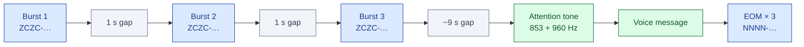
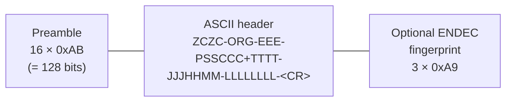
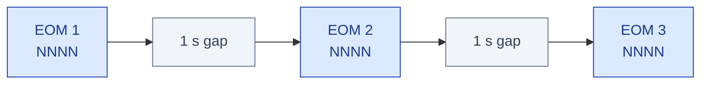
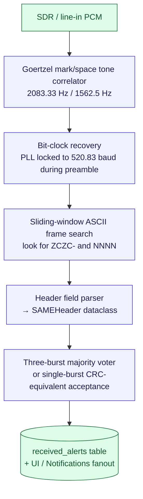

# SAME — Specific Area Message Encoding

> **Implementation:**
> [`app_utils/eas_fsk.py`](https://github.com/KR8MER/eas-station/blob/main/app_utils/eas_fsk.py) (encoder primitives)
> · [`app_utils/eas.py`](https://github.com/KR8MER/eas-station/blob/main/app_utils/eas.py) (`EASAudioGenerator`,
> header construction, attention tone, EOM)
> · [`app_utils/eas_decode.py`](https://github.com/KR8MER/eas-station/blob/main/app_utils/eas_decode.py) (offline decoder)
> · [`app_utils/eas_demod.py`](https://github.com/KR8MER/eas-station/blob/main/app_utils/eas_demod.py) (live AFSK demodulator)
>
> **Standards:**
> FCC 47 CFR §11.31 (regulatory definition)
> · NRSC-4-B §4 / Annex D (industry standard, summarised in
> [`../NRSC4B_SAME_STANDARD.md`](../NRSC4B_SAME_STANDARD.md))

SAME (Specific Area Message Encoding) is the audio-layer signalling
protocol used by the U.S. Emergency Alert System (EAS) and NOAA Weather
Radio (NWR) to convey machine-readable alert headers. Every EAS
activation begins with a SAME header burst, is followed by an audio
attention tone and a voice (or synthesised) message, and ends with a
SAME End-of-Message (EOM) burst.

EAS Station™ produces SAME audio for every outgoing broadcast — auto-
forwarded CAP/IPAWS, OTA EAS relay, and operator-authored manual events —
and consumes SAME audio off-air via the SDR / line-in receivers, decoding
it back into structured alerts.

---

## 1. Physical layer

| Parameter | Value | Notes |
|---|---|---|
| Modulation | **AFSK / NRZ** (audio-frequency-shift keying, non-return-to-zero) | No start/stop bits, no inter-bit gaps within a burst |
| Symbol rate | **520 5⁄6 baud** = `25 000 / 48` exactly = `Fraction(3125, 6)` | Stored as `SAME_BAUD` in `app_utils/eas_fsk.py` |
| Mark frequency (logical 1) | **2083 1⁄3 Hz** = `4 × 25000 / 48` | `SAME_MARK_FREQ` |
| Space frequency (logical 0) | **1562.5 Hz** = `3 × 25000 / 48` | `SAME_SPACE_FREQ` |
| Centre frequency | **1822.9 Hz** | Mid-point used by FM-discriminator demodulators |
| Bit order on-air | **LSB-first per byte** | (Note: this differs from MDC1200, which is MSB-first) |
| Audio channel | Voice band (300–3000 Hz) | Compatible with telephone, FM stereo, AM, narrowband LMR |

The 520 5⁄6 baud rate produces exactly 4 mark-cycles or 3 space-cycles per
bit period (1.92 ms/bit), giving the AFSK waveform integer-cycle symbols
that align cleanly at every bit boundary — this is what makes SAME
decodable on minimal receivers like NWR-only weather radios.

EAS Station™'s renderer (`generate_fsk_samples`) is phase-continuous: phase
is carried across every symbol boundary so there are no glitches at
mark-to-space transitions. The fractional-bit timing
(`samples_per_bit = sr / 520.83…`) is handled by a per-bit carry
accumulator so the integer sample count rounds out correctly across many
bits — at 16 kHz, the mean is ~30.72 samples/bit but individual bits
round to 30 or 31 to maintain the exact 25000/48 baud rate over the burst.

---

## 2. Burst structure

A complete SAME header transmission consists of **three identical bursts**,
each repeated for redundancy. A receiver decodes each burst independently
and accepts the message if any one (or, for stricter implementations,
two of three) decodes cleanly with a valid checksum-equivalent comparison.



Each burst is a continuous bit stream made of three concatenated parts:



### 2.1 Preamble

16 bytes of `0xAB` (binary `10101011`), transmitted LSB-first with no
framing. As bits this is `1101 0101` repeated, which alternates roughly
every bit and gives the receiver a strong clock-recovery signal at the
half-baud rate. After the preamble the receiver is locked and ready to
sample data bits at the correct phase.

`SAME_PREAMBLE_BYTE = 0xAB`, `SAME_PREAMBLE_REPETITIONS = 16` in
`app_utils/eas_fsk.py`.

### 2.2 ASCII header

Exactly the format mandated by FCC 47 CFR §11.31(c). Fields are
hyphen-delimited; the entire string is terminated with a single ASCII
carriage return (`0x0D`).

```
ZCZC-ORG-EEE-PSSCCC+TTTT-JJJHHMM-LLLLLLLL-<CR>
```

| Field | Meaning |
|-------|---------|
| `ZCZC-` | Mandatory literal start-of-frame |
| `ORG` | Originator code (3 chars), e.g. "WXR" (NWS), "EAS" (broadcaster), "CIV" (civil), "PEP" (national) |
| `EEE` | Event code (3 chars), e.g. "RWT", "EAS", "TOR", "SVR" |
| `PSSCCC` | One or more location codes (county FIPS), `+`-joined |
| `TTTT` | Validity (purge time) HHMM, e.g. "0030" = 30 minutes |
| `JJJHHMM` | Issue time: ordinal day-of-year (3 digits) + UTC HHMM (4 digits) |
| `LLLLLLLL` | Originator station callsign (8 chars, NUL-padded) |
| `<CR>` | Terminating ASCII carriage return (`0x0D`) |

Each character is encoded as:

* **7 ASCII data bits, LSB-first**, followed by
* **One null bit** (zero) — the eighth bit of the byte, which the FCC
  rule specifies as "either 0 or 1" but is conventionally always 0.

This is the responsibility of `encode_same_bits` in
`app_utils/eas_fsk.py`. Crucially there are **no start or stop framing
bits** between characters — the bit stream is continuous within the burst.

### 2.3 ENDEC fingerprint (optional, EAS Station™ extension)

Immediately after the carriage return, EAS Station™ optionally transmits 3
copies of the byte `0xA9` (binary `10101001`, 24 mostly-alternating mark/space
pulses, ~46 ms). This is **not** part of the SAME standard — it is a
common ENDEC-vendor convention for station fingerprinting, used to
identify the originating ENDEC model from the audio waveform. It is
controlled by the `endec_fingerprint` setting in `EASSettings` and
implemented via `encode_terminator_bits(0xA9, 3)`.

Because it falls *after* the SAME `<CR>`, every standards-compliant
decoder treats it as inter-burst silence/noise and ignores it.

---

## 3. Attention tone

Between burst 3 of the header and the start of the voice message, EAS
broadcasters emit an 8-second to 25-second **dual-tone** "attention
signal":

| Frequency | Hz |
|---|---|
| Tone 1 | **853.0 Hz** |
| Tone 2 | **960.0 Hz** |

EAS Station™ emits the standard 853 + 960 Hz mix for 8 seconds by default
(configurable via `attention_tone_seconds`). NOAA Weather Radio uses a
single 1050 Hz "warning alarm tone" instead; the codebase supports both
forms via the `_tone_freqs` selector in `app_utils/eas.py`.

The attention tone is **not** part of the SAME signalling — its purpose is
to alert humans (it survives FM broadcast EQ and squelch tails). SAME
decoders typically use the gap *before* the tone as their detection
window for the EOM-or-tone classifier.

---

## 4. End-of-Message (EOM)

Three identical EOM bursts terminate the broadcast:



Each EOM burst has the same 16-byte `0xAB` preamble as the header bursts,
followed by the ASCII string `NNNN`. **The EOM has no carriage return
terminator** — FCC §11.31 specifies only the four ASCII characters. EAS
Station handles this distinction via the `include_cr` parameter to
`encode_same_bits` (default `True`; set `False` for EOM).

After EOM 3, ~1 second of trailing silence is appended before the
post-alert signal (if any) is rendered.

---

## 5. Composite audio assembly

Putting it all together, every EAS Station™ broadcast follows this exact
audio timeline, assembled in `EASAudioGenerator.build_files`:

```mermaid
flowchart LR
    PRE["Pre-alert signal<br/>(optional)"]
    S1["SAME header #1"]
    S2["SAME header #2"]
    S3["SAME header #3"]
    TONE["Attention tone<br/>853 + 960 Hz · 8 s"]
    VOICE["Voice message"]
    E1["EOM #1"]
    E2["EOM #2"]
    E3["EOM #3"]
    POST["Post-alert signal<br/>(optional)"]

    PRE -->|0.5 s silence| S1
    S1 -->|1 s gap| S2
    S2 -->|1 s gap| S3
    S3 -->|~9 s silence| TONE
    TONE --> VOICE
    VOICE --> E1
    E1 -->|1 s gap| E2
    E2 -->|1 s gap| E3
    E3 -->|1 s silence| POST

    classDef signal fill:#fef3c7,stroke:#92400e,color:#78350f;
    classDef same fill:#dbeafe,stroke:#1e40af,color:#1e3a8a;
    classDef voice fill:#dcfce7,stroke:#166534,color:#14532d;
    class PRE,POST signal;
    class S1,S2,S3,E1,E2,E3 same;
    class TONE,VOICE voice;
```



The "voice message" segment can include per-broadcast `pre_alert_samples`
and `post_alert_samples` operator uploads bracketing the narration —
distinct from the system-level pre/post-alert *signals* described in
[`ALERT_SIGNALS.md`](../../guides/ALERT_SIGNALS.md). All audio is finally
serialised to a 16 kHz (default) signed-int16 mono WAV by
`samples_to_wav_bytes`.

---

## 6. Origination → broadcast pipeline

EAS Station™ builds SAME audio from one of four input paths, all converging
into `EASAudioGenerator.build_files`:

| Source | Trigger | Where |
|---|---|---|
| **CAP (IPAWS, NWS)** | poller pulls a CAP-XML alert and the event code matches the forwarded set | `app_core/cap_poller.py` → `app_utils/alert_sources.py` |
| **OTA EAS relay** | live demodulator decodes a header from a monitored receiver | `app_utils/eas_demod.py` → `app_utils/eas_detection.py` |
| **Manual** | operator authors and submits a broadcast | `app_utils/eas.py` `build_manual_components` |
| **RWT/RMT scheduled** | required-weekly-test scheduler fires | `app_core/rwt_scheduler.py` |

All four paths funnel into the same SAME header construction:

```python
ZCZC-ORIG-EEE-PSSCCC+...+PSSCCC-TTTT-JJJHHMM-LLLLLLLL-<CR>
```

…with `ORIG`, `EEE`, the location code list, validity, issue time, and
station ID populated from `EASSettings` plus the alert-specific fields.

---

## 7. Reception path

Live SAME demodulation lives in `app_utils/eas_demod.py`. The pipeline is:



Field parsing and validation share code with `app_utils/eas_decode.py` —
the offline decoder used for bench testing and forensic replay of
recorded captures. `app_utils/eas_codes.py` and `app_utils/event_codes.py`
provide the originator/event code lookup tables used both during decode
(for human-readable display) and during encode (for validation).

---

## 8. Tests

| Test file | What it pins down |
|---|---|
| [`test_eas_fsk.py`](https://github.com/KR8MER/eas-station/blob/main/tests/test_eas_fsk.py) | Bit-encoding (LSB-first 7+1, preamble, terminator), AFSK sample count and phase continuity |
| [`test_eas_build_same_header.py`](https://github.com/KR8MER/eas-station/blob/main/tests/test_eas_build_same_header.py) | Header field assembly: ORG, EEE, location-code list, time, station ID |
| [`test_eas_decode.py`](https://github.com/KR8MER/eas-station/blob/main/tests/test_eas_decode.py) | Round-trip encode → decode of representative alerts |
| [`test_eas_sample_rate_evaluation.py`](https://github.com/KR8MER/eas-station/blob/main/tests/test_eas_sample_rate_evaluation.py) | Bit-timing accuracy across 8 / 16 / 22.05 / 44.1 / 48 kHz |
| [`test_eas_monitor_*.py`](https://github.com/KR8MER/eas-station/tree/main/tests) | Live-monitor duplicate handling, FIPS matching, runtime consistency |

---

## 9. References

* **FCC 47 CFR §11.31** — Emergency Alert System Codes; SAME definition
  (the regulatory source of truth).
  <https://www.ecfr.gov/current/title-47/chapter-I/subchapter-A/part-11>
* **NRSC-4-B §4 + Annex D** — *United States RBDS Standard*, SAME
  industry specification for FM broadcasters. See companion
  [`../NRSC4B_SAME_STANDARD.md`](../NRSC4B_SAME_STANDARD.md).
* **NWS Instruction 10-1712** — NOAA Weather Radio SAME usage and event
  code list.
* **EAS Handbook** — FCC operational guidance for broadcasters.

---

## 10. Implementation notes

* All SAME timing constants are exact rationals (`Fraction`) at the
  module top of `app_utils/eas_fsk.py` to avoid floating-point drift.
* The encoder is deliberately decoupled from the audio output device:
  it produces an `int16`-range Python `list[int]` that
  `samples_to_wav_bytes` finalises to a WAV. This keeps the modem
  trivially testable and lets the same code drive `aplay`, an Icecast
  stream, a sound card, or a buffer fed to the airchain mixer.
* Phase-continuous FFSK rendering is shared with the MDC1200 encoder
  (see [`MDC1200.md`](MDC1200.md)) — both protocols call into
  `generate_fsk_samples` with their own baud / mark / space parameters.
