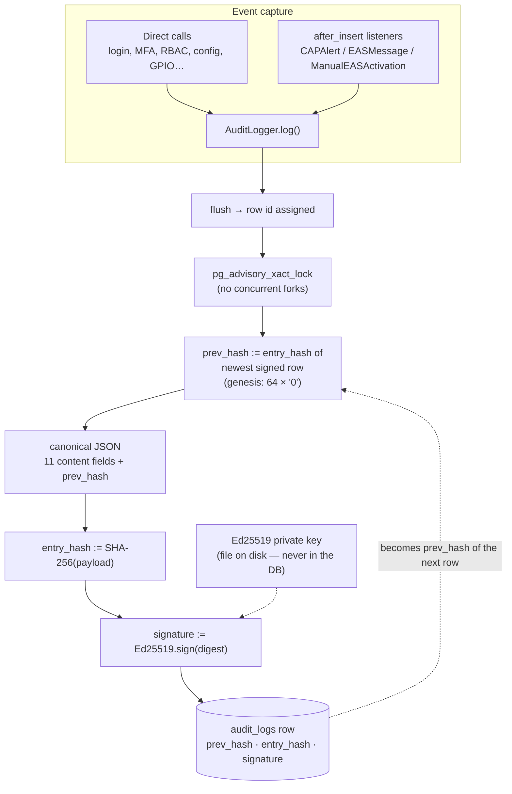

# Audit Log Integrity (Tamper-Evident Chain)

EAS Station™ keeps a cryptographically tamper-evident audit log. Every row in
the `audit_logs` table is **hash-chained** to the row before it and **signed**
with a station-specific Ed25519 key. The result is a log where any edit,
deletion, insertion, or reordering — even one performed directly against the
database with `psql` — is mathematically detectable.

This is the difference between *"we logged it"* and *"we can prove the log
hasn't been edited."* For incident reviews, FCC interactions, and internal
investigations, that distinction is the whole point.

- **Introduced:** v2.75.0 (migration `20260515_add_chain_columns_to_audit_logs`)
- **Verification UI:** **System Logs → Audit tab → Verify Chain Integrity**
  (`/logs?type=audit`)
- **Verification API:** `GET /security/audit-logs/verify`
- **Implementation:** `app_core/auth/audit.py` (`AuditLogger`),
  `app_core/auth/_audit_signing_key.py` (key loading),
  `app_core/auth/audit_listeners.py` (automatic alert-lifecycle capture)
- **Tests:** `tests/test_audit_chain.py`

---

## How It Works

### The Write Path

Every call to `AuditLogger.log()` — whether from a login, a configuration
change, or the automatic alert-lifecycle listeners — builds one link of the
chain inside a single database transaction:

1. **Flush** the new row so it receives its auto-increment `id`.
2. **Lock** the chain. On PostgreSQL a transaction-scoped advisory lock
   (`pg_advisory_xact_lock`) serializes concurrent writers so two gunicorn
   workers can never read the same "latest hash" and fork the chain.
3. **Link.** The newest already-signed row's `entry_hash` becomes this row's
   `prev_hash`. The very first signed row uses a genesis sentinel of 64 zeros.
4. **Hash.** The row's eleven content fields (`id`, `timestamp`, `user_id`,
   `username`, `action`, `resource_type`, `resource_id`, `ip_address`,
   `user_agent`, `success`, `details`) plus the `prev_hash` are encoded as
   *canonical JSON* — sorted keys, compact separators, UTC-normalized
   timestamps — and digested with **SHA-256**. That digest is the row's
   `entry_hash`.
5. **Sign.** The digest is signed with the station's **Ed25519 private key**;
   the signature is stored hex-encoded in `signature`.
6. **Commit** atomically. Either the event and its chain fields persist
   together, or neither does.



### Automatic Alert-Lifecycle Capture

You do not have to remember to audit alert activity. SQLAlchemy
`after_insert` listeners (registered by
`app_core.auth.audit_listeners.register_audit_listeners()` from the app
factory) automatically record:

| Model insert | Audit action |
|---|---|
| `CAPAlert` (alert ingested from NOAA/IPAWS/manual fetch) | `alert.received` |
| `EASMessage` (SAME/EAS audio generated for broadcast) | `eas.broadcast` |
| `ManualEASActivation` (operator-initiated activation) | `eas.manual_activation` |

The listener stashes events on the session and writes them `after_commit`,
so an alert insert that rolls back is never falsely audited, and a failing
audit write can never block a real alert.

### The Verifier

`AuditLogger.verify_chain(limit=None)` walks the table oldest → newest and
checks, for every signed row:

1. **Linkage** — `prev_hash` equals the previous signed row's `entry_hash`.
   Catches deleted, inserted, and reordered rows.
2. **Content** — recomputing the canonical-JSON SHA-256 reproduces
   `entry_hash`. Catches edits to any protected field (who, what, when,
   from where, success, details).
3. **Signature** — the Ed25519 signature over the digest verifies against
   the station's public key. Catches an attacker who recomputed hashes after
   editing but does not hold the private key.

It returns a structured verdict:

| Field | Meaning |
|---|---|
| `ok` | `true` only if every signed row passed all three checks |
| `checked` | Number of signed rows examined |
| `unsigned` | Rows with no `entry_hash` — recorded before v2.75.0 or while no key was available. Reported, not failed. |
| `ephemeral_key` | `true` if the process is signing with a temporary in-memory key (see [Key Management](#key-management)) |
| `first_bad_id` | `id` of the first row that failed, or `null` |
| `reason` | Human-readable explanation of the first failure |

**Interpreting a failure:** everything before `first_bad_id` is verified
intact; the failed row and everything after it can no longer be trusted.
Stop, preserve the database (and any exported CSV/PDF copies), and treat the
failure point as the start of the investigation window.

---

## Verifying the Log

### From the Web UI (recommended)

1. Navigate to **System Logs** → **Audit** tab (`/logs?type=audit`).
2. In the **Chain Integrity** card, optionally pick a scope (entire chain, or
   the newest 100 / 1,000 / 10,000 rows for very large tables).
3. Click **Verify Chain Integrity**.

You will see one of:

- ✅ **Chain intact** — every hash link and signature verified.
- 🚨 **Tampering detected** — the first bad row id and the precise reason
  (`prev_hash mismatch`, `entry_hash mismatch`, or `signature invalid`).
- ⚠️ **Unsigned rows** — pre-v2.75.0 legacy rows, counted but unverifiable.
- ⚠️ **Ephemeral key** — no persistent signing key is provisioned; see below.

Each verification run is itself written into the chain as an
`audit.chain.verified` entry, so the log carries evidence of when it was last
checked and what the verdict was.

To inspect a single entry, expand its **Details** — every audit row shows its
`prev_hash`, `entry_hash`, and `signature`, which you can cross-check against
an exported copy.

### From the API

```bash
# Verify the entire chain (requires an authenticated session with logs.view)
curl -b cookies.txt "https://your-station.example.com/security/audit-logs/verify"

# Verify only the newest 1000 rows
curl -b cookies.txt "https://your-station.example.com/security/audit-logs/verify?limit=1000"
```

```json
{
  "ok": true,
  "checked": 4821,
  "unsigned": 12,
  "ephemeral_key": false,
  "first_bad_id": null,
  "reason": null,
  "total_rows": 4833,
  "verified_at": "2026-06-12T15:30:00+00:00"
}
```

---

## Threat Model

### What it detects

| Attack | Detected by |
|---|---|
| Editing any field of a logged event (via the app, `psql`, or a DB dump/restore) | `entry_hash mismatch` |
| Deleting a row from the middle of the log | `prev_hash mismatch` on the next row |
| Inserting a fabricated row into the past | `prev_hash mismatch` |
| Reordering rows | `prev_hash mismatch` |
| Recomputing hashes after an edit (attacker has DB access but **not** the key) | `signature invalid` |

### What it does NOT defend against

Be honest with auditors about the boundaries:

- **Truncating the tail.** Deleting the newest N rows leaves a shorter but
  internally consistent chain. Mitigate by exporting periodic CSV/PDF
  snapshots (which include `entry_hash`) to separate storage — any divergence
  between a snapshot and the live table is then provable. The
  `audit.chain.verified` entries written by each verification run also anchor
  "the chain was at least this long at time T."
- **An attacker holding the private key.** Someone with the key file *and*
  database access can rewrite history seamlessly. This is precisely why key
  placement matters (next section).
- **Full root compromise of the host.** A root attacker can take the key,
  the database, and the application. Tamper evidence narrows the trusted
  computing base; it does not eliminate it.
- **Events that were never logged.** The chain proves recorded history is
  intact, not that recording was complete.

### Why the signing key is a file, not a database row

A natural question: *shouldn't the key live in the database alongside
everything else?* **No — that would defeat the entire feature.**

The threat this system is built to catch is **someone with database access
editing the log** — a leaked Postgres credential, a malicious insider with
`psql`, a tampered backup restored over the live table. If the Ed25519
private key were stored in the database (or in any settings table the web app
can read and write), that same attacker could:

1. edit the audit row,
2. recompute its `entry_hash` and every subsequent `prev_hash`, and
3. **re-sign the rewritten chain with the stolen key.**

Verification would pass and the tampering would be invisible. The signature
is only meaningful because it is made with a secret the database attacker
does not have. The key must therefore live **outside the database's trust
boundary**:

- a root-owned-directory, `0600`-permission **file on disk**
  (`/opt/eas-station/secrets/audit_signing.key`) — the default, or
- for higher assurance, a TPM/HSM or external KMS (the loader accepts any
  path, so a mounted secret works unchanged).

For the same reason, **do not store the key in database backups** or in the
same backup archive as database dumps. The `AUDIT_SIGNING_KEY_PATH`
environment variable holds only the *path*, never the key material — which is
also why this setting is exempt from the project's usual
"prefer database-backed settings over env vars" rule.

---

## Key Management

### Provisioning

`install.sh` generates the key automatically on fresh installs, and
`update.sh` generates it for existing installs that predate the feature.
To provision manually:

```bash
sudo mkdir -p /opt/eas-station/secrets
sudo openssl genpkey -algorithm ed25519 -out /opt/eas-station/secrets/audit_signing.key
sudo chown -R eas-station:eas-station /opt/eas-station/secrets
sudo chmod 700 /opt/eas-station/secrets
sudo chmod 600 /opt/eas-station/secrets/audit_signing.key
```

Then ensure `.env` points at it (Settings → Environment → Core Settings →
**Audit Signing Key Path**, or directly in `/opt/eas-station/.env`):

```
AUDIT_SIGNING_KEY_PATH=/opt/eas-station/secrets/audit_signing.key
```

Restart services to pick it up: **Admin → Services → Restart** (or
`sudo systemctl restart eas-station.target`).

### Resolution order

`app_core/auth/_audit_signing_key.py` resolves the key as:

1. `AUDIT_SIGNING_KEY_PATH` environment variable (production),
2. `${REPO_ROOT}/secrets/audit_signing.key` (development convenience),
3. an **ephemeral in-process key**, generated with a loud warning.

### The ephemeral-key warning

If no persistent key is found, audit rows are still hashed and chained, but
they are signed with a temporary key that dies with the process. After a
restart those signatures can no longer be verified, and the verifier reports
`ephemeral_key: true` — surfaced as a prominent warning in the Chain
Integrity card. **A station showing this warning has hash-chaining but no
meaningful signatures.** Provision a persistent key as above.

### Rotation and loss

- **Do not rotate the key casually.** Rows signed by the old key fail
  signature verification against a new key. If rotation is required (e.g.
  suspected key exposure), export and archive the full audit log first, note
  the rotation time, and expect `signature invalid` reports for pre-rotation
  rows thereafter.
- **If the key file is lost**, existing signatures become unverifiable (the
  hash chain itself still detects content edits and deletions). Generate a
  new key; new rows resume full verification from that point.
- **Back up the key** to storage that is *separate from database backups*
  (e.g. an offline copy or a secrets manager), with the same care as a TLS
  private key.

---

## Database Schema

Three nullable columns on `audit_logs` (migration
`20260515_add_chain_columns_to_audit_logs`):

| Column | Type | Content |
|---|---|---|
| `prev_hash` | `VARCHAR(64)` | Hex SHA-256 `entry_hash` of the previous signed row (genesis: 64 zeros) |
| `entry_hash` | `VARCHAR(64)` | Hex SHA-256 of this row's canonical content + `prev_hash` |
| `signature` | `VARCHAR(256)` | Hex Ed25519 signature over the digest |

Nullable by design: rows that predate the migration, and rows written while
no key was loadable, remain valid but are reported as `unsigned`.

---

## Troubleshooting

| Symptom | Cause / Fix |
|---|---|
| Chain Integrity card shows **Ephemeral signing key in use** | No persistent key found. Provision one ([Key Management](#key-management)) and restart services. |
| `signature invalid` on many older rows after a restart | The station ran on an ephemeral key when those rows were written, or the key was rotated. Hash-chain checks on those rows still hold; signatures from before the key change cannot be re-verified. |
| `signature invalid` / `entry_hash mismatch` / `prev_hash mismatch` on specific rows | Treat as tampering until proven otherwise. Preserve the database and exported copies; everything before `first_bad_id` is verified intact. |
| Large `unsigned` count | Rows recorded before v2.75.0. Expected; they predate tamper evidence. |
| Verification is slow on a huge table | Use the scope selector (newest 1,000 / 10,000 rows) for routine checks; run a full-chain scan on a schedule or before exports. |
| `signing key unavailable` error from the verify API | The key file exists but is unreadable or not a valid Ed25519 PEM. Check ownership (`eas-station`), permissions (`0600`), and that the file was generated with `openssl genpkey -algorithm ed25519`. |

---

## Review Cadence Recommendations

- **Weekly:** run **Verify Chain Integrity** (entire chain) and export the
  audit log as CSV to separate storage. The export includes `entry_hash`, so
  the snapshot anchors the chain against later tail-truncation.
- **Before any compliance submission or incident report:** run a full
  verification and capture the result (the `audit.chain.verified` entry it
  writes is your receipt).
- **Immediately on any failed verification:** stop writes if practical,
  preserve evidence, and investigate from `first_bad_id` forward.

See also: [Audit Log Review](../guides/AUDIT_LOG_REVIEW.md) for day-to-day
log review workflows, and [Security Guide](SECURITY.md) for the broader
security posture.
